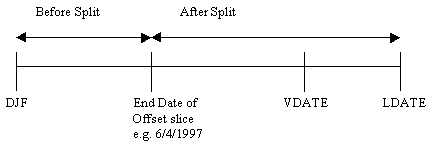

# Deferreds Basis: RetCash

## Cash Parameter Set

Cash Parameter Set is a Scheme Global parameter which groups the
Retirement Cash Commutation variables. This can be created by using
either the `Create Globals` function or using the _Add/Edit Retirement
Cash_ button. Once created, these parameters can be edited without going
back into the Basis similar to other global parameter sets.

## Benefit Basis

Benefit Basis can be Neutral/Nil, Multiple of Pension or Percentage of
Pension.

## Cash Indicator

Select from the drop-down list how to value cash benefits. The options
are:

-   Commutation
-   On top
-   None

Note: This field is only available to some users.

## Cash Multiple

## Cash Percentage

The commuted cash can be calculated either as a Multiple or a Percentage
of the PUP.

If an entry is made in the Multiple field, the commuted cash will be
calculated as:

Multiple &times; PUP revalued to retirement &times; Early Retirement Reduction
Factor (if applicable).

The Multiple can either be a fixed Multiple for all members or a Member
Specific Multiple. To use a fixed Multiple enter the value i.e. for 4
times the PUP enter `4`. To use a Member Specific Multiple, select from
the drop-down list the data item containing the appropriate value. To
value commutation of 4 times the PUP ensure the data item contains the
value 4.

To value a Percentage, ensure the entry in the Multiple field is blank.
The commuted cash can be calculated as:

Percentage &times; PUP revalued to retirement &times; Commutation Factor &times; Early
Retirement Reduction Factor (if applicable).

The Percentage can either be a fixed Percentage for all members or a
Member Specific Percentage. To use a fixed Percentage enter the value ie
for 25% enter `25`. To use a Member Specific Percentage, select from the
drop-down list the data item containing the appropriate value. To value
commutation of 25% of the PUP ensure the data item contains the value
25.

**General** Commutation is restricted to avoid commuting the GMP. There
is no allowance for post-retirement increases in calculating this
restriction.

**Cash Data Item** SuperVal does not have the functionality to value an
explicit Cash Commuted Data item. However, as a work around users can
enter the Member Specific Commuted Cash as a data item in the [Cap Cash
Amount](#deferreds_basis+datacashcap) below. They should then enter
either a Percentage or a Multiple here. The Percentage or the Multiple
entered should be sufficiently large so that the data item entered in
the Cap Cash Amount will bite for all members.

## Separate A-Day Cash Factors for each Pension Increase

This field indicates if separate A Day cash factors are to be calculated
for each pension increase or whether a single factor applies to the
entire pension.

 

If a User opts for the average factor approach which means the field is
left unchecked, then the User needs to select whether the average factor
will be applied Pro Rata or Priority.

## Treat Independent PUP Cash as Cash on Top

Users sometimes value Cash on Top in the Ind Slices and Ind PUPs giving
data items the same payment start and end age. If the intention is to
include this Cash on Top amount in the A Day max calculation, then this
box should be checked.

If this box is unchecked the system will still value cash amounts in the
Ind Slices and Ind PUPs but the A Day maximum will not be reduced to
allow for this Cash on Top (if the basis has `Percentage of A Day Cash`
commutation specified).

## Commutation Priority

This field is used to determine the order in which pension will be
commuted for cash. Select from the drop-down list which of the options
to use. The options are:

-   After Split (actives only)
-   Before Split (actives only)
-   Priority
-   Pro Rata

If `After Split` or `Before Split` is used then the pension is commuted
by reference to the `Latest Finish Date` specified on the [Offset
Slice](actives_basis+sliceup.md).

Typically an active member will have a service timeline as shown in the
following diagram:

If `After Split` is selected then the pension accrued after the End of
the Offset Slice would be commuted first. Within each period pension may
increase at different rates and are commuted in the following order:

-   Special
-   Main
-   Pension Increase 3
-   Pension Increase 4

If `Before Split` is selected then the pension accrued before End of the
Offset Slice would be commuted first. Within each period pension may
increase at different rates and are commuted in the following order:

-   Special
-   Main
-   Pension Increase 3
-   Pension Increase 4

If `Priority` is selected then the cash is commuted according to the
pension increase rate applied on the Slices or PUP Tab. Pensions are
commuted in the following order:

-   Special
-   Main
-   Pension Increase 3
-   Pension Increase 4

If `Pro Rata` is selected, then pension is commuted in proportion to the
pension amounts, irrespective of the pension increase rate.

## Male Commutation Tables  Parameter Set

## Female Commutation Tables  Parameter Set

Commutation Tables Parameter Set is a Scheme Global parameter which
groups the Male or Female Commutation table variables. This can be
created by using either the `Create Globals` function or using the
_Add/Edit Commutation Table_ button.

Once created, these parameters can be edited without going back into the
Basis similar to other global parameter sets.

## Calculate Male Commutation Factors based on Valuation Basis

## Calculate Female Commutation Factors based on Valuation Basis

SuperVal will calculate commutation factors applicable to each
individual member using the valuation basis and the all relevant Basis
Parameters (Guarantee Period, Post Retirement Mortality, Post Retirement
Interest rate and Pension Increases).

## Male % of Valuation Basis Factor

## Female % of Valuation Basis Factor

Users
can define the % of Valuation Basis Factor they want to apply to the
Scheme. To have this field visible the above field `Calculate
Male/Female Commutation Factors based on Valuation Basis` needs to be
ticked. The Valuation Factors produced by SuperVal can be seen in
individual VARPRINTs.

## Male Main

## Male Special

## Male PenInc3

## Male PenInc4

## Female Main

## Female Special

## Female PenInc3

## Female PenInc4

Double click to select the rate table containing the Commutation Factors
ie the amount of cash received for each pound per annum of pension
commuted. Please note that SuperVal assumes exits prior to NRA occur
half-way through the year i.e. 0.5 years, 1.5 years etc after the
valuation date. Exits at NRA occur at the beginning of the year. This
should be reflected in the Commutation Factors entered into the table ie
for ages prior to NRA the factor in the table should be the factor that
would apply at the point of exit.

For example, a factor of 9 at age 65 means that for every pound
surrendered in pension at age 65 the member would receive £9 in cash.

Separate tables can be specified for males and females and for each of
the different pension increase rates (Main, Special, Pension Increase 3
and Pension Increase 4) being used.

Even if cash is payable on top of pension benefits, cash commutation
factors are still required for application of IR Maximum rules.

### Related

-   [Selecting rate tables](selecting_rate_tables.md)

## Decr Help

Rate tables can be selected by any of the following methods:

-   Right-click on the field for a list of appropriate Rate Tables. For
    a field that will accept more than one type of Rate Table (e.g.
    Miscellaneous Tables), the list will be restricted to the current
    Table Type specified in the field – if you wish to see all allowable
    Rate Tables, delete the Table Type from the field before clicking;
    or
-   Double Clicking on the field will produce the Rate Tables form where
    Rate Tables can be viewed (numerically and graphically) and Rate
    Tables can be added or edited. A Rate Table can be selected by
    pressing the Select button or double clicking on the Rate Table
    description in the tree; or
-   the list of allowable Rate Tables can be scrolled through by
    pressing the `<` or `>` keys. The description of the Rate Table to
    the right of the field will change as each new Table is selected.

## Linearly Interpolate Male Commutation Tables for mid-point Exit values

## Linearly Interpolate Female Commutation Tables for mid-point Exit values

When checked, the system will linearly interpolate factors for mid year
exits such as early retirements and deaths. For Normal Retirements, the
system will apply no interpolation. If unchecked, the system will use
the factor specified at the age nearest rounded down for mid year exits
as previous versions have done.

## Adjust Male Commutation Tables by the change in member's expectation of life

## Adjust Female Commutation Tables by the change in member's expectation of life

Future mortality-improvement assumptions underlying the Technical Provisions can be applied to the tabulated commutation factors in force at the valuation date, to calculate revised commutation factors at the date of exit.

## Cash Cap Amount

SuperVal allows the user to enter a Cap on the cash benefit payable.
Select from the drop-down list the appropriate data item. If the cash
benefit is not restricted leave blank.

SuperVal will value the lower of the Cash Cap Amount and the cash
benefits specified on the Ret Cash Tab.

To value the Cash Cap Amount as the cash benefit ensure the cash
benefits described on the Ret Cash Tab exceed the data item for all
members.

## % of Cash Cap Amount

The Cash Cap Amount data item can be reduced or increased by entering a
percentage of the data item to value. Enter `100` to value 100% of the
data item as the Cash Cap Amount.

## Revaluation Rate Override

The user has the option to enter an override for the rate at which the
[Cash Cap Amount](#deferreds_basis+percentcashcap) will increase in
deferment.

Select from the drop-down list the Global Financial Parameter that
contains the rate applicable. Once selected, the current value is shown
to the right of this field.

To add a new Global Financial Parameter use the Edit Scheme Financials
button at the bottom of this Tab.

If you do not wish to use this option then leave blank.

## Complete Years Only Override

The user has the option to enter an override for the [Count Complete
Years](deferreds_basis+revyrs.md) entered on the Financial Tab.

Exits before NRA such as early retirement and death in deferment are
assumed to occur half way through the year i.e. 0.5, 1.5, 2.5 years after
the valuation date. By selecting `Yes` these benefits will receive
revaluations for the number of complete years only i.e. 0, 1, 2. By
selecting `No` these benefits will receive an additional half-year of
revaluations i.e. 0.5, 1.5, 2.5.

If you do not wish to use this option then leave blank.

## Exit Rounding Override

The user has the option to enter an override for the [NRA Exits
Rounding](deferreds_basis+nrarnd.md) entered on the Financial Tab.

Select from the drop-down list how the rounding for exits at NRA
Override on the Cash Cap should be calculated. The revaluation of the
Cash Cap to Normal Retirement Age will be based on the exact duration
between Valuation Date and Normal Retirement Date, rounded according to
the parameter entered. The options are:

-   Exact Days
-   Months Rounded Down
-   Nearest Months
-   Months Rounded Up
-   Years Rounded Down
-   Nearest Years
-   Years Rounded Up
-   Complete Tax Years

The discounting of the benefit will be based on years nearest.

If you do not wish to use this option then leave blank.

## ERF Indicator

Select from the drop-down list which Early Retirement Reduction Factors
to apply to the Cash Cap. The options are as follows:

-   None
-   ERF1
-   ERF2

## Adjustment Factor

A negative or positive loading can be applied to the Cash Cap.

If no adjustment is required enter `1`. If `0` is entered the liability
for the Cash Cap will be zero.

This field can be used to allow for any contingencies, such as
children’s pensions, which are not valued by SuperVal.

## Add/Edit Retirement Cash

Add or Edit any Retirement Factor parameter sets

## Add/Edit Commutation Tables

Add or Edit any Commutation Tables parameter sets.

## Edit Scheme Financials

Clicking the Edit Scheme Financials button takes you to the Scheme
Financials menu.

Here you will be able to see a list of all the Financials that are
currently defined. Double-click on the tree to see an expanded list of
all financial assumptions that are defined.

Click the Add/Edit Financials to change the value of one of the
assumptions.

## SaveAs

Click the _Save As_ button to save with a new file name.

## Save

Clicking on the _Save_ button allows you to save the entries.

## Quit

Clicking on the _Quit_ button allows you to exit without saving any of
your changes.

In some of the screens you will be asked to confirm if you want to exit
_Ignoring all changes_. If you click _Yes_, the file will be closed
without saving any changes. If you click _No_ you will be returned to your
original screen.

From the Browser, the _Quit_ button will take you to a graphical display
of the results.