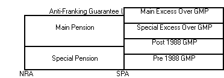

# Actives Basis: Membership

## Male Retirement Age Parameter Set

## Female Retirement Age Parameter Set

Retirement Factor Parameter Set is a Scheme Global parameter which
groups the Male or Female Retirement Factor variables. This can be
created by using either the `Create Globals` function or using the
_Add/Edit Retirement Factors_ button. Once created, these parameters
can be edited without going back into the Basis similar to other global
parameter sets.

## Male Normal Retirement Age

## Female Normal Retirement Age

Specify the Normal Retirement Age i.e. the age at which it is assumed
members will retire.

For actives where there is no Late Retirement Age and deferreds, the
decrements specified in the basis will affect the member up to the NRA
specified. On survivorship to NRA, all members will be assumed to retire
on the anniversary of the valuation date. Any withdrawal Pups will be
assumed payable from this age ( i.e. early retirements would be ignored
for withdrawals).

For actives where there is a Late Retirement Age, the decrement
specified in the basis will affect the member up to the LRA specified.
On survivorship to NRA, the proportion of members specified in the ER/LR
decrement will be assumed to retire on the anniversary of the valuation
date. Thereafter members will be assumed to retire on the anniversary of
the valuation date in line with the decrement table specified. On
survivorship to LRA, all members will be assumed to retire. Any
withdrawal Pups will be assumed payable from this age (i.e. early
retirements would be ignored for withdrawals).

State Pension Age (SPA) is automatically set by SuperVal to be 65 for
males and 60 for females. This will be the age at which the GMP will be
assumed to be payable (or NRA if this is later). The interaction between
NRA and SPA is illustrated below:

If NRA is less than SPA:

If NRA is greater than SPA then:

The Pension is immediately broken down in to its components of excess
over GMP, Pre-1988 and Post-1988 GMP. The GMP elements of the pension
will have late revaluation applied. The late revaluation will include
1/7% per week and increases to Post-1988 GMP. The rate at which the
Post-1988 GMP is increased depends on whether Statutory Increases are
applied.

Members who are over NRA (or LRA if specified) will be valued as
follows:

Actives

: Members who are over NRA will be assumed to retire immediately.

Deferreds

: Members who are over NRA will be assumed to retire immediately.

Please see the help for Early-Retirement Factors for how these will be
applied to members over NRA.

Note: The Late Retirement functionality is only available to some users.

## Normal Retirement Date Indicator

Select from the drop-down list how to define Normal Retirement Date for
determining service and final average salary in the actives benefit
calculations and deferred revaluations for the deferreds and active
withdrawals benefit calculations. The options are:

-   Exact Birthday
-   End of Month following Birthday
-   End of Year following Birthday

Note: The discounting of benefits and the selection of decrement rates
will be based on age nearest.

## Male Late Retirement Age

## Female Late Retirement Age

Enter the Late Retirement Age to use. This is the age at which all
members are assumed to retire from active service beyond normal
retirement age.

## Service Rounding

The Company Service and Scheme Membership used by SuperVal can be
rounded in a number of different ways. Select from the drop-down list
one of the following options:

-   Exact Days
-   Months Rounded Down
-   Nearer Months
-   Months Rounded Up
-   Years Rounded Down
-   Nearer Years
-   Years Rounded Up
-   Complete Tax Years

The entry on the Membership Tab will be used unless an Override is
specified on a particular Slice. Note, service is rounded on a Slice by
Slice basis and there is no rounding for total service.

## Maximum Service

## Retirement Maximum Service

## Maximum Service Table

## Retirement Maximum Service Table

## For users without Maximum Service or Maximum Service Table fields on the Death Pen Tab or IH Pen Tab

Enter the maximum number of year’s service that can count towards all
pension benefits.

SuperVal processes the Benefit Slices in descending number order. Each
Benefit Slice is cumulated to the last Benefit Slice. Therefore any
maximum service restriction will tend to apply to Slice 1, the future
service slice. Note that service on individual slices can either be
included or excluded in the maximum according to the setting of [Count
Towards Maximum Service](actives_basis+servindm.md) on the Slice Tab.
The service maximum specified will also apply where the Retirement Cash
Option is set to `Accrual × Salary for each
year`.

## For users with Maximum Service or Maximum Service Table fields on the Death Pen Tab or IH Pen Tab

Enter the maximum number of year’s service that can count towards
pension benefits. To use a Service Maximum Table, leave the `Retirement
Maximum Service` field blank. Double click for a list of available
tables.

SuperVal processes the Benefit Slices in descending number order. Each
Benefit Slice is cumulated to the last Benefit Slice. Therefore any
maximum service restriction will tend to apply to Slice 1, the future
service slice. Note that service on individual slices can either be
included or excluded in the maximum according to the setting of [Count
Towards Maximum Service](actives_basis+servindm.md) on the Slice Tab.
The service maximum specified will also apply where the Retirement Cash
Option is set to `Accrual × Salary for each year`.

The Maximum Service to apply for augmented death and ill health benefits
can be specified separately on the Death Pen Tab and the IH Pen Tab.
These fields will be used to determine the maximum augmented service for
these benefits.

Some fields are only available to some users.

## Decr Help

Rate tables can be selected by any of the following methods:

-   Right-click on the field for a list of appropriate Rate Tables. For
    a field that will accept more than one type of Rate Table (e.g.
    Miscellaneous Tables), the list will be restricted to the current
    Table Type specified in the field – if you wish to see all allowable
    Rate Tables, delete the Table Type from the field before clicking;
    or
-   Double Clicking on the field will produce the Rate Tables form where
    Rate Tables can be viewed (numerically and graphically) and Rate
    Tables can be added or edited. A Rate Table can be selected by
    pressing the Select button or double clicking on the Rate Table
    description in the tree; or
-   the list of allowable Rate Tables can be scrolled through by
    pressing the `<` or `>` keys. The description of the Rate Table to
    the right of the field will change as each new Table is selected.

## Accrual of Service Related Accrual

This field is only applied when using the [Service Related Accrual
Table](actives_basis+sratab.md) field on the Slices Tab. Select from
the drop-down list whether to use Uniform or Non-Uniform accrual.

When ‘Uniform’ is selected the benefits are spread proportionately
between past and future service assuming that accrual in each year is at
the average rate of accrual for the member over their total service. For
example, in certain schemes where there is ‘double accrual’ after 20
years, the past service liability will take account of any future period
with double accrual that may apply to their benefits even if they have
not yet reached the point where double accrual begins. The user will
then have the option to Cap the accrued service using [Uniform Cap
Accrual](#actives_basis+capaccrual).

When `Non-Uniform` is selected the benefits are not spread
proportionately. Under this option, using the example above, the past
service liability only takes account of any double accrual that has
actually taken place up to the valuation date

Consider a scheme where the accrual is 1/60th up to 20 years
and 1/30th thereafter. The only decrement is retirement which
occurs after 30 years of actual service. In SuperVal, the accrual rate
will be set to 1/60th and the Service Related Accrual Table
will contain the number of 60ths the member receives at each
duration. At 30 years this will be 40.

A member currently has 10 years of service.

-   Under uniform accrual their past service will be $\frac{10}{30} \times 40 = 13.3$
years or $\frac{13.33}{40} = 33\%$ of total liability
-   Under non-uniform accrual their past service will be 10 years or 
    $\frac{10}{40} = 25\%$ of total liability

Consider the same scheme but with a member who has 25 years of service.

-   Under uniform accrual their past service will be 
	$\frac{25}{30} \times 40 = 33.3$ years or 
	$\frac{33.33}{40} = \83%$ of total liability
-   Under non-uniform accrual their past service will be 
	$(20 + 2 \times 5) = 30$ years or $\frac{30}{40} = 75\%$ of total liability

## Uniform Cap Accrual

If you have opted to use Service Related Accrual, and opted to accrue
this using the Uniform method, then check this box if SuperVal should
spread the accrual of benefits over the period to Date of Exit. Leave
this box unchecked if SuperVal should accrue the additional benefits
over the remaining period of capped service.

If not using Service Related Accrual, and benefits are subject to a
service cap then check this box if the future service benefits are
accrued uniformly over the period to Date of Exit. Leave this box
unchecked if future service benefits are accrued over the remaining
period of capped service.

## DOE Qualifying Service

Select from the drop-down list the start date for qualifying service
when using a [Service Related Accrual Table](actives_basis+sratab.md)
on the Slices Tab.

## Use Exact Age and Service in determining Prospective Pension Augmentation Factors

This field is only available when using a Prospective Table for either
the [Death Benefit Basis](actives_basis+wobas.md) or the [Ill Health
Benefit Basis](actives_basis+illind.md).

Check this box to value service enhancements taking into account the
exact age and service of the member. The Enhancements will be calculated
using interpolation between integer age and service values.

Leave this box unchecked to calculate the Enhancement based on an
age-nearest definition of age and service.

Some fields are only available to some users.

## Start Date for CARE Accrual

Select from the drop-down list the Start Date for CARE Accrual when
prospective benefits on ill-health or death-in-service are valued. This
field is required if CARE benefits are valued in the Past Service
Slices.

## CARE Spreading Method

Select from the drop down how to spread CARE Benefit Accrual. The
options are:

-   Accrued Service
-   Accrued Pension

Under Accrued Service the benefits are spread using the ratio of service
from valuation date to the point of exit divided by service from start
date to the point of exit.

Under Accrued Pension the benefits are spread using the ratio of the sum
of future pension divided by the sum of total pension.

## Add/Edit Retirement Ages

Add or Edit any Retirement Age parameter sets.

## SaveAs

Click the _Save As_ button to save with a new file name.

## Save

Clicking on the _Save_ button allows you to save the entries.

## Quit

Clicking on the _Quit_ button allows you to exit without saving any of
your changes.

In some of the screens you will be asked to confirm if you want to exit
_Ignoring all changes_. If you click _Yes_, the file will be closed
without saving any changes. If you click _No_ you will be returned to your
original screen.

From the Browser, the _Quit_ button will take you to a graphical display
of the results.