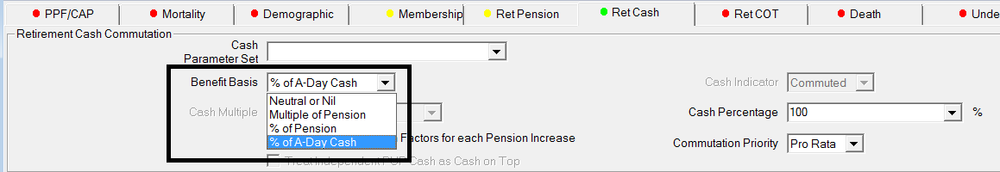
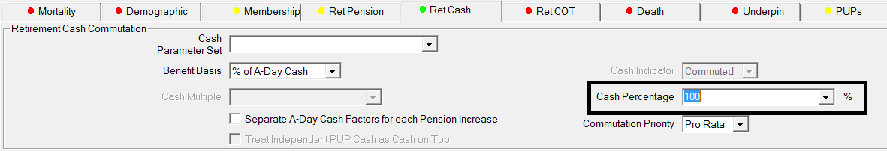
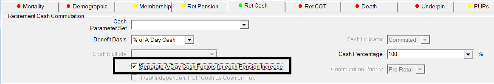
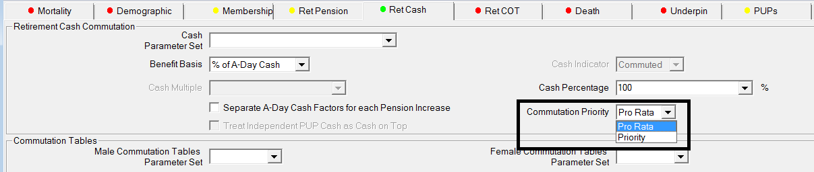
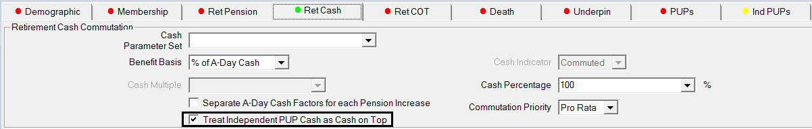

# A-Day Cash system calculations

## Specification

### System options

These calculations are available for Extended Parameter users.

The A-Day cash method is available for:

-   Actives retirement cash commutation
-   Actives ill-health cash commutation
-   Deferreds retirement cash commutation

### Retirement cash parameters

A new method is added to the list(s) of retirement-cash methods:

`% of A-Day Cash`

: The _Cash Percentage_ field is used for the percentage of A-Day cash. This can be a member-specific field if required.

    

    

_Separate A-Day Cash Factors for each Pension Increase_

: A new parameter (check box) indicates whether separate A-Day cash factors are to be calculated for each pension increase or whether a single factor applies to the entire pension.

    

    If you choose the average factor approach (leave the box above unchecked) then select whether the average factor will be applied `Pro Rata` or `Priority`.

    

Ind Slices and Ind PUPs

: You can value Cash on Top in the Ind Slices and Ind PUPs, giving data items the same payment start and end age. To include this Cash on Top amount in the A-Day max calculation, check the box _Treat Independent PUP/Slice Cash as Cash on Top_.

    

    If you leave this box unchecked the system will still value cash amounts in the Ind Slices and Ind PUPs, but the A Day maximum will not be reduced to allow for this Cash on Top (if the basis has _% of A-Day Cash_ commutation specified).

### A-Day cash formula

The formula used to calculate the factor for 100% of A-Day Cash is:

$$\frac{20 \times Pension - 3 \times Lump\ Sum}{Pension \times (20 + 3 \times Commutation\ Factor)}$$

Pension

: is the particular pension of a pension increase (or total pension summed over all pension increases if the factor is not calculated separately for each pension increase)

Lump Sum

: is the Cash on Top of a particular pension increase (or total Cash on Top summed over all pension increases if the factor is not calculated separately for each pension increase)

Commutation Factor

: is the factor for a particular pension increase. Unless you are calculating individual factors for each pension increase, this will be the average commutation factor weighted by pension.

When SuperVal uses the average commutation factor, it is
only to obtain the percentage of pension to be commuted. When the
percentage of pension to be commuted is calculated, SuperVal will use
the actual commutation factors for the relevant pension increases to
work out the cash. The following worked examples should make this clear.

SuperVal will limit the amount of pension it can commute if there is
insufficient Excess pension to commute from for any data sets with large
GMP.

---

## Worked examples

### Basic pension

#### One pension with one pension increase

    Main Pension          5,000
    Commutation Factor       10

$$\%\ of\ Pension\ Commuted = \frac{20 \times Pension \times Commutation\ Factor}{Pension \times (20 + 3 \times Commutation\ Factor)}$$

                           20 × 5,000 – 3 × 0
                       = ---------------------   = 40%
                         5,000 × (20 + 3 × 10)

    100% of A Day Cash = 40% × 5,000 × 10        = 20,000

Quick check: a more familiar formula for the A-Day Max Cash is:

$$100\%\ of\ A\ Day\ Cash = \frac{20 \times Pension \times Commutation\ Factor}{20 + 3 \times Commutation\ Factor}$$

                         20 × 5,000 × 10
                       = ---------------         = 20,000
                           20 + 3 × 10

#### One pension with one pension increase and Cash on Top

    Main Pension                                5,000
    Commutation Factor                             10
    Cash on Top Lump Sum of 1 × Main Pension    5,000

$$\%\ of\ Pension\ Commuted = \frac{20 \times Main\ Pension - 3 \times Lump\ Sum}{Pension \times (20 + 3 \times Commutation\ Factor)}$$

      20 × 5,000 - 3 × 5,000
    = ----------------------   = 34%
      5,000 × (20 + 3 × 10)

Quick check:

$$100\%\ of\ A\ Day\ Cash = \frac{20 \times (Pension + Lump\ Sum \div Commutation\ Factor)}{20 \div Commutation\ Factor + 3}$$

      20 × (5,000 + 5,000 ÷ 10)
    = -------------------------   = 22,000
             20 ÷ 10 + 3

### Basic pension with GMP

#### One excess pension with GMP, all with one pension increase

This is considering a member where NRA = SPA.

    Main Pension          5,000
    GMP                   4,000  where Dynamism on Legislation set to Main
    Commutation Factor       10

$$\%\ of\ Total\ Pension\ Commuted = \frac{20 \times Pension - 3 \times Lump\ Sum}{Pension \times (20 + 3 \times Commutation\ Factor)}$$

        20 × 9,000 - 3 × 0
    = ---------------------   = 40%
      9,000 × (20 + 3 × 10)

    Pension Commuted = 40% × 9,000 = 3,600

GMP Coverage check: 3,600 &lt; Excess = 5,000 so no issues commuting.

Percentage of Excess commuted = $\frac{3,600}{5,000}$ = 72% as NRA = SPA and
only the Excess is commuted.

#### One small excess pension with GMP, all with one pension increase

This is considering a member where NRA = SPA.

    Main Pension            1,000
    GMP                     4,000  where Dynamism on Legislation set to Main
    Commutation Factor         10

                                    20 × 5,000 - 3 × 0
    % of Total Pension Commuted = ---------------------   = 40%
                                  5,000 × (20 + 3 × 10)

    Commuted Pension            = 40% × 5,000             = 2,000

GMP Coverage check: 2,000 &gt; Excess = 1,000 so SuperVal will reduce the
cash to allow for the Excess pension available.

Since only a maximum of 1,000 of Excess can be commuted, SuperVal will commute the entire Excess pension and show a GMP liability and cash of 1,000 × 10 = 10,000.

### Two pensions with different commutation factors

#### Two pensions and Average Factor

If you leave unchecked on the _Ret Cash_ tab the option to have _Separate A-Day Cash Factors for each Pension Increase_ the system will work out the commutable pension using an average commutation factor weighted by pension amount.
You can then choose to use this average factor on a [Priority or Pro-rata basis](#priority-and-pro-rata-bases).

**Pro Rata**

    Main Pension                  5,000
    Special Pension              10,000
    Main Commutation Factor          10
    Special Commutation Factor       30

                                  5,000 × 10 + 10,000 × 30
    Weighted Commutation Factor = ------------------------   = 23.33
                                          15,000

$$\%\ of\ Pension\ Commuted = \frac{20 \times Pension - 3 \times Lump\ Sum}{Pension \times (20 + 3 \times Commutation\ Factor)}$$

                            20 × 15,000 - 3 × 0
                       = -------------------------           = 22%
                         15,000 × (20 + 3 × 23.33)

    Commutable Pension =   22.22% × 15,000                   = 3,333

    100% A Day Cash    =   22.22% ×  5,000 × 10
                         + 22.22% × 10,000 × 30              = 77,770

Taking this further, our expected liabilities would be:

    Main Liability    = (1 – 22.22%) ×  5,000 × Annuity at NRA
    Special Liability = (1 – 22.22%) × 10,000 × Annuity at NRA

**Priority**

    Main Pension                 5,000
    Special Pension             10,000
    Main Commutation Factor         10
    Special Commutation Factor      30

                                  5,000 × 10 + 10,000 × 30
    Weighted Commutation Factor = ------------------------   = 23.33
                                         15,000

$$\%\ of\ Pension\ Commuted = \frac{20 \times Pension - 3 \times Lump\ Sum}{Pension \times (20 + 3 \times Commutation\ Factor)}$$

         20 × 15,000 - 3 × 0
    = -------------------------          = 22.22%
      15,000 × (20 + 3 × 23.33)

    Commutable Pension = 22.22% × 15,000 = 3,333

Using the Priority order, as 3,333 &lt; 10,000, the pension is only
commuted from Special:

    Cash Value         = 3,333 × 30      = 99,990

Taking this further, our expected liabilities would be:

    Special Liability  = (10,000 – 3,333) × Annuity at NRA
    Main Liability     =   5,000          × Annuity at NRA

#### Two Pensions and Individual Factor

If you check the option on the _Ret Cash_ tab to have _Separate A-Day Cash Factors for each Pension Increase_ the system will work out the commutable pension for each group of pensions, according to the pension-increase indicator, using the relevant commutation factor.

    Main Pension                   5,000
    Special Pension               10,000
    Main Commutation Factor           10
    Special Commutation Factor        30

$$\%\ of\ Pension\ Commuted = \frac{20 \times Pension - 3 \times Lump\ Sum}{Pension \times (20 + 3 \times Commutation\ Factor)}$$

                                     20 × 5,000 - 3 × 0
    % of Main Pension Commuted    = ---------------------   = 40%
                                    5,000 × (20 + 3 × 10)

                                     20 × 10,000 - 3 × 0
    % of Special Pension Commuted = ----------------------   = 18.18%
                                    10,000 × (20 + 3 × 30)

    Max Cash                      =   40%    ×  5,000 × 10
                                    + 18.18% × 10,000 × 30   = 74,540

#### Two pensions with Cash on Top and Average Factor

If you leave unchecked the option on the _Ret Cash_ tab to have _Separate A-Day Cash Factors for each Pension Increase_ the system will work out the commutable pension using an average commutation factor weighted by pension amount.
You can then choose to use this average factor on a [Priority or Pro-rata basis](#priority-and-pro-rata-bases).

**Pro Rata**

    Main Pension                  5,000
    Special Pension              10,000
    Main Commutation Factor          10
    Special Commutation Factor       30

Cash on Top is 1×Pen, so 5,000 for Main and 10,000 for Special.

                                  5,000 × 10 + 10,000 × 30
    Weighted Commutation Factor = ------------------------   = 23.33
                                        15,000

$$\%\ of\ Pension\ Commuted = \frac{20 \times Pension - 3 \times Lump\ Sum}{Pension \times (20 + 3 \times Commutation\ Factor)}$$

      20 × 15,000 - 3 × 15,000
    = ------------------------   = 18.89%
      15,000 × (20 + 3 × 23.33)

    Commutable Pension = 18.89% × 15,000 = 2,834

    100% A Day Cash    =   18.89% ×  5,000 × 10
                         + 18.89% × 10,000 × 30
                         + 10,000 + 5,000                    = 81,115

Taking this further, our expected liabilities would be:

    Main Liability    = (1 – 18.89%) ×  5,000 × Annuity at NRA
    Special Liability = (1 – 18.89%) × 10,000 × Annuity at NRA

**Priority**

    Main Pension                5,000
    Special Pension            10,000
    Main Commutation Factor        10
    Special Commutation Factor     30

Cash on Top of 1×Pen, so 5,000 for Main and 10,000 for Special.

                                  5,000 × 10 + 10,000 × 30
    Weighted Commutation Factor = ------------------------   = 23.33
                                          15,000

$$\%\ of\ Pension\ Commuted = \frac{20 \times Pension - 3 \times Lump\ Sum}{Pension \times (20 + 3 \times Commutation\ Factor)}$$

                          20 × 15,000 - 3 × 15,000
                        = -------------------------          = 18.8%
                          15,000 × (20 + 3 × 23.33)

    Commutable Pension  = 18.89% × 15,000                    = 2,834

Using the Priority order, as 2,834 &lt; 10,000, the pension is only commuted from Special:

    Cash Value          = 2,834 × 30 + 10,000 + 5,000        = 100,020

Taking this further, our expected liabilities would be:

    Special Liability   = (10,000 – 3,333) × Annuity at NRA
    Main Liability      = 5,000            × Annuity at NRA

#### Two pensions with Cash on Top and Individual Factor

If you check the option on the _Ret Cash_ tab to have _Separate A Day Cash Factors for each Pension Increase_ the system will work out the commutable pension for each group of pensions, according to the pension-increase indicator, using the relevant commutation factor.

    Main Pension                   5,000
    Special Pension               10,000
    Main Commutation Factor           10
    Special Commutation Factor        30

Cash on Top of 1×Pen, so 5,000 for Main and 10,000 for Special

$$\%\ of\ Pension\ Commuted = \frac{20 \times Pension - 3 \times Lump\ Sum}{Pension \times (20 + 3 \times Commutation\ Factor)}$$

                                    20 × 5,000 - 3 × 5,000
    % of Main Pension Commuted    = ----------------------       = 34%
                                    5,000 × (20 + 3 × 10)

                                    20 × 10,000 - 3 × 10,000
    % of Special Pension Commuted = ------------------------     = 15.45%
                                     10,000 × (20 + 3 × 30)

    Max Cash                      =    34%    ×  5,000 × 10
                                     + 15.45% × 10,000 × 30
                                     +  5,000 + 10,000           = 78,350

### Two pensions with GMP and different commutation factors

#### Two pensions with GMP and Average Factor

Assuming NRA = SPA

If you leave unchecked the option on the _Ret Cash_ tab to have _Separate A-Day Cash Factors for each Pension Increase_ the system will work out the commutable pension using an average commutation factor weighted by pension amount.
You can then choose to use this average factor on a [Priority or Pro-rata basis](#priority-and-pro-rata-bases).

**Pro Rata**

    Main Pension                 5,000
    Special Pension             10,000
    GMP                          4,000  where GMP Dynamism set to Main
    Main Commutation Factor         10
    Special Commutation Factor      20

                                  9,000 × 10 + 10,000 × 20
    Weighted Commutation Factor = ------------------------ = 15.26
                                   5,000 + 10,000 + 4,000

$$\%\ of\ Pension\ Commuted = \frac{20 \times Pension - 3 \times Lump\ Sum}{Pension \times (20 + 3 \times Commutation\ Factor)}$$

                            20 × 19,000 - 3 × 0
                        = ------------------------        = 30.40
                          19,000 × (20 + 3 × 15.26)

    Commutable Pension  = 30.40% × 19,000                 = 5,776

    100% A Day Cash     =   30.40% ×  9,000 × 10
                          + 30.40% × 10,000 × 20          = 88,160

Taking this further, our expected liabilities would be:

    Main Liability    = [(1 – 30.40%) ×  9,000 – 4,000] × Annuity at NRA
    Special Liability =  (1 – 30.40%) × 10,000          × Annuity at NRA

**Priority**

    Main Pension                 5,000
    Special Pension             10,000
    GMP                          4,000  where GMP Dynamism set to Main
    Main Commutation Factor         10
    Special Commutation Factor      20

                                  9,000 × 10 + 10,000 × 20
    Weighted Commutation Factor = ------------------------   = 15.26
                                          19,000

$$\%\ of\ Pension\ Commuted = \frac{20 \times Pension - 3 \times Lump\ Sum}{Pension \times (20 = 3 \times Commutation\ Factor)}$$

                             20 × 19,000 - 3 × 0
                        = -------------------------          = 30.40%
                          19,000 × (20 + 3 × 15.26)

    Commutable Pension  = 30.40% × 19,000                    = 5,776

Using the Priority order, as 5,776 &lt; 10,000, the pension is only commuted from Special:

    Cash Value          = 5,776 × 20                         = 115,520

Taking this further, our expected liabilities would be:

    Special Liability = (10,000 – 5,776) × Annuity at NRA
    Main Liability    =  5,000           × Annuity at NRA

#### Two Pensions with GMP and Individual Factor

If you check the option on the _Ret Cash_ tab to have _Separate A-Day Cash Factors for each Pension Increase_ the system will work out the
commutable pension for each group of pensions, according to the pension increase indicator, using the relevant commutation factor.

    Main Pension                  5,000
    Special Pension              10,000
    GMP                           4,000  where GMP Dynamism set to Main
    Main Commutation Factor          10
    Special Commutation Factor       20

$$\%\ of\ Pension\ Commuted = \frac{20 \times Pension  - 3 \times Lump\ Sum}{Pension \times (20 + 3\times Commutation\ Factor)}$$

                                     20 × 9,000 - 3 × 0
    % of Main Pension Commuted    = ---------------------       = 40%
                                    9,000 × (20 + 3 × 10)

                                      20 × 10,000 - 3 × 0
    % of Special Pension Commuted = ----------------------      = 25%
                                    10,000 × (20 + 3 × 20)

GMP Coverage check: Main Pension Commuted = 40% × 9,000 = 3,600

As 3,600 &lt; Excess = 5,000, we can commute 40% of the Main pension

    100% Max A Day Cash          =   40% ×  9,000 × 10
                                   + 25% × 10,000 × 20          = 86,000

#### Two Pensions with GMP, Cash on Top and Average Factor

Assuming NRA = SPA

If you leave unchecked the option on the _Ret Cash_ tab to have _Separate A-Day Cash Factors for each Pension Increase_ the system will work out the commutable pension using an average commutation factor weighted by pension amount.
You can then choose to use this average factor on a [Priority or Pro-rata basis](#priority-and-pro-rata-bases).

**Pro Rata**

    Main Pension                  5,000
    Special Pension              10,000
    GMP                           4,000  where GMP Dynamism set to Main
    Cash on Top for Main          5,000 (same as Excess pensions)
    Cash on Top for Special      10,000 (same as Excess pensions)
    Main Commutation Factor          10
    Special Commutation Factor       20

                                  9,000 × 10 + 10,000 × 20
    Weighted Commutation Factor = ------------------------ = 15.26
                                   5,000 + 10,000 + 4,000

$$\%\ of\ Pension\ Commuted = \frac{20 \times Pension - 3 \times Lump\ Sum}{Pension \times (20+ 3 \times Commutation\ Factor)}$$

                          20 × 19,000 - 3 × 15,000
                        = -------------------------        = 26.80%
                          19,000 × (20 + 3 × 15.26)

    Commutable Pension  = 26.80% × 19,000                  = 5,092

    100% A Day Cash     =   26.80% ×  9,000 × 10
                          + 26.80% × 10,000 × 20 + 15,000  = 92,720

Taking this further, our expected liabilities would be:

    Main Liability    = [(1 – 26.80%) ×  9,000 – 4,000] × Annuity at NRA
    Special Liability =  (1 – 26.80%) × 10,000          × Annuity at NRA

**Priority**

    Main Pension                  5,000
    Special Pension              10,000
    GMP                           4,000  where GMP Dynamism set to Main
    Cash on Top for Main          5,000 (same as Excess pensions)
    Cash on Top for Special      10,000 (same as Excess pensions)
    Main Commutation Factor          10
    Special Commutation Factor       20

                                  9,000 × 10 - 10,000 × 20
    Weighted Commutation Factor = ------------------------ = 15.26
                                   5,000 + 10,000 + 4,000

$$\%\ of\ Pension\ Commuted = \frac{20 \times Pension - 3 \times Lump\ Sum}{Pension \times (20 + 3 \times Commutation\ Factor)}$$

                          20 × 19,000 - 3 × 15,000
                        = -------------------------        = 26.80%
                          19,000 × (20 + 3 × 15.26)

    Commutable Pension  = 26.80% × 19,000                  = 5,092

Using the Priority order, as 5,092 &lt; 10,000, the pension is only commuted from Special:

    Cash Value          = 5,092 × 20 + 15,000              = 116,840

Taking this further, our expected liabilities would be:

    Special Liability = (10,000 – 5,092) × Annuity at NRA
    Main Liability    =  5,000           × Annuity at NRA

#### Two pensions with GMP, Cash on Top and Individual Factor

If you check the option on the _Ret Cash_ tab to have _Separate A-Day Cash Factors for each Pension Increase_ the system will work out the commutable pension for each group of pensions, according to the pension-increase indicator, using the relevant commutation factor.

    Main Pension                  5,000
    Special Pension              10,000
    GMP                           4,000  where GMP Dynamism set to Main
    Cash on Top for Main          5,000 (same as Excess pensions)
    Cash on Top for Special      10,000 (same as Excess pensions)
    Main Commutation Factor          10
    Special Commutation Factor       20

$$\%\ of\ Pension\ Commuted = \frac{20 \times Pension - 3 \times Lump\ Sum}{Pension \times (20 + 3 \times Commutation\ Factor)}$$

                                    20 × 9,000 - 3 × 5,000
    % of Main Pension Commuted    = ----------------------                = 36.67%
                                    9,000 × (20 + 3 × 20)

                                    20 × 10,000 - 3 × 10,000
    % of Special Pension Commuted = ------------------------              = 21.25%
                                     10,000 × (20 + 3 × 20)

GMP Coverage check: Main Pension Commuted = 36.67% × 9,000 = 3,300

As 3,300 &lt; Excess = 5,000, we can commute 36.67% of the Main pension

    100% Max A Day Cash               =   36.67% ×  9,000 × 10
                                        + 21.25% × 10,000 × 20 + 15,000   = 90,503

### Two small excess pensions with GMP and different commutation factors

#### Two small pensions with GMP and Average Factor

Assuming NRA = SPA

If you leave unchecked the option on the _Ret Cash_ tab to have _Separate A-Day Cash Factors for each Pension Increase_ the system will work out the commutable pension using an average commutation factor weighted by pension amount.
You can then choose to use this average factor on a [Priority or Pro-rata basis](#priority-and-pro-rata-bases).

**Pro Rata**

    Main Pension                 1,000
    Special Pension              1,000
    GMP                          4,000  where GMP Dynamism set to Main
    Main Commutation Factor         10
    Special Commutation Factor      20

                                  5,000 × 10 + 1,000 × 20
    Weighted Commutation Factor = -----------------------   = 11.67
                                          6,000

$$\%\ of\ Pension\ Commuted = \frac{20 \times Pension - 3 \times Lump\ Sum}{Pension \times (20 + 3 \times Commutation\ Factor)}$$

                             20 × 6,000 - 3 × 0
                        = ------------------------          = 36.36%
                          6,000 × (20 + 3 × 11.67)

    Commutable Pension  = 36.36% × 6,000                    = 2,182

As 2,182 &gt; 2,000, all of Main and Special is commuted, and the commutable pension is restricted to 2,000.

    Cash Value          = 1,000 × 20 + 1,000 × 10           = 30,000

So the only liabilities that should be produced are the cash of 30,000
and the value of the GMP liability.

**Priority**

    Main Pension                 1,000
    Special Pension              1,000
    GMP                          4,000  where GMP Dynamism is set to Main
    Main Commutation Factor         10
    Special Commutation Factor      20

                                  5,000 × 10 + 1,000 × 20
    Weighted Commutation Factor = -----------------------
                                      6,000  = 11.67

$$\%\ of\ Pension\ Commuted = \frac{20 \times Pension - 3 \times Lump\ Sum}{Pension \times (20 + 3 \times Commutation\ Factor)}$$

                            20 × 6,000 - 3 × 0
                        = ------------------------ = 36.36%
                          6,000 × (20 + 3 × 11.67)

    Commutable Pension  = 36.36% × 6,000           = 2,182

Using the Priority order, as 2,182 &gt; 1,000, all of Special is commuted, the remaining 1,182 &gt; 1000 and so all of Main is also commuted.
As such, the commutable pension is limited to 2,000.

    Cash Value          = 1,000 × 20 + 1,000 × 10  = 30,000

So the only liabilities that should be produced are the cash of 30,000
and the value of the GMP liability.

#### Two small pensions and Individual Factor

If you check the option on the _Ret Cash_ tab to have _Separate A-Day Cash Factors for each Pension Increase_ the system will work out the commutable pension for each group of pensions, according to the pension-increase indicator, using the relevant commutation factor.

    Main Pension                 1,000
    Special Pension              1,000
    GMP                          4,000  where GMP Dynamism set to Main
    Main Commutation Factor         10
    Special Commutation Factor      20

$$\%\ of\ Pension\ Commuted = \frac{20 \times Pension - 3 \times Lump\ Sum}{Pension \times (20 + 3 \times Commutation\ Factor)}$$

                                       20 × 5,000 - 3 × 0
    % of Main Pension Commuted      = ---------------------   = 40%
                                      5,000 × (20 + 3 × 10)

GMP Coverage check: 40% × 5,000 = 2,000.

As 2,000 &gt; Excess = 1,000, the system restricts the commutable pension to 1,000

    % of Main Pension Commuted     = 100%

                                      20 × 1,000 - 3 × 0
    % of Special Pension Commuted  = ---------------------    = 25%
                                     1,000 × (20 + 3 × 20)

    Max Cash                       =   100% × 1,000 × 10
                                     +  25% × 1,000 × 20      = 15,000

Taking this further, our expected Excess liabilities would be:

    Special Liability              = 75% × 1,000 × Annuity at NRA
    Main Liability                 = 0

#### Two small Pensions with GMP, Cash on Top and Average Factor

Assuming NRA = SPA

If you leave unchecked the option on the _Ret Cash_ tab to have _Separate A-Day Cash Factors for each Pension Increase_ the system will work out the commutable pension using an average commutation factor weighted by pension amount.
You can then choose to use this average factor on a [Priority or Pro-rata basis](#priority-and-pro-rata-bases).

**Pro Rata**

    Main Pension                  1,000
    Special Pension               5,000
    GMP                           4,000  where GMP Dynamism set to Main
    Cash on Top for Main          5,000 (same as Excess pensions)
    Cash on Top for Special      10,000 (same as Excess pensions)
    Main Commutation Factor          10
    Special Commutation Factor       20

                                  5,000 × 10 - 5,000 × 20
    Weighted Commutation Factor = -----------------------    = 15
                                         10,000

$$\%\ of\ Pension\ Commuted = \frac{20 \times Pension - 3 \times Lump Sum}{Pension \times (20 + 3 \times Commutation Factor)}$$

                                  20 × 10,000 - 3 × 15,000
                                = ------------------------   = 23.85%
                                   10,000 × (20 + 3 × 15)

Commutable Pension = 23.85% × 10,000 = 2,385 &lt; 6,000 so we have
sufficient pension to commute from.

Checking Pre-97 coverage: 23.85% × 5,000 = 1,192.5 &gt; 1,000 of Pre-97
Excess available. So, all of the Main Excess pension is commuted and the
rest of the commutable pension, 2,385 – 1,000 = 1,385 is commuted from
the Special pension.

    Cash Value        = 1,000 × 10 + 1,385 × 20 + 15,000     = 52,700
    Special Liability = (5,000 – 1,385) × Annuity at NRA

**Priority**

    Main Pension                  1,000
    Special Pension               5,000
    GMP                           4,000  where GMP Dynamism set to Main
    Cash on Top for Main          5,000 (same as Excess pensions)
    Cash on Top for Special      10,000 (same as Excess pensions)
    Main Commutation Factor          10
    Special Commutation Factor       20

                                  5,000 × 10 - 5,000 × 20
    Weighted Commutation Factor = ----------------------- = 15
                                          10,000  

$$\%\ of\ Pension\ Commuted = \frac{20 \times Pension - 3 \times Lump\ Sum}{Pension \times (20 + 3 \times Commutation\ Factor)}$$

                          20 × 10,000 - 3 × 15,000
                        = ------------------------   = 23.85%
                           10,000 × (20 + 3 × 15)

    Commutable Pension  = 23.85% × 10,000            = 2,385

Using the Priority order, as 2,385 &lt; 5,000, only Special pension is
commuted from.

    Cash Value          = 2,385 × 20 + 15,000        = 62,700

Taking this further, our expected liabilities would be:

    Special Liability   = (5,000 – 2,385) × Annuity at NRA
    Main Liability      =  5,000 × Annuity at NRA - 4,000 × Annuity at SPA

#### Two small pensions with GMP, Cash on Top and Individual Factor

If you check the option on the Ret Cash tab to have _Separate A Day Cash Factors for each Pension Increase_ the system will work out the commutable pension for each group of pensions, according to the pension-increase indicator, using the relevant commutation factor.

    Main Pension                  1,000
    Special Pension               5,000
    GMP                           4,000  where GMP Dynamism set to Main
    Cash on Top for Main          5,000 (same as Excess pensions)
    Cash on Top for Special      10,000 (same as Excess pensions)
    Main Commutation Factor          10
    Special Commutation Factor       20

$$\%\ of\ Pension\ Commuted = \frac{20 \times Pension - 3 \times Lump\ Sum}{Pension \times (20 + 3 \times Commutation\ Factor)}$$

                                    20 × 5,000 - 3 × 5,000
       % of Main Pension Commuted = ----------------------    = 34%
                                     5,000 × (20 + 3 × 10)  

                                    20 × 5,000 - 3 × 10,000
    % of Special Pension Commuted = -----------------------   = 17.5%
                                     5,000 × (20 + 3 × 20)  

GMP Coverage check: Main Pension Commuted = 34% × 5,000 = 1,700

As 1,700 &gt; Excess = 1,000, the system limits the amount it can commute
from the Main pension to 1,000 so that no GMP is commuted.
As the Individual Factor approach considers the pensions grouped by pension
increase in isolation, the system will not commute the extra 700 of
commutable pension from the Special pension.
The resulting value of cash will be lower than if an Average factor approach is used.

    100% Max A Day Cash = 1,000 (Main Excess) × 10 + 17.5% × 5,000 × 20 + 15,000
                        = 42,500

---

## Priority and Pro-rata bases

Pro Rata

: aims to apply a broad proportion across the whole pension for the amount commuted.

Priority

: works in order of pension increases: Special, Main, Pension Increase 3 and Pension Increase 4 (e.g. if the commutable pension is greater than the special pension, the system commutes all of the Special pension and then goes onto the Main pension and so on)

