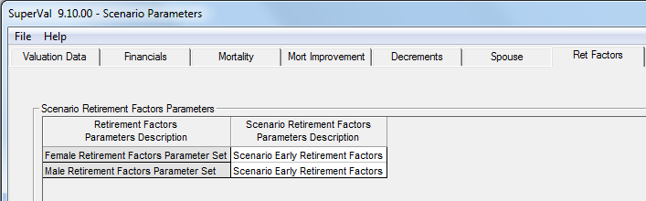

# Global parameters and accurate scenario modelling

_How Equiniti has implemented the Accurate Scenario Model (ASM)_

This module includes globalising additional parameters from the basis in
order to cover the usual range of parameters varied by users when
looking at alternate scenarios in their valuation basis.

All globalised parameters are varied in the Accurate Scenario
Modelling module for a scenario without having to change the underlying
basis. Equiniti has taken on board the feedback from the clients from
the SuperVal User Group and globalised the parameters as suggested.

ASM lets you perform multiple runs, including:

-   Step-by-step change-of-basis analysis
-   Sensitivity runs and buy-out valuations
-   What-if scenarios
-   Updating bases from previous to current valuation basis
-   Carrying out valuations at a different valuation date. (Note: this does not take into account salary increases and pension increases).

This article explains how the Accurate Scenario Model works.

## New features

Equiniti has introduced new features in V9.10 which support the running
of ASM.

### New retirement-age related rates

New RR (Retirement Decrement Rate Table) and ER, FR, GR and HR
(Age-related Factor Tables) have been introduced. These are 2-Dimensional 
Rate Tables that contains Rates by Age and by Retirement Age
(e.g. the 60^th^ column will contain Rates that apply when NRA
is 60 and the 65^th^ column will contain Rates that apply when
NRA is 65).

This will enable changes of Normal [Retirement Age](#retirement-age_1) without
necessitating a change to different Retirement Decrement Tables and any
Age-related Factor Tables such as Retirement Factors or Commutation
Factors.

This type of Table can also be used to store all Tables (of a particular
type) used for a single scheme - where they differ only because of a
different retirement age.

### Financial constants

Financial Constants have been introduced into a Financial Parameter set.
These should be used for any constant that is dependent on the Financial
Basis assumed (e.g. Barber Factors). When a different set of Financials
parameters is chosen, the Financial Constants in the selected Financials
Parameter set will be used.

The use of these Financial Constants is rolled out to all "Adjustment
Factors" used throughout the system.

To set up Financial Constants, fill out the grid as shown below.

The above can then be used, for example, under the Financial tab
(Actives only) as shown below:

Financial Constants can also be used for Adjustment Factors in the
Salaries/Slices/Alt Slices/Ind Slices parameters under the Actives
module or in the GMP/PUPs/Ind PUPs/NSPUPs /Cash Cap parameters under the
Deferreds module or in the GMP/Pensions parameters under the Pensioners
module.

### Retirement factors and commutation factors

Retirement Factors and Commutation Factors can now be stored as Exact
Age Rates. These factors can be used for any Normal Retirement Age with
mid-point values determined by linear interpolation.

## Global parameters

### Background

The range of global parameter sets available has been extended in
Version 9.10.

V9.00 *Compulsory* via S21 Migration Wizard | V9.10 *Optional* via Create Globals Wizard
-----------------------------------------------|----------------------------------------------
Financials (Interest Rates, Revaluation Rates, Inflation Rate, Pension Increase Rate)  Mortality Rates  Mortality Improvement Rates  Contribution Assumptions  New Entrants Parameters | Decrement Rates (gender-specific Actives and Deferreds)   Spouse Parameters (Actives, Deferreds and Pensioners)   Retirement Age (gender-specific Actives and Deferreds)   Retirement Factors (gender specific Actives and Deferreds separately for Early/Late and Pension/Cash on Top)   Retirement Cash (Actives and Deferreds separately for Retirement/Ill-Health and Commutation/Cash on Top)   Commutation Tables (gender-specific Actives and Deferreds separately for Retirement/Ill-Health)   Spreading Dates (Actives separately for Death/Ill-Health and Pension/Cash)

Unlike the parameter sets created by the S21 Migration Wizard, the new
parameter sets are optional. The Create Globals Wizard gives the user
the option to select which parameter sets they wish to create from the
basis.

To maximise the use of the Global Parameter functionality in SuperVal
V9.10, give thought to the names and use of each global
assumptions in the Create Globals Wizard.

### The Create Globals wizard

The Create Globals Wizard will identify variables from Version 9 basis
files which can be bundled into Global Parameter Sets. The process is
started by _Bases \> Create Globals_.

The Creation of Global Parameter Sets screen (shown below) allows the
user to make a number of choices about how the parameter sets will be
formed. See below for more information on each of these.

1.  Here you can select the type(s) of Global Parameter set you wish to create. Use Ctrl+Left-Click to select multiple types.

2.  If different Membership Groups are run in one folder then you can set up different Financial Global Parameters for each group by checking this box. This will create a separate set of pointers for each of the Actives, Deferreds and Pensioners which will enable separate management of the migrated financial assumptions by membership group. To create a single pointer for a similar assumption, leave this box unchecked.

3.  To create separate pointers for Retirement and Ill-Health decrement types with the same value, check this box. To create a single pointer, leave unchecked.

4.  To create separate pointers for Cash and Cash on Top field types with the same value, check this box. To create a single pointer, leave unchecked.

5.  To create separate pointers for Male and Female field types with the same value, check this box. To create a single pointer, leave unchecked.

6.  If an existing parameter set has been previously migrated, you can use the existing global parameter sets as pointers rather than creating new global parameters. To do this, check the box for the relevant module(s).

7.  Here you can select the basis file(s) from which to create Global Parameter sets. Use Ctrl+Left-Click to select multiple basis files.

    Select only the categories you want to globalise. Unglobalised categories will not pick up the new scenarios parameters, and will continue to use the original parameters.

Click _Next_ to proceed.

The Create Globals wizard will show the structure of pointers and the
values to be created for each of the Global Assumptions.

Under each pointer will be a list of all the categories where it will be
used, as shown below:

You can rename, clone or delete the pointers via the
right-click menu. Equiniti recommends you ensure all names
and descriptions are generic, so if the value of the assumption
changes in future the pointer name is still valid.

To rename a pointer, click once slowly and an edit box will appear
around the existing name. 

To clone a pointer, right-click on it once and rename it. 
Any existing Global Variables that should be
underneath this pointer can be moved using "click and drag".

To delete a pointer, right-click and select delete. This option is 
available only if no categories use the pointer.

Ensure the pointers established are a true and
accurate reflection of all the different possible assumptions required
to value the scheme going forward. In particular, take care to set up
separate pointers for assumptions that by coincidence were the same at
the previous valuation but may not be at future valuations.

You will then see a summary report which displays
the final migration details before any changes are confirmed. It will
contain details of the Global Parameter created and a list of where in
the Scheme Basis Files this will be used. (See below.)

### Notes on the Create Globals wizard

1.  Some fields can use a member-specific Data Item which can only be
    specified when editing the Basis. These fields will be shown as
    blank in the Globals definition. If these parameters are left blank
    in the Global definition, the value in the Basis will be used.

    Applies to: Retirement Cash and Spreading Dates parameter sets.

2.  A Global Parameter Set will be set up only if the Parameter Set
    dropdown in that basis is empty. (If not, a Global Parameter Set
    already exists.)

3.  If the range of checkboxes (2 to 6 described above) do not enable
    the optimal assignment of Global pointer names in your Bases (or the
    amount of cloning and renaming pointer names becomes excessive),
    fine tuning of these Global pointer names can be achieved using the
    new Update Bases functionality.

### Retirement age

A new Global parameter has been created for Retirement Age:

-   Normal Retirement Age
-   Late Retirement Age (Actives and GAD only)

A separate global Parameter set has been created for males and females
in Actives and Deferreds bases.

### Decrement rates

A new global Parameter has been created for Decrement Rates containing:

-   Retirement Decrement 
-   Ill-Health Decrement (Actives only)
-   Leaving Service Decrement (Actives only)
-   Leaving Service Durational Weight (Actives only)

A separate global Parameter Set has been specified for males and females
in Actives and Deferreds bases.

### Spouse parameters

A new global Parameter has been created for Spouse Parameters
containing:

-   Spouse Definition
-   Male Proportion Married Table
-   Female Proportion Married Table
-   Male Spouse Age Difference Table (GAD only)
-   Female Spouse Age Difference Table (GAD only)
-   Male Spouse Age Difference
-   Female Spouse Age Difference

A global Parameter set has been created in Actives, Deferreds and
Pensioners bases.

### Retirement factors

A new Global parameter has been created for Retirement Factors
containing:

-   Retirement Factor 1 (Actives Revaluation 1 + 3 or Deferreds)
-   Retirement Factor 2 (Actives Revaluation 1 + 3 or Deferreds)
-   Retirement Factor 1 (Actives Revaluation 2)
-   Retirement Factor 2 (Actives Revaluation 2)

A separate global Parameter set has been created for males and females,
Early (and Late for GAD only) Retirement, Pension and Cash on Top in
Actives and Deferreds bases (although only the first two tables are used
for Deferreds).

A flag has been introduced to indicate if Factors are exact age-based
(current Rate Tables must be mid-year based pre-NRA making them NRA
specific). All tables must be one type or the other.

Note that if a change in the Normal Retirement Age is to be assumed, it
will be preferable to specify Retirement Factors that are based on exact
age (Factors at non-integral ages will be determined by linear
interpolation) as this may enable the same Factor Rate Table to be used
for each valuation/scenario (unless Factors vary by Normal Retirement
Age assumed).

If Retirement Factors specified are one-dimensional and mid-year based,
a different set will generally be required for each Normal Retirement
Age (assuming the factor is calculated with reference to NRA).

### Commutation factors

A new Global parameter has been created for Commutation Factors
containing:

-   Main Increases Commutation Table
-   Special Increases Commutation Table
-   PenInc3 Increases Commutation Table
-   PenInc4 Increases Commutation Table

A separate global Parameter set has been created for males and females,
Retirement and Ill-Health (Actives only), in Actives and Deferreds
bases.

A flag has been introduced to indicate if Factors are exact age-based
(current Rate Tables must be mid-year based pre-NRA making them NRA
specific). All tables must be one type or the other.

Note that if a change in the Normal Retirement Age is to be assumed, it
will be preferable to specify Commutation Factors that are based on
exact age (Factors at non-integral ages will be determined by linear
interpolation) as this may enable the same Factor Rate Table to be used
for each valuation/scenario (unless Factors vary by Normal Retirement
Age assumed).

If Commutation Factors specified are one-dimensional and mid-year based,
a different set will generally be required for each Normal Retirement
Age (assuming the Commutation Factors are age-based).

### Cash benefits

A new global Parameter has been created for Cash Benefits Basis.

This global parameter will be used for both Actives and Deferreds,
Retirement and Ill-Health (Actives only) and Commutation and Cash on
Top.

The Benefit Bases have been standardised for Actives and Deferreds to
the following:

    Neutral or Nil
    IR Maximum
    Accrual × Salary for each year
    Multiple of Pension
    % of Pension (Actives is currently effectively Proportion of Pension)

Notes:

1.  `IR Maximum` and `Accrual × Salary for each year` are restricted for use
    with Actives only.

2.  The `% of Pension` parameter field has been standardised – Actives
    currently uses a Pension Proportion rather than a %. This will
    require any member-specific Cash Proportions in Actives bases to be
    amended in the member data to a percentage.

The list of fields in the Cash Benefit Basis global parameter are:

-   Benefit Basis
-   Accrual Rate
-   Service Definition
-   Cash Multiple (numeric value only)
-   Cash Percentage (numeric value only)

Notes:

1.  The Salary field required for the `Accrual × Salary for each year`
    remains as a Basis parameter (as Salaries are defined as part of the
    Basis).

2.  The member-specific values for Cash Multiple or Cash Percentage
    remain as Basis Parameters (as these are related to the Data Format
    used in the Basis). If a member-specific value applies, leave blank the
    parameters in the Cash Basis Global Parameter Set.

A separate global Parameter Set will be specified for males and females
for each of the Cash amounts for Retirement and Ill-Health (Actives
only) and Commutation and Cash on Top.

### Spreading basis 

A new global Parameter has been created for the spreading options for
Death and Ill Health benefits.

This global parameter will be used for Pension and Cash and will include
the following parameters:

-   Funding methods - PUC and FAS (Extended Parameters only)
-   Spreading Start date
-   Spreading End date

**Note** The Member-specific Dates for Spreading Start and End remain as Basis Parameters (as these are related to the Data Format used in the Basis). If a Member-specific date applies, the parameters in the Spreading Dates Global Parameter Set should be left blank.

A separate global Parameter Set will be specified for each of the Death and Ill-Health benefits.

## Accurate Scenario Modelling

To set up scenarios, select _Bases \> Scenarios_, as shown below:

The tabs shown on this form will depend on the Global Parameters Sets
used in the Scheme's Bases.

### Valuation data

The valuation data can be varied in a scenario by either:

- specifying a new valuation date; and/ or

- a new data file (and its corresponding data format) where Data Files
  have been specified in the Scheme Details form.

For the alternate Files functionality to work, the Bases must be saved
with Data Filenames and Data Formats linked to the Scheme Details
parameters.

If _Financials Assumptions are effective at the Original Valuation
Date_ is left unchecked, SuperVal will assume the financials will
apply from the Scenario Valuation Date populated above.

If the field is checked and you are using vectors or yield curves,
the financial assumptions that applied for the period from the Original
Valuation Date to the new Scenario Valuation Date will be dropped from
the start of each financial assumption – using linear interpolation if
the period is a non-integral number of years.

### Financials

The current Financials global parameter can be varied in a scenario by
either:

1.  select a different financial global parameter set; or

2.  relative adjustment(s) (+/-) made to Financial values in the
    Currently Selected Financials Parameter Set (either a scalar value,
    a vector or a Yield Curve file). The adjustments will be added or
    subtracted from the value in the Financials Set; or

3.  specify new values where they differ from the Currently Selected
    Financials Set (either a scalar value, a vector or a Yield Curve
    file). The new values will replace the value in Financials Parameter
    Set.

4.  select this field to use the currently selected financial parameters
    at the time of the Scenario run.

### Mortality

In a scenario, each Mortality Parameter set currently used can be
either:

-   assigned a different Mortality Parameter set; and/or

-   loaded with an additional (+/-) % Rating. Please note this field will
    use the relative amount of the additional % Rating e.g. if user has
    already used a % rating in their mortality global parameters for their
    primary basis, this will be applied in addition to that; or

-   adjusted for a life expectancy change (+/-) at a specified age (note
    the life expectancy change is on Mortality Table only as Mortality
    Improvement Table is specified separately) e.g. if Life Expectancy Age
    is set to 65 and the change is set to +2, ASM will back-solve it by
    using a scaling factor.

Note that the Loading and the Life Expectancy change can be applied to
either the existing Mortality Parameter Set or the specified alternate
Mortality Parameter Set.

### Mortality improvement

In a scenario, each Mortality Improvement Parameter set currently used
can be assigned a different Mortality Improvement Parameter set.

### Retirement age

A new Global parameter has been created for Retirement Age:

-   Normal Retirement Age
-   Late Retirement Age (GAD only)

A separate global Parameter set has been specified for males and
females.

In a scenario, each Retirement Age Parameter set currently used, can be
either:

-   assigned a different Retirement Age Parameter Set; or
-   changed to specified Normal (and Late for GAD) Retirement Ages.

If the Retirement Decrement will change when the Normal Retirement Age
is changed, the new RR Retirement Decrement Table can be used to specify
different Decrement Rates at different Retirement Ages or if the
Retirement Factors will change when the Normal Retirement Age is
changed, the new ER, FR, GR, and HR Retirement Factor Tables can be used
to specify different Retirement Factors at different Retirement Ages.

See 
[New retirement age-related rates](#new-retirement-age-related-rates)
above. 

These new Retirement Age related Rate Tables will remove the need to
create and specify new Parameter Sets for each of these assumptions
within a Scenario (when a change in Retirement Age is made).

### Decrement rates

A new global Parameter has been created for Decrement Rates containing:

-   Retirement Decrement
-   Ill-Health Decrement (Actives only)
-   Leaving Service Decrement (Actives only)
-   Leaving Service Durational Weight (Actives only)

A separate global Parameter Set has been specified for males and
females.

In a scenario, each Decrement Rates Parameter set currently used can be
assigned a different Decrement Rates Parameter set.

### Spouse parameters

A new global Parameter has been created for Spouse Parameters
containing:

-   Spouse Definition
-   Male Proportion Married Table
-   Female Proportion Married Table
-   Male Spouse Age Difference Table
-   Female Spouse Age Difference Table
-   Male Spouse Age Difference
-   Female Spouse Age Difference

In a scenario, each Spouse Parameters set currently used can be assigned
a different Spouse Parameter set.

### Retirement factors

A new Global parameter has been created for Retirement Factors
containing:

-   Retirement Factor 1 (Actives Revaluation 1 + 3 or Deferreds)
-   Retirement Factor 2 (Actives Revaluation 1 + 3 or Deferreds)
-   Retirement Factor 1 (Actives Revaluation 2)
-   Retirement Factor 2 (Actives Revaluation 2)

In a scenario, each Retirement Factors Parameter set currently used can
be assigned a different Retirement Factors Parameter set.

### Commutation factors

A new Global parameter has been created for Commutation Factors
containing:

-   Main Increases Commutation Table
-   Special Increases Commutation Table
-   PenInc3 Increases Commutation Table
-   PenInc4 Increases Commutation Table

In a scenario, each Commutation Factors Parameter set currently used can
be assigned a different Commutation Factors Parameter set.

### Cash benefits

A new global Parameter has been created for Cash Basis containing:

-   Benefit Basis
-   Accrual Rate
-   Service Definition
-   Cash Multiple
-   Cash Percentage

In a scenario, each Cash Basis Parameter set currently used can be
assigned a different Cash Basis Parameter set.

### Spreading basis 

A new global Parameter has been created for the spreading options for
Death and Ill Health benefits containing:

-   Spreading Start date
-   Spreading End date
-   Funding methods – PUC and FAS (Extended Parameters only)

In a scenario, each Spreading Parameter set currently used can be
assigned a different Spreading Parameter set.

### New Entrant Model

In a scenario, each New Entrant Model Parameter set currently used can
be assigned a different New Entrant Model Parameter set.

## Running scenarios

### Scenarios report

Before running scenarios, a user can run a Scenario Report via _Bases \>
Scenarios Report_.

The scenarios report will be saved in the user’s input folder as an
HTML file.

This provides a summary of the parameter settings in each Scenario and a
limited validation of those Parameter settings.

Users can view all scenarios together at a glance.

### Run scenarios

To run a scenario, select _Valuation \> Scenarios Run_ as shown below:

Click _Add Valuation Batch_ to select the base run ASM will use as the
Primary bases.

Click _Add Scenarios_ to add the scenarios that are being valued. The
scenarios under the _Selected Scenarios_ frame can be reordered using
the toggle buttons on the left hand side of the frame.

Use the _Scenarios Output Filename_ field to name your own
output file.

The _Only run Valuation on the Primary Basis not previously run_
checkbox will compare the basis parameters and their timestamps with
those stored in valuation database. If all basis parameters are
identical, SuperVal will not re-run the primary basis run (as these
results already exist in the database).

Similarly with the scenarios, you can check _Only run the
Scenario Valuations not previously run_, which will do a similar
check on the scenarios as the primary basis above, and will skip
scenarios already run.

## Output

Once the scenarios have been run, SuperVal will produce Excel outputs as
well as a database output. A detailed Excel output for every scenario
run is created. In addition to this a summary Excel output is produced,
named as yopu specified in _Scenario Output Filename_.

Under the consolidation folder another database is created alongside the
valuation database. This includes all runs in the scenario and
the Benefit Types will be mapped to use the consolidation descriptions.

The summary output contains the following:

### Balance sheet

The balance sheet shows the primary valuation results followed by
the scenario results. The columns which follow show the percentage
difference and absolute difference from the primary run and from the
previous run.

\* Can be expanded to show further breakdown of liabilities by decrement
and pension increases.

The output shows a graphical representation of the liabilities.

### Cash flows

The output shows the cash flows for the primary basis as well as the
scenarios that the user has run along with differences between the
scenario run and the primary run (when scenarios are independent of each
other) and differences between the scenario run and the previous
scenario (where scenarios are not independent of each other i.e. they
represent steps in the change from one basis to another).

A graphical representation of the cash flows:.

### Projected accrued benefits

The output shows the projected accrued benefits for the primary
basis as well as the scenarios you ran, along with
differences between the scenario run and the primary run (when scenarios
are independent of each other) and differences between the scenario run
and the previous scenario (where scenarios are not independent of each
other i.e. they represent steps in the change from one basis to another).

A graphical representation of the projected accrued benefits:

### Projected discontinuance benefits 

The output shows the projected discontinuance benefits for the
primary basis as well as the scenarios you ran, along with
differences between the scenario run and the primary run (when scenarios
are independent of each other) and differences between the scenario run
and the previous scenario (where scenarios are not independent of each
other i.e. they represent steps in the change from one basis to another).

A graphical representation of the projected accrued benefits is shown
below.

## Update bases

To update bases, select _Bases \> Update Bases_

Updated bases can be stored in either:

-   The existing Basis File(s) (leave the field blank and multiple files can be updated at once) ; or
-   In another existing Basis File (single file selected from the list); or
-   A new Basis File (specify a new basis filename and basis description in the next field).

No creation of a Financial Set is required if:

-   No Absolute or Relative changes are specified; or

    

-   Scenario Valuation Date not after the Valuation Date or the adjust financials for Valuation Date flag is not checked)

    

If the Scenario Basis settings require a new set of Financials (either
Absolute or Relative changes are made or the Scenario Valuation Date is
after the Valuation Date and the adjust Financials for Valuation Date
flag is checked), the user is required to either:

-   Create a new Set of Financials; or
-   Specify an existing set of Financials that has identical values to
    that created by applying the Scenario settings (note that the
    specified Financials set must match exactly (in all respects) the
    Financials set created by the Update Bases process so it is most
    likely to have been created by a previous Update Bases run)**.**

## Access levels

Access Levels can be set by administrators via _Tools \> Administration
\> Define Access Levels_

Administrators can set users up such that they can only add/edit
scenarios and not actually enter the basis to change the original
parameters.
