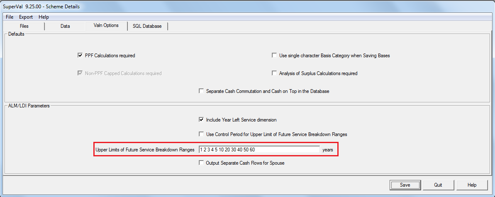
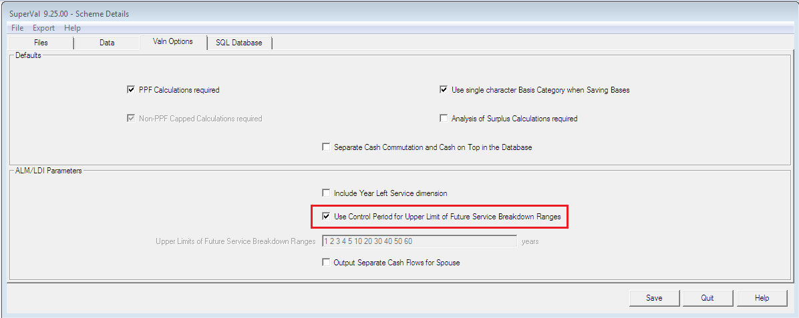
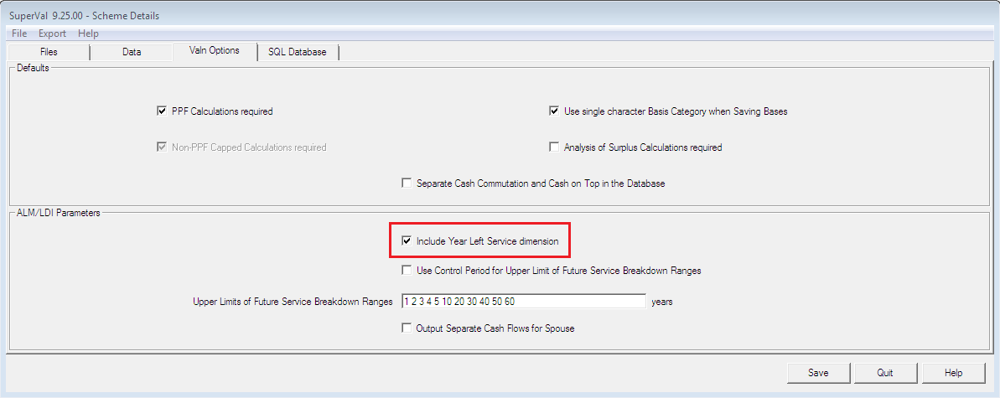
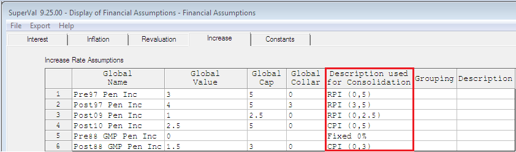
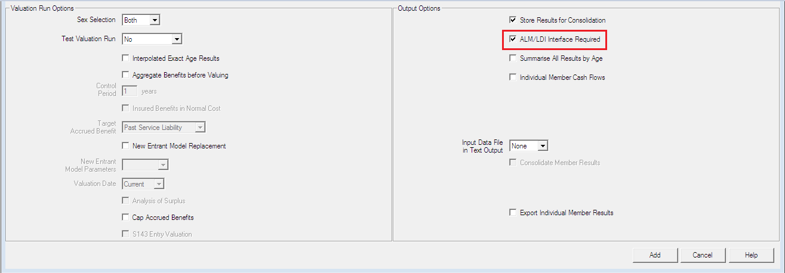
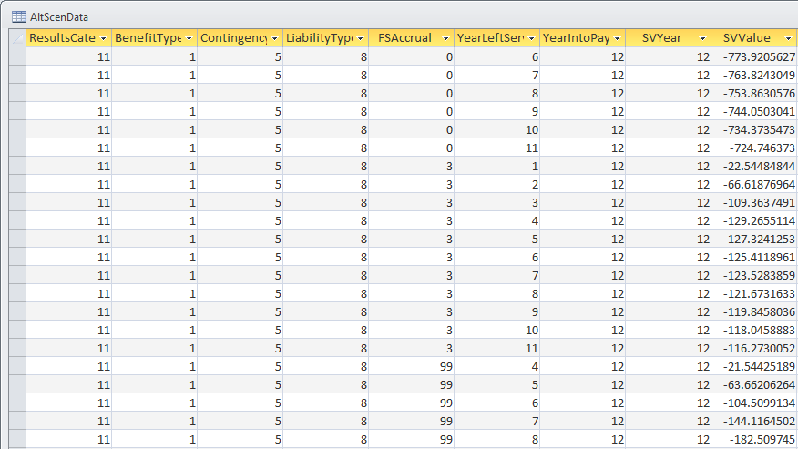

# ALM/LDI interface

The ALM/LDI module creates a table in the Access database that 
provides additional information about the timing of the
cashflows. That ensures you have
sufficient information about the plan’s cashflows to
produce a full ALM study. In particular, the cashflows of the plan are
split by year of payment. SuperVal always lets you produce 3D
cashflows such that the year-left-service is available.

See InFocus article:
[“Database Output”](../database-output/index.md). for a full description of the Access database.

## Scheme setup

### Future Service Breakdown Ranges

You can define the future service breakdown range in the _Upper Limits
of Future Service Breakdown Ranges_ field under _Scheme Details_: 
select _Files \> Properties \> Valn Options_.

If the above setup is used, the Future Service Accrual will be split
into 1, 2, 3, 4, 5 and then 6–10 will be shown under 10 years, 11–20
be shown under 20 years, etc.

If the _Upper Limits of Future Service Breakdown Ranges_ field is set to
3 60, then the Future Service Accrual will be a total of 1, 2 and 3
shown under 3 and then 4 – 60 will be shown under Future Service Accrual
of 60.

### Control period used as the upper limit of future service breakdown ranges

You can now use the Control Period as the upper limit of Future Service Breakdown Ranges if the below field is checked.

In the `AltScenData` table, when an AAN valuation is run the upper limit of Future Service used will be set to 99 
(i.e. all future service will be treated as one band).

### 3D Cashflows

Users can also get 3D Cashflows from SuperVal by checking the _Include
Year Left Service dimension_ checkbox on the Scheme Details. Following
this method will create a new column in the `AltScenData` table; the
Year Left Service column. This shows the year in which active members
have withdrawn from the Scheme.

## Basis setup

No additional information needs to be added to the basis setup to allow
the ALM LDI to run.

To use the results produced in the Scenario Modelling Spreadsheet (SMS) module,
populate the _Description used for Consolidation_ fields under the
_Increase_ tab of the Scheme Financials.

This will enable the same pension increases to be consolidated together.

## Valuation run

Once the data and the basis are ready in SuperVal, the valuation run can
be set up. To set up the valuation run, the User is required to check
the _ALM/LDI Interface Required?_ checkbox under _Batch Run \> Parameters_.

Once the valuation run is complete, you can run a consolidation.

## Results

The valuation run produces a database `SVResultsDB.mdb` in the
consolidation folder. This file can be opened in Microsoft Access. An
additional table `AltScenData` in this database contains the ALM/LDI information.

If you run a consolidation with the _Description used for
Consolidation_ fields populated, the same results will be produced. But
the _BenefitType_ column will be populated with ID 100+ which correspond
to the names defined in _Description used for Consolidation_ fields.

### AltScenData table

The columns of the `AltScenData` table are

ResultsCategoryID

: Whether the results are from Actives, New Entrants, Deferreds or Pensioners.

	Details of which category type each code relates to are found in the
	`ResultsCategory` table, which also includes `ClassID`, which shows
	the membership group. The membership groups are:

	1.  Actives 
	2.  New Entrants 
	3.  Deferreds 
	4.  Pensioners

BenefitTypeID

: The pension increases. If pension escalation in the _Description used for Consolidation_ fields were populated under the Scheme Financials e.g. RPI, LPI then those will be valued as 100+ integers.

	Details of what benefit type each code relates to are found in the `BenefitType` table.

ContingencyID

: The modes of exits, such as retirement, death in service, ill health etc.

	Details of what contingency type each code relates to are found in the `Contingency` table.

LiabilityID

: The discontinuance cashflow or the full cashflow

FSAccrual

: The future service accrual (Actives only). It will be 0 for all non-actives.

	For Actives, records will show 0 for past service or the number of years of future service.

YearLeftService

: The year the active member withdraws from the scheme.

YearIntoPayment

: The year the benefit originally came into payment.

SVYear

: The year the benefit shown in `SVValue` is payable. It is the number of years since the valuation date.

SVValue

: The projection of annual benefit cashflows.

!!! note "ResultsData and AltScenData tables"
	The `ResultsData` table and the `AltScenData` table are similar
	but the `AltScenData` table has extra columns: `YearIntoPayment`,
	`YearLeftService` and `FSAccrual`.

	The `AltScenData` table lets you correctly allow for
	the differentiation in discount rate pre- and post-retirement when
	discounting cashflows.

## SuperVal methodology

To calculate the Present Value of liabilities using cashflows:

### Cash

To calculate the present value of the cash liability paid on normal retirement, multiply the cashflow by:

$$(1 + DR_{pre})^{- (Y-1)}$$

where $DR_{pre}$ is the pre-retirement discount rate, and $Y$ is the year into payment.

<!-- (1 + pre-retirement discount rate) ^ - (YEAR INTO PAYMENT-1). -->

To calculate the present value of the cash liability paid on other decrements, 
multiply the cashflow by

$$(1 + DR_{pre})^{-(Y - 0.5)}$$

<!-- (1 + pre-retirement discount rate) ^ - (YEAR INTO PAYMENT-0.5). -->

### Pension

To calculate the present value of the pension liability on normal
retirement, where payments are made evenly over the year, you will need
to apply both the pre-retirement discount rate and the post-retirement
discount rate ($DR_{post}$). 
The cashflow should be multiplied by:

$$(1 + DR_{pre})^{-(Y-1)} \times (1 + DR_{post}^{-(SVYEAR - Y + 0.5)})$$

<!-- (1 + pre-retirement discount rate) ^ - (YEAR INTO PAYMENT-1)

multiplied

(1 + post-retirement discount rate) ^ - (SVYEAR - YEAR INTO PAYMENT +
0.5).
 -->

To calculate the present value of the pension liability on other decrements, 
multiply the cashflow by:

$$(1 + DR_{pre})^{-(Y - 0.5)} \times (1 + DR_{post})^{-(SVYEAR - Y)}$$

<!-- (1 + pre-retirement discount rate) ^ - (YEAR INTO PAYMENT-0.5)

multiplied

(1 + post-retirement discount rate) ^ - (SVYEAR - YEAR INTO PAYMENT).
 -->

!!! warning "An adjustment should be made when the pension payments are made at different points in the year."
