<!-- FIXME workaround because extra.css not getting compiled -->

# Analysis of Surplus

## Scope

The purpose of the Analysis of Surplus (AOS) is to compare the actual
results of the current valuation with the expected results of the
previous valuation and to break down the results between the possible
sources of surpluses and deficiencies.

Effectively, the previous valuation must be rolled forward to the
current valuation date giving the expected results. These are then
compared with the results of the current valuation – the actual results.
In doing so, each of the possible sources of surplus/deficiency must
have its contribution to the overall surplus/deficiency calculated
individually.

Sources of surplus/deficiency can be divided into two types:

1.  Cash B Cash receipts/payments during the inter-valuation period
    which arises from the payment of pensions and contributions; and

2.  Changes in reserves required for future cash receipts/payment (i.e.
    after the current valuation date) arises from the decrements in the
    inter-valuation period.

## Data requirements for the AOS calculations 

### Member data 

As the previous valuation results have to be rolled forward to the
current valuation date and compared with the current valuation results,
all the member data input to the previous and current valuations is
required. This data is held at individual member data level within
member status (Actives, Deferreds and Pensioners).

The AOS data must include data as at the current valuation date and also
as at the previous valuation date. The data required is the same data
items for the current valuation and the previous valuation. SuperVal has
the functionality to validate and blend files of the current and the
previous valuation data called the “Data Merge”.

A unique identifier (MEMNO) will be required in both the current and the
previous valuation data to proceed with the Data Merge.

The following numeric fields should be present in the valuation data
files.

| All Modules               | Actives                   | Deferreds           | Pensioners                   |
|---------------------------|---------------------------|---------------------|------------------------------|
| Unique identifier (MEMNO) | Date joined Company (DJS) | Pre 88 GMP (GMP0)   | Pre 88 GMP (GMP0)            |
| Name (NAME)               | Date joined Scheme (DJF)  | Post 88 GMP (GMPE0) | Post 88 GMP (GMPE0)          |
| Category (CAT)            | Salary (SAL)              | Leaving Date (LD)   | Date Pension Commenced (DPC) |
| Date of Birth (DOB)       | Previous Salary (PSAL)    |                     | Member or Spouse (MEMORSP)   |
| Sex (SEX)                 |                           |                     |                              |

The following numeric fields should have entries in the current valuation data.

| Actives                        | Deferreds                      | Pensioners                     |
|--------------------------------|--------------------------------|--------------------------------|
| Mode of Exit (MOE)             | Mode of Exit (MOE)             | Mode Ceased Pension (MOT)      |
| Date of Exit (DOE)             | Date of Exit (DOE)             | Date Ceased Pension (DOT)      |
| Lump sum benefit on Exit (BOE) | Benefit upon Termination (BOT) | Benefit upon Termination (BOT) |
|                                |                                | Total Pension Paid (TPP)       |
|                                |                                | Types of Pension (TOP)         |

### Steps to follow for Data Merge

1.  Two data files, one with current valuation data and one with
    previous valuation data. These files need to be saved as CSV files
    in the input folder. The filenames of the data files should be saved
    without spaces. These files should be saved in the same format as
    data files for regular valuations. The first row contains the names
    of the variables and the second row contains the data format
    (character, numeric or date format).

2.  There needs to be a unique identifier in both data files so as to
    match the records. This column **must** be named `MEMNO`.

3.  Launch SuperVal and select _Data \> Data Merge_

4.  The Data Merge form will ask you for:

    1.  the current valuation data file (CSV).

    2.  the previous valuation data file (CSV).

    3.  the membership type of the data (Actives, Deferreds or
        Pensioners)

    4.  the name of the merge file to be created.

    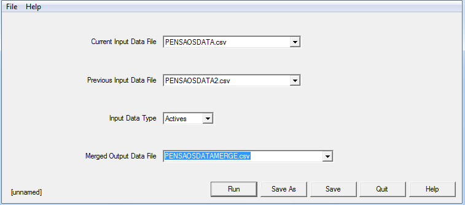

The new CSV file created has data from the current valuation and previous valuation merged.
The columns created from the previous valuation data file 
have the names of the variables prefixed by `#`.
An example of the Active data file is shown in [Appendix 1](#appendix-1).

Once the Data Merge is complete a Data Build is required to get the data ready for an AOS valuation.

### Actives setup

The AOS parameters can be accessed from: _Bases\>Scheme\>Analysis of
Surplus\>Actives Parameters_. 
Four Modes of Exit are available:

    Retirement
    Death in Service
    Ill Health Retirement
    Withdrawal

The Modes of Exit will be set according to what has been entered in the
data file. For instance, the example in Appendix 1 shows that the Modes
of Exit were as follows:

    D: Death in Service
    I: Ill Health Retirement
    R: Normal Retirement
    W: Withdrawal
    E: Early Retirement

These are not hard coded, but user-defined. The Modes of
Exit should be defined as a single character. You can have multiple
Modes of Exit defined in a particular field e.g. an Early Retirement (E)
and a Normal Retirement (R) can be defined in the Retirement Mode of
Exit field by double clicking on the field as highlighting the two
characters E and R.

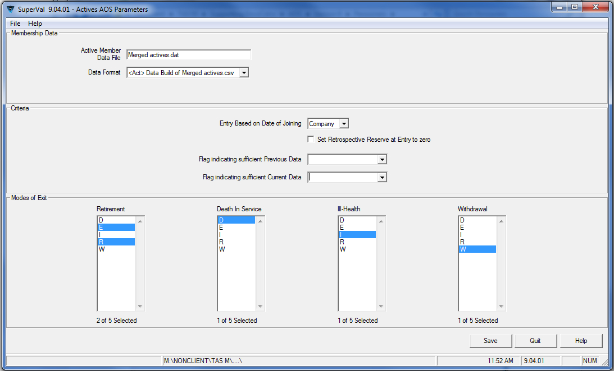

### Deferreds setup

In the AOS Parameters Setup for the Deferreds Module there are two Modes
of Termination available namely:

    Retirement
    Death In Deferment

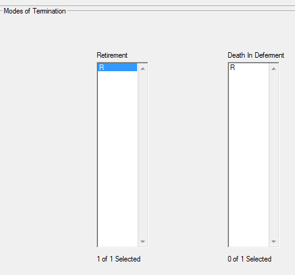

### Pensioners setup

In the AOS Parameters Setup for the Pensioners Module there is one Mode
of Termination available, which is `Death`.

## Valuation run

Once the data and the basis are ready in SuperVal, the valuation run can
be set up. Under _Scheme Details_ (_File\>Properties_), first
tick _Analysis of Surplus Calculations required_.

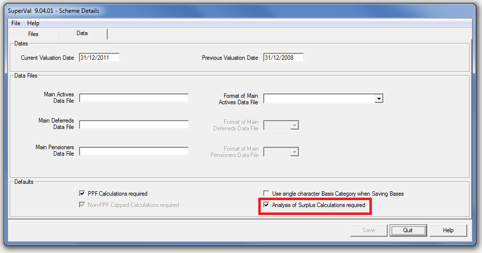

To set up the valuation run: check the _Analysis of Surplus_ box in the
Batch Setup: _Valuation\>Batch Run\>Add Runs_.

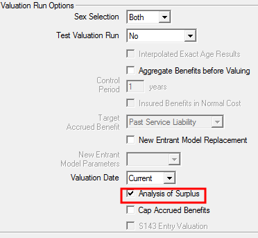

## Results

The aim of the AOS valuation is to analyse the expected liability
build‑up for each member, and allow actual accounting information to
be blended in with these results.

To enable the calculation of the reserve build‑up and the emerging
surpluses/strains that are analysed for each member individually, it is
necessary to value each member twice; first, at the later of the
Previous Valuation Date or the Date of Entry and then at the earlier of
the Date of Exit or the Current Valuation Date.

To enable the valuation calculations to be carried out at both dates,
the relevant member information must be available at both these dates
(although some approximations will be used in certain circumstances).
This information is to be held in the one member data record for each
member i.e. both current and previous valuation data is held in the one
[data record](#data-requirements-for-the-aos-calculations). 

Obviously, this approach must assume that the exact same benefit
definitions and valuation assumptions apply at both the current and
previous valuation dates. Thus, additional runs are required to evaluate
the effect of benefit changes or changes in the valuation assumptions
used.

For all modules (Actives, Deferreds and Pensioners), the results of the
AOS will be split according to the following groups:

Starter Enders

: in force at both the previous and current valuation date

New Entrant Enders

: inter‑valuation new entrants in force at current valuation date

Starter Exits

: in force at the previous valuation date but exits prior to or on current valuation date

New Entrant Exits

: inter‑valuation new entrant exits

Additionally, for Deferreds and Pensioners, the results of the Analysis
of Surplus are also split according to the Type of Pension data field.
Grouped results are also produced for all the Types of Pension fields
specified for each of the causes of exit (as specified in the Analysis
of Surplus parameters screen).

These groupings of the results enable the association of results for
members transferring between groups of members within the Scheme (for
example, an Active member retiring to become a Pensioner). This
association is necessary to allocate the surplus correctly, as in the
case given a large surplus will emerge in the Active AOS (equal to the
reserve required for pension benefits) and a corresponding strain will
emerge in the Pensioner AOS.

To calculate the expected values, a valuation is carried out for each
member on the anniversary of the current valuation date either at or
immediately prior to the latter of the date of entry or the previous
valuation date. For each of the specific groups mentioned above, this
valuation involves:

Starter Enders

: projections of amounts at the Previous Valuation Date based on member data effective at that date, or

    when the inter‑valuation period is a non‑integral number of years,
    projections of amounts (with appropriate linear interpolation in the
    first ‘short’ year) at the anniversary of the Valuation Date prior to
    Previous Valuation Date based on member data effective at the Previous
    Valuation Date,

New Entrant Enders

: projections of amounts (with appropriate linear interpolation in the first ‘short’ year) at the anniversary of Valuation Date prior to Entry based on member data assumed effective at the Entry Date

Starter Exits

: as for Old Actives except appropriate linear interpolation will apply in the ‘short’ Year of Exit also

New Entrant Exits

: as for New Actives except appropriate linear interpolation will apply in the ‘short’ Year of Exit also.

### Active results

The specific calculations for Active Members are set out below.
Obviously many of the values are based on numbers generated from the
valuation, and reference will be made to these values without
explanation.

The specification will be illustrated by sample calculations based on
the following members (whose results are displayed in Appendices 2—4).

-   Starter Ender member valued using the Projected Unit Credit Method
-   New Entrant Ender member valued using the Attained Age Normal Method
-   Starter Exit member valued using the Projected Unit Credit Method

#### Contributions

The amounts of expected and actual contributions will be evaluated split
into four groups:

-   Member contributions
-   Expected Company contributions in respect of Funded benefits (based on recommended rates)
-   Company contributions in respect of Unfunded (current cost) death benefits
-   Company contributions in respect of Unfunded (current cost) ill‑health benefits

Additionally, the Company contributions required in respect of funded
benefits will be evaluated (that is, the theoretically required
contribution to maintain reserves).

##### Expected contributions

All Expected Contributions (Member, Company Funded and Company Death
and Ill‑Health Current Cost) are based on the expected salary of the
member, as projected in the valuation of the member at the later of the
Date of Entry or the Previous Valuation Date assuming the member remains
in force until the earlier of the Date of Exit or the Current Valuation
Date.

An approximation may be applied if Expected Contributions are calculated
as zero, for example when salary at Entry is not specified. These
approximations are discussed in more detail below.

Thus, the calculations for the example members would be as follows
(based on the rates of contribution as specified in the Contribution
screens):

<!-- Style all following tables as numeric -->

**Starter Ender – Projected Unit Credit (Appendix 2)**

| Year Commencing                                        | 31/12/2008 | 31/12/2009 | 31/12/2010 | Total  |
|--------------------------------------------------------|------------|------------|------------|--------|
| Expected Salary                                        | 32,508     | 33,808     | 35,161     | \-     |
| Proportion Active                                      | 1.00       | 1.00       | 1.00       | \-     |
| Member – 7.5%                                          | 2,438      | 2,536      | 2,637      | 7,611  |
| Company – 12.5%                                        | 4,064      | 4,226      | 4,395      | 12,685 |
| Current Cost – Death 2.5%                              | 813        | 845        | 879        | 2,537  |
| Current Cost – Ill Health 0%                           | 0          | 0          | 0          | 0      |

**New Entrant – Attained Age Normal (Appendix 3)**

| Year Commencing                                        | 31/12/2008 | 31/12/2009 | 31/12/2010 | Total  |
|--------------------------------------------------------|------------|------------|------------|--------|
| Expected Salary                                        | 19,500     | 20,280     | 21,091     | \-     |
| Proportion Active                                      | 0.25       | 1.00       | 1.00       | \-     |
| Member – 7.5%                                          | 365        | 1,521      | 1,582      | 3,468  |
| Company – 12.5%                                        | 609        | 2,535      | 2,636      | 5,780  |
| Current Cost – Death 2.5%                              | 122        | 507        | 527        | 1,156  |
| Current Cost – Ill Health 0%                           | 0          | 0          | 0          | 0      |

**Note** Contributions are pro-rated in the year of Exit.

The Required rate of Company Contribution (which equals the
theoretical contribution rate required to maintain reserves net of
Member contributions) is calculated as part of the valuation process.
This contribution rate also depends on the particular valuation method
being used:

Projected Unit Credit

: Equal to the expected additional contributions (net of Member Contributions) for each year of additional service accrued (that is, the theoretically total contribution required for funded benefits net of member contributions, or effectively a projection of one year Normal Costs under the Projected Unit Credit method).

Attained Age Normal

: Equal to the PUC Normal Cost (see above).

Defined Accrued Benefit

: Equal to the expected additional Company contributions (net of Member Contributions) required to maintain a reserve equal to the Defined Accrued Benefit, that is, the Reserve under this method.

The projection of Required Company Contributions are derived in the
valuation of the member at the later of the date of entry or the
previous valuation date assuming the member remains in force until the
earlier of the Date of Exit or the Current Valuation Date.

Required Contributions are pro‑rated in the year of Entry or Exit.

##### Actual contributions

The Actual Member contributions are calculated by differencing the
following data items, Accumulated Employee Contributions without
Interest at the Previous Valuation Date (or Entry) and Current Valuation
Date (or Exit).

The Actual Company contributions are calculated by differencing the
following data items, Accumulated Employer Contributions without
Interest at the Previous Valuation Date (or Entry) and Current Valuation
Date (or Exit).

An approximation may be applied if Actual Contributions are calculated
as zero or negative, for example, when an Accumulation of Contributions
without Interest field at Exit is not specified. These approximations
are discussed in more detail below.

Note that it is not mandatory that these Accumulated Contributions
without Interest data fields be specified as the total Scheme amount of
Actual member and Company contributions can be blended with the
consolidated Analysis of Surplus results (replacing the approximate
figure estimated by the system).

The Actual Company Current Cost Contributions in respect of Death and
Ill‑Health are derived from the Actual Member Contributions by applying
the ratio of the Expected Rate of Current Cost Contribution over the
Expected Rate of Member Contribution.

##### Contributions: approximations

The following sets out the approximations made by system in respect of
the calculation of Expected and Actual Contributions. Note that these
calculations are generally designed to overcome insufficient member
data, either on an overall Scheme level (for example, a Contributions
without Interest data field that is not specified) or for specific
members (such as missing data for New Entrants at Entry or for Exits at
Date of Exit).

The approximation calculated may not be required as the corresponding
amount may be available in the Scheme accounts or a more appropriate
approximation may be possible based on other amounts in the Accounts or
the Analysis.

The approximations are made in the order set out below (although some or
all may be skipped if not required) and thus some approximations may be
based on previous approximations.

1.  **Actual Member Contributions**, if they are evaluated as being less than or equal to zero, are set equal to Expected Member Contributions (to cope with no specification of Accumulated Employee Contributions without Interest data field or missing value at Exit).

2.  **Expected Member Contributions**, if they are evaluated as being equal to zero, are set equal to Actual Member Contributions (to cope with no salary at Entry).

3.  **Actual Company Contributions**, if they are evaluated as being less than or equal to zero, are set equal to Actual Member Contributions multiplied by the ratio of the Expected Company Contribution Rate over the Expected Member Contribution Rate (to cope with no specification of Accumulated Employer Contributions without Interest data field or missing value at Exit).

    In the common circumstance where both Accumulated Contributions
    without Interest data fields are not specified or values are missing
    at Exit, this approximation will result in Actual Company Funded
    Contributions equal to Expected Company Funded Contributions.

    The Expected Contribution Rates (Member and Company) are calculated as:

    -   the average rate of Expected Contribution over the inter‑valuation period (calculated as the sum of Expected Member Contributions divided by the sum of the Expected 1% of Salary based on the projection from the Previous Valuation Date), or (if this is zero)

    -   the average rate of Expected Contribution over a future inter‑valuation period (as projected from the valuation at the Current Valuation Date or Date of Exit), or (if this is zero)

    -   the average rate of Expected Contribution over a future inter‑valuation period (as projected from the valuation at the Current Valuation Date or Date of Exit but assuming a future salary level of 1 per annum).

4.  **Required Company Contributions**, if they are evaluated as being equal to zero, are set equal to Actual Company Contributions (to cope with no salary at entry or exit).

5.  **Expected Company Contributions**, if they are evaluated as being equal to zero, are set equal to Actual Company Contributions (to cope with no
salary at entry or exit).

6.  **Actual Current Cost Company Contributions** are set equal to Actual Company Contributions multiplied by the ratio of the Expected Company Current Cost Contribution Rate over the Expected Company Contribution Rate.

7.  **Expected Current Cost Company Contributions**, if they are evaluated as being equal to zero, are set equal to Actual Current Cost Company Contributions (to cope with no salary at entry).

Typically, these approximations should only be required for new entrants
and exits where the salary information is not supplied at entry or exit.
The result of these assumptions is that a New Entrant Exit without any
salary information will have a reserve at exit calculated as the sum of
the Actual member and Company contributions plus Expected Interest on
these amounts.

##### Contributions profits

Thus, the calculation of the contribution profits for the example
members would be as follows (based on the rates of contribution as
specified in the Contribution screens):

**Starter Ender – Projected Unit Credit (Appendix 2)**

| Year Commencing                                    | 31/12/2008 | 31/12/2009 |          31/12/2010 | Total  |
|----------------------------------------------------|------------|------------|---------------------|--------|
| Expected Member Conts                              |      2,438 |      2,536 |               2,637 |  7,611 |
| Actual Member Conts                                |            |            |       19,076–11,043 |  8,033 |
| Excess Member Conts                                |            |            |                     |   –422 |
| Expected Company Conts                             |      4,064 |      4,226 |               4,395 | 12,685 |
| Actual Company Conts                               |            |            |  8,033 × 12.5 ÷ 7.5 | 13,388 |
| Excess Company Conts                               |            |            |                     |   –703 |
| Expected Death Current Cost Conts                  |        813 |        845 |                 879 |   ,537 |
| Actual Death Current Cost Conts                    |            |            | 13,388 × 2.5 ÷ 12.5 |  2,678 |
| Excess Death Current Cost Conts                    |            |            |                     |   –141 |
| Expected Ill Health Current Cost Conts             |          0 |          0 |                   0 |      0 |
| Actual Ill Health Current Cost Conts               |            |            | 13,388 × 0.0 ÷ 12.5 |      0 |
| Excess Ill Health Current Cost Conts               |            |            |                     |      0 |

**New Entrant – Attained Age Normal (Appendix 3)**

| Year Commencing                                    | 31/12/2008          | 31/12/2009 | 31/12/2010         | Total |
|----------------------------------------------------|---------------------|------------|--------------------|-------|
| Expected Member Conts                              | 365                 | 1,521      | 1,582              | 3,468 |
| Actual Member Conts                                |                     |            | 4,157 – 0          | 4,157 |
| Excess Member Conts                                |                     |            |                    |   689 |
| Expected Company Conts                             | 609                 | 2,535      | 2,636              | 5,780 |
| Actual Company Conts                               |                     |            | 4,157 × 12.5 ÷ 7.5 | 6,928 |
| Excess Company Conts                               |                     |            |                    | 1,148 |
| Expected Death Current Cost Conts                  | 122                 | 507        | 527                | 1,156 |
| Actual Death Current Cost Conts                    |                     |            | 6,928 × 2.5 ÷ 12.5 | 1,386 |
| Excess Death Current Cost Conts                    |                     |            |                    |   230 |
| Expected Ill Health Current Cost Conts             | 0                   | 0          | 0                  |     0 |
| Actual Ill Health Current Cost Conts               |                     |            | 6,928 × 0.0 ÷ 12.5 |     0 |
| Excess Ill Health Current Cost Conts               |                     |            |                    |     0 |

**Starter Exit – Projected Unit Credit (Appendix 4)**

| Year Commencing                                           | 31/12/2008           | 31/12/2009 | 31/12/2010          | Total  |
|-----------------------------------------------------------|----------------------|------------|---------------------|--------|
| Expected Member Conts                                     | 5,365                | 5,580      | 1,450               | 12,395 |
| Actual Member Conts                                       |                      |            | 15,755 – 3,236      | 12,519 |
| Excess Member Conts                                       |                      |            |                     |    124 |
| Expected Company Conts                                    | 8,942                | 9,300      | 2,416               | 20,658 |
| Actual Company Conts                                      |                      |            | 12,519 × 12.5 ÷ 7.5 | 20,865 |
| Excess Company Conts                                      |                      |            |                     | 207    |
| Expected Death Current Cost Conts                         | 1,788                | 1,860      | 483                 | 4132   |
| Actual Death Current Cost Conts                           |                      |            | 20,865 × 2.5 ÷ 12.5 | 4,173  |
| Excess Death Current Cost Conts                           |                      |            |                     | 41     |
| Expected Ill Health Current Cost Conts                    | 0                    | 0          | 0                   | 0      |
| Actual Ill Health Current Cost Conts                      |                      |            | 20,865 × 0.0 ÷ 12.5 | 0      |
| Excess Ill Health Current Cost Conts                      |                      |            |                     | 0      |

#### Funding level profits

The difference between the rate of Company contribution actually paid and the theoretically required rate of Company contributions represents a funding level profit (that is, a surplus is being created if the Company is paying more than is required).

Thus, the calculation of the funding level profit for the example members would be as follows:

**Starter Ender – Projected Unit Credit (Appendix 2)**

| Year Commencing                                        | 31/12/2008 | 31/12/2009 | 31/12/2010 | Total  |
|--------------------------------------------------------|------------|------------|------------|--------|
| Proportion Active                                      | 1.00       | 1.00       | 1.00       | —      |
| Expected Company Conts                                 | 4,064      | 4,226      | 4,395      | 12,685 |
| Required Company Conts                                 | 3,482      | 3,796      | 4,137      | 11,414 |
| Funding Level Profit                                   | 582        | 430        | 258        | 1,271  |

**New Entrant – Attained Age Normal (Appendix 3)**

| Year Commencing                                    | 31/12/2008 | 31/12/2009 | 31/12/2010 | Total |
|----------------------------------------------------|------------|------------|------------|-------|
| Proportion Active                                  | 0.25       | 1.00       | 1.00       | —     |
| Expected Company Conts                             | 609        | 2,535      | 2,636      | 5,780 |
| Required Company Conts                             | 361        | 1,589      | 1,744      | 3,695 |
| Funding Level Profit                               | 248        | 946        | 892        | 2,085 |

**Note** Contributions are pro‑rated in the year of Entry. Due to technical
reasons (which is because a valuation of the member is performed prior
to entry – when Past Service, in this case, is **–**0.75 years!), the
Required Company Contributions in the year of Entry are understated and
leads to an error in the Reserve build‑up.

**Starter Exit – Projected Unit Credit (Appendix 4)**

| Year Commencing                                           | 31/12/2008 | 31/12/2009 | 31/12/2010 | Total  |
|-----------------------------------------------------------|------------|------------|------------|--------|
| Proportion Active                                         | 1.00       | 1.00       | 0.25       | —      |
| Expected Company Conts                                    | 8,942      | 9,300      | 2,416      | 20,658 |
| Required Company Conts                                    | 8,340      | 9,082      | 2,470      | 19,892 |
| Funding Level Profit                                      | 602        | 218        | -54        | 766    |

Contributions are pro‑rated in the year of Exit and are equal to
the Expected Contributions due to the valuation method.

#### Reserves and salary-increase strain

The difference between the Actual Reserve at the Current Valuation Date (or Exit) and the Expected Reserve at this date is considered a strain due to salary increases.

The Actual Reserve is calculated as part of the valuation process and the method of calculation depends on the particular valuation method being used:

Projected Unit Credit

: Equal to a Retrospective Reserve of the PUC Projected Benefit Obligation

Attained Age Normal

: Equal to a Retrospective Reserve of the present value of accrued portion (that is, the portion of each benefit that has been accrued by virtue of completion of membership or payment of contributions in the Scheme) of all Benefits (usually referred to as the Past Service Liability)

If the Actual Reserve is calculated as zero (due to a lack of member information at the Current Valuation Date), the Actual Reserve is set equal to the Expected Reserve at the Current Valuation Date.

The Expected Reserves are projected as part of the valuation process at anniversary of the valuation date at or immediately prior to the latter of Entry or the Previous Valuation Date assuming the member remains in force until the earlier of the Date of Exit or the Current Valuation Date. The calculation of the reserve at that date of valuation is identical to that described above for the Current Reserve.

The process involved in the projection of reserves is set out below for each of the two types of reserve calculation.

Prospective Reserve

: The prospective reserve is equal to the present value of the future Total Benefit Liability (occurring after the projected future date) less the present value of the future Member and Company "Funded" Contributions (after the future date). This produces an accurate projection of all benefits and contributions. 

Retrospective Reserve

: The retrospective reserve is equal to the present value of the projected Past Service Liability (basically equal to the Past Service Liability at the valuation date plus a proportion of the Future Service Liability with appropriate allowance for inflation and discounting). 

    The Future Service Liability is assumed to accrue uniformly between the date of the valuation and date of the benefit emerging and thus the pro‑ration is based on the service completed since the valuation date compared to the potential service at the assumed date of exit (the same as pro‑ration for the Projected Unit Credit Normal Cost).

    This method of pro‑ration will accurately project liabilities related
    to service (or pro‑rated in the Past Service Liability by service),
    but is an approximation to other benefits such as:

    -   greater-of benefits such as those subject to the contributions underpin, and
    -   benefits based on a return of contributions.

For all methods using a Retrospective approach, the reserve is set equal
to zero at Entry for an inter‑valuation new entrant.

For members who attain an age beyond the assumed retirement age, the
Expected Reserve is projected by rolling up the Reserve at the
Retirement Age with interest at the valuation rate.

When the Reserve projected from the Previous Valuation Date is zero (for
example, when salary at Entry is not specified), the Expected Reserve at
the Current Valuation Date is assumed to be the sum of Actual Member
Contributions and Actual Company "Funded" Contributions plus Interest at
the valuation rate.

Thus, the calculation of the salary increase strain for the example
members would be as follows:

|                            | Starter Ender Projected Unit Credit | New Entrant Attained Age Normal | Starter Exit Projected Unit Credit |
|----------------------------|---------------------------------------|-----------------------------------|--------------------------------------|
| Current Actual Reserve     | 122,457                               | 8,761                             | 51,962                               |
| Projected Expected Reserve | 109,766                               | 7,739                             | 45,233                               |
| Salary-Increase Strain     | 12,691                                | 1,022                             | 6,729                                |

#### Reserves and salary increase strain

The profit emerging from members exiting the Scheme is calculated as the difference between the Actual Release of Reserves for members actually leaving the Scheme over the inter‑valuation period and the Expected Release of Reserves based on the valuation assumptions.

The release of Expected Reserves takes account only of those benefits that have been funded (as no Reserve is held for those benefits paid for on a Current Cost basis). Thus the amount of the Expected Current Cost Company contributions are also released, offsetting the strain from allowing for ‘insured’ benefits paid from the Scheme.

##### Actual release of reserve

The Actual Release of Reserve (for exiting members only) is calculated
as the difference between the Actual Reserve at the date of exit and the
amount of the immediate Cash Benefit (if any) paid to the exiting member
including any ‘insured’ cash benefit, but excluding the value of any
(‘insured’ or ‘funded’) pension benefits paid.

For inter‑valuation Exits, the immediate Cash Benefit paid at Exit is
read from the data field in the member data record which is specified as
Lump Sum Benefit on Exit (BOE) .

The Actual Release will be allocated to one of the four causes of
decrement:

    Retirement
    Death in Service
    Ill‑Health
    Withdrawal

According to the Mode of Exit for the member matching one of the modes
of exit specified (in the Analysis of Surplus Parameters screen) that
relate to the particular cause of exit (for example, Retirement may
include `E` for early, `N` for Normal and `L` for Late Retirement).

If the Mode of Exit does not match one of those specified (or is blank),
it will be allocated to the `Unspecified` cause of exit (for which there
is no Expected Release of Reserve). This may be used in the situation
where members have been retrenched by the Employer – a situation not
‘expected’ on the valuation basis.

The results of the Analysis (in terms of Actual Releases on the four causes
of exit) will then be broken down by each of the modes of exit specified
and then grouped together to give the overall release for that cause of
exit.

Note that the value of any pension benefits will be revealed as a
surplus but this surplus will be offset by a new entrant strain emerging
in the pensioner of deferred member Analysis of Surplus.

As only the example Starter Exit member did exit, the Actual Release
upon Exit calculation for him would be as follows:

|                                | Starter Exit Projected Unit Credit |
|--------------------------------|--------------------------------------|
| Actual Reserve at Exit         | 51,962                               |
| Cash Benefit at Exit           | 60,000                               |
| Actual Reserve Release at Exit | –8,038                               |

Depending on the marital status of the deceased member a spouse’s
pension is payable and the value of this benefit (evaluated in the
Pensioners Analysis of Surplus) will be an additional strain in respect
of this exit. The Type of Pension code will provide the link with the
Exit code from the Actives analysis.

##### Expected release of reserve

The release upon exit for each of the assumed exit decrements (all
released at the assumed point of exit, that is, mid‑year except for
normal retirement which is assumed to take place at the start of the
year) is calculated as:

the **projected reserve**

:  (at the end of year of assumed exit discounted back to the middle of the year, except normal retirement where start year (that is, point of exit) reserve is utilised)

less **foregone contributions**

: that is, the expected non‑receipt of half of the Expected Contributions (Member and Required Company) receivable for the year anticipated by the exit event (zero for normal retirement as exit occurs at start of year)

less the **expected ‘funded’ benefit payment**

These calculations are carried out at the later of the anniversary of
the valuation date at or prior to Entry or the Previous Valuation Date
and assume the member remains in force until the earlier of the Date of
Exit or the Current Valuation Date.

The expected release is calculated for each of the four causes of
decrement:

    Withdrawal
    Death
    Ill‑Health 
    Retirement

Thus, the calculations for the expected release upon death for the
example members would be as follows:

**Starter Ender – Projected Unit Credit**

| Year Commencing                                       | 31/12/2008       | 31/12/2009 | 31/12/2010  | Total  |
| ------------------------------------------------------|------------------|------------|-------------|--------|
| Proportion Active (t)                                 | 1.00             | 1.00       | 1.00        | –      |
| Expected Reserve – End Year                           | 83,678           | 96,058     | 109,766     | –      |
| Probability of Exit – Qdeath                          | 0.00178          | 0.00196    | 0.00219     | –      |
| Expected Member Contributions                         | 2,438            | 2,536      | 2,637       | 7,611  |
| Required Company Contributions                        | 3,482            | 3,796      | 4,137       | 11,414 |
| Total Benefit – Death                                 | 94,329           | 103,238    | 112,374     | –      |
| Discounted Reserve: Reserve~1~ ÷ 1.07^½t^     | 80,895           | 92,863     | 106,115     | –      |
| Reserve Release: Disc. Reserve × QDeath × t        | 144              | 182        | 232         | 558    |
| Foregone Contributions: ½ × (MC + CC) × QDeath × t | 5            | 6          | 7           | 18     |
| Benefit Paid: Total Benefit × QDeath × t           | 168              | 202        | 246         | 616    |
| Expected Release                                      | –29              | –27        | –21         | –76    |

**New Entrant – Attained Age Normal**

| Year Commencing                                       | 31/12/2008       | 31/12/2009 | 31/12/2010  | Total  |
| ------------------------------------------------------|------------------|------------|-------------|--------|
| Proportion Active (t)                                 | 0.25             | 1.00       | 1.00        | –      |
| Expected Reserve – End Year                           | 752              | 4,020      | 7,739       | –      |
| Probability of Exit – Qdeath                          | 0.00073          | 0.00078    | 0.00084     | -      |
| Expected Member Contributions                         | 365              | 1,521      | 1,582       | 3,468  |
| Required Company Contributions                        | 361              | 1,589      | 1,744       | 3,695  |
| Total Benefit – Death                                 | 0                | 3,891      | 9,296       | –      |
| Discounted Reserve: Reserve~1~ ÷ 1.07^½t^     | 727              | 3,886      | 7,482       | –      |
| Reserve Release: Disc. Reserve × QDeath × t        | 0                | 3          | 6           | 9      |
| Foregone Contributions: ½ × (MC + CC) × QDeath × t | 0                | 1          | 1           | 2      |
| Benefit Paid: Total Benefit × QDeath × t           | 0                | 3          | 8           | 11     |
| Expected Release                                      | 0                | -1         | -3          | -4     |

**Starter Exit – Projected Unit Credit**

| Year Commencing                                        | 31/12/2008 | 31/12/2009 | 31/12/2010 | Total  |
|--------------------------------------------------------|------------|------------|------------|--------|
| Proportion Active (t)                                  | 1.00       | 1.00       | 0.25       | –      |
| Expected Reserve – End Year                            | 23,652     | 40,470     | 58,625     | –      |
| Probability of Exit – Qdeath                           | 0.00233    | 0.00259    | 0.00289    | –      |
| Expected Member Contributions                          | 5,365      | 5,580      | 1,450      | 2,395  |
| Required Company Contributions                         | 8,340      | 9,082      | 2,470      | 19,892 |
| Total Benefit – Death                                  | 17,490     | 33,037     | 49,059     | –      |
| Discounted Reserve: Reserve~1~ ÷ 1.07^½t^      | 22,865     | 39,124     | 58,131     | –      |
| Reserve Release: Disc. Reserve × QDeath × t         | 53         | 101        | 42         | 196    |
| Foregone Contributions: ½ × (MC + CC) × QDeath × t  | 16         | 19         | 1          | 36     |
| Benefit Paid: Total Benefit × QDeath × t            | 41         | 86         | 35         | 162    |
| Expected Release                                       | -3         | -3         | 6          | -1     |

#### Release of current cost contributions 

As discussed above, for the Death and Ill‑Health decrements (when the funding method adopted for some or all of the benefit is current cost), the amount of the Expected Current Cost Company contributions are released. As no Reserve is held for these ‘insured’ benefits, the Release of these contributions offsets the payment of Actual "Insured" Benefits (either as a Cash Benefit or via a pension paid from the Scheme).

|                                     | Starter Ender: Projected Unit Credit | New Entrant: Attained Age Normal | Starter Exit: Projected Unit Credit |
|-------------------------------------|---------------------------------------|-----------------------------------|--------------------------------------|
| Actual Reserve Release              | 0                                     | 0                                 | -8,038                               |
| Expected Reserve Release            | –76                                   | –4                                | –1                                   |
| Expected Current Cost Contributions | 2,537                                 | 1,156                             | 4,132                                |
| Exit Profit                         | 2,613                                 | 1,160                             | -3,905                               |

#### Expected interest 

Interest is calculated at the rate expected on the valuation assumptions on all items that contribute to the build‑up of the reserve.

Thus, the Expected Interest is calculated as follows:

-   the Reserve at the start of the year times the valuation rate of interest in that year

-   plus the sum of the Expected Releases of Reserves for each of the four causes of exit plus the Required Company and Member Contributions for the year times half a year's interest at the valuation rate (that is, the square root of the valuation rate).

When the Expected Interest projected from the Previous Valuation Date is zero (for example, when salary at Entry is not specified), the Expected Interest is calculated as the Expected Interest that would have been payable on the build-up on the sum of Actual Member Contributions and Actual Company Funded Contributions at the valuation interest rate.

Thus, the calculations for the example members would be as follows:

**Starter Ender - Projected Unit Credit**

| Year Commencing                                                             | 31/12/2008 | 31/12/2009 | 31/12/2010 | Total   |
|-----------------------------------------------------------------------------|------------|------------|------------|---------|
| Proportion Active (t)                                                       | 1.00       | 1.00       | 1.00       | –       |
| Expected Reserve – Start Year                                               | 72,509     | 83,678     | 96,058     | 109,766 |
| Expected Member Contributions – Mid Year                                    | 2,438      | 2,536      | 2,637      | 7,611   |
| Required Company Contributions – Mid Year                                   | 3,482      | 3,796      | 4,137      | 11,414  |
| Expected Release (All Causes of Exit) – Mid Year                       | –29        | –27        | –21        | –77     |
| Expected Interest – Start Year: Reserve × 0.07 × t                       | 5,076      | 5,857      | 6,724      | 17,657  |
| Expected Interest - Mid Year: (MC + CC + Rel) × (1.07½t) – 1  | 203        | 217        | 232        | 652     |
| Total Expected Interest                                                     | 5,279      | 6,074      | 6,956      | 18,309  |
| Reserve Build‑Up: Res0 + MC + CC + Rel + Int                  | 83,678     | 96,508     | 109,766    |         |
| Error In Reserve Build-Up                                                   | 0          | 0          | 0          | 0       |

**New Entrant – Attained Age Normal**

| Year Commencing                                                             | 31/12/2008 | 31/12/2009 | 31/12/2010 | Total   |
|-----------------------------------------------------------------------------|------------|------------|------------|---------|
| Proportion Active (t)                                                       | 0.25       | 1.00       | 1.00       | –       |
| Expected Reserve – Start Year                                               | 0          | 752        | 4,020      | 7,739   |
| Expected Member Contributions – Mid Year                                    | 365        | 1,521      | 1,582      | 3,468   |
| Required Company Contributions – Mid Year                                   | 361        | 1,589      | 1,744      | 3,695   |
| Expected Release (All Causes of Exit) – Mid Year                       | 0          | –1         | –3         | –4      |
| Expected Interest – Start Year: Reserve × 0.07 × t                       | 0          | 53         | 281        | 334     |
| Expected Interest – Mid Year: (MC + CC + Rel) × (1.07½t) – 1  | 6          | 107        | 114        | 227     |
| Total Expected Interest                                                     | 6          | 160        | 395        | 561     |
| Reserve Build‑Up: Res0 + MC + CC + Rel + Int                  | 732        | 4,020      | 7,739      |         |
| Error In Reserve Build–Up                                                   | –20        | 0          | 0          | –20     |

!!! warning 

    As a valuation of the member is performed prior to entry (when Past Service, in this case, is **–**0.75 years!) the Required Company Contributions in the year of Entry are understated and leads to an error in the Reserve build‑up.

**Starter Exit – Projected Unit Credit**

| Year Commencing                                                             | 31/12/2008 | 31/12/2009 | 31/12/2010 | Total   |
|-----------------------------------------------------------------------------|------------|------------|------------|---------|
| Proportion Active (t)                                                       | 1.00       | 1.00       | 0.25       | –       |
| Expected Reserve – Start Year                                               | 8,858      | 23,652     | 40,470     | 45,233  |
| Expected Member Contributions – Mid Year                                    | 5,365      | 5,580      | 1,450      | 12,395  |
| Required Company Contributions – Mid Year                                   | 8,340      | 9,082      | 2,470      | 19,892  |
| Expected Release (All Causes of Exit) – Mid Year                       | –3         | –3         | 6          | –1      |
| Expected Interest – Start Year: Reserve × 0.07 × t                       | 620        | 1,656      | 708        | 2,984   |
| Expected Interest – Mid Year: (MC + CC + Rel) × (1.07½t) – 1  | 471        | 504        | 33         | 1,008   |
| Total Expected Interest                                                     | 1,091      | 2,160      | 741        | 3,992   |
| Reserve Build‑Up: Res0 + MC + CC + Rel + Int                  | 23,652     | 40,470     | 45,137     |         |
| Error In Reserve Build–Up                                                   | 0          | 0          | –96        | –96     |

!!! warning

    The error in this example is due to the use of linear interpolation for the Expected Reserve value at Exit (and the Reserve Build‑Up is probably a better representation of the ‘true’ Expected Reserve at Exit).

#### Approximations in the Analysis of Surplus system

The following approximations are made by the Analysis of Surplus system:

1.  for the projection of Retrospective Reserves (as used in AAN and
    PUC) benefits accruing in the future are assumed to be uniformly
    accrued to the date of payment,

2.  calculations made using any time-related elements in the valuation
    basis will be carried out on the assumption that the time‑related
    factors commence at both valuation dates at which the calculations
    are being made (which, of course, should not be the case if they
    vary with time),

3.  valuation periods of a non‑integral number of years are catered for
    by carrying out calculations for a valuation period of the next
    highest number of years and interpolating the figures at the
    Previous Valuation Date,

4.  calculations for inter‑valuation new entrants are carried out at the
    anniversary of the valuation date prior to entry (that is, a
    valuation period of the number of years of membership rounded up is
    assumed) and the figures at Entry are interpolated (thus all
    salaries figures specified are assumed to be those applying at this
    prior date),

5.  if a zero reserve is calculated for Exits at the Date of Exit (that
    is, salaries and contributions at Exit were not specified), the
    reserve and actual contribution amounts will be assumed equal to the
    "expected" values (projected from the Previous Valuation Date or
    Date of Entry). Thus, the Salary Profit will be zero.

6.  if the Expected Member Contributions are equal to zero (for example,
    when salary at Entry is not specified) they are set equal to the
    amount of Actual Member Contributions.

#### Circumstances not automatically allowed for in the Analysis of Surplus system

In the following circumstances the system will not cope automatically. 
See the suggested solution to derive the required numbers.

Change in member information such as date of birth or date of entry

: Value member on both old and new information and carry forward the resulting surplus.

Change in member’s benefit category

: Value member in both old and new category and carry forward  the resulting surplus.

Change in valuation basis

: Value members on both the old and new valuation basis (either at the current or previous valuation date) and carry forward the resulting surplus.

Time-related items in the valuation basis (such as short-term interest and inflation rates, time related weights on withdrawal)

: Treat as for a change in Valuation basis.

###  Pensioners results

The specific calculations for Pensioner Members are set out below.
Obviously many of the values are based on numbers generated from the
valuation, which have been documented elsewhere, and reference will be
made to these values without explanation.

The specification will be illustrated by sample calculations based on
the following members (whose results are displayed in [Appendix 6](#appendix 6):

-   a Start Ender married pensioner with 1 year remaining in the Guarantee Period,
-   a New Entrant single pensioner, and
-   a Starter Exit married pensioner.

All three members are males born on at 31 December 1940 and the other
relevant pension payment details are:

-   a 50% Reversionary Pension is also payable (if applicable);
-   5% p.a. increases are payable on the pension.

#### "Contributions" – Pension Payments

The amounts of Expected and Actual pension payments are evaluated.

##### Expected pension payments

"Expected" Pension Payments are based on the expected pension payments to the pensioner, as projected in the valuation of the pensioner at the later of the Date Pension Commenced or the Previous Valuation Date assuming the member remains in force until the earlier of the Date of Exit or the Current Valuation Date.

An approximation may be applied if Expected Pension Payments are calculated as zero, for example when Pension at Entry is not specified. These approximations are discussed in more detail below.

Thus, the calculations for the example pensioners would be as follows:

**Start Ender**

| Year Commencing          | 31/12/2008 | 31/12/2009 | 31/12/2010 | Total |
|--------------------------|------------|------------|------------|-------|
| Expected Pension         | 1,025      | 1,076      | 1,130      | –     |
| Proportion Active        | 1.00       | 1.00       | 1.00       | –     |
| Expected Pension Payment | 1,025      | 1,076      | 1,130      | 3,231 |

**New Entrant**

| Year Commencing          | 31/12/2008 | 31/12/2009 | 31/12/2010 | Total |
|--------------------------|------------|------------|------------|-------|
| Expected Pension         | 1,100      | 1,100      | 1,100      | –     |
| Proportion Active        | 0.25       | 1.00       | 1.00       | –     |
| Expected Pension Payment | 275        | 1,100      | 1,100      | 2,475 |

(Pension Payments are pro‑rated in the year of Entry.)

**Starter Exit**

| Year Commencing          | 31/12/2008 | 31/12/2009 | 31/12/2010 | Total |
|--------------------------|------------|------------|------------|-------|
| Expected Pension         | 1,025      | 1,076      | 1,130      | –     |
| Proportion Active        | 1.00       | 1.00       | 0.25       | –     |
| Expected Pension Payment | 1,025      | 1,076      | 283        | 2,384 |

!!! detail "Pension payments are pro‑rated in the year of exit."

##### Actual pension payments

The Actual Pension Payments are obtained from the data item, Total
Pension Paid. Note that this is the sum of all Pension amounts paid to
the pensioner over the inter‑valuation period.

An approximation may be applied if Total Pension Paid is evaluated as
zero, for example, when the Total Pension Paid field is not specified.
These approximations are discussed in more detail below.

Note that it is not mandatory that the Total Pension Paid data field be
specified as the total Scheme amount of Actual Pension paid can be
blended with the consolidated Analysis of Surplus results (replacing the
approximate figure estimated by the system).

##### Pension payments: approximations

The following sets out the approximations made by system in respect of
the calculation of Expected and Actual Pension Payments. Note that these
calculations are generally designed to overcome insufficient member
data, either on an overall Scheme level (for example, the Total Pension
Paid data field is not specified) or for specific members (such as
missing data for New Entrants at Entry or for Exits at Date of Exit).

The approximation calculated may not be required as the corresponding
amount may be available in the Scheme accounts or a more appropriate
approximation may be possible based on other amounts in the Accounts or
the Analysis.

The approximations are made in the order set out below (although some or
all may be skipped if not required).

1.  **Expected Pension Payments**, if they are evaluated as being equal to zero, are set equal to Actual Pension Payments (to cope with no pension specified at Entry).
2.  **Actual Pension Payments**, if they are evaluated as being equal to zero, are set equal to Expected Pension Payments (to cope with no specification of the Total Pension Paid data field).

Typically, these approximations should only be required for new entrants
and exits where the pension information is not supplied at entry or
exit.

##### Pension payments profits

Thus, the calculation of the pension payments profits for the example
members would be as follows:

|                         | Starter Ender | New Entrant | Starter Exit |
|-------------------------|---------------|-------------|--------------|
| Expected Pension Paid   | 3,230         | 2,475       | 2,380        |
| Actual Pension Paid     | 3,250         | 2,500       | 2,500        |
| Pension Payments Profit | –20           | –25         | –120         |

#### Reserves & pension-increase profits

The difference between the Actual Reserve at the Current Valuation Date
(or Exit) and the Expected Reserve at this date is considered a strain
due to pension increases.

The Actual Reserve is calculated as part of the valuation process. If
the Actual Reserve is calculated as zero (due to a lack of pensioner
information at the Current Valuation Date), the Actual Reserve is set
equal to the Expected Reserve at the Current Valuation Date.

The Expected Reserves are projected as part of the valuation process at
anniversary of the valuation date at or immediately prior to the latter
of Entry or the Previous Valuation Date assuming the member remains in
force until the earlier of the Date of Exit or the Current Valuation
Date.

When the Reserve projected from the Previous Valuation Date is zero (for
example, when pension at Entry is not specified), the Expected Reserve
at the Current Valuation Date is assumed equal to the Actual Reserve at
that date.

Thus, the calculation of the pension increase profit for the example
members would be as follows:

|                            | Starter Ender | New Entrant | Starter Exit |
|----------------------------|---------------|-------------|--------------|
| Projected Expected Reserve | 14,331        | 10,750      | 14,226       |
| Current Actual Reserve     | 14,484        | 10,750      | 14,226       |
| Pension Increase Profit    | –153          | 0           | 0            |

#### New-entrant strain

The Actual Reserve at the Date of Entry for New Entrants is considered a strain. This strain is required to offset a corresponding surplus that will have emerged from either the Active members Analysis of Surplus or the Deferred members Analysis of Surplus.

This Actual Reserve is calculated as part of the valuation process at anniversary of the valuation date at or immediately prior to the Date of Entry.

When the Actual Reserve calculated at the Previous Valuation Date is zero (for example, when pension at Entry is not specified), the Reserve is assumed equal to the Actual Reserve at the Current Valuation Date plus Actual Pension Payments less Expected Interest Earned.

Thus, the calculation of the new-entrant strain for the example members would be as follows:

|                         | Starter Ender | New Entrant | Starter Exit |
|-------------------------|---------------|-------------|--------------|
| Actual Reserve at Entry | n/a           | 11,056      | n/a          |
| New Entrant Strain      | 0             | 11,056      | 0            |

#### Release of reserve upon exit

The profit emerging from pensioners exiting the scheme is calculated as
the difference between the Actual Release of Reserves for pensioners
actually leaving the scheme over the inter‑valuation period and the
Expected Release of Reserves based on the valuation assumptions.

##### Actual release of reserve

The Actual Release of Reserve (for exiting pensioners only) is
calculated as the difference between the Actual Reserve at the date of
exit and the amount of the immediate Cash Benefit (if any) paid to the
exiting pensioner.

For inter‑valuation Exits, the immediate Cash Benefit paid at Exit is
read from the Benefit at Exit data field (BOT) in the pensioner data
record.

The Actual Release will be allocated to the Death Release if the Mode of
Exit for the pensioner matches the mode of exit specified on the AOS
tab.

If the Mode of Exit does not match one of those one specified (or is
blank), it will be allocated to the `Unspecified` cause of exit (for
which there is no Expected Release of Reserve). This may be used in the
situation where pensioners have commuted their pension – a situation not
‘expected’ on the valuation basis.

As only the example Starter Exit member did exit, the Actual Release
upon Exit calculation for him would be as follows:

|                                | Starter Exit |
|--------------------------------|--------------|
| Actual Reserve at Exit         | 14,226       |
| Cash Benefit at Exit           | 5,500        |
| Actual Reserve Release at Exit | 8,726        |

A release upon assumed exit (released at the assumed point of exit, that
is, mid‑year) is calculated for each of the following:

-   the reserve in respect of the single life pension
-   the reserve in respect of the reversionary pension

These calculations are carried out at the latter of the anniversary of
the valuation date at or prior to Entry or the Previous Valuation Date
and assume the member remains in force until the earlier of the Date of
Exit or the Current Valuation Date.

#### Exit profit

The resultant profit revealed from Exits is the difference between
Actual Release on Exit and the Expected Release for that cause of Exit.

Thus, the calculation of the Exit Profit in respect of deaths for the
example members would be as follows:

|                          | Starter Ender | New Entrant | Starter Exit |
|--------------------------|---------------|-------------|--------------|
| Actual Reserve Release   | 0             | 0           | 9,181        |
| Expected Reserve Release | 817           | 0           | 597          |
| Exit Profit              | –817          | 0           | 8,584        |

#### Expected interest

Interest is calculated at the rate expected on the valuation assumptions
on all items that contribute to the build‑up of the reserve.

Thus, the Expected Interest is calculated as follows:

-   the Reserve at the start of the year times the valuation rate of interest in that year
-   plus the sum of the Expected Releases of Reserves less the Expected Pension Payments for the year times half a year's interest at the valuation rate (that is, the square root of the valuation rate).

#### Approximations in the Pensioner Analysis of Surplus system

The following is a list of approximations made by the Pensioner Analysis of Surplus system:

-   calculations made using any time-related elements in the valuation basis will be carried out on the assumption that the time‑related factors commence at both valuation dates at which the calculations are being made (which, of course, should not be the case if they vary with time),
-   valuation periods of a non‑integral number of years are catered for by carrying out calculations for a valuation period of the next highest number of years and interpolating the figures at the Previous Valuation Date,
-   calculations for inter‑valuation new entrants are carried out at the anniversary of the valuation date prior to entry (that is, a valuation period of the number of years of membership rounded up is assumed) and the figures at Entry are interpolated (thus all salaries figures specified are assumed to be those applying at this prior date),
-   if a zero reserve is calculated for Exits at the Date of Exit (that is, pensions at Exit were not specified), the reserve and actual pension amounts will be assumed equal to the "expected" values (projected from the Previous Valuation Date or Date of Entry). Thus, the Pension Increase Profit will be zero!

#### Circumstances not automatically allowed for in the Pensioner Analysis of Surplus system

The following is a list of circumstances which the system will not cope
with automatically along with the suggested solution to derive the
required numbers:

Change in member information such as date of birth or date of entry

: Value member on both old and new information and carry forward the resulting surplus.

Change in member's benefit category

: Value member in both old and new category and carry forward the resulting surplus.

Change in valuation basis

: Value members on both the old and new valuation basis (either at the current or previous valuation date) and carry forward the resulting surplus.

Time-related items in the valuation basis (such as short-term interest and inflation rates, time related weights on withdrawal)

: Treat as for a change in Valuation basis.

###  Deferreds results

The specific calculations for Deferred Members are set out below.
Obviously many of the values are based on numbers generated from the
valuation, which have been documented elsewhere, and reference will be
made to these values without explanation.

The specification will be illustrated by sample calculations based on
the following members (whose results are displayed in [Appendix 7](#appendix-7)): 

-   Starter Ender Member
-   New Entrant Ender
-   Starter Exit Member

#### Reserve & pension-increases profits

The difference between the Actual Reserve at the Current Valuation Date
(or Exit) and the Expected Reserve at this date is considered a strain
due to pension increases.

The Actual Reserve is calculated as part of the valuation process. If
the Actual Reserve is calculated as zero (due to a lack of deferred
information at the Current Valuation Date), the Actual Reserve is set
equal to the Expected Reserve at the Current Valuation Date.

The Expected Reserves are projected as part of the valuation process at
anniversary of the valuation date at or immediately prior to the latter
of Entry or the Previous Valuation Date assuming the member remains in
force until the earlier of the Date of Exit or the Current Valuation
Date.

When the Reserve projected from the Previous Valuation Date is zero (for
example, when pension at Entry is not specified), the Expected Reserve
at the Current Valuation Date is assumed equal to the Actual Reserve at
that date.

#### New-entrant strain

The Actual Reserve at the Date of Entry for New Entrants is considered a strain. This strain is required to offset a corresponding surplus that will have emerged from the Active members Analysis of Surplus.

This Actual Reserve is calculated as part of the valuation process at anniversary of the valuation date at or immediately prior to the Date of Entry.

When the Actual Reserve calculated at the Previous Valuation Date is zero (for example, when pension at Entry is not specified), the Reserve is assumed equal to the Actual Reserve at the Current Valuation Date plus Actual Pension Payments less Expected Interest Earned.

#### Release of reserve upon exit

The profit emerging from members exiting the Scheme is calculated as the
difference between the Actual Release of Reserves for members actually
leaving the Scheme over the inter‑valuation period and the Expected
Release of Reserves based on the valuation assumptions.

##### Actual Release of Reserve

The Actual Release of Reserve (for exiting pensioners only) is
calculated as the difference between the Actual Reserve at the date of
exit and the amount of the immediate Cash Benefit (if any) paid to the
exiting member.

For inter-valuation Exits, the immediate Cash Benefit paid at Exit is
read from the data field in the member data record which is specified as
Lump Sum Benefit on Exit (BOE).

The Actual Release will be allocated to one of the four causes of
decrement

-   Retirement
-   Death Before Retirement

According to the Mode of Exit for the member matching one of the modes
of exit specified (in the Analysis of Surplus Parameters screen) that
relate to the particular cause of exit (for example, Retirement may
include `E` for early, `N` for Normal and `L` for Late Retirement).

If the Mode of Exit does not match one of those specified (or is blank),
it will be allocated to the `Unspecified` cause of exit (for which there
is no Expected Release of Reserve).

The results of the Analysis (in terms of Actual Releases on the 2 causes
of exit) will then be broken down by each of the modes of exit specified
and then grouped together to give the overall release for that cause of
exit.

Note that the value of any pension benefits will be revealed as a
surplus but this surplus will be offset by a new entrant strain emerging
in the pensioner member Analysis of Surplus.

##### Expected release of reserve

The release upon exit for each of the assumed exit decrements is
released at the assumed point of exit i.e. mid-year except for normal
retirement which is assumed to take place at the start of the year.

The calculations are carried out at the latter of the anniversary of the
valuation date at or prior to Entry or the Previous Valuation Date and
assume the member remains in force until the earlier of the Date of Exit
or the Current Valuation Date.

The expected release is calculated for each of the four causes of
decrement:

-   Retirement
-   Death

#### Exit profit

The resultant profit revealed from Exits is the difference between
Actual Release on Exit and the Expected Release for that cause of Exit.

#### Expected interest

Interest is calculated at the rate expected on the valuation assumptions
on all items that contribute to the build‑up of the reserve.

Thus, the Expected Interest is calculated as follows:

-   the Reserve at the start of the year times the valuation rate of interest in that year
-   plus the sum of the Expected Releases of Reserves less the Expected Pension Payments for the year times half a year’s interest at the valuation rate (that is, the square root of the valuation rate).

#### Approximations in the Deferred Analysis of Surplus system

The following is a list of approximations made by the Deferred Analysis
of Surplus system:

-   calculations made using any time-related elements in the valuation basis will be carried out on the assumption that the time‑related factors commence at both valuation dates at which the calculations are being made (which, of course, should not be the case if they vary with time),
-   valuation periods of a non‑integral number of years are catered for by carrying out calculations for a valuation period of the next highest number of years and interpolating the figures at the Previous Valuation Date,
-   calculations for inter‑valuation new entrants are carried out at the anniversary of the valuation date prior to entry (that is, a valuation period of the number of years of membership rounded up is assumed) and the figures at Entry are interpolated (thus all salaries figures specified are assumed to be those applying at this prior date),
-   if a zero reserve is calculated for Exits at the Date of Exit (that is, pensions at Exit were not specified), the reserve and actual pension amounts will be assumed equal to the "expected" values (projected from the Previous Valuation Date or Date of Entry).

#### Circumstances not automatically allowed for in Analysis of Surplus system

The following is a list of circumstances which the system will not cope
with automatically along with the suggested solution to derive the
required numbers:

Change in member information such as date of birth or date of entry

: Value member on both old and new information and carry forward the resulting surplus.

Change in member’s benefit category

: Value member in both old and new category and carry forward the resulting surplus.

Change in valuation basis

: Value members on both the old and new valuation basis (either at the current or previous valuation date) and carry forward the resulting surplus.

Time-related items in the valuation basis (such as short-term interest and inflation rates, time related weights on withdrawal),

: Treat as for a change in Valuation basis.

<!-- End of numeric tables style -->

## Appendices

### Appendix 1

Example of an active data merge file ready for Data Build.

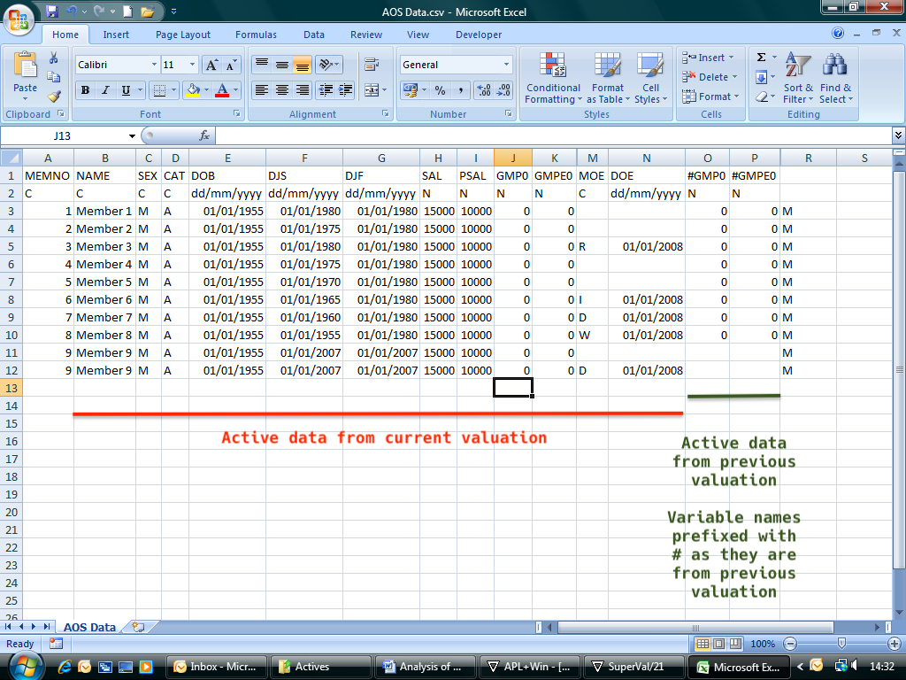

### Appendix 2

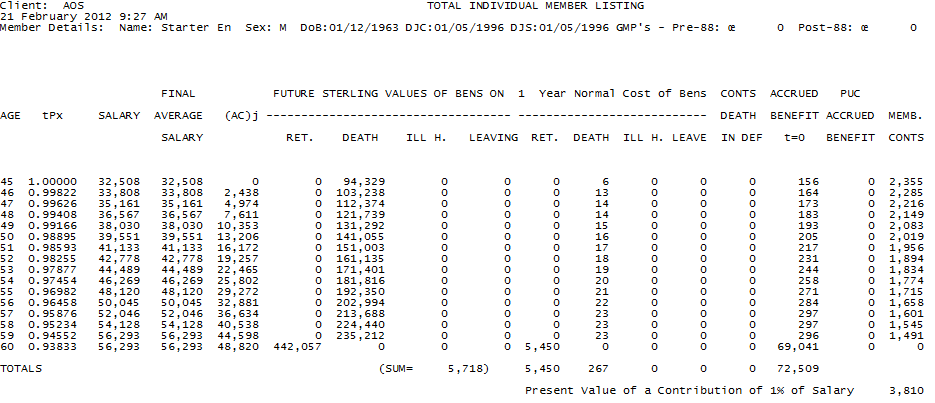

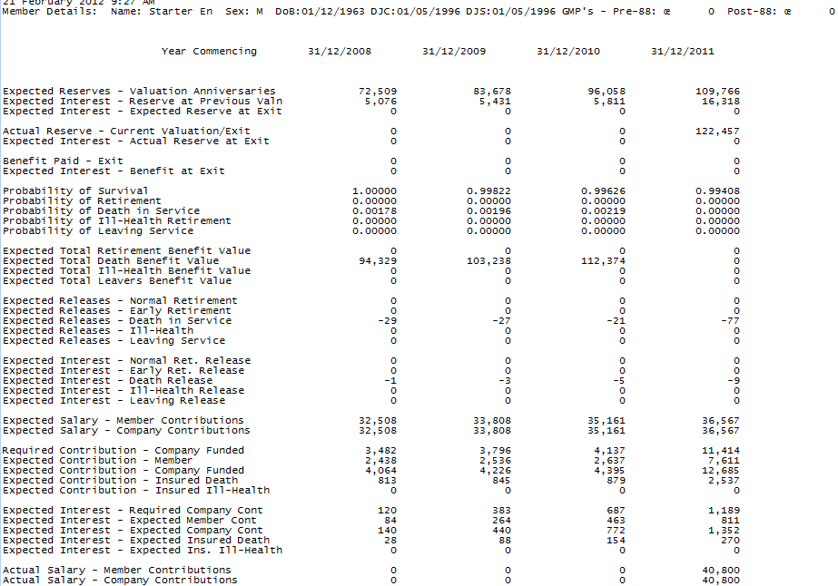

### Appendix 3

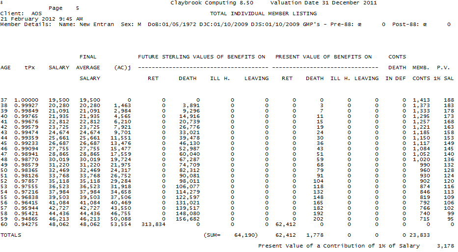

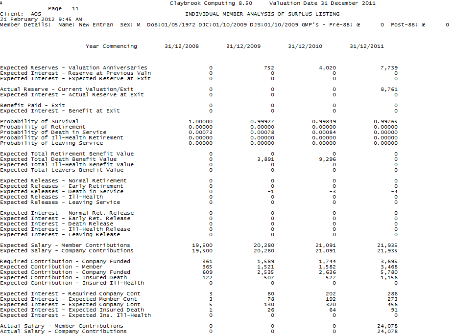

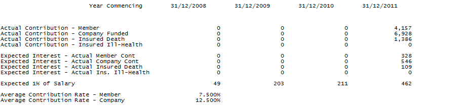

### Appendix 4

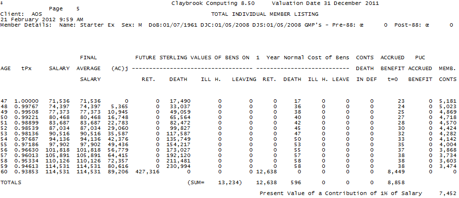

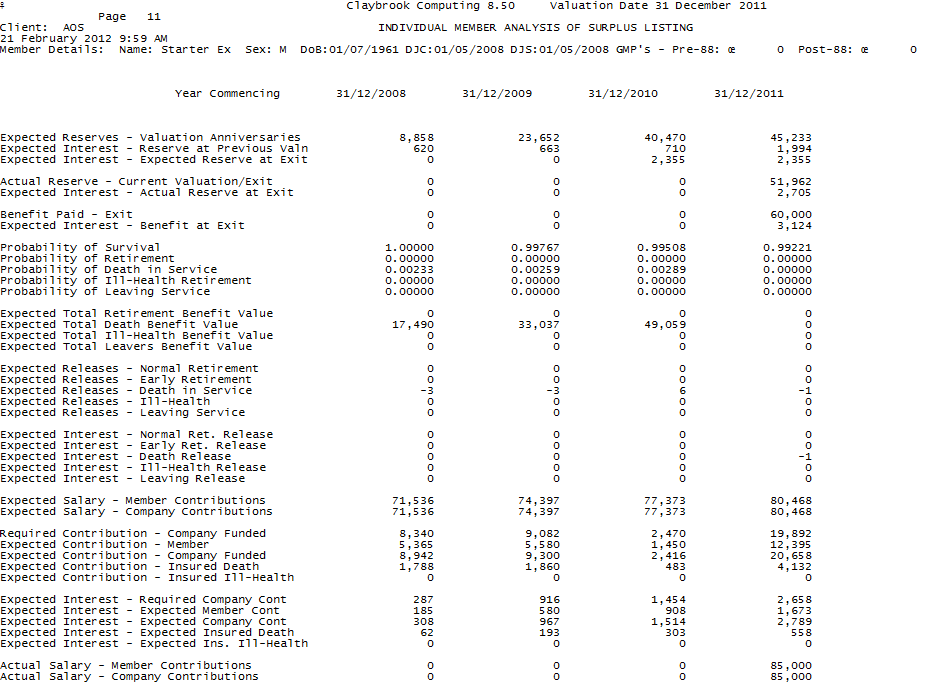

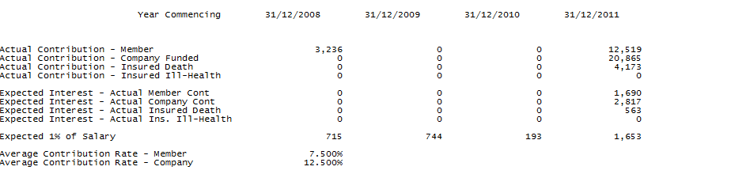

### Appendix 5

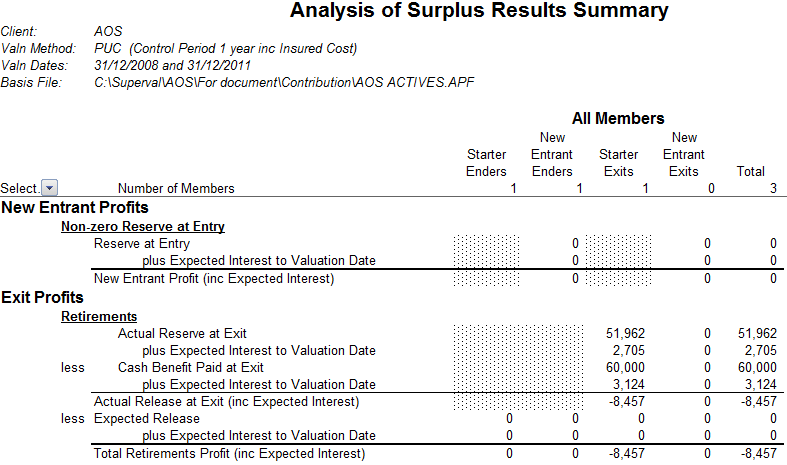

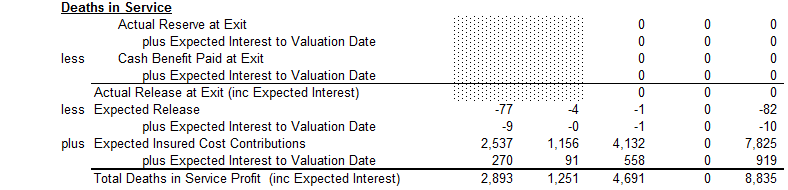

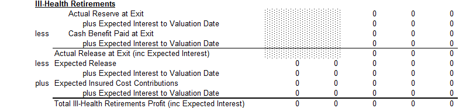

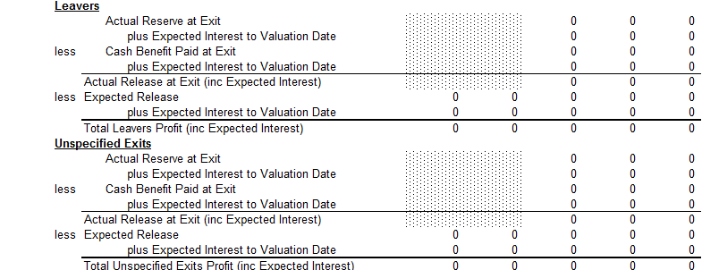

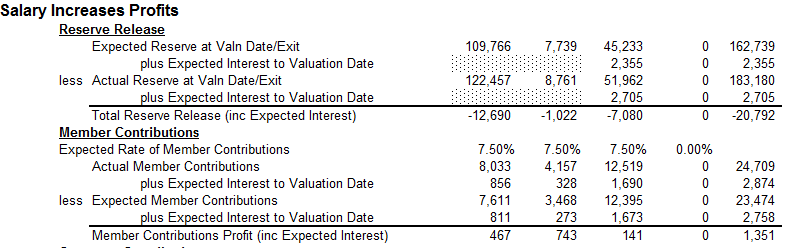

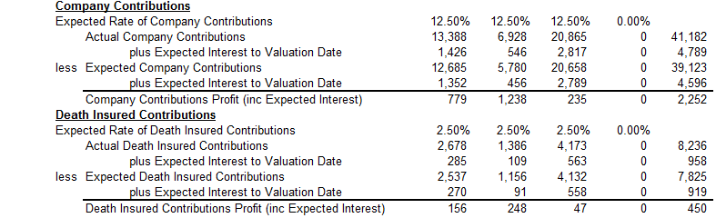

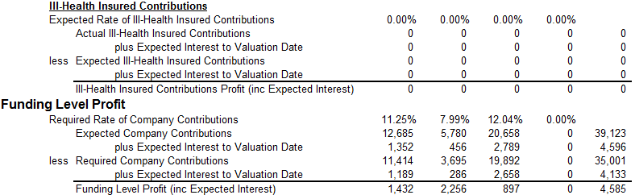

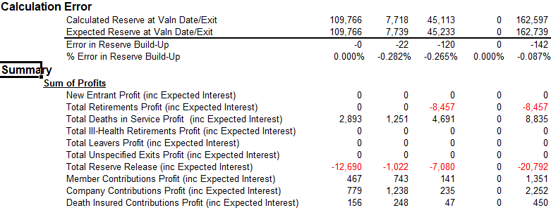

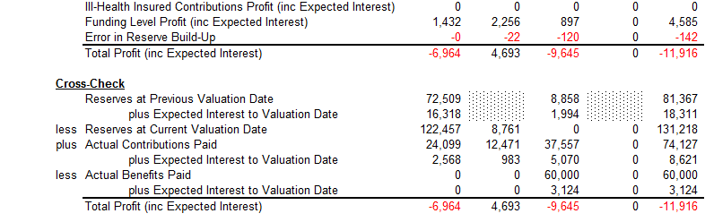

### Appendix 6

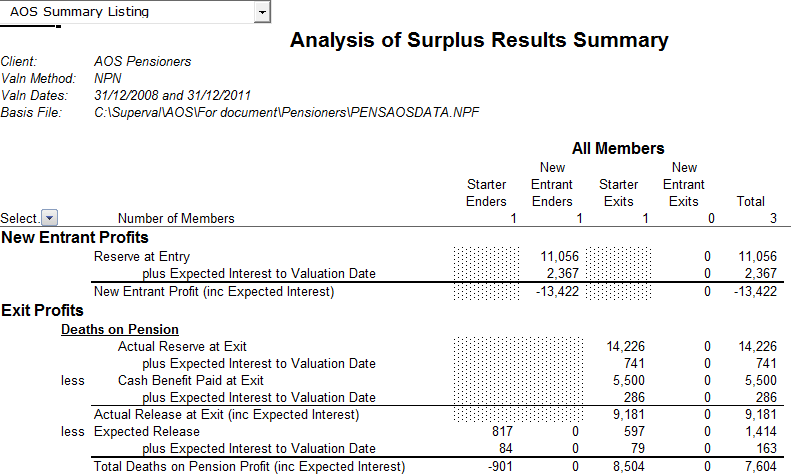

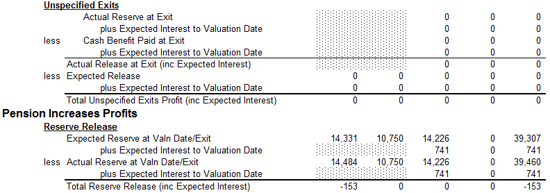

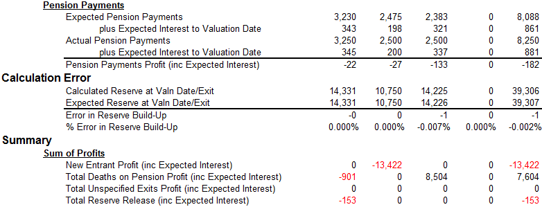

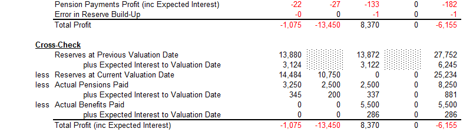

### Appendix 7

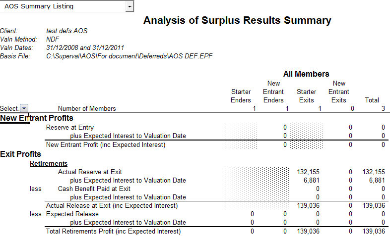 

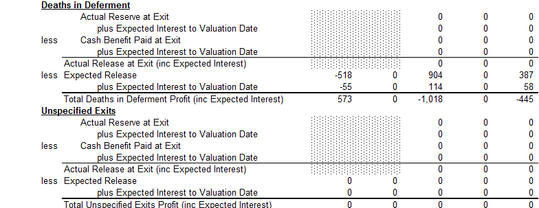

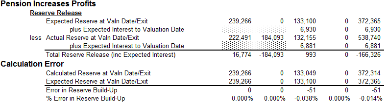

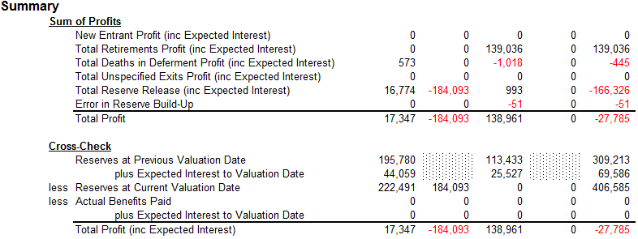
