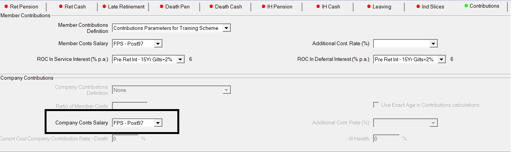
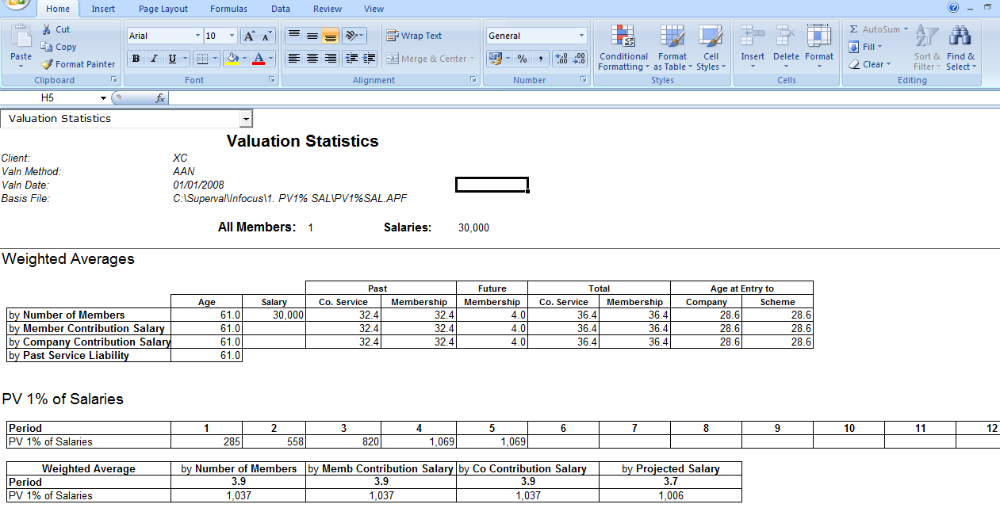
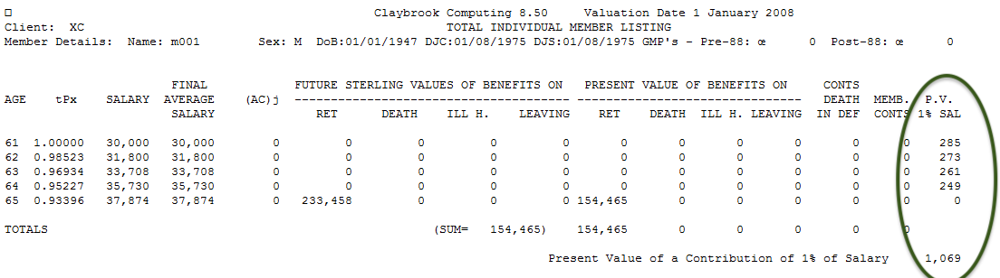

<!-- FIXME workaround because extra.css not getting compiled -->

# Calculation of PV 1% salaries

_‘PV 1% Salaries’ figures for the Actives Module_

SuperVal will include ‘PV 1% Salaries’ figures in the results output.
Their derivation and calculation is explained in this article.

!!! detail "Version"

	This document is based on Version V9.25 of SuperVal. 
	Any screenshots included from earlier versions of SuperVal are
	not materially different from those in V9.25.

## Salary

SuperVal uses the salary that has been defined in the Company
Contribution tab to calculate the PV 1% of Salaries.

SuperVal uses all the characteristics specified for the Salary used for
calculating the PV 1% of Salaries except for the averaging period.
SuperVal ignores the averaging period you have specified for that
salary.

## Worked example

The example used is based on the following data:

	DOB              1st January 1947                                             
	NRD              1st January 2012                                             
	Salary           30,000 (increasing on the anniversary of the Valuation Date) 
	Valuation Date   1 January 2008                                               

The valuation basis is:

	Pre-retirement interest rate   9% p.a.
	Salary escalation rate         6% p.a.
	Pre-retirement mortality       PA(90)-2

[Appendix 1](#appendix-1-results-excel-output) shows the main page of results using the AAN method for
this member. The ‘PV 1% Salary’ figure for this member is 1,069.

The way that the present value of 1% salaries is calculated looks at
the contribution made by the ‘enders’ (those that make it to the end
of each year) and the ‘exits’ (those that leave during each year). The
‘enders’ will contribute a full 1% of salary in each year and the
‘exits’ will be assumed to contribute % each year.

**Table 1** below shows how the ‘PV 1% Salary’ figure is arrived at for
this member.

| Age   | V(MP) (A) | V(Q) (B) | Enders (C) | Exits (D) | PV 1% Sal (E) |
|-------|--------------|-------------|---------------|--------------|------------------|
| 61    | 0.95783      | 0.97869     | 283.10        | 2.14         | 285.24           |
| 62    | 0.87874      | 0.89788     | 270.87        | 2.23         | 273.10           |
| 63    | 0.80618      | 0.82374     | 258.78        | 2.33         | 261.11           |
| 64    | 0.73962      | 0.75573     | 246.82        | 2.42         | 249.24           |
| 65    | –            | –           | –             | –            | 0                |
| Total |              |             |               |              | 1,068.69†        |

† In [Appendix 1](#appendix-1) (SuperVal output) this number is
rounded up to give 1,069.

V(MP) 

: is the discount factor (at 9%) at the mid-point of each year i.e.

	V^½^ = 0.95783, V^1½^ = 0.87874, V^2½^ = 0.80618, etc. 

V(Q)

: is the discount factor for a quarter way through each year i.e. 

	V^¼^ = 0.97869, V^1¼^ = 0.89788, V^2¼^ = 0.82374, etc.

The ‘enders’ are assumed to be active at the start and the finish of
each year. The discounting factor for interest for the value of ‘enders’
will take account of a half a year, i.e. the figures in the column
V(MP). The value of the ‘enders’ in each year is as follows:

**Table 2 (‘enders’):**

Age | 1% Salary (A) | ~t~p~61~ (B) | Value (A) × (B) × Table 1(A)
----|------------------|-----------------|--------------------------------
61  | 300.00           | 0.98523         | 283.10
62  | 318.00           | 0.96934         | 270.87
63  | 337.08           | 0.95227         | 258.78
64  | 357.30           | 0.93396         | 246.82
65  | 378.74           | –               | –

Salaries are assumed to increase by 6% at the end of each year (i.e.
‘review date’ increases on 31/12 each year). If ‘continuous’ salary
increases had been selected then the figures in the ‘1% Salary’ column
above will be increased by a further 3% (6%).

The ‘exits’ are assumed to leave active service half way through the
year (this could be by death in service, withdrawal, ill health
retirement, or early retirement). The discounted factor for interest for
the value of ‘exits’ will take account of a quarter of a year, i.e. the
figures in column V(Q) in table 1. The value of the ‘exits’ in each year
is shown below:

**Table 3 (‘exits’):**

Age	| % Salary (A) | ~t~p~61~ (B) | q~age~ (C)        | Value (A) x (B) x (C) x Table 1(B)
----|-----------------|-----------------|----------------------|--------------------------------------
61  | 150.00          | 0.98523         | 0.01477              | 2.14
62  | 159.00          | 0.96934         | 0.01613              | 2.23
63  | 168.54          | 0.95227         | 0.01761              | 2.33
64  | 178.65          | 0.93396         | 0.01923              | 2.42
65  | 189.37          | –               | –                    | –

**Note** In this example the only decrement before NRA is death-in-service.

If a member is run under the PUC method, then the ‘exits’ will still be
assumed to occur half way through the year, but the discounted factor
for interest for the value of ‘exits’ will take account of half of a
year rather than quarter of a year, i.e. the figures in column V(MP) in
Table&nbsp;1.

So note the difference in discounting between PUC and AAN when
dealing with decrements assuming an exit half way through the year.

The present value of 1% figures are assumed to be payable continuously.
If you want to allow for contributions payable monthly then you could
reflect this by using the loading adjustment field on the Salary
Projection.

The results pages in [Appendix 1](#appendix-1-results-excel-output) also show the present value of salary
over a number of different periods. These are shown below:

Present Value Years | Present Value 1% p.a. | Present Value 1% Sals
-----------------------|--------------------------|----------------------
1                      | 0.8578                   | 285
5                      | 4.0609                   | 1,069
10                     | 6.7002                   | 1,069
15                     | 8.4156                   | 1,069
20                     | 9.5305                   | 1,069
25                     | 10.2551                  | 1,069
30                     | 10.7260                  | 1,069
50                     | 11.4443                  | 1,069
3.87                   | 3.8290                   | 1,037

The _Present Value 1% p.a._ figures are the sum of the V(MP)’s for that
number of years. These figures therefore include interest and not
mortality.

e.g. 5 years: V^½^ + V^1½^ + V^2½^ + V^3½^ + V^4½^ = 4.0609 (using 9% interest)

The _Pres Value 1% of Sals_ figures carry out the same calculations as
already set out in the above tables (and so include both interest and
mortality) and are summed for that number of years.

The last figure uses average remaining service life. For this member the
average remaining service life is 3.87 years. The ‘Pres Value 1% Sals’
figure is found by summing the PV 1% salary figures in years 1 to 3 and
adding 0.87 times the PV 1% salary figure in year 4.

i.e. `285.24 + 273.10 + 261.11 + 0.87 249.24 = 1,036.29`

If the member is starred (has a ‘\*’ in the last column of the members
data record) then further pages will be produced headed _Individual
Member Listing_. These pages take the values from the VARPRINT (pension
amounts times annuities) and apply probabilities and discounting for
interest.

The last such page for this member is shown in [Appendix 2](#appendix-2-individual-member-listing). There is a
column headed _PV 1% Sals_ which shows the figures each year that are
also shown in Table 1.

## Appendix 1 – Results Excel output

## Appendix 2 - Individual member listing

