# Cashflow and consolidation 

SuperVal allows you to consolidate valuation results and generate
cashflows. This article describes how to use the different options.

!!! note "Version"

    This article is based on Version 9.25 of SuperVal. 
    Any screenshots from earlier versions of SuperVal are not materially different from those in V9.25.

## Initial setup

All runs that need to be consolidated must have the same consolidation folder.

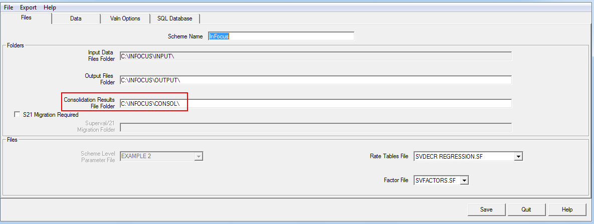

The Consolidation can be set through _File \> Properties_ and whenever opening a new scheme.

All runs that are to be consolidated must all have the same Client Name. 
The Client Name should be the same across modules (i.e. actives, deferreds, ensioners). 

You will only be able to run a consolidation on runs of the same type and with the same valuation date. 
Hence you wouldn’t be able to consolidate an Active PUC run with an Active AAN run, or (say) an Active PUC run with a Pensioner PPF run.

All SuperVal results are written into a database file `SVResults.mdb` in the consolidation folder. 
This folder is used for consolidation purposes, so ypiu should not delete it if you need to run a consolidation. 

Liabilities (and cashflows) can be split / grouped according to pension increase type. 
To make use of this new functionality, the different types of increase rate need to be specified as follows:

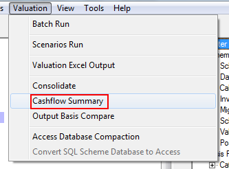

The names for the cashflows split by pension increase can be defined in the Scheme Financial assumptions:

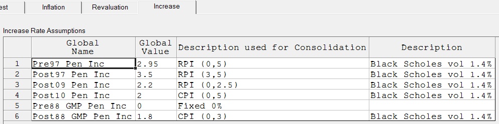

The column _Description used for Consolidation_ should be populated so that the Cashflow Summary will have column headers using the descriptions above.

As the descriptions are specified in the _Scheme \> Financial Assumptions_ there is no need to do any additional work in the basis elsewhere.

## Cashflow options

The Cashflow parameters are specified on the _Main_ tab in the Active and Deferred modules:

The Deferred Module has the following options:

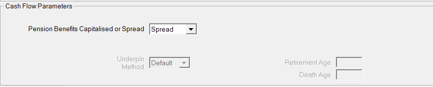

The Active module has slightly more parameters:

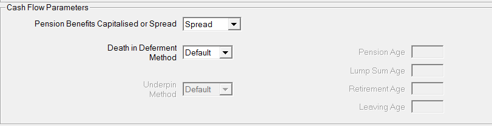

### Pension benefits capitalised or spread?

Select `C – Capitalise` if you wish exit liabilities to be displayed as capitalised values. 
Otherwise `S – Spread` for a payment flow of the exit liabilities.

### Death in Deferment method

This is only used if `S – Spread` is selected in the above parameter. 
Death-in-Deferment benefits will still be valued on a capitalised basis. 
However there is a choice as to where the capitalised value will appear.

Select `T – Table` if you wish to specify a table to determine the point where the capital value of the Death in Deferment Pension and Lump Sum are to appear in the cash flow. 
Otherwise select `D – Default` for the capital value of the Pension and Lump Sum to appear at the exit point (withdrawal).

### Underpin method

This is only used if `S – Spread` is selected in the above parameter. 
Death-in-Deferment benefits will still be values on a capitalised basis. 
However there is choice as to where this capitalised value will appear.

Select `T – Table` if you wish to specify the table to determine the point where the Underpin in excess of the capitalised Retirement and Withdrawal benefits is to appear in the case flow. 
Otherwise select `D – Default` if you wish the Underpin excess to appear at the respective retirement or earlier exit point. 

### Using the Death in Deferment and Underpin “Table” options

An age-related rate table, i.e. “EX” type, is needed if the “Table” option is to apply. 
The reference age is the age nearest at the start of the exit year. 
The corresponding entry is the age that the capital value is to appear in the cash flow for that year’s Death in Deferment or Underpin excess benefit.

For example:

| Age | Entry |
|-----|-------|
| ... | ...   |
| 45  | 48    |
| 46  | 49    |
| 47  | 50    |
| ... | ...   |

Applying such a table means that the capital value will appear in the 3rd year following the exit year. 
The value would be rolled forward for 2.5 years interest (allowing for the fact that the value initially is half way through the year) and survivorship.

## Consolidation

### Consolidation setup

Once all runs have been done, the next step is to consolidate the runs.

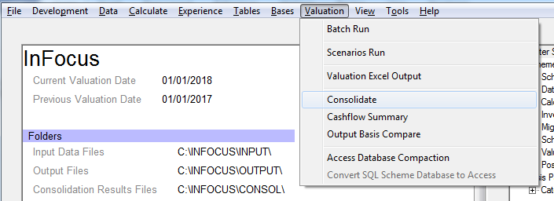

Once a consolidation file and selection edit file have been specified, you will be asked to select the type of consolidation required:

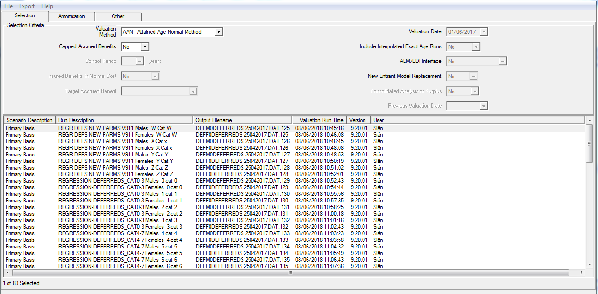

Select the type of run you have and then highlight the categories you want to consolidate.

#### Amortisation

You can specify up to two different recovery plans on this page. 
The amount amortised and the level of payments needed will be displayed on the Excel output. 

The amount amortised can be paid off in level amounts, fixed amounts with accrued interest or as a percentage of salaries.

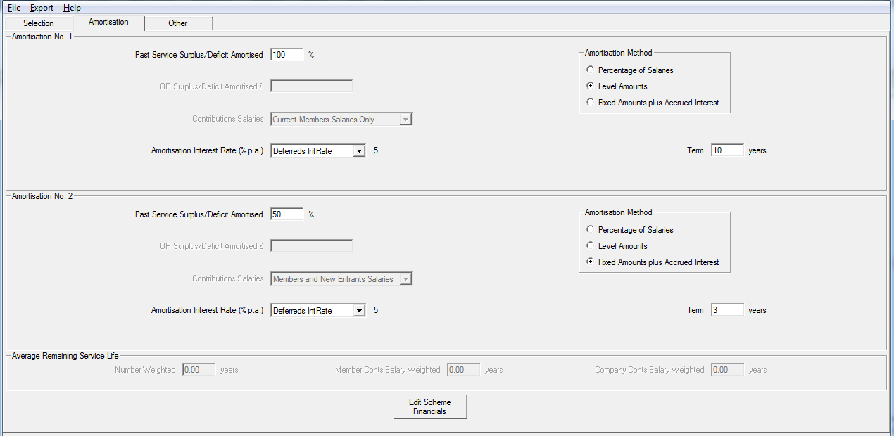

This can be a useful way to test out initial thoughts for recovery plans and allows you to select yield curves for the amortisation interest rate.

#### Asset values, other liabilities and expenses

On the _Other_ tab you can specify expenses and any additional liabilities.

The assets and the asset roll-up rate can be specified here. 

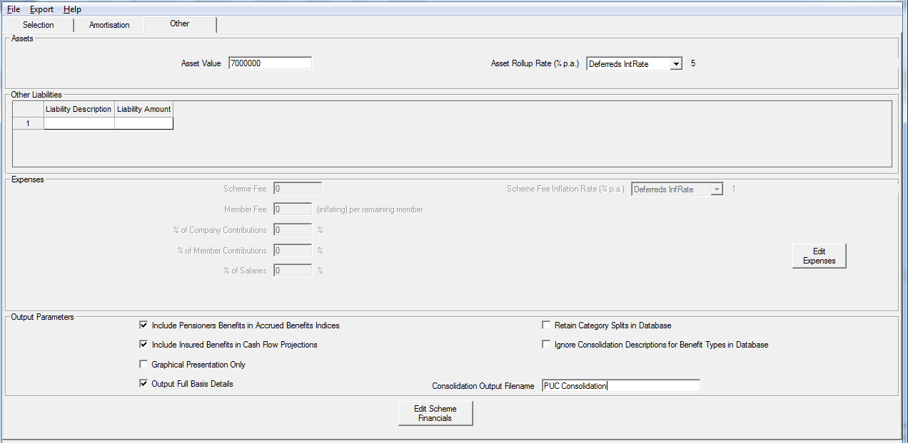

The tab is also used to name the consolidation database and the Excel output produced.

### Excel output

You can choose from several different sheets. 
The liabilities on the Valuation Statistics sheet are grouped as specified by you under
the Pension Increases in the Financial Assumptions.

The sheets produced are as follows:

-   Valuation Run Summary
-   Basis Details (different sheet for different modules)
-   Actives Membership Projection (if applicable)
-   Valuation Balance Sheet
-   Valuation Statistics
-   Projected Cash Flows
-   Projected Accrued Benefits

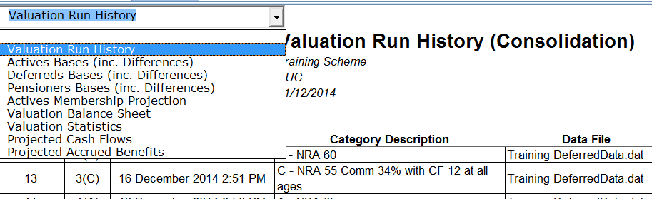

**Cash Flow output**
For AAN and PUC runs, the Cash Flows given continue until the last
benefit payment has been made. For DAB runs the Cash Flow Summary
Listings continues for the Control Period only (& only actives).

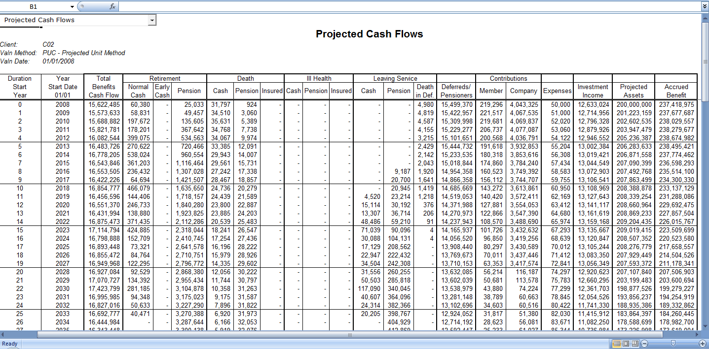

The relevant cashflows are:

#### Actives module

Retirement (Normal Cash/Early Cash/Pension)

: Where `C – Capitalise` has been selected in the basis file, in the capitalised liability of exit by Normal Retirement and Early Retirement will appear under the _Normal Cash_ and _Early Cash_ columns.

    If `S – Spread` has been selected any cash will appear under _Normal Cash_ and _Early Cash_ as appropriate and the spread pension payment flow will appear under the _Pension_ column.

Death (Cash/Pension/Insured)

: If `C – Capitalised` the Death in Service liability will appear under the _Cash_ column.

    Where `S - Spread` has been selected, any cash liability will appear under _Cash_ and the pension liability will be shown under column _Pension_.

    Insured Death in Service benefits – where SuperVal has calculated the insured premium cost for death in service lump sum and pension and this has been selected as being included in the Consolidation parameters, this will be reflected under the _Insured_ column (for both).

    For AAN runs the parameter for include/exclude the death-in-service insured costings is on the _Parameters_ tab field _Include Insured Cost in Cash Flow?_

    For PUC runs including/excluding insured costings is controlled in the parameters under the funding method choice for Consolidation before selecting the runs.

Ill Health (Cash/Pension/Insured)

: The _Cash_ column will show the capitalised liability if this has been selected in the basis.

    If `S – Spread` has been selected, then any pension liability is shown under “Pension”.

Leaving Service (Cash/Pension/Death in Def)

: The capitalised liability will appear under the _Cash_ column if `C – Capitalise` has been selected.

    When `S – Spread` has been selected, all death-in-deferment and cash liabilities are separately shown and the spread deferred retirement liability is shown under column _Pension_.

#### Pensioners and Deferreds modules

Deferreds/Pensioners

: This column is for valuation runs from the Pensioner and Deferred modules. Pensioner cash flows are spread by default. The Deferred cashflows can be spread or capitalised if desired. The spread or capitalised options are specified on the Main tab in the basis.

    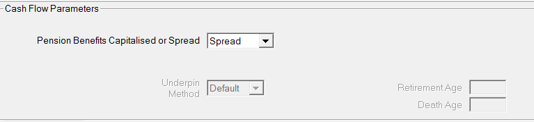

#### Other cash-flow outputs

Total benefits cash flow

: This is simply a sum across the rows for Actives, Deferreds & Pensioners.

Member Contributions

: This column shows the value of the (Active) members’ contributions in each year.

Company Contributions

: The value of company contributions in each year is shown here. 

    This equals Future Liability less Member’s Contributions plus Insurance and Expenses.

Expenses

: Scheme expenses in each year are specified in the Consolidation parameters.

Investment Income

: This is a balancing item. The formula for Duration “t” is:

        Assets at Start Year (t+1) – Assets at Start Year t
        – Company Contributions at time t
        – Member Contributions at time t
        + Total Projected Benefit Payments at time t

Assets at Start Year

: The formula for Duration “t” is:

        Assets at Start Year (t–1) plus 1 year’s interest
        + Member Contributions year (t–1) with ½ year’s interest
        + Company Contributions year (t–1) with ½ year’s interest
        - All Projected Benefit Payments year (t–1) 
          excl. Normal Retirement with ½ year’s interest
        – Normal Retirement Liability year (t–1) with 1 year’s interest

Accrued Benefit **(PUC runs only)**

: This is the past service liability at each (Curtate) Duration allowing for projected salaries i.e. “ongoing” past service liability at each future duration.

### Generating cashflows split by pension-increase type

The projected cashflows given in the Excel consolidation output are
not split by pension-increase type as defined in the Pension Increase
parameters. These are available, though, if you select the
Cashflow Summary option:

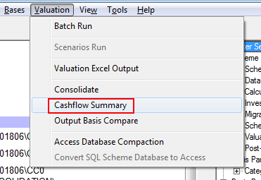

You are asked to specify the consolidation database file created when running the initial consolidation, and then a separate Excel file is created showing the cashflows split by pension type. 
You can opt to filter the results by membership type (i.e. Actives, Deferreds, Pensioners, All) and/or pension type. 
Results are also shown graphically.

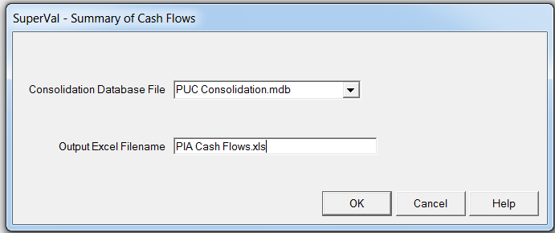

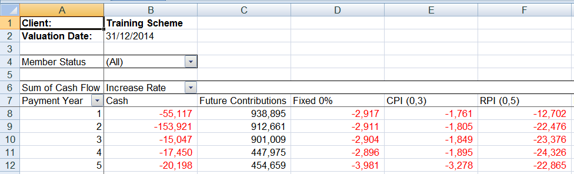

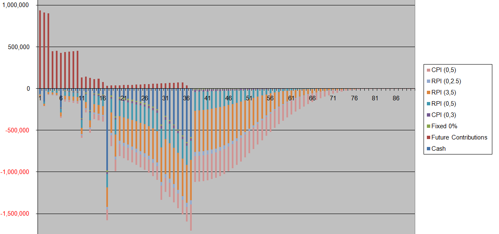

## Notes on consolidation output

Consolidations Results are produced in Excel rather than text output.
The (visible) changes that have been made to each of the worksheets
within the Excel output are as follows:

Each worksheet now displays the following information:

-   Client
-   Valuation Method
-   Valuation Date
-   Basis File (only on the Active Membership Projection worksheet)
-   Control Period (only on the Valuation Balance Sheet)

A dropdown allows you to view any worksheet you want:

### Valuation Balance Sheet

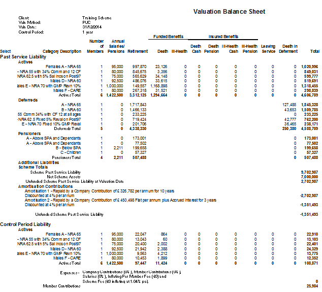

The Actives Results are split to show Past and Future Service Liability.

Past Service Liability Totals are provided for Deferreds and Pensioners.

### Valuation Summary and Statistics Worksheet

-   Breakdown of control period liability for Actives
-   Valuation Statistics show the Liabilities split by Pension Increase and cause of emerging benefit
-   ‘PV 1% of Salaries’ figured are formatted so that figures exactly equal to previous period are not displayed.
-   Average Age and Remaining Service Life along with details of how they are weighted

### Membership Projection Worksheet (Actives Only)

This starts with the Fund total and subtracts the exits during that year (next line) and adds new entrants to get a new Fund Total.

The Active Membership Projection also shows the projection of salaries

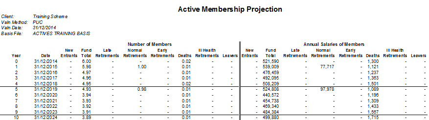

### Projected Accrued Benefits

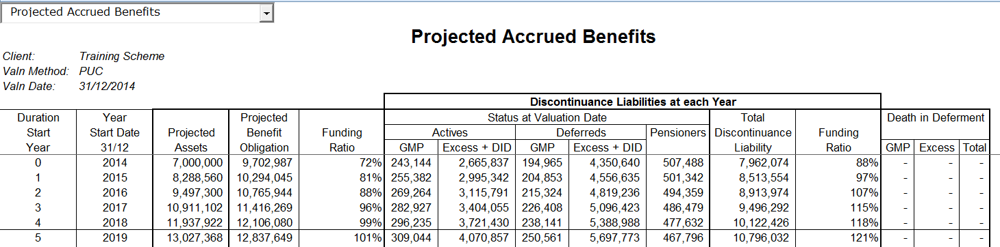

The discontinuance liabilities are rolled forward using the expected cashflows produced in the runs.

The assets are rolled forward using the asset roll up rate allowing for any benefit payments

### Projected Cash Flows Worksheet

Company Contributions column matches text output. The Valuation Excel
output Company Contributions column does not match Consolidation Excel
Output. The difference is that Valuation Excel output does not include
Insured Benefits.
