<!-- FIXME when extra.css gets compiled -->

# Contributions

SuperVal has a number of different options for setting up contribution
rates for Active members. 
Here’s how to use these different parameters.

!!! note "Version"

	This article is based on V9.25 of SuperVal. Any screenshots from earlier versions are not materially different. 

	It is relevant for the Actives module only.

## Defining contribution rates in the global parameters

V9.00 of SuperVal introduced a new approach to the contribution
parameters for members, the company and the underpin. The parameters
relating to the definition of a contribution structure are now entered
in the Global Parameters instead of the Actives Basis File. This area is
accessed from the Home Page under _Bases>Scheme>Contributions_.

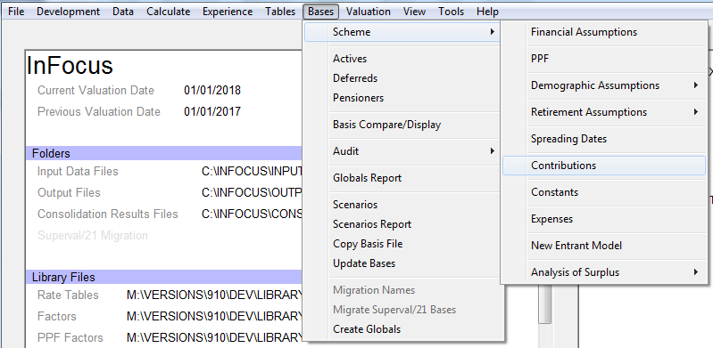

You can either edit an existing Global Contribution
definition or enter a new definition by selecting _New (Defaults)_ from
the _Open\> Parameter_ menu. This will then open the _Contribution
Definition_ screen where the contribution definition can be entered. (See
screenshot below.)

There are six different ways to define contributions structures:

-   Fixed percentage of salary
-   Differing percentages on up to 10 salary bands
-   Varying percentage of salary based on attained age
-   Varying percentage of salary based on age at entry
-   Varying percentage of salary based on duration from valuation date
-   Salary bands table with differing percentages (GAD-specific)

The setup for each of these methods is discussed below.

**Company contributions** 
are required only if using the Analysis of Surplus module.

### Fixed percentage of salary

If the contributions are a fixed percentage of salary then use this
option.

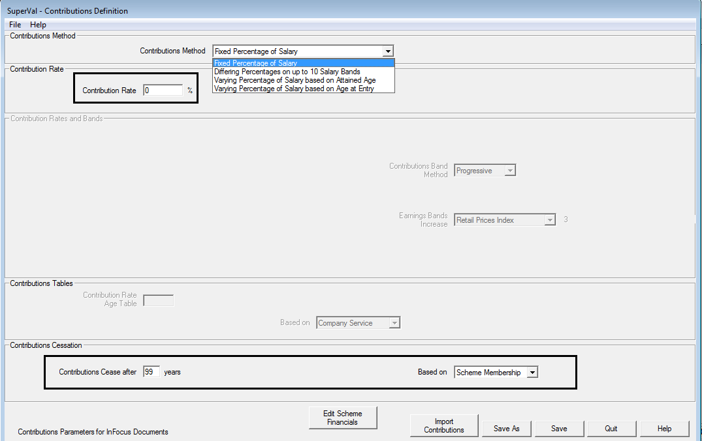

Contribution Rate

: Enter the fixed rate of contribution into the Contribution Rate box. For 5% enter 5 and not 0.05.

Contribution Cessation

: Enter the number of years after which contributions cease. If contributions continue throughout membership enter a sufficiently large number to cover the entire service period e.g. 99. Then select from the dropdown box whether the service period will be based on Scheme Membership or Company Service.

### Differing percentage on up to 10 salary bands

SuperVal has the option to define contribution rates that depend upon the member’s salary.

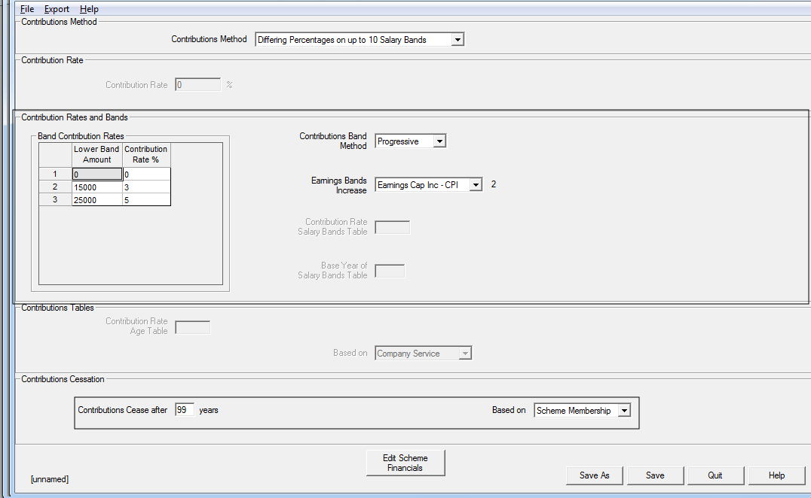

Contribution Rates and Bands

: Start by entering the contribution band structure. Right-click over the `1` in the box containing Contributions and Bands to add sufficient rows for the contribution definition. You can add up to nine rows.

	Then select the method to use to determine contributions. The salary-related contribution scale may be applied in one of two ways. These are Progressive or Band-related. An example of the two different methods is set out below.

Progressive

: Under this approach, a member pays contributions at the rates specified
in the table on the earnings within each salary band. For example:

		Band     Salary Band       Contribution Rates
		---------------------------------------------
		  1         0 – 12,600             5.5%       
		  2    12,601 – 14,700             5.8%       
		  3    14,701 – 18,900             5.9%       
		  4    18,901 – 31,500             6.5%       
		  5    31,501 – 42,000             6.8%       
		  6    42,001 – 78,700             7.2%       
		  7    Greater then 78,700         7.5%       

	So a member with a salary of £100,000 would pay contributions of:

		0.055 ×   12,600           =   693.00 on Band 1 earnings 
		0.058 ×  (14,700 – 12,600) =   121.80 on Band 2 earnings 
		0.059 ×  (18,900 – 14,700) =   247.80 on Band 3 earnings 
		0.065 ×  (31,500 – 18,900) =   819.00 on Band 4 earnings 
		0.068 ×  (42,000 – 31,500) =   714.00 on Band 5 earnings 
		0.072 ×  (78,700 – 42,000) = 2,642.40 on Band 6 earnings 
		0.075 × (100,000 – 78,700) = 1,597.50 on Band 7 earnings.

	The total contributions payable would be £6,835.50 per year. 

Band-related

: Under this approach, the member pays a single specified contribution rate on their entire salary. The rate paid is dependent on the Salary Band in which the member’s salary currently lies. Under this approach the member in the above example would pay contributions of

		7.5% × £100,000 = £7,500 per year

	i.e. because the member’s salary lies in the range covered by Band 7, the Band 7 contribution rate is paid on all salary.

	Finally, select from the dropdown list which of the inflation rates defined in the Global Parameters to use to inflate the Contribution Band Limits over time. If the limits on the Bands are non-increasing then select a Global Parameter with a value of 0%. The value of the Global Parameter will be shown to the right of the field.

	If the increase to the Contribution Bands varies across Bands or time then consider using the [Salary Bands Table with Differing Percentages](/#varying-percentage-of-salary-based-on-duration-from-valuation-date) methodology below.

Contribution Cessation

: As above, enter the number of years after which contributions cease. If contributions continue throughout membership enter a sufficiently large number to cover the entire service period e.g. 99. Then select from the dropdown box whether the service period will be based on Scheme Membership or Company Service.

### Varying percentage of salary based on attained age

Under this option the contribution rate determined will vary according
to the member’s current age.

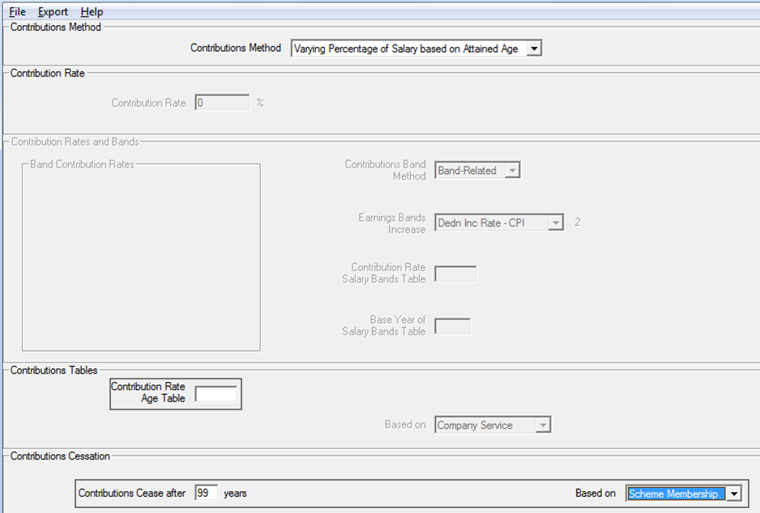

Contribution Tables

: Double click to select the rate table that contains the contribution rates appropriate at each member’s age. A typical rate table would be of type `FX` (but `EX`, `GX`, or `HX` could all be used). Enter the values in the table as percentages i.e. for 5% the entry should be 5 and not 0.05.

Contribution Cessation

: As above, enter the number of years after which contributions cease. If contributions continue throughout membership enter a sufficiently large number to cover the entire service period e.g. 99. Then select from the dropdown box whether the service period will be based on Scheme Membership or Company Service.

### Varying percentage of salary based on age at entry

Under this option the contribution rate determined will vary according
to the member’s age either at entry to Company Service or Scheme
Membership.

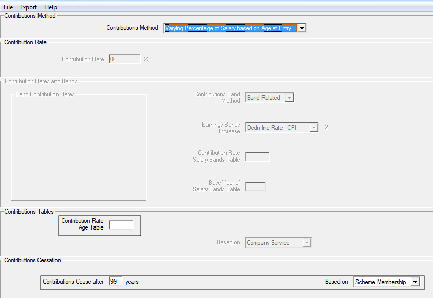

Contribution Tables

: Double-click to select the rate table that contains the contribution rates appropriate at each member’s age. A typical rate table would be of type `FX` (but `EX`, `GX`, or `HX` could all be used). The values in the table should be entered as percentages i.e. for 5% the entry should be 5 and not 0.05. Then select whether the age at entry should be determined from the date of joining the company or the date of joining the scheme.

Contribution Cessation

: As above, enter the number of years after which contributions cease. If contributions continue throughout membership enter a sufficiently large number to cover the entire service period e.g. 99. Then select from the dropdown box whether the service period will be based on Scheme Membership or Company Service.

### Varying percentage of salary based on duration from valuation date

Under this option you can enter a varying future contribution rate
as a table allowing contributions to cease when modelling cessation of
future accrual.

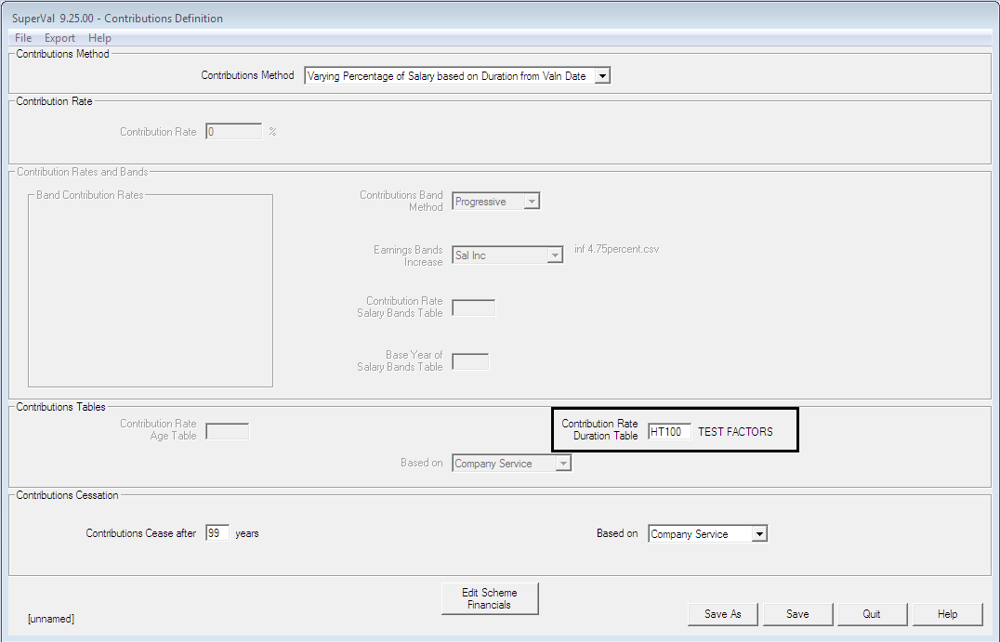

Contribution Tables

: Double click to select the rate table that contains the contribution rate duration table. A typical rate table would be of type `FX` (but `ET`, “FT”, `GT`, or `HT` could all be used). The values in the table should be entered as percentages i.e. for 5% the entry should be 5 and not 0.05. 

Contribution Cessation

: Enter the contribution rate in the table. To cease future contributions, amend the _Contribution Rate Duration_ table by setting the rate to 0 after a certain number of years.

### Salary bands table with differing percentages

Under this option the contribution rate determined will vary according
to the Salary Band Table entered. This enables the user to define
contribution structures where the Salary Bands (but not the contribution
rates) increase at different rates over time.

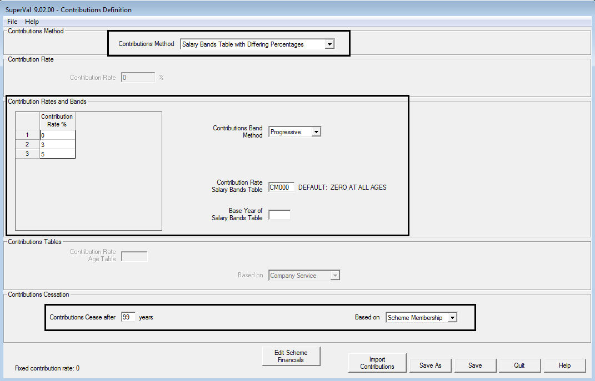

Contribution Rates and Bands

: Start by entering the contribution band structure. Right-click over the `1` in the box containing Contribution Rates to add sufficient rows for the contribution definition. You can add up to nine rows.

	Then select the method to be used to determine contributions. The salary related contribution table may be applied in one of two ways. These are Progressive or Band-related. An example of the two different methods is set out above in [differing percentage on up to 10 salary bands](#differing-percentage-of-up-to-10-salary-bands). The same logic applies here.

	Then select the 2D table containing the Salary Bands to be used for the calculations. The 2D table will be of a `CM` type and contain the Salary Band Limits for each year in each column. The data in the first column will be used in the year after the valuation date and should contain the Salary Band at the beginning of the year. The value entered in the field (0,0) will be used as the bottom of the first Salary Band i.e. the Salary at which contributions are first paid. The second column will contain the same data for the end of year. The Salary Band data is then geometrically averaged to get the Salary Band value at the mid-point of the year to compare with the mid-point salary.

	The maximum number of Salary Band Limits is ten. (This is consistent with nine salary bands.)

	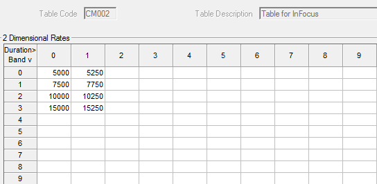

	You can vary the number of entries for each band. However, the geometric average of the last two columns of Salary Bands data will be used for all years into the future. Hence, you must enter at least two years’ data.

	Enter the Base Year of the Salary Band Table. This will let you use the same table at future valuation dates.

Contribution Cessation

: As above, enter the number of years after which contributions cease. If contributions continue throughout membership enter a sufficiently large number to cover the entire service period i.e. 99. Then select from the dropdown box whether the service period will be based on Scheme Membership or Company Service.

## Additional fields in the Actives basis file

Some additional fields are entered on the _Contributions_ tab found in the
Actives Basis file.

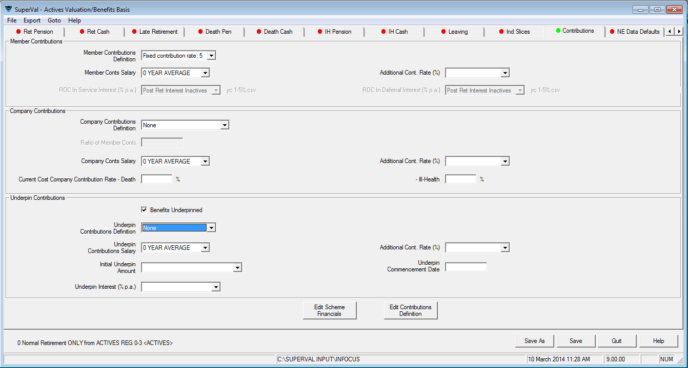

### Member’s Contribution Parameters

Member Contributions Definition

: Select one of the previously defined Contribution Definitions for member’s contributions.

Member Conts Salary

: Specify which previously defined salary definition is to be used. (The salary will have been defined on the _Salaries_ tab.)

Member’s Additional Cont Rate

: For each of the five bases you can specify a member-specific additional contribution rate that will be valued in addition to any fixed member contributions. This will typically be held as a data item. This could be to reflect for example a member’s voluntary contribution rate in addition to some standard rate.

Interest Rates to accumulate Member’s Contributions

: The data format has a standard variable for the amount of the member’s accumulated contributions as at the valuation date, and this is called
`ACW`. This will be accumulated with interest and additional contributions to each future exit point. The rates of interest to be used in service and deferment can be specified here. 

	The accumulations of a member’s contributions to all future exit dates are shown in the VarPrint in section 40 – [see below](#how-the-calculations-are-undertaken-and-shown-in-the-varprint).

### Company Contribution parameters

Company Conts Salary

: Unless you are defining contributions for the Analysis of Surplus module, the only entry for Company Contributions is the salary on which these are based. Select which previously defined salary definition to use. (The salary will have been defined on the _Salaries_ tab.)

### Underpin Contribution parameters

If you have checked the box to confirm that Benefits are underpinned,
then the Underpin Contribution Parameters will be available for use.

Underpin Contributions Definition

: Select one of the previously defined Contribution Definitions for the Underpin.

Underpin Contribution Salary

: Specify which previously defined salary definition to use. (The salary will have been defined on the _Salaries_ tab.)

Additional Underpin Contribution Rate

: You can specify for each of the five bases a member-specific additional contribution rate that will be valued in addition to any fixed underpin contributions. This will typically be held as a data item.

Initial Underpin Amount

: Enter the initial amount of the Underpin.

Underpin Interest

: Select from the dropdown list which previously defined interest rates to use to accumulate the Underpin.

Underpin Commencement Date

: Enter the date from which the Underpin applies.

## How the calculations are undertaken and shown in the VarPrint

The accumulation of a member’s contributions to all future exit dates is
shown in the VarPrint in section 40. 

**Note**
A VarPrint file is produced by placing a `*` in the last column of the member’s data record and setting the _Test Mode_ to either `Limited Results` or `Full Results` on specifying a Valuation Batch.)

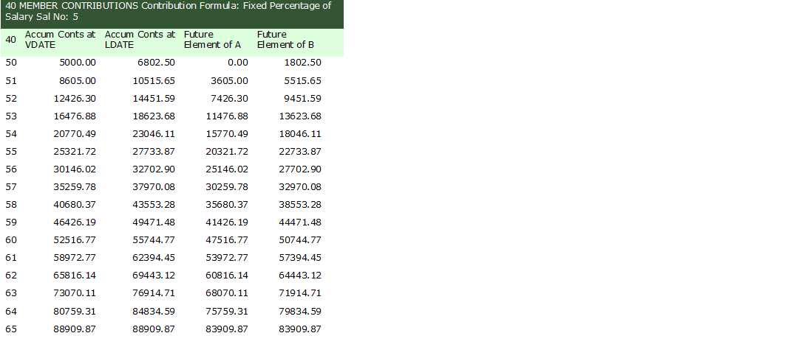

The figures in the _Accum Conts at LDATE_ are used to determine the
present value of a return of contributions benefit payable on death in
service or death in deferment. The figures shown in _Future Element of B_
are used to determine the future service liability of this benefit.

### Member data and salary projections

The following member data and assumptions have been used:

	Date of Birth                              1 Jan 1963  
	Date Joined Company                        1 Jan 1987  
	Date Joined Scheme                         1 Jan 1990  
	Salary                                     £35,000     
	Accumulated Member’s Contributions at DoV  £5,000      
	Additional Contribution Rate               5%          

	Date of Valuation                          1 Jan 2013
	Pre Retirement Interest Rate               6.25%     
	Post Retirement Interest Rate              5.00%     
	Salary Increase Rate                       6.00%     
	Contribution Increase                      2.00%     
	Pension Increase Rate                      2.25%     
	Salary Band Inflation                      3.00%     

The Scheme provides a 1/60th benefit at a Normal Retirement
Age of 65.

Contributions are paid on Contribution Salary, which is base salary with
no adjustments.

The salary on which contributions are based is projected as follows:

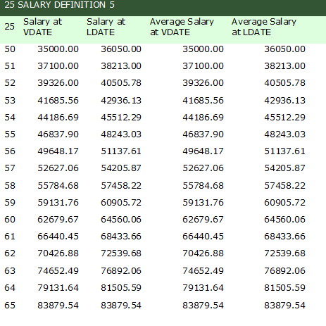

See InFocus article:
[“Salary Projections”](../salary-projections/index.md)
for more details on salary projections

**Calculation of contributions**
over a year uses the _Salary at LDATE_ (i.e. salary at the future exit dates). The rationale for this is that contributions are payable on average half way through the year.

### Fixed percentage of salary 

The table below shows the build up of member contributions based on a
member contribution rate of 5% and an additional contribution of 5%.
Member’s accumulated contributions at the valuation date are £5,000 and
interest is applied at 2% to the contributions. The projected salary is
shown above.

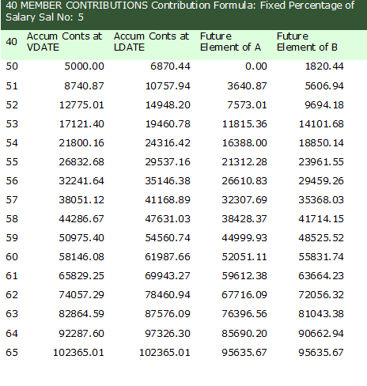

Accum Conts at VDate

: The member is age 50 nearest at the valuation date and therefore the figure shown here is the member contributions at the Valuation Date taken from the data file `ACW`, i.e. £5,000.

	In general, the formula for calculating the accumulated member’s contributions figure at the anniversary of a Valuation Date is determined as follows:

		(Prev. Year’s Accumulated Contributions) × (1+Contribution Increase Rate) 
		+ (Fixed Contribution Rate + Additional Contribution Rate) 
		  × Mid-year Salary × √(1+Contribution Increase Rate)

	Hence, at age 51 (nearest), the figure is calculated as: 

		  £5,000 × 1.02 + (5% + 5%) × £36,500 × √1.02
		= £5,100 + £3,640.87
		= £8,740.87

	At age 52, the figure is calculated as:  

		  £8,740.87 × 1.02 + (5% + 5%) × £38,213 × √1.02
		= £8,915.69 + £3,859.32
		= £12,775.01

Accum Conts at LDATE

: The accumulated contributions at `LDATE` (i.e. future exit dates) are taken as the average of the previously calculated accumulated contributions at the start and at the end of the year.

		At age 50 = ½ × (£5,000    +  £8,740.87) =  £6,870.44  
		At age 51 = ½ × (£8,740.87 + £12,775.01) = £10,757.94

Future Element of A (Accum Conts at VDate)

: The future-service element of the _Accum Conts at VDATE_ is calculated in the same way, only the past-service accumulation has been removed. This is therefore:

		At age 50 = £0.00 
		At age 51 = (5% + 5%) × £36,050 × √1.02  
		          = £3,640.87

Future Element of B (Accum Conts at LDATE)

: This is the future-service element of the _Accum Conts at LDATE_. This will be the roll-forward of each year’s contributions plus half a year’s contributions for the year of exit. This is therefore:

		At age 50 =   ½ × (5% + 5%) × £36,050 × √1.02 
		          = £1,820.44
		At age 51 =       (5% + 5%) × £36,050 ×  1.02 
		            + ½ × (5% + 5%) × £38,213 × √1.02
		          = £3,677.10 + £1,929.66 
		          = £5,606.76

### Differing percentage of up to 10 salary bands 

The table below shows the build-up of member contributions based on a
contribution definition that varies with salary. The following
contributions have been defined. The contributions are being determined
using the Progressive method.

	Salary Band       Contribution Rates 
	-------------------------------------
	Less than £5,000         0%                 
	£5,000 to £7,500         3%                 
	Above £7,500             5%                 

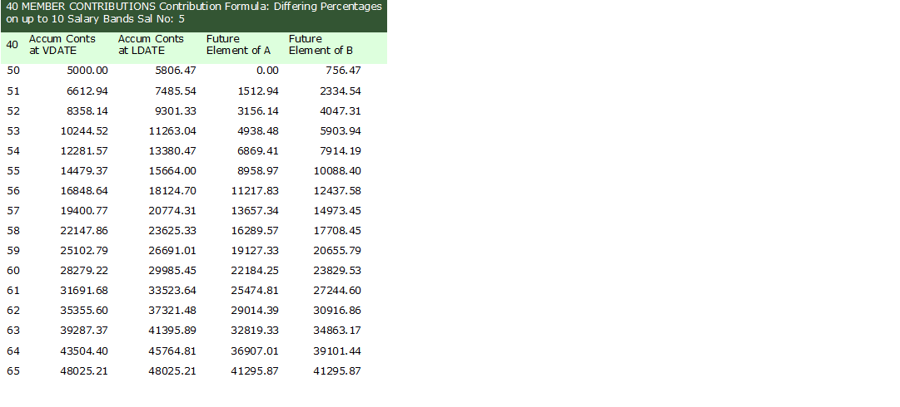

Accum Conts at VDate

: The member is age 50 nearest at the valuation date and therefore the figure shown here is the member contributions from the data file `ACW`, i.e. £5,000.

	The following year, the accumulated member’s contributions figure at the Valuation Date is determined using the same approach as above, but the salary bands are inflated to the mid-year point before calculation of the relevant contributions.

	At age 51 (nearest), the figure is calculated as one year's additional contributions plus the accumulated contributions:

		= £5,000 × 1.02 + [ (0% ×  £5,000          × (1 + 3%/2))
		                  + (3% × (£7,500–£5,000)  × (1 + 3%/2)) 
		                  + (5% × (£36,050–£7,500) × (1 + 3%/2)) ] × √1.02
		= £5,100 + £1,512.91 
		= £6,612.91               (The minor difference is due to rounding.)

Accum Conts at LDATE

: The accumulated contributions at `LDATE` (i.e. future exit dates) are taken as the average of the previously calculated accumulated contributions at the start and at the end of the year.

		At age 50 = (£5,000    + £6,612.94)/2 = £5,806.47  
		At age 51 = (£6,612.94 + £8,358.14)/2 = £7,485.54

Future Element of A (Accum Conts at VDate)

: The future service element of the _Accum Conts at VDATE_ is calculated in the same way only the past-service accumulation has been removed. This is therefore:

		At age 50 = £0.00

		At age 51 = [  (0% ×  £5,000          × (1+3%/2)) 
		             + (3% × (£7,500–£5,000)  × (1+3%/2)) 
		             + (5% × (£36,050–£7,500) × (1+3%/2)) ] × √1.02
		          = £1,512.91

Future Element of B (Accum Conts at LDATE)

: This is the future-service element of the _Accum Conts at LDATE_. This will be the roll-forward of each year’s contributions plus half a year’s contributions for the year of exit. This is therefore:

		At age 50 = ½ × [  (0% ×  £5,000          × (1+3%/2)) 
		                 + (3% × (£7,500–£5,000)  × (1+3%/2)) 
		                 + (5% × (£36,050–£7,500) × (1+3%/2)) ] × √1.02
		          = £756.46

		At age 51 = (756.46 × 2 × √1.02)
		            + ½ × [  (0% ×  £5,000          × 1.03 × (1+3%/2)) 
		                   + (3% × (£7,500–£5,000)  × 1.03 × (1+3%/2)) 
		                   + (5% × (£38,213–£7,500) × 1.03 × (1+3%/2)) ] × √1.02
		          = £1,527.97 + £806.45 
		          = £2,334.42

### Contribution rate varies by age

The principles of the calculations above remain the same, however, this
time the contribution rate will be taken from the table specified.

### Contribution rate varies by age at entry

This is effectively a fixed type of contribution where the contribution
rate is determined at either the age of entry to the company or the
scheme. This will follow a similar calculation approach to the Fixed
Percentage of Salary above.

### Salary band tables with differing percentages

The image below shows the build up of member contributions based on a
contribution definition that is based on salary bands that increase at
different percentages. The following contributions have been defined.
The contributions are being determined using the Band Related method.

Contribution Rates (above Salary Band) | Salary Band 0 | Salary Band 1 | Salary Band 2 | Salary Band 3
------------------------------------------|------------------|------------------|------------------|-----------------
5%                                        | £5,000           | £5,125           | £5,250           | £5,500
10%                                       | £15,000          | £15,250          | £15,500          | £15,750
15%                                       | £25,000          | £25,500          | £26,000          | £26,500
20%                                       | £50,000          | £51,000          | £52,000          | £53,000

<!--numeric-table-->

At the first two exit point the mid-point of the Salary Bands is
determined as:

| First Exit Point                            | Second Exit Point                           |
|---------------------------------------------|---------------------------------------------|
| √(£5,000 × £5,125) = £5,062    | √(£5,125 × £5,250) = £5,187    |
| √(£15,000 × £15,250) = £15,124 | √(£15,250 × £15,500) = £15,374 |
| √(£25,000 × £25,500) = £25,248 | √(£25,500 × £26,000) = £25,749 |
| √(£50,000 × £51,000) = £50,498 | √(£51,000 × £52,000) = £51,498 |

As the member’s salary is £36,050, contributions will be paid at the
rate of 15% in the first year. As the member’s salary at the mid-point
of year 2 is £38,213, contributions will be paid at the rate of 15% in
the second year. When the member’s salary at the mid-year exit point
exceeds £51,498 (the geometric average of £52,000 and £53,000) then
contributions will be paid at the rate of 20%.

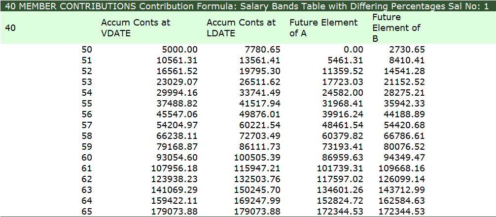

At the Valuation Date the member’s salary is £35,000. As this is between
£25,000 and £50,000 and we are using the Band-related method he will
initially pay contributions at the rate of 15%.

Accum Conts at VDate

: The member is age 50 nearest at the valuation date and therefore the figure shown here is the member contributions from the data file ACW, i.e. £5,000.

	The following year, the accumulated member’s contributions figure at the Valuation Date is determined using the same approach as above, but the salary bands are inflated to the mid-year point before calculation of the relevant contributions.

	At age 51 (nearest), the figure is calculated as one year's additional contributions plus the accumulated contributions:

		= £5,000 × 1.02 + (15% × £36,050) × √1.02
		= £5,100 + £5,461.31 
		= £10,561.31

Accum Conts at LDATE

: The accumulated contributions at LDATE (i.e. future exit dates) are taken as the average of the previously calculated accumulated contributions at the start and at the end of the year.

		At age 50 = ½ × ( £5,000    + £10,561.31) =  £7,780.66 
		At age 51 = ½ × (£10,561.31 + £16,561.52) = £13,561.42

Future Element of A (Accum Conts at VDate)

: The future-service element of the _Accum Conts at VDATE_ is calculated in the same way, only the past-service accumulation has been removed. This is therefore:

		At age 50 = £0.00 
		At age 51 = (15% × £36,050) × √1.02
		          = £5,461.31

Future Element of B (Accum Conts at LDATE)

: This is the future-service element of the _Accum Conts at LDATE_. This will be the roll-forward of each year’s contributions plus half a year’s contributions for the year of exit. This is therefore:

		At age 50 =   ½ × (15% × £36,050) × √1.02 
		          = £2,730.65

		At age 51 =       (15% × £36,050) ×  1.02 
		            + ½ × (15% × £38,213) × √1.02
		          = £8,410.14

