# Database output

When a valuation is run in SuperVal a file `SVResultsDB.mdb` is written
in the consolidation folder. This is a Microsoft Access database output
file.

!!! tip "Access to the database output file"

    Access to open this file requires purchase of the Database module.

The database output file holds more results than those in the Excel
output. These results can either be extracted by filtering data through
the tables or you could write SQL queries to get the results you require.

Similarly, when a consolidation is run in SuperVal an MDB file with a name you choose is created in the consolidation folder.

## Tables in the database

### BasisData

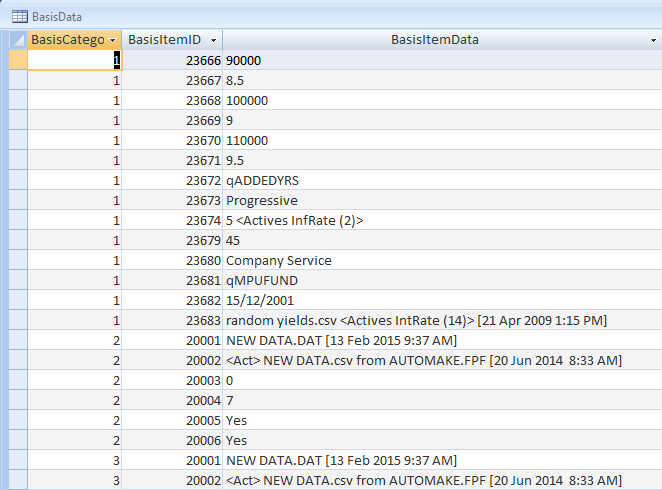

BasisCategoryID

: Generated depending on the number of categories run in Actives, Deferreds and Pensioners.

BasisItemID

: Link to the `BasisItem` table (shown below). This number represents the particular fields populated in the basis files e.g. the pre-retirement interest rate, the pension escalation fields, the deferred revaluation rate etc.

BasisItemIDs

: `BasisItemIDs` in the database have been made static in V9.25; new Basis Parameters will be allocated the next highest number in the future.

BasisItemData

: The actual parameter value populated in the basis files.

### BasisItem

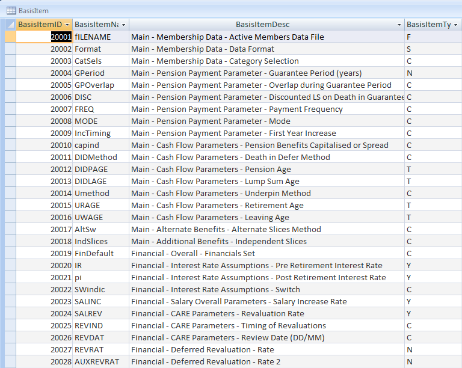

BasisItemID

: A link to the `BasisData` table (shown above).

BasisItemName

: The unique identifier name for each field in the basis files.

BasisItemDesc

: Description of the _Page Name \> Frame Name and Field Name_ where the particular fields are found on the SuperVal basis files.

BasisItem Type

: Describes if that particular field is a Number (`N`), Character (`C`) or a Date (`D`), etc. More of these characters are described in the `BasisType` table.

### BenefitAssumptions

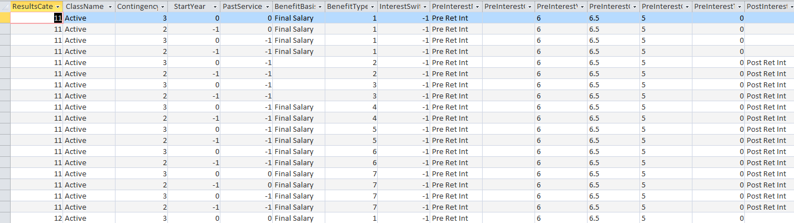

This table is created when the Quick Scenario Module is run. It sets out the benefit assumptions used in the valuation run.

### BenefitType

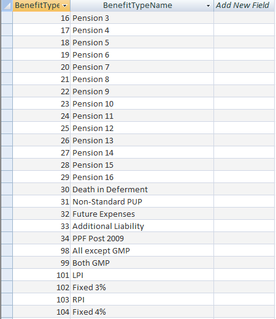

BenefitTypeID

: The different pension increases specified in the pension increase fields for Actives, Deferreds and Pensioners. In the consolidation database output file, the numbers increase from 101+ if the _Description used for Consolidation_ fields under the _Increase_ tab under the _Scheme Financials_ have been populated. (Above example shows a screen print from the consolidation database. The corresponding `SVResultsDB.mdb` file will not have the 100+ entries. They will only be defined as `4 – Main`, `5 – Special`, `6 – PenInc3` and `7 – PenInc4`.

BenefitTypeName

: The names of the different pension increases. The 100+ onwards represent the names that have been specified in the _Description used for Consolidation_ fields under the _Increase_ tab.

    The screen print below shows the _Increase_ tab under the Scheme Financials. This shows an example of the Description used for Consolidation fields being populated.

    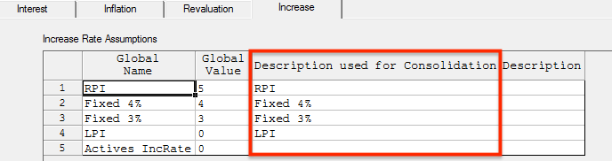

### CategoryAssumptions

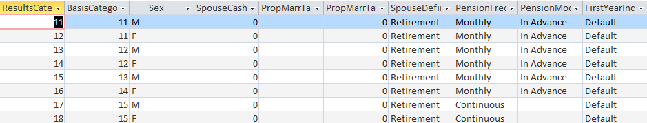

This table is created when the Quick Scenario Module is run. It sets out details of all the categories used in the valuation run.

### CharMemberData

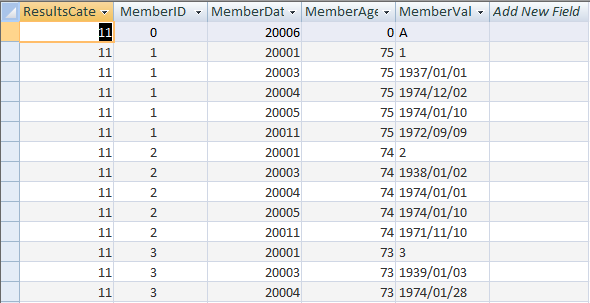

ResultsCategoryID

: Generated depending on the  of categories run in Actives, Deferreds and Pensioners.

MemberID

: Whether the member is an Active, a Deferred or a Pensioner.

MemberDataID

: The particular fields populated in the basis files.

MemberAge

: Age of the member. This data will be used for summarising by age results.

MemberValue

: Name of the member, the data of birth, date joined scheme, date joined fund, date pension commenced etc.

### Contingency

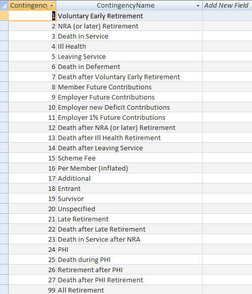

This table lists out the different contingencies present in SuperVal
e.g. Ill Health, Death in Service etc.

### DataItem

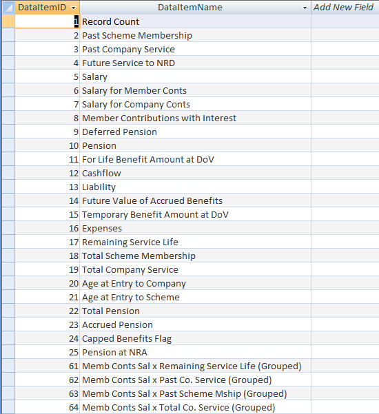

This table gives a list of the data items such as the accrued pension,
total pension, etc which will be used in the `ResultsData` table.

`DataItemIDs` 61 to 78 are only used when the member results are grouped
by age.

### FinancialGroups

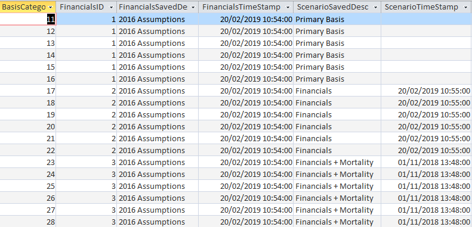

This table shows the financial assumptions, the description and timestamps of when the scenarios were saved for the Accurate Scenario Module.

### FinancialValues

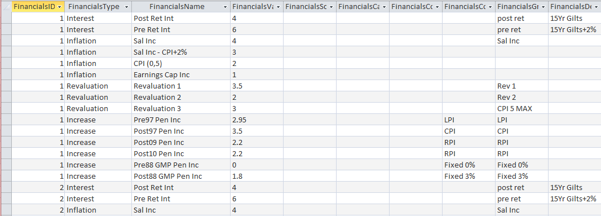

This table shows the values of the scenario used for the Accurate Scenario Module. It also shows the new financial groups for the Quick Scenario module.

### Identification

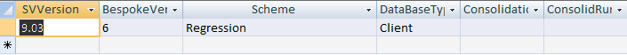

This table summarises the version of SuperVal you are running and also
sets out the name of the scheme being run. If a consolidation run has
been completed, the name of the consolidation file and the date it was
run will be populated in the consolidation database.

The `ConsolidationID` and the `ConsolidRunData` columns will not be
populated in the `SVResultsDB.mdb` output file.

### LiabilityType

This table gives a list of the liability items such as the past service,
cashflows, etc which will be used in the ResultsData table (shown in
the `MemberResults` table).

### MemberFields

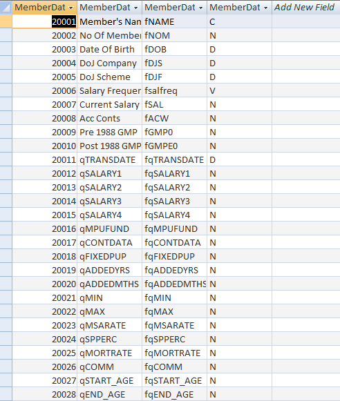

The table shows all the standard and user-defined fields
populated in the Actives, Deferreds and Pensioners modules.

To ensure unique numbering the Pensioners start at 0, the Deferreds
start at 10,000 and the Actives will start at 20,000.

### MemberResults

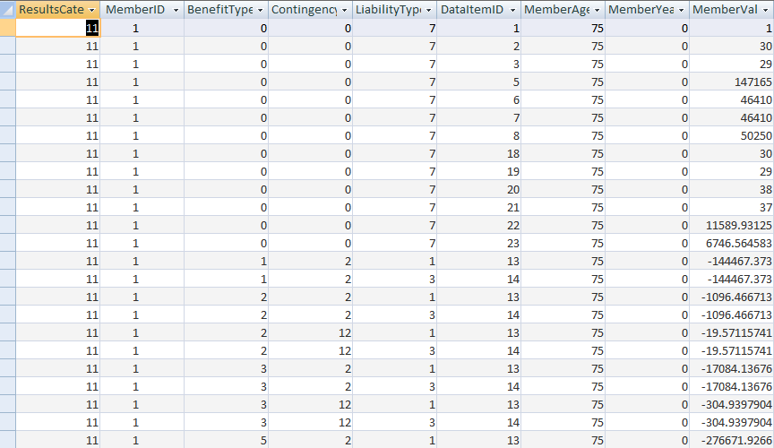

The first six columns have been explained in the above tables.

MemberYear

: The year following the valuation year.

MemberValue

: The SuperVal calculation such as the past service liability, future service liability. If the total liability is required then the user will be required to sum the past service liability and future service liability.

!!! info "This table *does not* give individual member liabilities/cashflows."

### NumMemberData

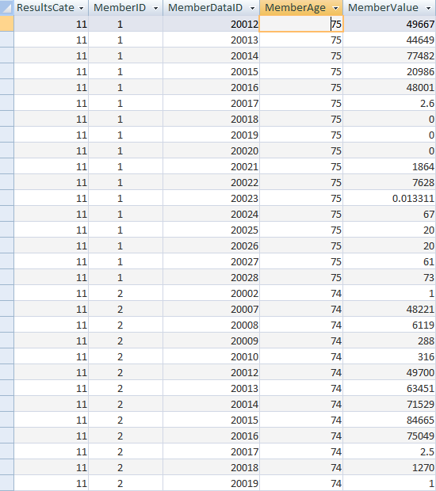

This table stores the members’ numeric data items such as the salaries,
GMP values, pension values etc. These data items are those that have
been brought into SuperVal in the original data files (CSV files).

### OutputFile

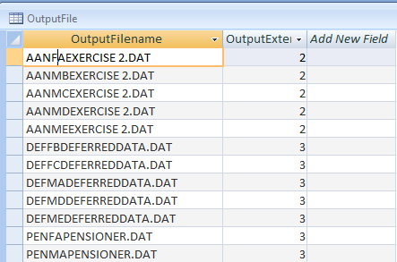

The table lists all the text files that have been created when
running the valuation run. The files beginning with `AAN` are the Attained
Age Normal runs for Actives module. The files beginning with `DEF` are the
ongoing runs for Deferreds module. The files beginning with `PEN` are the
ongoing runs for the Pensioners module. The number in the
`OutputExtension` column is the number that follows the text file names.
These files are found in the output folder in Windows Explorer.

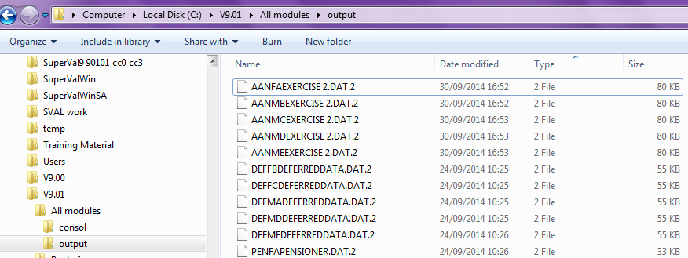

### ResultsCategory

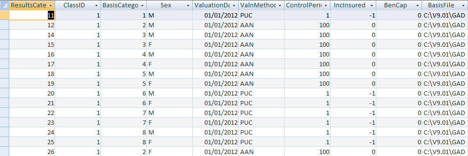

ClassID

: Encoded as

        1 – Active member
        2 – Active New Entrant member
        3 – Deferred member
        4 – Pensioner member

This table also sets out all the details of the valuation runs that have
been carried out in the batch run. It will list:

-   The categories that have been valued for each module.
-   The types of valuation runs that has been run
-   The valuation date
-   The control period (affects only Actives)
-   The benefit is insured (affects only Actives)
-   The basis file used for different modules.
-   The time stamp the basis file was last saved.
-   The basis description
-   The data file that was used for the valuation.
-   The time stamp the data file was last saved.
-   All the parameters set in the batch parameters tab when setting up the batch run.

### ResultsData

ResultsCategoryID

: A link to the `ResultsCategory` table above. The `ResultsCategoryID` is generated depending on the number of categories run in Actives, Deferreds and Pensioners.

BenefitTypeID

: Pension increases specified in the pension increase fields for Actives, Deferreds and Pensioners. In the consolidation database output file, the numbers increase from 101+ if the fields under the tab under the _Scheme Financials_ have been populated. The corresponding `SVResultsDB.mdb` file will not have the 100+ entries. They will only be defined as `4 – Main`, `5 – Special`, `6 – PenInc3` and `7 – PenInc4`.

ContingencyID

: Modes of exits used in the valuation run. For e.g. if Ill Health benefits has been defined in your Actives basis file then the `ContingencyID` 4 will be populated in the above table and you will see some cashflows (`SVValue` amounts) against it.

LiabilityTypeID

: Types of liabilities generated by SuperVal such as cashflows, past-service liability, accrued benefits.

DataItemID

: Data items such as the accrued pension, total pension, etc.

SVAge

: Age of the member as at valuation date. If `SVAge` is 0 that could be because there is a child pensioner aged 0 being valued or SuperVal is valuing a Scheme Level Liability.

SVYear

: Year after the valuation date.

SVValue

: Annual cashflow of the benefit being valued.

### TableNames

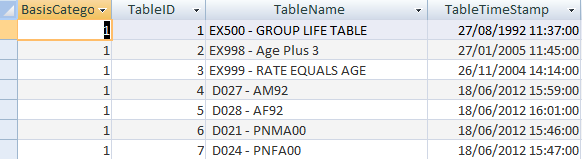

This table shows all the decrement rate tables and mortality improvement
tables used in the valuation runs. It also shows when the tables were
last amended/saved in SuperVal.

### TableValues

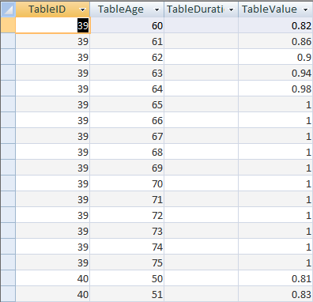

This table shows the values of all the rate tables at each age, used in
the valuation.

## ALM/LDI module

### AltScenData

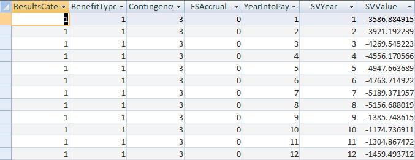

!!! tip "ALM/LDI Interface module"

    The `AltScenData` table gets populated only if you have the ALM/LDI Interface module in your SuperVal package.

    The ALM/LDI Interface module is available for purchase.

ResultsCategory

: Whether the results are from Actives, Deferreds or Pensioners.

BenefitTypeID

: Pension increases. If the _Description used for Consolidation_ fields were populated e.g. RPI, LPI then those will be valued as 100+ integers.

ContingencyID

: Modes of exits such as retirement, death in service, ill health etc.

FSAccrual

: Future service accrual (Actives only).

YearIntoPayment

: Year the benefit came into payment.

SVYear

: Year the benefit shown in `SVValue` is payable. It is the number of years since the valuation date.

SVValue

: The projection of annual benefit cashflows.

## AOS module

!!! tip "AOS tables"

    The AOS tables get populated only if you have the AOS module in your SuperVal package.

    The AOS module is available for purchase.

### AOSClass

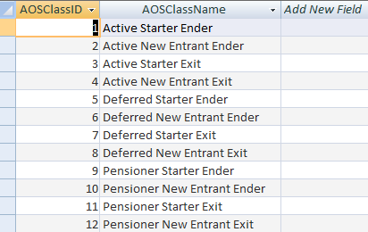

This table describes the class of member being valued for e.g. an active
member who was present in the last valuation and is present in the
current valuation as well.

### AOSItem

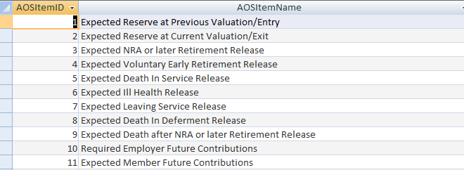

This table represents the names of the expected benefits calculated in
SuperVal.

### AOSMember

ResultsCategoryID

: A link to the `ResultsCategory` table [described above](#resultscategory).

MemberID

: A link to the `MemberFields` table [described above](#memberfields).

AOSClassID

: Described in the `AOSClass` table above.

AOSContingency

: Contingencies. The cell for members who are Enders will be blank.

AOSAge

: Age of the member being valued.

AOSDataItem

: A link to the `AOSItem` table described above.

AOSValue

: The liability calculated by SuperVal.

### AOSResults

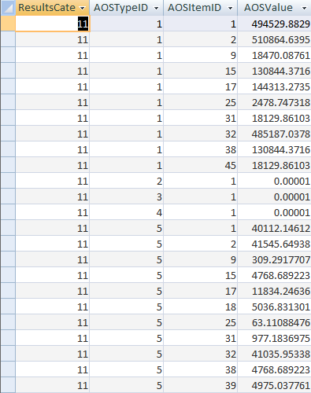

ResultsCategoryID

: A link to `ResultsCategory` table described above.

AOSTypeID

: A link to the `AOSType` table described below.

AOStemID

: A link to the `AOSItem` table described above.

AOSValue

: The liability calculated by SuperVal.

### AOSType

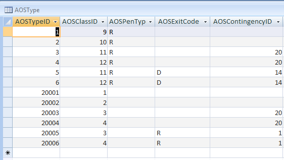

AOSTypeID

: A link to the `AOSResults` table described above.

AOSClassID

: Described in the AOSClass table above.

AOSContingency

: Contingencies.

AOSPensType

: The character that represents the types of pension populated in the Analysis of Surplus Global Parameters under Pensioners Parameters. Actives and Deferreds cells will be blank for this column. Below is an example where these characters are populated in the Analysis of Surplus Global Parameters.

    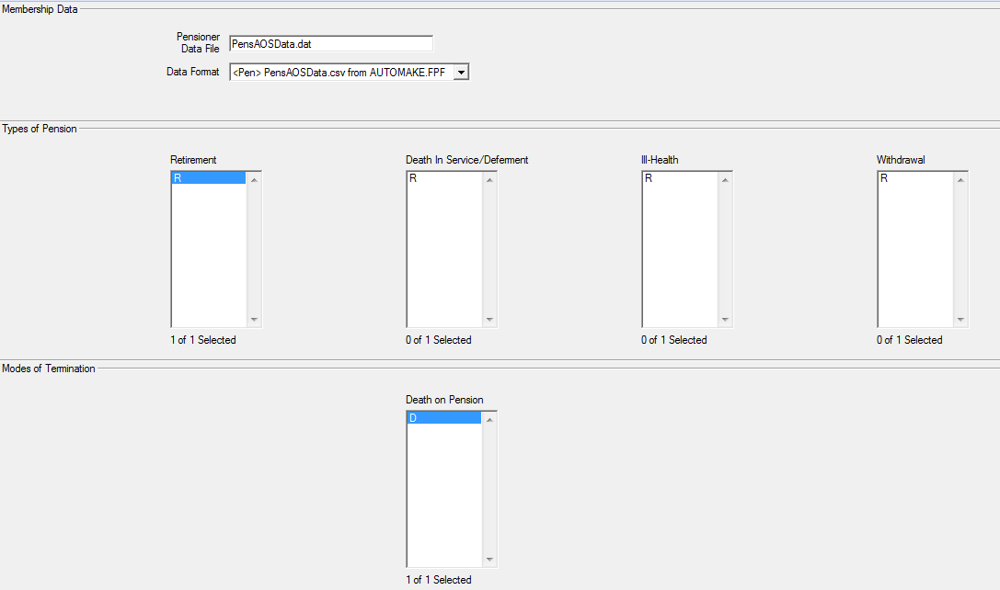

AOSExitCodes

: The character that describes the modes of exit for a particular member. Below is an example of an Active module that shows the modes of Exit being populated in the Analysis of Surplus Global Parameters under Actives Parameters.

    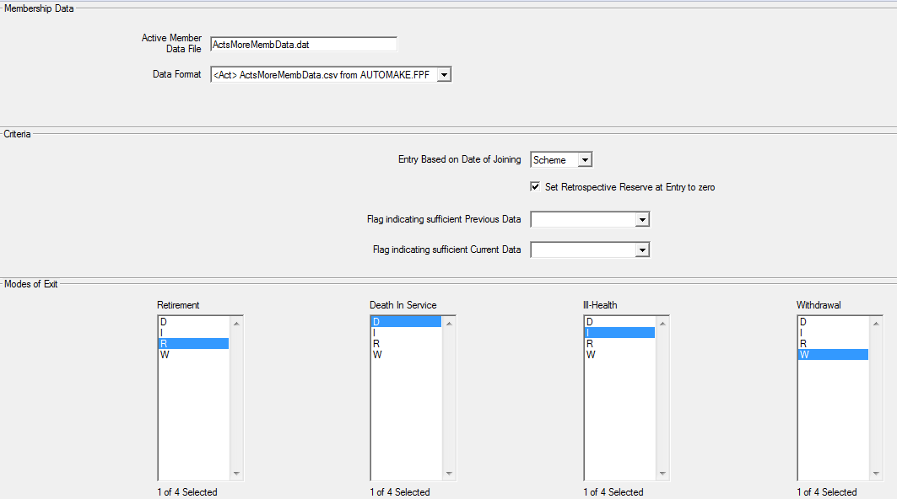

