# Death-in-Service benefits

This article lists the options available for Death in Service.

It includes numerical examples in the appendix to help understand how the system works.

## Inputs

### Actives tabs

Below are screenshots of the fields you need to fill in when defining
Death-in-Service benefits in SuperVal. The screenshots are taken from
the `Death Pen` and `Death Cash` tabs:

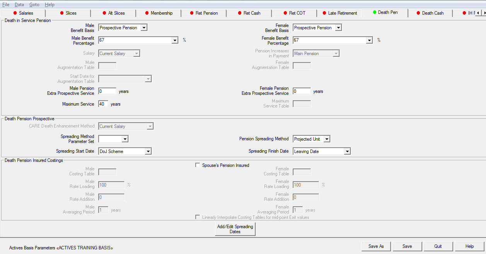

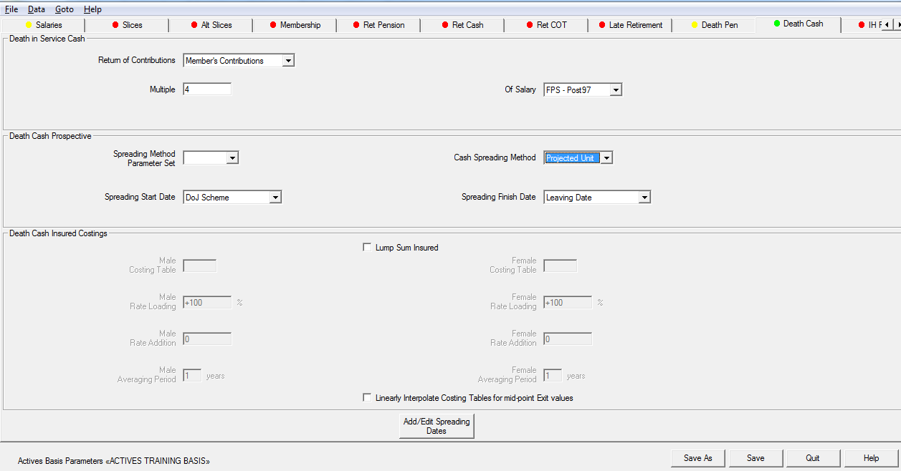

## Valuing lump-sum DIS benefits

You have a range of options as to how to specify lump-sum DIS
benefits. The different parameters are considered below.

### Return of contributions

Where a return of contributions is payable after the death of an active
member, the user has the following options to value the benefit:

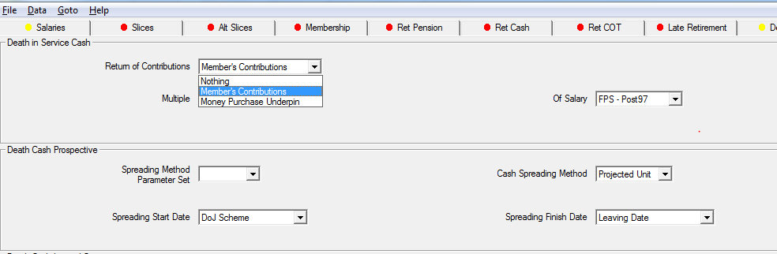

Nothing

: Self-explanatory: no benefit is valued.

Member’s Contributions

: If this option is selected, any past contributions (with interest if applicable) must be specified in the member-data CSV file as the ACW data item. For future contributions, employee contributions must be set up on the _Contributions_ tab (including whether or not interest should be applied up to the time of decrement). A screenshot is shown below of the _Contributions_ tab; refer to the [Contributions](../contributions/index.md) article for more details.

    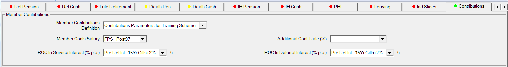

Money Purchase Underpin

: If this option is selected, the value of the underpin at the valuation date (with interest if applicable) must be specified in the member-data CSV file as a user-defined variable. This must be selected on the _Contributions_ tab in the _Underpin Contributions_ section.

### Multiple of salary

Where a multiple of salary is paid out on the death of an active member,
this must be specified based on the following parameters:

Multiple

: Self-explanatory: enter the multiple of salary.

Of Salary

: You can choose any of the nine salary definitions on the Salary tab

    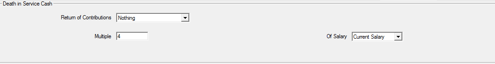

Lump Sum Insured?

: If the multiple of salary benefit is not insured, enter `No`. If the benefit is insured and you want to use SuperVal functionality to work
out a 1-yr insurance premium, enter `Yes`. If you would rather work out any insured costs outside of SuperVal, then do not specify any multiple of salary benefit.

    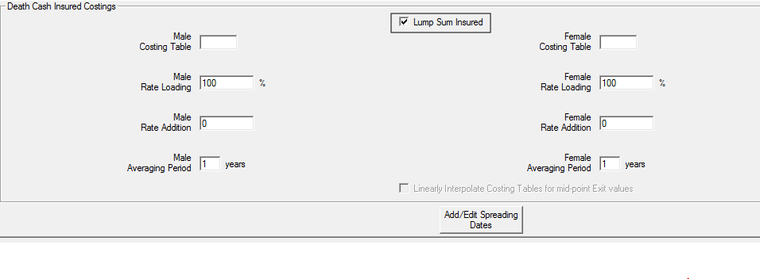

    Spreading Start Date / Spreading Finish Date

    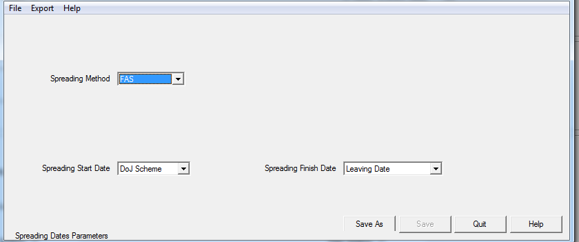

    For benefits that are _not_ insured, you must specify how the benefit accrues. SuperVal will assume the benefit accrues uniformly from the Spreading Start Date defined up to the Spreading Finish Date and is split between past and future service on the same uniform basis.

    The future-service liability will be deemed to be the fraction: $\frac{VDATE\ to\ SFD}{SSD\ to\ SFD}$ where SSD is the Spreading Start Date and SFD is the Spreading Finish Date.

    The past-service liability will be deemed to be the fraction: $\frac{SSD\ to\ VDATE}{SSD\ to\ SFD}$.

    For example, you may input DJF for SSD and LDATE for SFD if the benefit accrues uniformly over the entire service period.

    :fontawesome-solid-hand-point-right:
    [Appendix](#appendix-spreading-dis-benefits) for spreading of DIS benefits

#### DIS lump-sum insured costings

If the multiple-of-salary benefit is insured and you wish to
calculate an estimate for a 1-yr insurance premium in SuperVal,
check the box in the _Lump Sum Insured?_ field and then specify the
basis upon which the cost is calculated:

-   The relevant premium rates for males and females. The rate should be per £1,000 of lump sum benefit.
-   Any loadings to these premium rates. The loading is given as a percentage (default 100) so that if it were required to increase the rates by 20% then the Rate Loading would be set to 120.
-   Any additions to the calculated premium, e.g. an expense loading (not age-dependent). Specify this per £1,000 of sum assured.
-   Any average period applied (i.e. if the insurance premium is smoothed over a number of years).

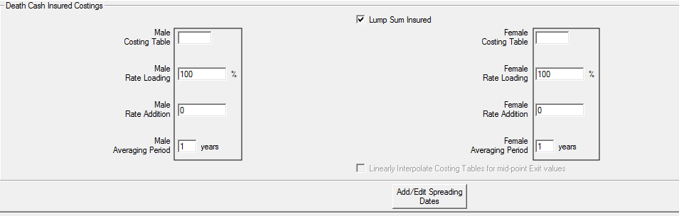

!!! warning "Mortality rates"

    You _could_ specify mortality rates rather than premium rates in the Rate table, but would then need to adjust the Rate Loading entry by a factor of 1,000 (and so Rate Loading would be 100% x 1,000 = 100,000%).

## Valuing DIS pension benefits

You have a range of options for specifying DIS Pension
benefits. The different parameters are considered below.

### Benefit basis – males/females

Where a spouse’s pension is payable after the death of an active member,
you have the following options for the type of benefit:

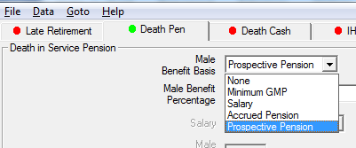

None

: Self-explanatory: no benefit is valued.

Minimum GMP

: In this case, only the Widow’s/Widower’s GMP is valued as a pension. This will be 50% of the Post’88 GMP plus 50% of the Pre’88 GMP for Widows (i.e. no pre’88 Widower’s GMP for Female members).

Salary

: Where a percentage of salary pension benefit is paid out to the spouse on the death of an active member, this option must be chosen.

Accrued Pension

: Where a percentage of **accrued** pension benefit (based on pensionable service up to death) is paid out to the spouse on the death of an active member, this option must be chosen.

Prospective Pension

: Where a percentage of **prospective** pension benefit (based on prospective pensionable service up to assumed Normal Retirement Age) is paid out to the spouse on the death of an active member, this option must be chosen.

### Benefit setup

Where a spouse’s pension is paid out on the death of an active member,
this must be specified based on the following parameters:

Percentage (OR Percentage Field) – Males/Females

: The relevant percentage must be entered here (either as a percentage of pension or salary, depending on the _Benefit Basis_ chosen above).

    This can either be entered as a fixed amount for all males/females (e.g. 50 for 50%) in the Percentage input, or as a member-specific variable (included in the data CSV file) in the Percentage Field input.

Salary

: An entry in this field is required if the spouse’s death-in-service pension is type 2 (Salary). Any of the nine salary projections can be selected. The salary will be used rather than the final average salary.

    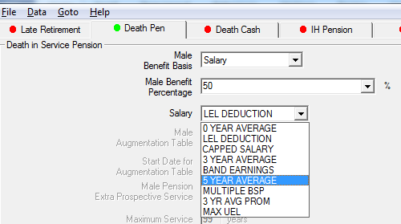

Increase in Payment (Option 2)

: If the pension benefit is a multiple of salary (as per Option 2), the user must specify how the DIS pension will increase in payment (whether the pension increase rate is Main, Special, PenInc3 or PenInc4)

    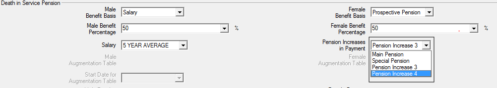

Spouse’s Insured?

: If the DIS pension benefit is not insured, leave the box unchecked. If the benefit is insured and you want to use SuperVal functionality to work out a 1-yr insurance premium, check the box. If you would rather work out any insured costs outside of SuperVal, then do not specify any DIS pension benefit.

Spreading Start Date / Spreading Finish Date

: This field must be set if the Spouse's Death in Service Pension benefit is not insured.

    The benefit is assumed to accrue uniformly between the Spreading Start
    Date and the Spreading Finish Date and is split between past and future
    service on the same uniform basis.

    The Spreading Start Date and Spreading Finish Date fields will only have
    an effect if the death in service pension is either % of Salary or
    Prospective.

    If the pension is % of salary then the whole of the benefit is
    apportioned between past and future service liability.

    For the prospective benefit it is the prospective element only that is
    spread. (The part of the pension determined from past service is still
    past service liability, the part of the pension determined from service
    from valuation date to exit point is future service liability. It is the
    part of the pension determined from service from the exit to NRD that is
    spread.)

    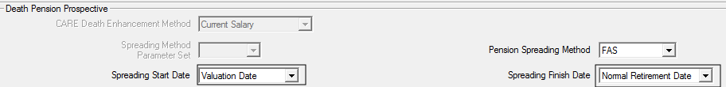

    The future service liability will be deemed to be the fraction: $\frac{VDATE\ to\ SFD}{SSD\ to\ SFD}$, where SSD is Spreading Start Date and SFD is Spreading Finish Date.

    The past service liability will be deemed to be the fraction: $\frac{SSD\ to\ VDATE}{SSD\ to\ SFD}$.

    :fontawesome-solid-hand-point-right:
    [Appendix](#appendix-spreading-dis-benefits) for spreading of DIS benefits

Extra Prosp Serv for Males/Females SDISP

: If a prospective DIS pension benefit is based on any additional service (e.g. based on service up to age 65, but Normal Retirement Age is set as 60), then you may include an additional amount here (e.g. 5 for 5 years). This amount will be added to the prospective service calculation.

DIS Pension Insured Costings

: If the DIS Pension benefit is insured and you wish to calculate an estimate for a 1-yr insurance premium in SuperVal, you will need to check the box  _Spouse’s Insured?_ box and then specify the basis upon which the cost is calculated.

    For details of setup, see note above in relation to DIS lump-sum insured costings.

    **Specify premium rates per £100 (per annum) of pension assured.**

    **Added functionality for Client Code 3 users**
    An Additional field _Spreading Method for Prospective Element_ allows you to either use the default `FAS` approach, or use a `Projected Unit` approach.

## Appendix – Spreading DIS benefits

### Do Spreading Dates have any effect?

When setting up DIS benefits in SuperVal, if spreading dates are
given, then, depending on the type of benefit being valued, they may
or may not have any effect on the calculation. The following table sets
out which benefits are affected by these dates:

| **Lump Sum Benefit Option** | **Effect?** |     | **Pension Benefit Option** | **Effect?** |
|-----------------------------|-------------|-----|----------------------------|-------------|
| None                        | NO          |     | None                       | NO          |
| Member's Contributions      | NO          |     | Minimum GMP                | NO          |
| Money Purchase Underpin     | NO          |     | Salary                     | **YES**     |
|                             |             |     | Accrued Pension            | NO          |
| Multiple of Salary          | **YES**     |     | Prospective Pension        | **YES**     |

### Timeline for spreading of benefits

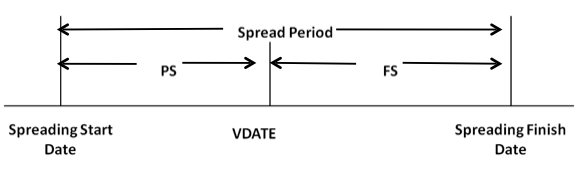

### Apportioning benefits between past and future service

Consider decrements (i.e. deaths) **separately for each year**.

For benefits based on a **multiple of salary**, the benefit is apportioned as follows:

    Past Service Benefit   = Multiple of Salary x PS ÷ Spread Period
    Future Service Benefit = Multiple of Salary x FS ÷ Spread Period

For **prospective pension benefits**, the benefit is apportioned as
follows:

    PSB = Past Serv Pension + (Outstanding Prospective Pension x PS ÷ Spread Period)
    FSB = Fut Serv Pension  + (Outstanding Prospective Pension x FS ÷ Spread Period)

Where FS is future service **to assumed Finish Date**, and Outstanding Prospective Pension is Pension in relation to service from Finish Date to NRD

$$=\frac{Total\ Prospective\ Service – PS – FS}{Total\ Prospective\ Service} × Total\ Prospective\ Pension$$

### Worked example

    Member age                     47        @VDATE
    Past Service                   12 years  to VDATE
    Salary                         £25,000   @VDATE
    NRA                            60
    Accrual rate                   60ths
    Salary increase assumption     0% p.a.
    Proportion married             100%
    LS DIS benefit                 4 × salary
    DIS pension                    50% prospective

**Q1)** How is the Lump Sum benefit split between Past and Future
Service in each of the four spreading periods shown in the table below?
Just consider the 4th year after VDATE.

**Q2)** How is the Pension benefit split between Past and Future Service
in each of the four spreading periods shown in the table below? Again, just
consider the 4th year after VDATE.

         Spreading Start Date  Spreading Finish Date
    -------------------------------------------------
    1            DJF                   LDATE
    2            VDATE                 LDATE
    3            DJF                   VDATE
    4            DJF                   NRD

!!! tip "Remember SuperVal assumes exits occur mid-year."

**Solution 1:**

Total Lump Sum benefit = 4 x 25,000 = 100,000.

Consider Spreading Period 1:

PS = 12 years, FS = 3.5 years (halfway through yr 4).
Spread Period = 15.5 years

So Lump Sum allocated to PS = 12 ÷ 15.5 x 100,000 = 77,419

And Lump Sum allocated to FS = 3.5 ÷ 15.5 x 100,000 = 22,581

Repeating the exercise for the other spreading periods gives:

          SSD      SFD    PS    FS   Spread Period   PS LS     FS LS  TOTAL LS
    ---------------------------------------------------------------------------
    1    DJF      LDATE   12    3.5       15.5      77,419    22,581   100,000
    2    VDATE    LDATE    0    3.5        3.5           –   100,000   100,000
    3    DJF      VDATE   12    0         12       100,000   –         100,000
    4    DJF      NRD     12   13         25        48,000    52,000   100,000

**Solution 2:**

Firstly, allocate the Accrued Pension part (this element is not spread):

    Past Service   = (12÷60)  × 25,000 × 50% = 2,500
    Future Service = (3.5÷60) × 25,000 × 50% =   729

Now calculate the Prospective element:

    Prospective element = (9.5÷60) × 25,000 × 50% = 1,979

We only spread the prospective element, so for Spreading Period 1:

    Pension allocated to Past service   = 2,500 + (12÷15.5)  × 1,979 = 4,032
    Pension allocated to Future service =   729 + (3.5÷15.5) × 1,979 = 1,176

Repeating the exercise for the other spreading periods gives:

          SSD     SFD    PS    FS   Spread Period  PS pen  FS pen  Tot Pen
    ----------------------------------------------------------------------
     1   DJF     LDATE   12    3.5       15.5       4,032   1,176    5,208
     2   VDATE   LDATE    0    3.5        3.5       2,500   2,708    5,208
     3   DJF     VDATE   12    0         12         4,479     729    5,208
     4   DJF     NRD     12   13         25         3,450   1,758    5,208

