# Importing data into SuperVal

*How to import data into SuperVal for all modules from Excel or
CSV files, and some issues that may arise during the process.*

!!! info "Version"

    This article is based on Version 9.30 of SuperVal. Any screenshots
    from earlier versions are not materially different from those in V9.30.

## Data

You can import data into SuperVal from an Excel file or a CSV
(comma delimited) text file.

SuperVal has pre-defined standard field names if you want to use them.

There is flexibility in naming the standard data fields in the data
files (Excel or CSV). SuperVal will try to map these names to the
standard names.

You can also (optionally) specify the type of format for
each column in Row 2. 

The format types are:

code | type | note
-----|------|-----
C    | character |
N    | total numeric | the sum if grouped e.g. salaries, contribution accounts
n    | average numeric | the average if grouped e.g. Contribution Rate or Accrual Rate or Reversion %
A    | total numeric averaged | the value is an average and needs to be multiplied by NOM for a Total Numeric
     | date | one of: `dd/mm/yyyy`, `ddmmyyyy`, `mm/dd/yyyy`, `mmddyyyy`

Examples of how data can be imported into SuperVal, either in an Excel
format or a CSV format:

1.  Data with no format types in row 2

    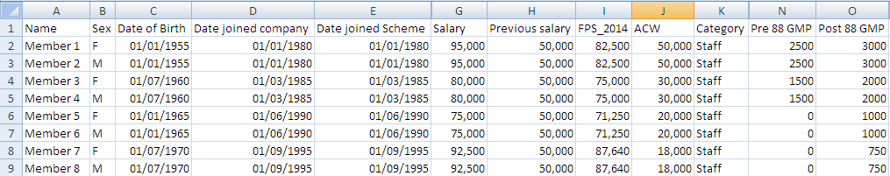

1.  Data using pre-defined names and format types

    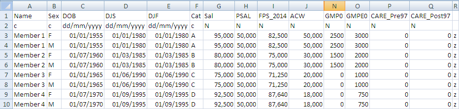

### Standard variable names

!!! tip "Required fields"

    Data Build requires standard variables 
    `NAME`, `SEX`, `Category` (or `CAT`) and `Date of Birth` (or `DOB`) 
    in row 1 of the data file.

The standard names are listed in the table below.

The standard names can appear anywhere in Row 1 and in any order.

Non-standard names get prefixed with the letter `q` and treated as user-defined variables.

If a standard data variable name is found within a type of membership
where that variable does not apply (e.g. SAL in a Deferreds
data build) it gets prefixed with a `q` and treated as a user-defined variable.

The above list does not include static variables such as salary
frequency etc. The default value(s) will be retained – if these
require changing, edit the data format by _Data \> Format_. 

!!! warning "Such changes get discarded if Data Build is redone."

| Actives | Deferreds | Pensioners | Type  | Description                                                                                   |
|---------|-----------|------------|-------|-----------------------------------------------------------------------------------------------|
| NOM     | NOM       | –          | N     | Number of members to be used if there is grouped data                                         |
| NAME    | NAME      | NAME       | C     | Name of each member (numbers can be used)                                                     |
| SEX     | SEX       | SEX        | C     | Sex of the member, must be `M` or `F`                                                         |
| CAT     | CAT       | CAT        | C     | Category of membership specified. Can be defined using up to 16 characters e.g. Staff, A1 etc |
| DOB     | DOB       | DOB        | D     | Date of Birth                                                                                 |
| DJS     | –         | –          | D     | Date Joined Company i.e. date joined for company                                              |
| DJF     | –         | –          | D     | Date Joined Scheme i.e. date joined for pensionable                                           |
| MOE     | MOE       | –          | C     | Mode Of Exit from statuses e.g. death, retirement                                             |
| DOE     | DOE       | –          | D     | Date Of Exit (actives)                                                                        |
| BOE^†^  | BOE^†^    |            | N     | Lump Sum Benefit on Exit                                                                      |
| PSAL    | –         | –          | N     | Previous Salary                                                                               |
| SAL     | –         | –          | N     | Current Salary                                                                                |
| ACW     | ACW       | –          | N     | Accrued Contributions (actives) or Underpin (deferreds)                                       |
| ACWO^†^ | –         | –          | N     | Accrued Contributions without Interest                                                        |
| EACWO^†^| –         | –          | N     | Accrued Employer Contributions without Interest                                               |
| GMP0    | GMP0      | GMP0       | N     | Pre 1988 GMP as at the Valuation Date                                                         |
| GMPE0   | GMPE0     | GMPE0      | N     | Post 1988 GMP as at the Valuation Date                                                        |
| –       | –         | SDOB       | D     | Spouse’s Date of Birth                                                                        |
| –       | LD        | LD         | D     | Leaving Service Date                                                                          |
| –       | –         | DPC        | D     | Date First Pension Commenced e.g. retirement date                                             |
| –       | –         | DOT        | D     | Date Pension Ceased i.e. exit date from deferred or pensioner status                          |
|         |           | MOT        | C     | Mode Ceased Pension                                                                           |
|         | TOP       | TOP        | C     | Type of PUP                                                                                   |
|         |           | BOT^†^     | N     | Benefit upon Termination                                                                      |
|         |           | TPP^†^     | N     | Total Pension Paid                                                                            |
| –       | –         | MOT        | C     | Mode Ceased Pension                                                                           |
| –       | –         | –          | N     | Lump Sum on Death in Deferment                                                                |
|         |           | MEMORSP    | C     | Member or Spouse                                                                              |
| q\_\_\_ | q\_\_\_   | q\_\_\_    | N/C/D | User Defined Variable- default row                                                            |

^†^ Used for Analysis of Surplus only

### Data for Analysis of Surplus (AOS)

As the previous valuation results have to be rolled forward to the
current valuation date and compared with the current valuation results,
all the member data input to the previous and current valuations is
required. This data is held at individual member data level within
member status (Actives, Deferreds and Pensioners).

The AOS data must include data as at the current valuation date and also
as at the previous valuation date. The data required is the same data
items for the current valuation and the previous valuation.

The columns for the previous valuation data file will have the names of
the variables prefixed by `#`.

### CSV files

Excel supports the CSV format. To save a file in this format,
click on _File \> Save As_ – you will see the following dialogue:

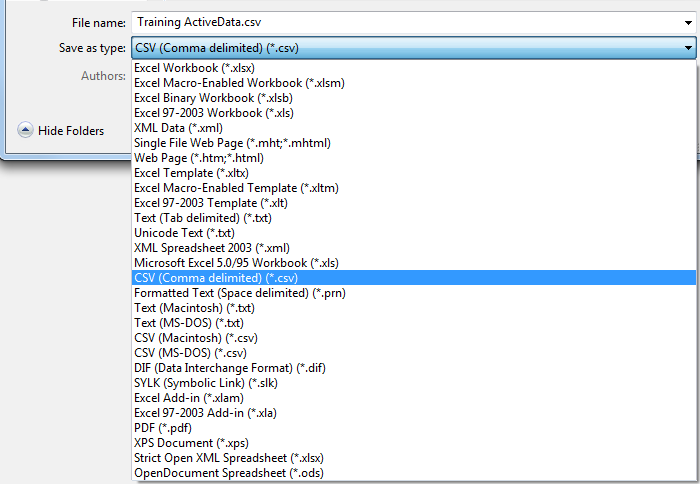

Select `CSV (Comma delimited) (*.csv)` for _Save as type_ , specify the name
of the file and click _Save_. The CSV file gets saved in your
designated Input folder. 
(_Data \> Data Build_ will only allow you to select files from here.)

The names in Row 1 may be specified in any order and in upper or lower
case.

Before you save and close the document, ensure that you have selected a
cell within the block of your data. Excel will then save all data up to
the next blank row / column. (It will save the numbers – not the
formulae, and will not save data on other worksheets).

!!! danger "Remove thousand separators from numerical cells before saving in CSV format."

    The CSV delimiter and the thousand separator are both commas 
    and it is not possible to distinguish one from the other when reading the CSV file.

    <!-- FIXME: I thought I removed this limitation in the first version of Data Build! -->

    Other features of a typical spreadsheet are usually acceptable and Excel
    disregards them when writing to CSV files.

!!! danger "If you maintain a row of data descriptions in the Excel file, remove it before saving the CSV file."

Finally, once you have saved the CSV file, ensure you close it before
importing it into SuperVal.

## Data Build

### Mapping data fields

In the CSV or Excel member-data file, 
you can either use the standard SuperVal field names described
above, or profit from the new flexibility in naming fields. 
Standard field names (e.g. `DOB`, `DJF` etc.) continue to
work best but names such as `Date of Birth`, `Date Joined Scheme` etc. can
be used and SuperVal will try to map them to the standard names.

SuperVal will then let you map (or un-map, or re-map) any fields
that were not identified as standard fields (or were incorrectly identified) 
when performing the Data Build.

The required format will be assumed for standard data fields.
If Row 2 does not contain format types
the data formats will be guessed for
date fields and non-standard fields. 

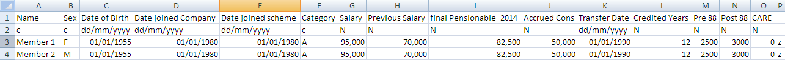

You can correct errors with the _Change Data Field Type_ button.

### The Data Build wizard

Click _Data \> Data Build_. You will see a dialogue like this:

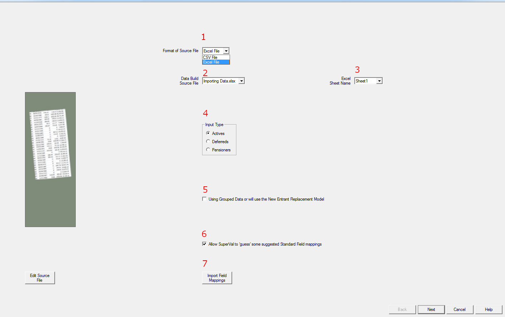

1.  Select CSV or Excel file as the format of the member-data file.

2.  SuperVal will look for it in the
    designated Input folder. (_File\>Properties_). 
    If there is more than one CSV / Excel file there, 
    select from the dropdown menu the one you want.

3.  Excel files can contain multiple data sheets – select the
    one you want.

4.  Select whether membership type is Actives, Deferreds or Pensioners

5.  If not ticked, columns which are numeric 
    (or have `n` as a format in the 2nd-row) 
    will be understood as the total value for
    that member for those columns. If ticked (i.e. if using grouped data
    or New Entrant Replacement Model) the numeric columns will be
    understood to be the average value for that group of members.

6.  If names such as `Date of Birth`, `Date Joined Scheme` etc. are 
    used in the member-data file, tick 
    _Allow SuperVal to “guess” some suggested Standard Field mappings_. 
    SuperVal will try to map them to the standard names.

    If you tick 
    _Allow SuperVal to “guess” some suggested Standard Field mappings_
    when you then click _Next_  you will see a dialogue 
    asking you to confirm the mappings:

    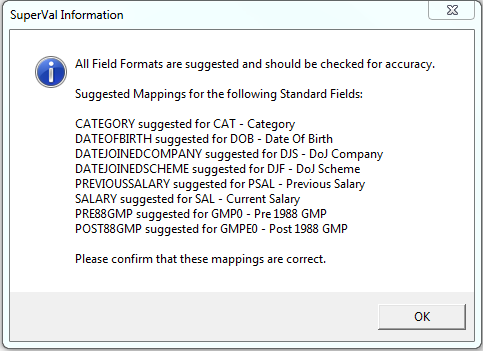

    If a Data Build has already been run for this scheme, previous mappings
    are assumed (but can be amended). 
    You will be asked to confirm the mappings:

    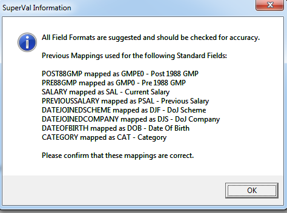

7.  If a Data Build has been run previously for another scheme,
    you can import the field mappings from the previous folder.

After you click _Next_, SuperVal will list the standard and user-defined fields
included in the member-data file.
You will also see (_Not Present_) standard fields you might wish to include.

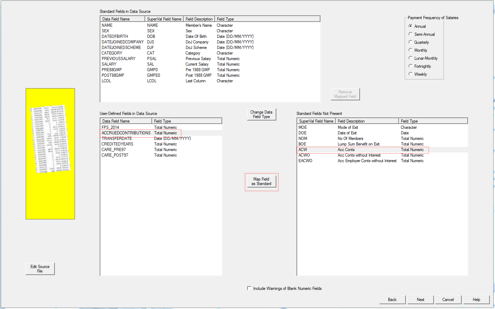

!!! tip "Click the _Edit Source File_ button if you need to modify the CSV or Excel file."

Above, `ACCRUEDCONTRIBUTIONS`is to be mapped to standard field `ACW` (accrued contributions with interest):

-   In _User Defined Field in Data Source_ select `ACCRUEDCONTRIBUTIONS”`.
-   In _Standard Fields Not Present_ select `ACW` 
-   Click _Map Field as Standard_

SuperVal will check the member-data file, report errors, 
and warn of possible problems.
If it finds errors, Data Build will not proceed until you have 
corrected them. 
(Use the _Edit Source File_ to do this.)

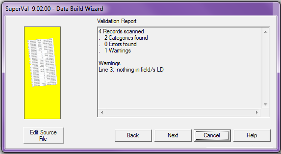

SuperVal will then check the sums in the data file. 
You can save the checksums output in a
separate CSV file in the Input folder. 
The checksums include all fields of _total numeric_ type.

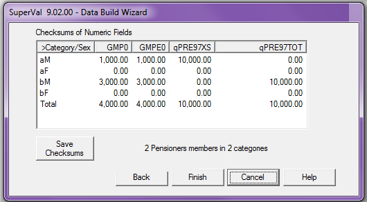

!!! tip "You can use the _Cancel_ button to abort the Data Build."

Click _Finish_ to see the validation page.

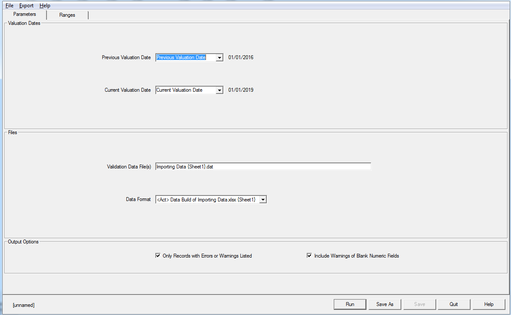

On the _Ranges_ tab you can specify reasonable ranges for numeric data fields .

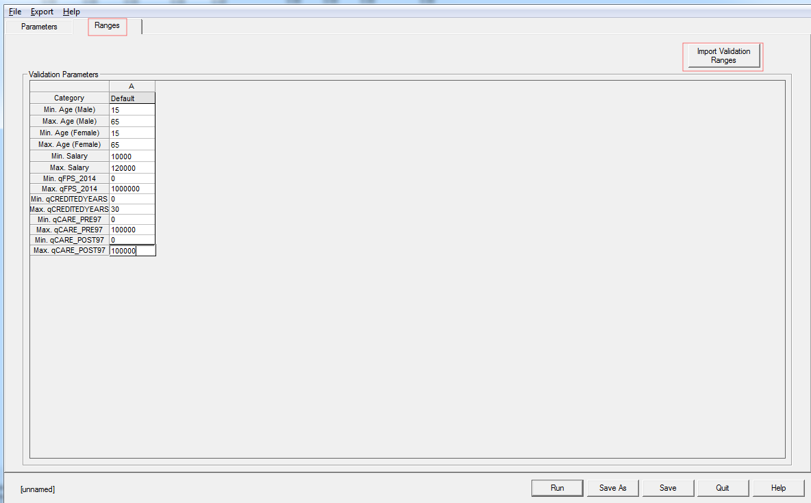

These validation ranges are stored as part of the Data Format created
by the Data Build.

Use _Import Validation Ranges_ to copy ranges used previously
for the membership class. 
If you previously set up , these can be copied as the starting
point for new validation ranges. e.g.

-   Data Build for `Actives 2018.csv` set validation ranges

-   Data Build for `Actives 2019.csv`: copy the validation ranges used in Data Build
  of `Actives 2018.csv`.

This avoids setting up validation ranges again, 
as `Actives 2018.csv` and `Actives 2019.csv` 
are likely to have the same user-defined fields.

Click _Run_ to start validating the data.

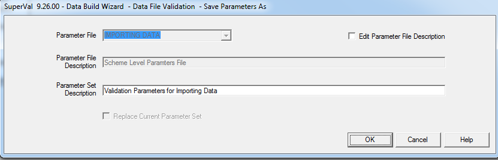

SuperVal will ask you if the scheme details should be updated 
with the latest Data Build file.

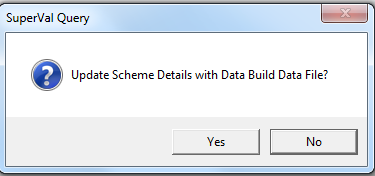

If _Yes_ is selected the scheme details will be updated:

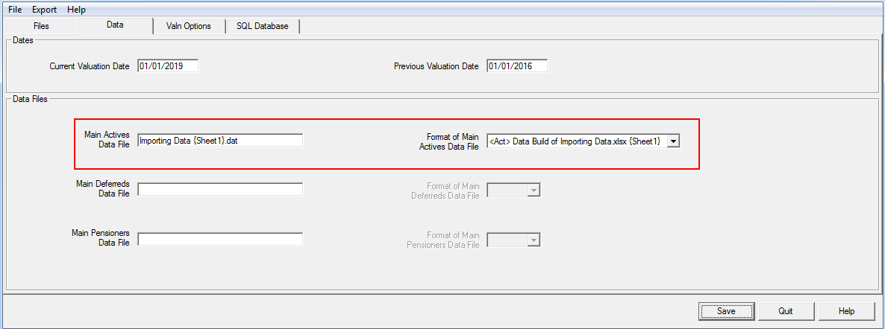

### Member-data file

SuperVal will write in your Input folder a data file with the same name as the Excel / CSV file and a `.DAT` extension.

!!! tip "To keep an earlier DAT file, rename it before running Data Build again."

!!! tip "Recommended practice"

    Use distinct names for the Excel / CSV files containing each type of
    member data i.e. actives, deferreds and pensioners.

### Troubleshooting: getting the data file right

_Some error messages associated with setting up member data._

Unable to tie (filename)

: 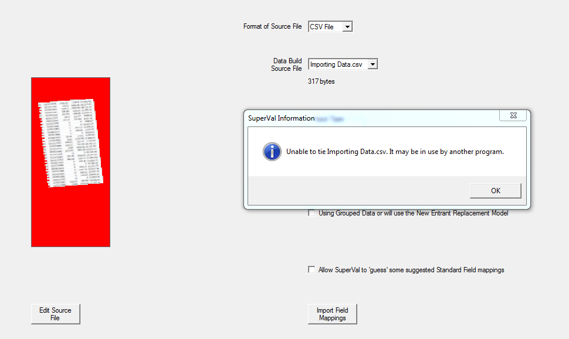

    Close the CSV data file before building the DAT file: select _File > Close_

Unable to open Excel workbook 

: 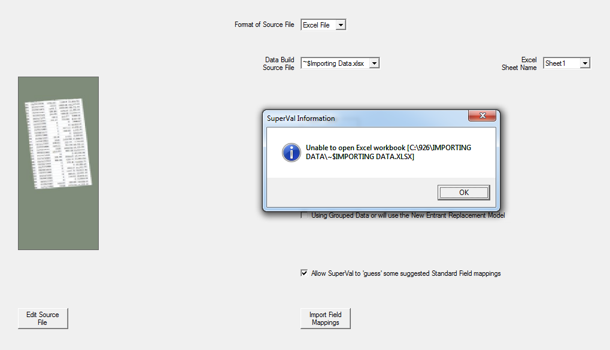

    The selected Excel data file is open.

    The last saved version of the Excel file can be selected and a .DAT file built from it.

Missing required fields

: 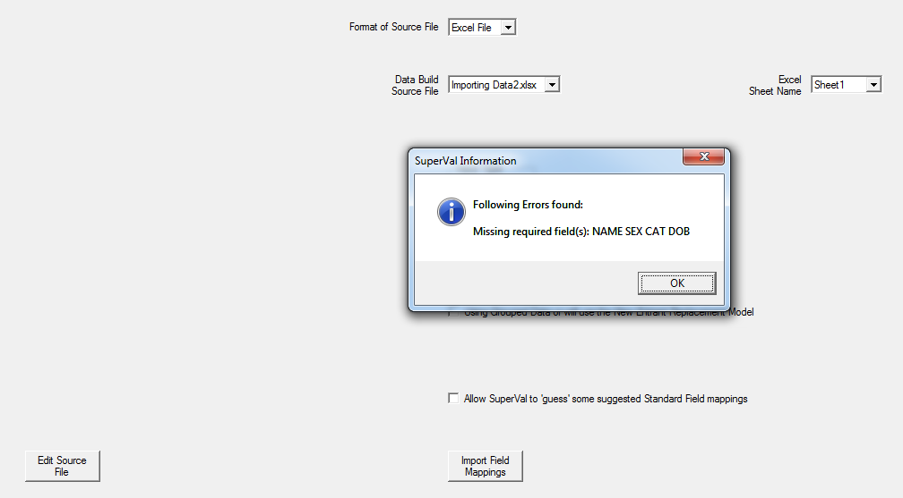

    The data file must contain a minimum of four columns, with
    the headings: `NAME`, `SEX`, `CAT` and `DOB`.

No data rows

: 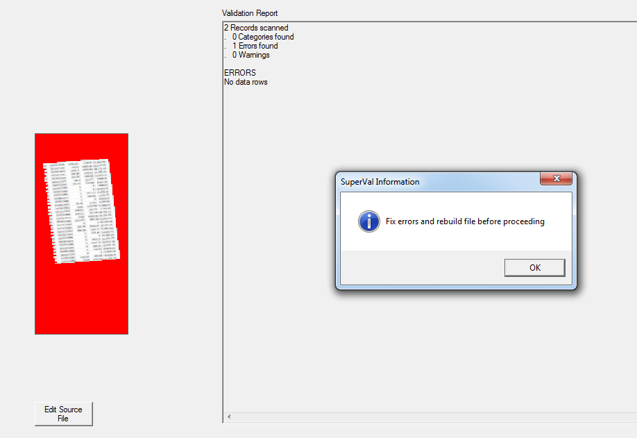

    Your data file does not contain any member records.

Duplicate field names 

: 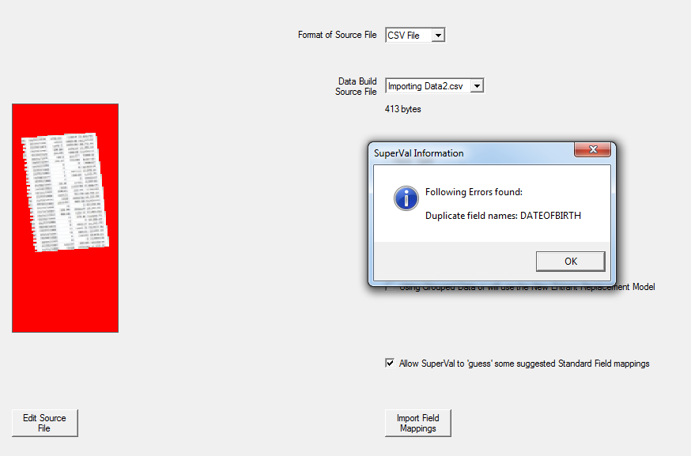

    You have specified duplicate names in Row 1, which should contain unique names.

    This validation occurs before the `q` prefix is added.

