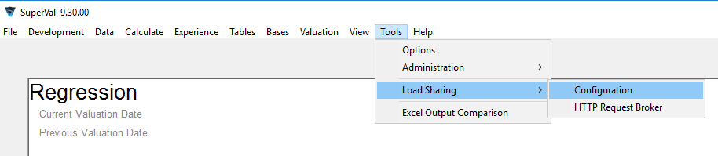
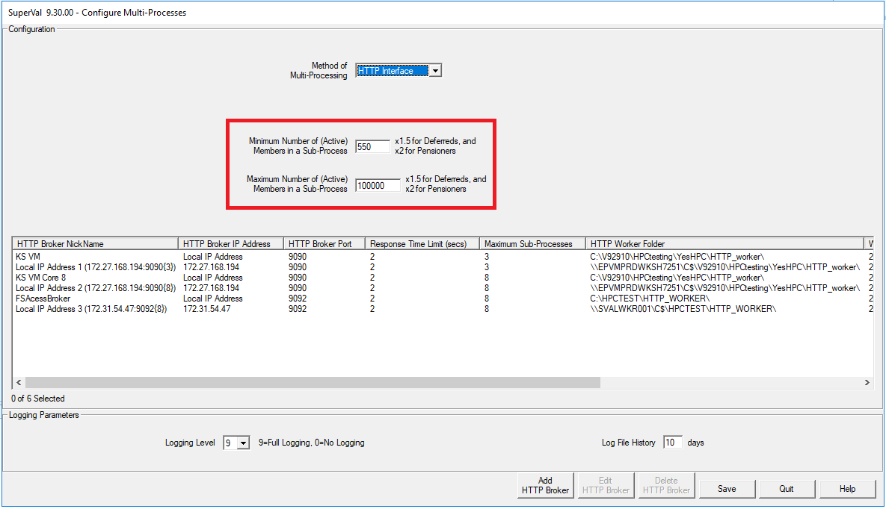
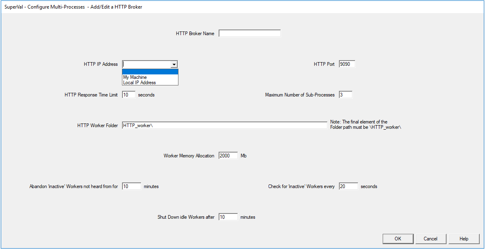
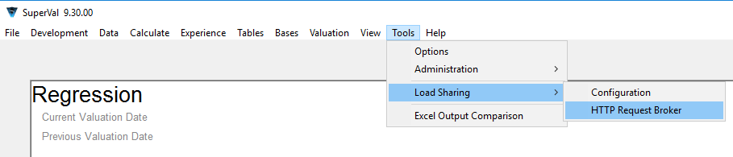
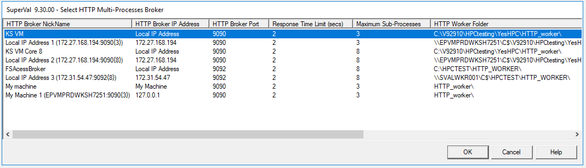
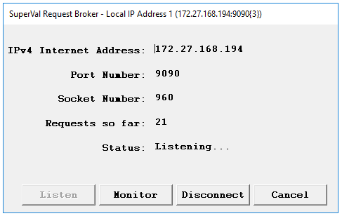
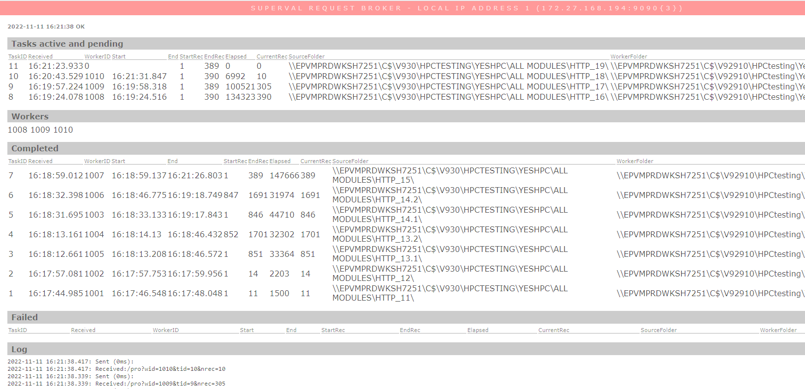
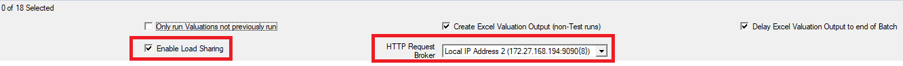

#  Load sharing in SuperVal

Load sharing allows SuperVal valuation work to be shared across
multiple sub-processes using the multiple cores generally available in
today’s computers. Those cores could be contained in your own
computer, a colleague’s computer or in a computer dedicated to
performing valuation work.

This generally provides a significant improvement in valuation
processing time as:

-   Valuations for different Sex/Category groups can be processed in
    parallel; or

-   Valuations for Sex/Category groups with a large number of members can
    be split into multiple valuations with smaller groups of members and
    processed in parallel; or

-   Both.

Load sharing is enabled by establishing a Valuation Broker which
is responsible for launching the Valuation Worker sub-processes and all
communications with both SuperVal and the Valuation Worker
sub-processes. The Valuation Broker can be monitored in your browser,
showing the progress of any valuation work and the queue of pending
valuation work.

Multiple Valuation Brokers (ideally each on a different computer to
avoid having to share resources) can be established at the one time. For
example, you may have a dedicated valuation computer for each valuation
team.

## Load sharing process

At this stage, we have implemented a single method of Load Sharing.

SuperVal sends valuation tasks to the Valuation Broker using
configuration settings to decide whether Sex/Category groups need to be
divided into a series of smaller valuation sub-groups.

The communication between Valuation Broker and SuperVal/Valuation
Workers is via Sockets (a socket is a simple two-way communication
channel through which two programs communicate over a network using
well-established TCP/IP protocol) using each computer’s IP address and a
port number (specified in the configuration). Communications are encoded
as simple text strings.

The Valuation Broker will launch Valuation Workers and then allocate
these valuation tasks to the Valuation Workers and progress on the work
is reported back to the Valuation Broker.

The inputs and outputs of a valuation process are transferred between
SuperVal and Valuation Worker computers using the standard File system
(using Universal Naming Convention (UNC) folder names) so it is
necessary that the SuperVal installation, the computer running the
SuperVal instance, the computer running the Valuation Broker and the
computer running the Valuation Workers are on the same network.

The inputs consist of a compressed (and therefore effectively encrypted)
package containing all valuation code, valuation variables (eg all
valuation basis details) and the member data relevant to the valuation
(sub-)group.

Other than the text valuation output (which is not available with Load
Sharing) the outputs are those usually output by a SuperVal valuation
run – native files containing database records to be uploaded to the
Valuation Database and errors/warnings generated by the valuation run.
These outputs are transferred back to SuperVal, blended with other
outputs if a Sex/Category valuation group was sub-divided into as number
of smaller sub-groups, and treated by SuperVal in the same manner as any
other valuation.

As the Load Sharing process involves many more file movements, it is
recommended that the Valuation Workers computer has a high-performance
disk drive.

## Configuration

The effectiveness (in terms of improving the speed of valuations) of the
Load Sharing depends on a number of factors:

- The speed of the processor on the Valuation workers computer

- The number of cores available on the Valuation workers computer

- The amount of memory on the Valuation workers computer

- The speed of the disk drive on the Valuation workers computer

- The number of SuperVal users using any particular Valuation Broker

To help you optimise the performance of Load Sharing in your
particular circumstances, there are a number of configuration parameters
for the set-up of a Valuation Broker. These parameters can be set
by an Administrator-level user at _Tools>Load Sharing>Configuration_

### Configure a Valuation Broker

The following Configuration screen will be presented:

The following parameters are common to all methods of Load Sharing.

Method of Load Sharing

: At present, the only method of Load Sharing of valuation tasks is the Valuation Broker using a HTTP interface. We hope to add others later.

Minimum Number of Members

: The minimum number of Active members to create sub-divisions of a Sex/Category valuation run. Due to the quicker valuation timings, this number is multiplied by 1½ for Deferred members and 2 for Pensioner members.

Maximum Number of Members

: The maximum number of members to be included in sub-divisions of a Sex/Category valuation run. As all membership data is loaded into the Valuation task, this parameter should be considered in conjunction with the Maximum Number of Sub-Processes and Valuation Worker Memory Allocation. Due to the quicker valuation timings, this number is multiplied by 1½ for Deferred members and 2 for Pensioner members.

Logging Level

: To assist with the debugging of any issues with the Valuation Broker, the communications between the Valuation Broker and SuperVal/Valuation Workers can be logged into log files stored in the `log` sub-folder of the `WLS` sub-folder of the SuperVal install folder. 

    !!! tip "Give all SuperVal users write access to this folder."

    The level of logging can be varied from Full Logging (level 9) to No
    Logging (level 0).

Log File History

: To enable quicker identification of issues, different logging files are created for:

    -   Each SuperVal user

    -   Each active Valuation Broker

    and these Logging files are rolled over daily, which can result in a
    large number of files.

    To avoid the proliferation of files, a limit can be placed on the time
    (in days) that these Logging files are retained.

### Add a new Valuation Broker

When adding a new Valuation Broker, you are presented with the following
form:

Valuation Broker Name

: A unique descriptive name by which to select it

Valuation Broker IP Address

: The IPv4 format of the IP Address of the computer where the Valuation Broker will be launched (IPv6 format IP Addresses are not supported). The IP Address can be either the local network IP Address (generally `192.x.x.x` or `172.x.x.x`) or the IP Address assigned by the ISP (although as files need to be copied between computers, all computers will need to be on the same network and will thus have local network IP Addresses).

    There are two pre-coded options which can be selected here:

    My Machine

    : This option uses the IP Address `127.0.0.1`, which denotes the computer launching the Valuation Broker. A Valuation Broker launched using this IP Address can only be accessed by the computer upon which it was launched. This option can be useful if you have additional cores on your computer.

    Local IP Address

    : This option launch a Valuation Broker with this IP Address. Note that when this Valuation Broker is activated, a new Valuation Broker definition will be added to the list of Valuation Brokers (if it does not already exist) – the name of which is displayed in a message.

    Once established, the Valuation Broker is only used for communication
    between SuperVal instance and the Valuation Workers and the generation
    of Progress reports in the Browser so the Valuation Broker computer is
    not required to be particularly fast.

Valuation Broker Port

: This is the Port through which communications are passed.

    A port is a virtual point where network connections start and end and
    allow computers to easily differentiate between different kinds of
    traffic. Each port can be associated with a specific process or service
    and use of the commonly used Ports (eg 80 for Browser traffic) should be
    avoided.

Valuation Broker Response Time Limit (seconds)

: The number of seconds allowed before a communication is assumed to have failed. As most communications (with the exception of establishing a new Valuation Worker) are dealt with by the Valuation Broker in milliseconds, this period should be kept quite short.

Maximum Number of Sub-Processes

: The maximum number of Sub-Processes (or Valuation Workers) that can be established. This is generally the number of “spare” cores in the Valuation computer (although it should be decided in conjunction with the Maximum Number of Members and the Valuation Worker Memory Allocation). Obviously, the more Valuation Workers that can be launched the more valuation work can be done in parallel.

Valuation Worker Folder

: A fully qualified path of the Folder which is to be used as the parent folder of the Valuation Worker folders. Each valuation task undertaken by a Valuation Worker will create a sub-folder of this folder which will contain all the inputs and outputs required for the valuation work.

    The exception to this is the My Machine option for the IP Address, in
    which case the Valuation Worker Folder will be a sub-folder of the
    SuperVal Input Folder.

    In all cases, the final element of the Valuation Worker Folder path must
    be `\HTTP_worker\`, which will be automatically added if not specified.

Valuation Worker Memory Allocation

: The Memory Allocation to each of the Valuation Workers in Mb. This will most likely be the amount of “spare” memory divided by the Maximum Number of Valuation Workers. Another consideration when deciding this is also the Maximum Number of Members allocated to a valuation task as all the member data is read from file into the Valuation Workspace (compared to SuperVal, which reads 200 records at a time).

Check for “inactive” Valuation Workers

: The number of seconds between checks on “inactive” Valuation Workers (those that are not responding to the Valuation Broker).

Abandon “inactive” Valuation Workers not heard from

: The number of minutes before a Valuation Worker that has not communicated to the Valuation Broker is shut down. Any work already allocated to an abandoned Valuation Worker will be allocated to another Valuation Worker.

Shut Down Idle Valuation Workers

: The number of minutes before an idle Valuation Workers (one waiting for a valuation task) is shut down. Note that the Valuation Broker will always maintain one idle Valuation Broker at all times so it is ready to commence valuation work at any time.

### Edit or delete Valuation Brokers

Once a Valuation Broker definition has been configured, this definition
can be edited at any time. Or Valuation Brokers definitions which have
ceased to be relevant (e.g. if your local-network address changes) can
be deleted.

If a Valuation Broker is not shut down correctly (by pressing the _Cancel_
button – see below) for any reason, it will continue to be regarded as
“active”. In this case, this Valuation Broker definition could be
deleted to reset its “active” status to avoid it appearing in list of
Valuation Brokers available for use.

## Launch a Valuation Broker

Once Valuation Brokers have been defined, you can launch one at _Tools>Load Sharing>HTTP Request Broker_

Without Administrator rights you can launch only a
`My Machine` Valuation Broker, which runs on your own machine.

If you have Administrator rights you will see the following form:

Select a Valuation Broker: it will be launched and tested.

Selecting a Valuation Broker with an IP Address of `My Machine` or
`Local IP Address` creates a new Valuation Broker
definition with the actual IP Address (unless that definition already
exists). These new definitions appear in lists of available Valuation
Brokers when preparing Valuation runs.

Obviously, this new Valuation Broker definition will be different on
each computer (as `My Machine` is restricted to the local computer and
IP Address will use the computer’s local-network IP Address).

Selecting either the IP Address of `My Machine` or `Local IP Address`
Valuation Brokers or the Valuation Broker definition they have created
has the same effect.

Once a Valuation Broker is launched, SuperVal will show a pop-up box as
below:

You can monitor the progress of valuations in a Browser Dashboard by
pressing the _Monitor_ button.

!!! tip "Temporary disconnection"

    In theory, you could leave a Valuation Broker running forever, awaiting any
    valuation tasks sent to it. (It will even survive the computer
    going into hibernation.) However, while the Valuation Broker is not required, 
    you can suspend communications temporarily with the _Disconnect_ button.

    You can reactivate it later with the _Listen_ button.

Pressing the _Cancel_ button shuts the Valuation Broker down.

## Use load sharing in a valuation

There are two new fields on the _Valuation Batch_ form:

Tick the _Enable Load Sharing_ box.

Select a Valuation Broker from the dropdown list of active HTTP Request Brokers.

