<!-- # Mortality setup -->

_How to define mortality rates in SuperVal for Actives, Deferreds and Pensioners._

**Version**
This document is based on Version 9.25 of SuperVal. Any
screenshots from earlier versions are not materially different from those in V9.25.

## Inputs

Below is a screenshot of the fields to fill in when defining
the mortality tables and improvement factors to use in SuperVal. The
screenshot is taken from the _Mortality_ tab from the Pensioners module.
Set-up for the Actives and Deferreds modules is similar, except for
that you will also need to define pre-retirement mortality (and, if
applicable, ill-health retirement mortality). The fields can be found on
the _Mortality_ tabs in all modules.

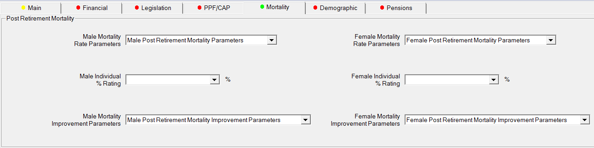

If you click on _Add/Edit Mortality Table_ at the bottom of
the page, then the Mortality Rate Parameters can be added, defined and
named as a set for a specific basis file:

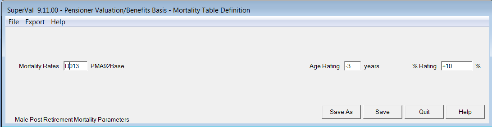

## Basic adjustments to mortality tables

There are several ways to adjust a (base) mortality table (circled in
screenshot above).

### Applying a % rating factor (or scaling)

This is simply done by adjusting the value of $q_x$ for each age
$x$ by a constant, e.g.

$$q_x' = 1.1 × q_x$$

where $q_x$ is the base mortality rate, 1.1 is the scaling
factor and $q_x'$ is the adjusted mortality rate.

In SuperVal, % rating factors can be defined in the cells indicated, and
can either be fixed or member-specific.

**Fixed**

In the Males/Females _% Rating_ cells simply enter any additional percentage.
SuperVal will apply 1 plus the entry in the field. In other words, to
multiply the rates by 1.1 enter `10` for 10% loading or to multiply rates
by 0.9 enter `-10`.

_Male Post Retirement Mortality Parameters_

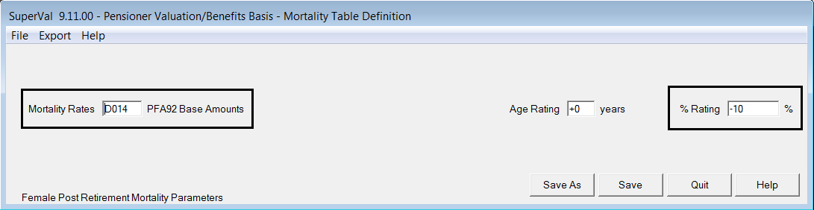
_Female Post Retirement Mortality Parameters_

The above mortality set-up is as follows:

	Males:   110% PMA92 Base
	Females:  90% PFA92 Base

In the _Mortality_ tab, ensure you select the named parameter sets _Male Post Retirement Mortality Parameters_ and
_Female Post Retirement Mortality Parameters._

**Member-specific**

If a percentage loading is required on a member-by-member basis, then a
data item can be selected and input on the _Mortality_ tab in the
Male/Female individual _% Rating_ cells. The data item (included in the
CSV file) has to be a number, so if a loading of 110% is
required then use `10`, or if a loading of 90% use `-10`.

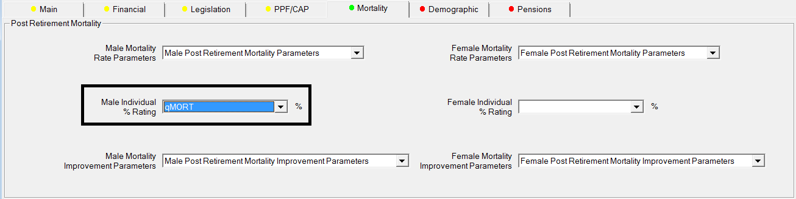

### Applying an age rating

This is simply done by adjusting the value of $q_x$ for each age
$x$ as:

$$q_x’ = q_{x+a}$$

where $q_x$ is the base mortality rate, $a$ is the age rating and
$q_x’$ is the adjusted mortality rate.

In SuperVal, age ratings can be defined in the cells indicated, and must
be fixed for each sex (i.e. you cannot presently define member-specific
age ratings in SuperVal).

**Male / Female Rating**

The _Age Rating_ cells make allowance for mortality ‘lighter’ or
‘heavier’ than that specified in the table. The adjustment specified
here is made to the (base) mortality table specified.

NB: Non-integer ratings or ratings higher than +9 or -9 years are not
allowed.

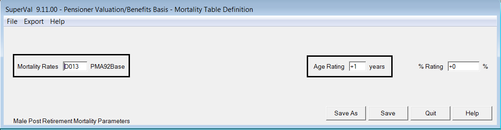
_Male Post Retirement Mortality Parameters_

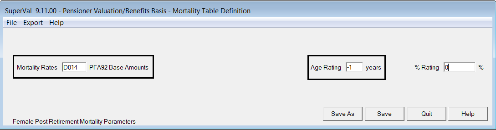
_Female Post Retirement Mortality Parameters_

The above mortality set-up is as follows:

	Males: PMA92 Base +1 yr
	Females: PFA92 Base -1 yr

In the _Mortality_ tab, select
the named parameter sets _Male Post Retirement Mortality Parameters_ and
_Female Post Retirement Mortality Parameters._

## Allowing for mortality improvements

SuperVal gives you five different options for the type of mortality
improvement you can define:

None

: This can be selected even when there is no mortality improvement
set up on the _Mortality_ tab

	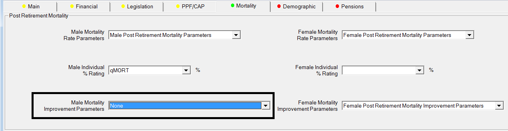

The other options can be seen when defining Mortality improvement
tables:

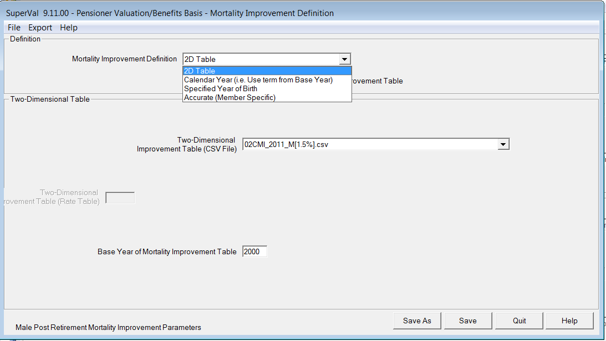

These five options can be grouped into three separate categories, as
explained below.

### Basic mortality adjustments

This is where there is one $q_x$ for each age – the value of
$q_x$ does _not_ vary with DOB (or based on a specified Calendar
Year).

In this case, you’d just select option `N – None` and define the
mortality table(s) in the _Male Table_ and _Female Table_ cells.

This type of mortality adjustment has already been covered in the
previous section. You can allow for improvements via age rating and
scaling, as described earlier.

**Adjusting the base mortality table using a 2D table by means of a Reduction Factor Formula**

This is done by adjusting the value of $q_x$ for each age $x$ as
follows:

$$q_x’ = q_x × RF(x,t)$$

where $q_x$ is the base mortality rate, $RF(x,t)$ is the reduction
factor to apply to a member aged $x$ at time $t$, and $q_x’$ is the
adjusted mortality rate.

One approach suggested by the Continuous Mortality Investigation (CMI)
is to use a formula for the reduction factor, set out as follows:

$$RF(x,t) = \alpha(x) + (1-\alpha(x)).(1-\beta(x))^{\frac{t}{PERIOD}}$$

$RF(x,t)$ has a maximum value of 1 (since it reflects an
improvement in mortality and hence a reduction in the value of
$q_x$).

$t$ in the formula above is the number of years after the base
year (e.g. 1980 or 1992).

When setting up these tables, you can specify the values of alpha, beta
within SuperVal using a `HX` type table.

The CMI has published two sets of values for alphas and betas, which
relate to adjusting the 80 series and 92 series base mortality
tables. The values can be found in CMI Reports 10 and 17, respectively.

Depending on the improvement method used, you may also need to enter
further parameters:

#### Improvement Method

SuperVal allows three different improvement methods to be applied that
incorporate the Alpha and Beta tables.

These are as follows:

Calendar Year

: 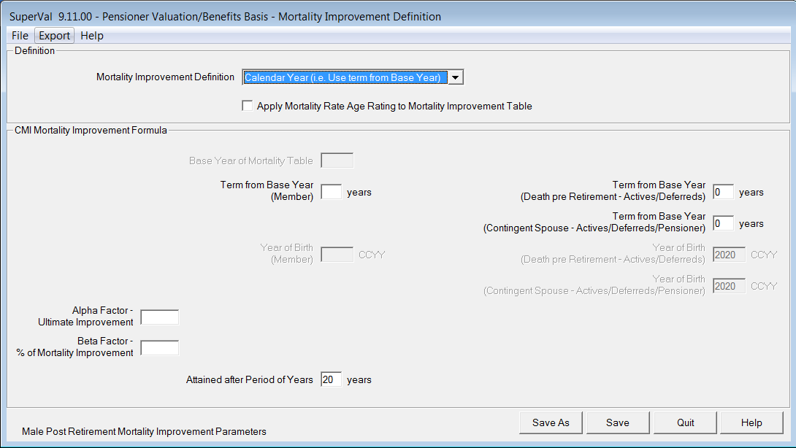

Specified Year of Birth (applied to all members)

: 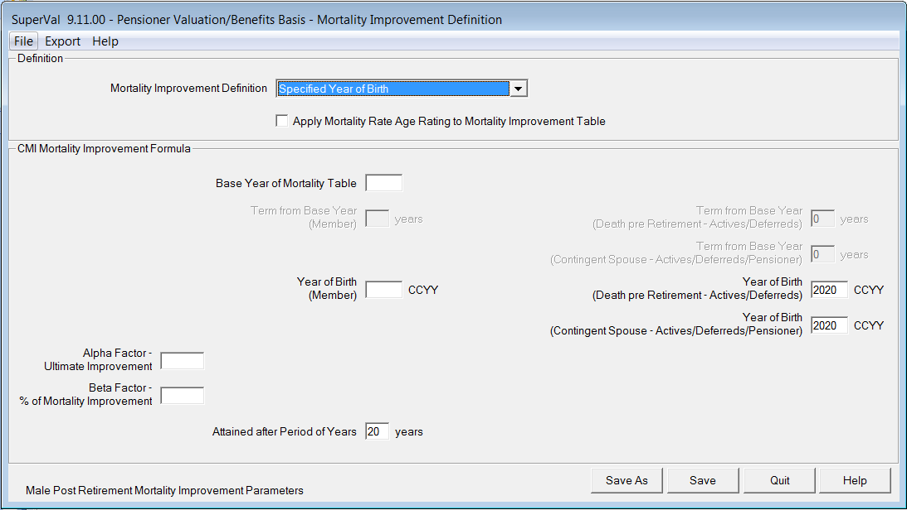

Accurate – Member Specific Year of Birth

: 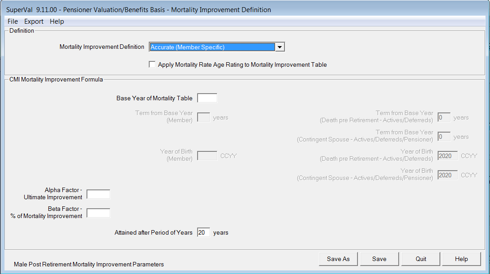

#### Mortality Table Base Year

This parameter is only required for the `Specified Year of Birth` method
and `(Accurate) Member Specific` methods. So this would be 1980 or 1992,
say.

#### Specifying the Year of Birth or Term from Base Year

For the Enhanced Pensioners set-up, there are four different fields:

-   Member (Males/Females)
-   Contingent (Males/Females)

The value will depend on the mortality assumed for members and spouses
(based on sex)

For the Calendar Year method, the value to input should be the
difference between the Projection Year and the Base Year of the
mortality table. So, if you were using PMA92 CY=2020, then the input
would be 28 (=2020 – 1992).

For the Specified Year of Birth Method, the value to input is simply the
fixed Birth Year that you are using for your mortality projections (e.g.
1945 for PMA92 BY=1945).

For the Actives and Enhanced Deferreds modules there are additional
fields, depending on the type of decrement (e.g. death before
retirement, withdrawal, retirement etc.).

#### Alpha and Beta (M&F)

Select the relevant rate table for Alpha and Beta values.

#### Period (M&F)

The period is 20 years (see CMI Reports)

#### Examples and comments

See [Appendix](#appendix) for examples of setup for Calendar Year, Specified Year of
Birth and Member-specific Year of Birth.

For member-specific Year of Birth, SuperVal uses age nearest at
the valuation date to work out the relevant $RF(x,t)$ factor to use. This
may mean that the YOB is one year out in some cases.

If you set up mortality based on the $RF(x,t)$ formula
method using the 92-series improvement formulas to adjust 00
mortality base tables, the above methodology will _not_ calculate
mortality rates accurately. In this instance, you would need to input
the $RF(x,t)$ values as a 2D table, as described in the following section.
The reason for this is that the formula for $RF(x,t)$ shown above is based
on improving mortality rates from 1992 onwards, while if you are using
the 00 series base tables, you will only want to apply
improvements after 2000. You cannot simply adjust the inputs above using
2000 instead of 1992.

The above methodology _cannot_ allow for cohort effects or
underpins. Again, 2D tables are required in this instance.

### Adjusting the base mortality table by specifying a 2D table

Where the reduction factors do not follow the formula specified in the
previous section, a 2-Dimensional Table can be specified in SuperVal
(e.g. tables which include allowance for the cohort effect or an
underpin to the rate of mortality improvement).

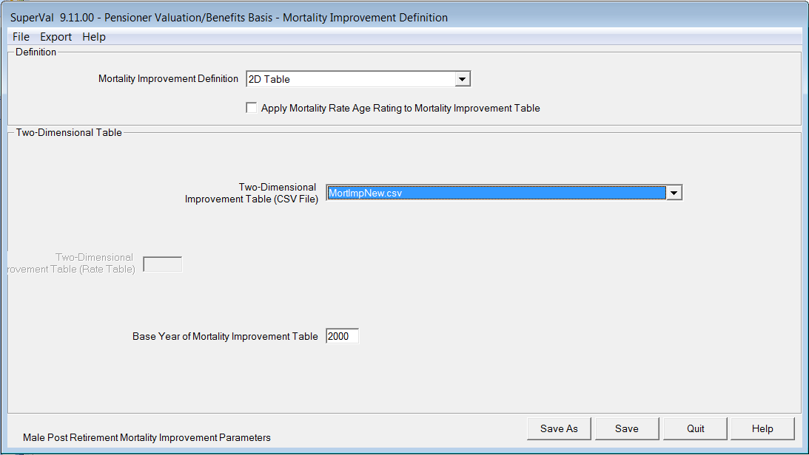

To use this method a CSV file is required for reduction factors that
vary by age and year. This file is stored in the System folder of where
the program files are kept (typically a network drive). A sample file is
provided with Version 8.30 called `MortImpNew.csv`.

#### Creating your own CSV file

This can be created in Excel but make sure you are pointing inside the
data before saving as a CSV file type.

Ages are rows, years are columns.

Cell A1 must start at Age 0.

If the first column of improvements is the year 2000, then the _Base
Year of Mortality Improvement Table_ should be set to 2000. If the first
column is 2007, then the _Base Year of Mortality Improvement Table_
should be 2007, etc.

There must be 120 rows *and* 120 columns

#### Example setup

The following setup is for:

	Males:   PNMA00 BY=19xx LC min 1%  i.e. member-specific birth year, 
	                                   Long Cohort min imp 1% p.a.
	Females: PNFA00 BY=19xx LC min 1%

Start off by adding the Mortality Rate Parameters with the base table,
then add the Mortality Rate Improvements and add these to the basis
file.

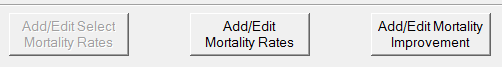

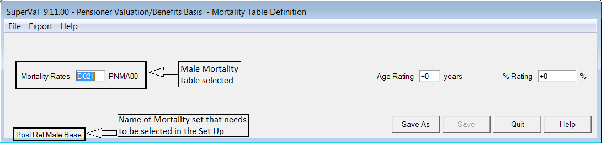

Likewise with the Female Mortality, and then save and move on to set up
definitions for the Mortality improvement tables:

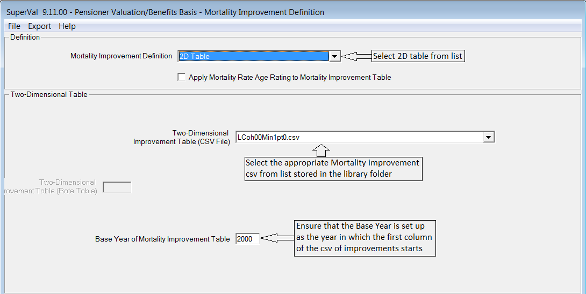

Then the Basis file should choose these two options on the Mortality
tab:

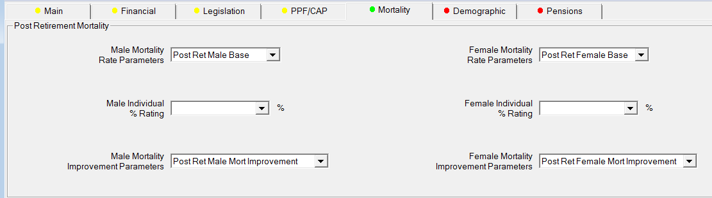

## Adjusting the age rating of improvement factors

If an age rating is being applied to the (base) mortality table, then
the same age rating can be applied to the improvement factors.

This is done by checking the box for the following field within the
Mortality Improvement set:

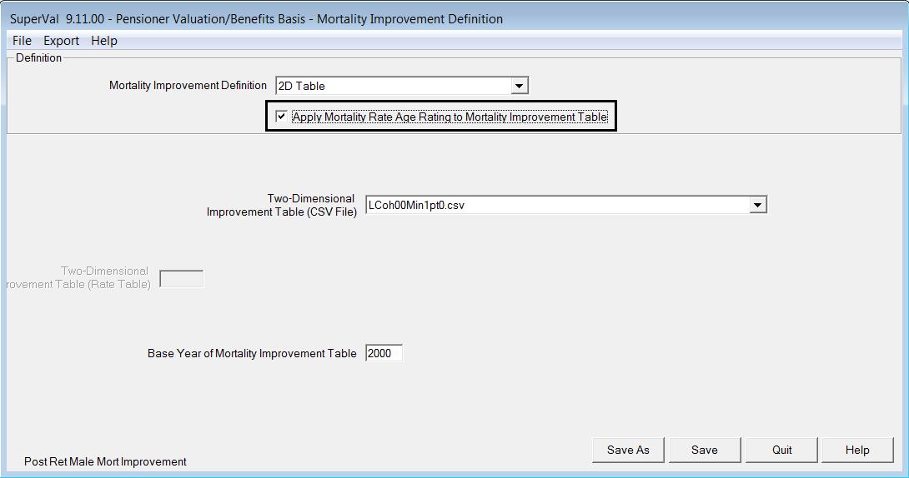

Example:

	A member’s age is 60 nearest at valuation date
	Valuation year is 2007
	+2 year age rating is being applied to the base mortality table

If the box is left unchecked, then the age that SuperVal will use at
valuation date for improvement factors will be 60.

If the box is checked, then the age that SuperVal will use at valuation
date for improvement factors will be 62.

This is shown in the illustration below:

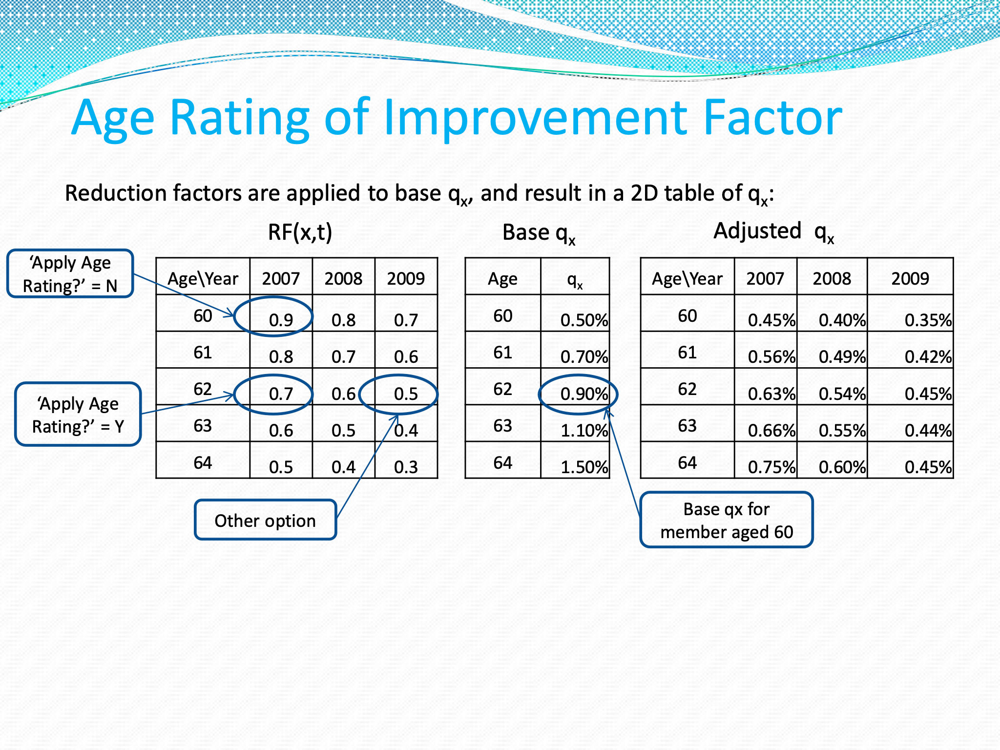

This illustration also shows that SuperVal does not adjust $t$.
If you do want to allow for the age rating to affect $t$ (shown above as
_other option_) , then you’ll need to import your own adjusted $RF(x,t)$
tables.

## Appendix

Sample setups for formula-derived 2D tables

**Note** All set-ups are taken from the Enhanced Deferreds Module.

### Calendar Year

_92-series base tables and CMI R17 &alpha;s & &beta;s only_

		Males:   PMA92 (CY=2007)
		Females: PFA92 (CY=2007)

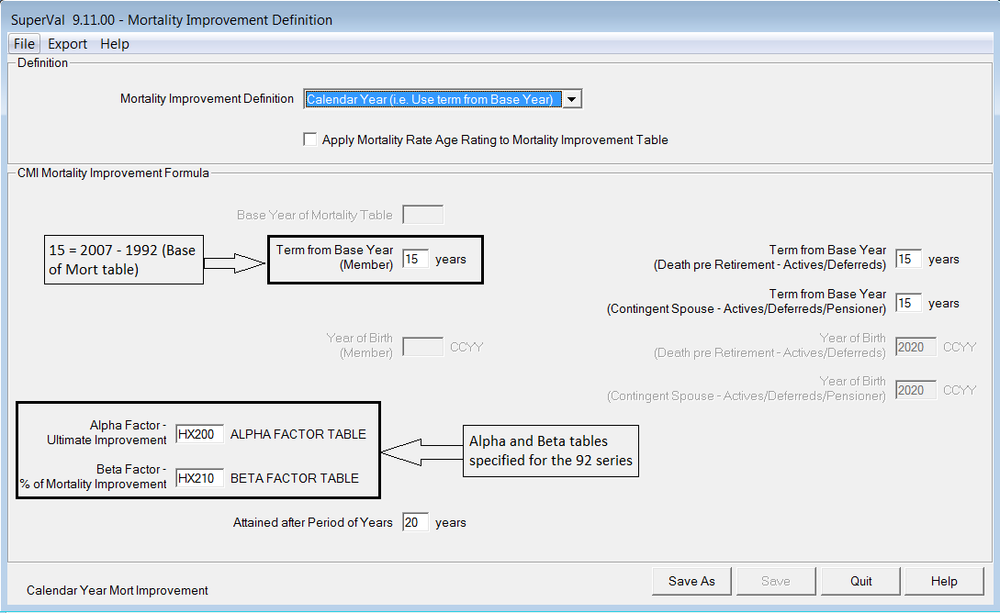

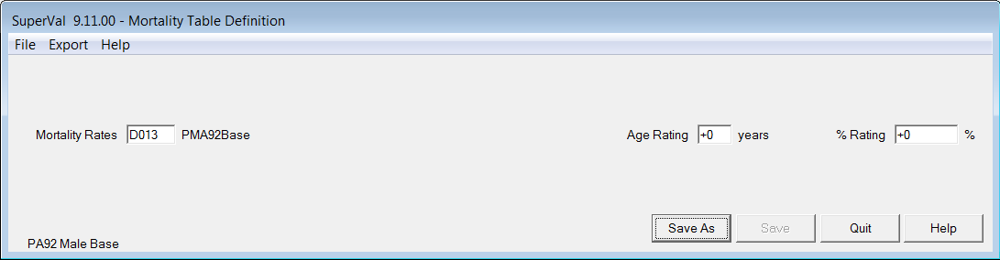

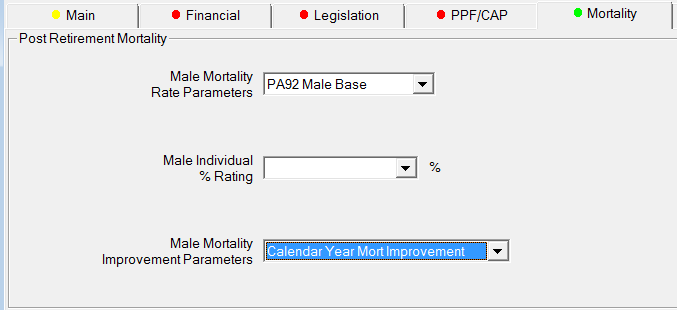

### Specified year of birth 

_92-series base tables and CMI R17 &alpha;s & &beta;s only_

	Males:   PMA92 (BY=1945)
	Females: PFA92 (BY=1945)

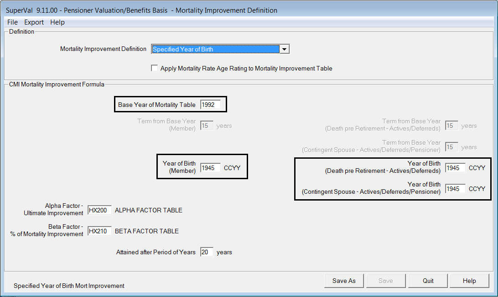

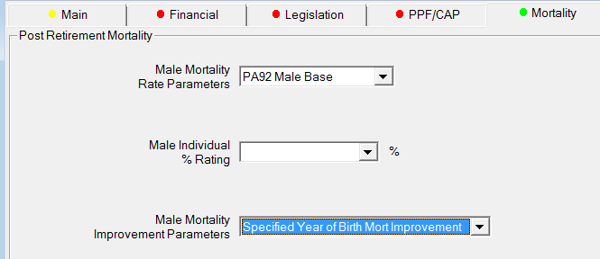

### Accurate (member-specific) birth year 

_92-series base tables and CMI R17 &alpha;s & &beta;s only_

	Males:   PMA92 (BY=19xx)   i.e. member-specific
	Females: PFA92 (BY=19xx)

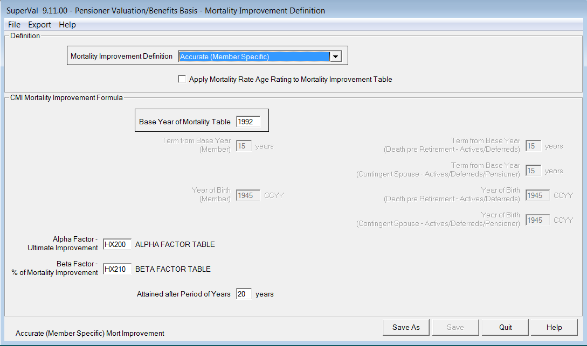

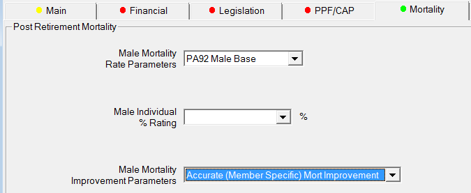
