# Non-PPF capped valuations

_Capped non-PPF runs for the Active, Deferred and Pensioner modules_

In some circumstances, you may want to apply the Compensation Cap to a
non-PPF run. This note sets out what fields are used and which ones
are ignored when this option is selected.

It also covers the outputs available.

!!! info "Version"

    This document is based on Version 9.25 of SuperVal. Any screenshots from earlier versions are not materially different from those in V9.25.

## Introduction

SuperVal can run a non-PPF capped valuation i.e. a
valuation where the Pension Protection Fund (PPF) compensation cap is
applied to the benefits, but all other aspects of the Pension Protection
Fund valuation methodology are ignored. This can be undertaken on all
funding methods ie AAN, PUC and DAB for Actives and for the Deferred and
Pensioner runs.

When applied, the Compensation Cap will be used in the calculation of
the Accrued Liabilities results pages.

## Application of compensation cap

The Compensation Cap test applied under a non-PPF capped run is
different to that which SuperVal will apply in the PPF valuation run.

:fontawesome-solid-hand-point-right:
[“PPF S179 (Levy) Valuations”](../ppf-s179/index.md)
for how SuperVal carries out PPF Valuations.

A summary of how the compensation cap is applied:

-   Only the Accrued Benefits (i.e. benefit if left at Valuation Date) are
    compared.

-   The Compensation Cap and Age Factors set up in the PPF parameters
    relevant to the Valuation Date are applied.

-   For Pensioners, the capping method used in the PPF valuations is the
    same as Non PPF Capped runs. For example, if any pensions have a
    ceasing age less than 120, they are not compared to the compensation
    cap. This is in line with guidance from the PPF as members may have
    temporary bridging pensions which are not subject to comparison to
    the compensation cap. Please look through the PPF Infocus document
    regarding capping for more information on how the Pensioner module
    applies the compensation cap to benefits.

-   Retirement cash-on-top will be added to the Accrued Benefit. Cash will
    be converted to pension using the Cash Factors specified in the PPF
    parameters.

-   In the Pensioner module, any benefits valued as cash will not be
    compared to the compensation cap. If a member is below the Capped
    Retirement Age they will receive 90% of their cash benefits
    otherwise they will receive 100% of their cash

-   There is a _Cap Increases before/after discontinuance_ field on the
    _Scheme PPF_ screen for both Actives and Deferreds modules. This
    allows control over how the Compensation Cap will increase in
    deferment. Any rate of increase set here will be applied in addition
    to the rate of increase set for the benefits in deferment in the
    valuation basis.

-   There is a _Discontinuance Pension Increases_ field on the _PPF/Cap_
    tab for all modules to allow control over how Pre and Post 97
    benefits increase in payment.

-   In the Actives module, the _Offset Slice_ parameter will determine
    which pension is Pre 97 and which is Post 97. For Deferreds and
    Pensioners, each PUP and Pension definition respectively includes a
    Pre 97/97 to 09/Post 09 Indicator listed as the _PPF Service Period_.

-   For Deferreds and Pensioners, the _PPF Service Periods_ indicated on
    the PUPs tab and Pensions tab respectively determine which pension
    increase is applied to the benefits. Benefits assigned to _Pre97_
    PPF Service Period get _Pre97_ Discontinuance Pension Increases in
    payment, while those benefits assigned to _97 to 09_ or _Post09_ PPF
    Service Periods get _Post97_ Discontinuance Pension Increases in
    payment.

-   Note that no other PPF assumptions or parameters will apply. In
    particular, NRAs specified on the Retirement tab (for Actives), the
    Membership tab (for Deferreds) and the Capped Retirement Ages on the
    PPF/Cap tab (for Pensioners) are applied. The PPF NRAs specified on
    the PPF/Cap tab are ignored for Actives and Deferreds.

-   The Pre 97 pension will be compared to the GMP at Valuation Date and
    increased if appropriate. Thereafter, GMP will be treated as zero.
    See also the note on GMPs in the Actives and Deferreds section later
    in this document.

-   PPF Slice Loading Adjustment factors for Actives will be ignored.

-   The `Main` and `Special` Deferred adjustment factors on the Financial
    tab are applied. The Deferred Adjustment Factors specified for
    `PenInc3` and `PenInc4` respectively are ignored

-   Underpins will be ignored.

-   Death-in-Deferment spouse’s pension (where % member’s pension type
    only) will be tested assuming the Compensation Cap Age Factor at NRA
    applies throughout the whole period of deferment. \[The PPF
    Valuation looks at the Compensation Cap Age Factors at each age (at
    death) in deferment.\]

The benefits for members under Scheme NRA are compared with the
Compensation Cap (x Age Factor as appropriate) and the result is then
multiplied by 90%. Any restriction is applied (uniformly), and then the
restricted benefit is valued starting at the Valuation Date.

Benefits for members aged nearest Scheme NRA and over at the Valuation
Date are not compared to the compensation cap and do not get adjusted by
90%.

## Setting up basis files for non-PPF capped runs 

### Global parameters

First activate the relevance rules for non-PPF capped
runs which basically provide a guided approach so it is obvious 
what needs to be filled in.

This can be enabled through the _Defaults_ section on the Scheme
Details accessed through _File \> Properties_:

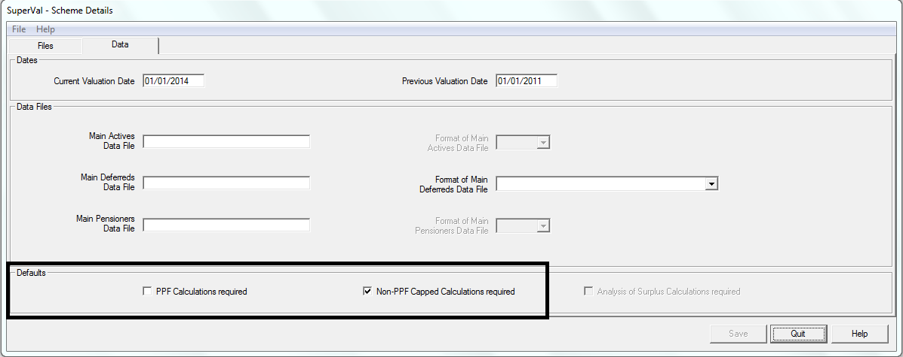

The home screen is a quick way to check which one of these check boxes
is used.

Also take a look at the scheme-level PPF assumptions, as
this also has fields which need to be updated for non-PPF Capped runs.

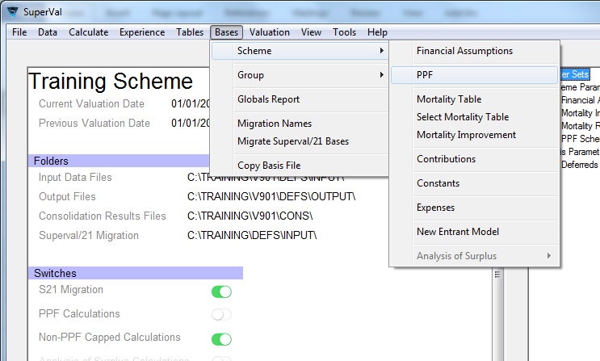

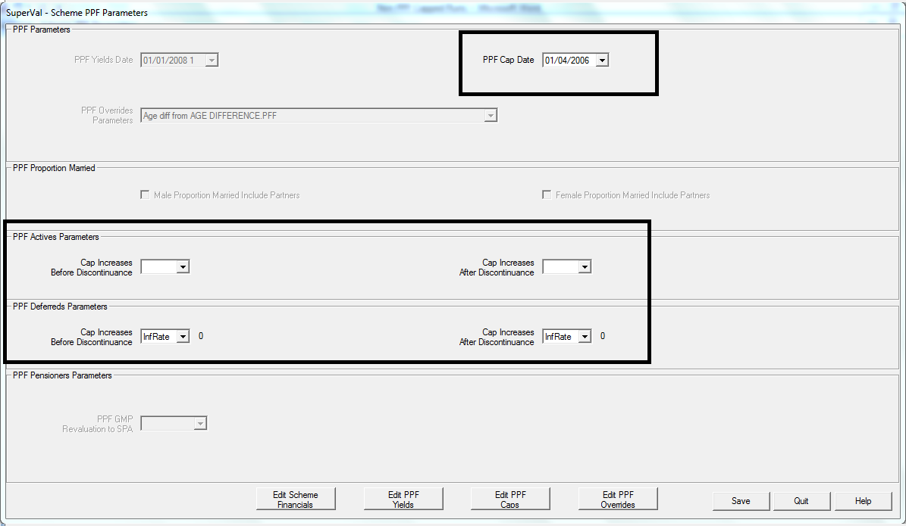

The PPF Cap Date will be used to get the applicable compensation cap and
the Cap Increases Before and After Discontinuance are needed here as
well.

## Actives

### Financial and demographic assumptions

The Financial and Demographic Assumptions will be applied as specified
in the valuation basis i.e. interest rate, deferred revaluation rate, and
mortality. Only the deferred adjustment loading factors for Main and
Special increases. The deferred adjustment factors for PenInc3 and
PenInc 4 increases are ignored.

The Pension Escalation rates specified on the _Financial_ tab and on the
slices tabs are ignored. SuperVal will increase the benefits in line
with the _Pre97/Post97 Discontinuance Pension Increases_ fields
specified on the _PPF / Cap_ tab.

### PPF / CAP tab

The fields which SuperVal refers to are highlighted below:

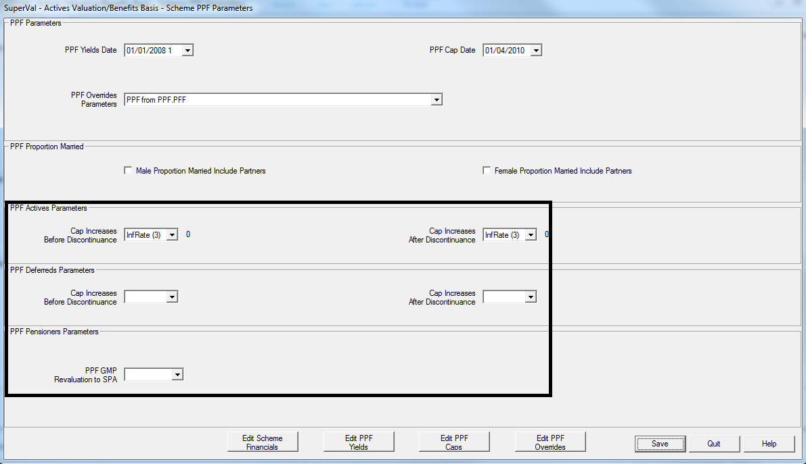

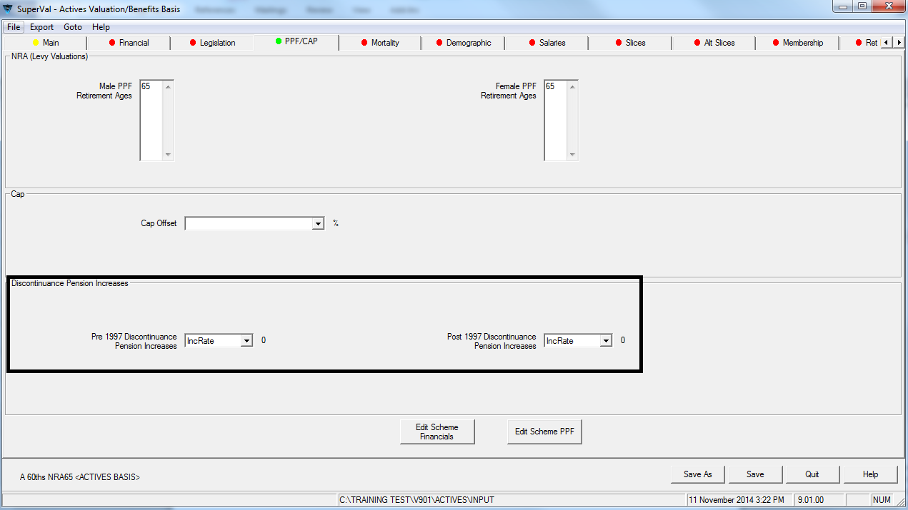

PPF Cap Date 

: will be used to determine the cap at VDATE, based on the Normal Retirement Age specified on the _Retirement_ tab.

Cap Increases

: fields are used when projecting the Compensation Cap. Note that the rates entered in these fields are **relative** to the net interest rate used to value deferred benefits.

    Therefore:

    -   Enter 0 for the Cap to be increased in line with deferred benefits
    -   Enter the appropriate rate to reflect whether the Cap should increase
        at a faster rate than deferred benefits (and enter the rate required
        relative to the net rate in deferment). The rate should be entered as
        a percentage i.e. for 3% enter 3 and not 0.03.

    _Discontinuance Pension Increases_ fields will be applied to pre- and post-97 benefits as applicable.

### Pre 97 and Post 97 benefits for PPF

For Active members, SuperVal will use the _Offset Slices_ field on the
Financial tab to determine which benefits are pre 6/4/1997 and which are
post 5/4/1997.

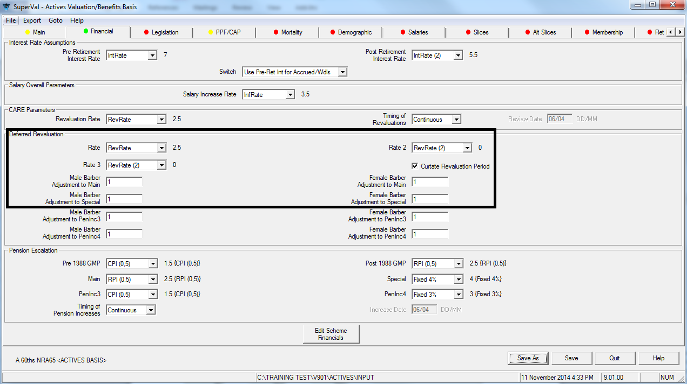

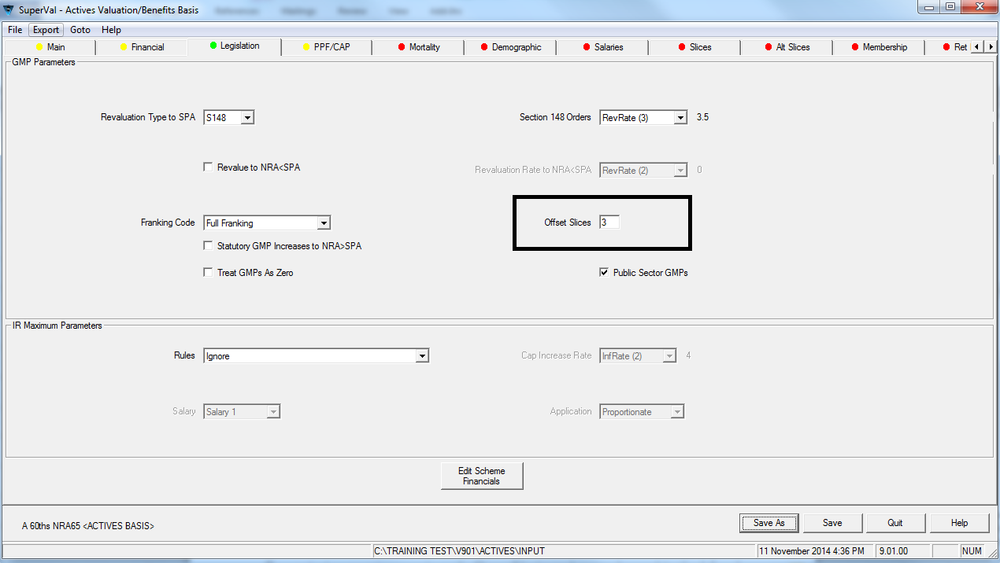

Above, the number of offset slices is 3.
Therefore Superval will assume all benefits arising from slices 3
upwards are Pre 97, and benefits arising from Slices 2 downwards are
Post 97, irrespective of the PPF Service Periods indicated on the
Slices tab.

!!! warning "The pension-increase rate parameter on the Slices will be ignored – even when applying the deferred revaluation adjustments."

When applying the deferred revaluation adjustments, Pre 97 pension
will be adjusted using the _Adj to Special_ parameters. Post 97
pension will be adjusted using the _Adj to Main_ parameter. Both as
specified on the Financial tab.

### GMPs

SuperVal will compare the Pre 97 pension with the GMP at the Valuation
Date. If GMP is larger this will replace the Pre 97 pension (and will
be valued as Pre 97 pension). GMP is ignored altogether if this is
less than the Pre 97 pension.

### Cash on Top

Where the scheme provides a retirement cash benefit on top of pension
then this will be valued in the non-PPF Capped run unless it is of the
following type.

    2 - 25% Pension
    3 - IR Max Cash
    8 - % of pension

If any of these three options is selected then the cash-on-top benefit will
be ignored (as for PPF Valuations).

### Death-in-Deferment benefits

SuperVal only carries out a Cap test on the spouse’s pension where this
is defined as a % member’s pension i.e. Options type _only_. Death in
Deferment Lump Sum will not be included in the test by SuperVal but will
be valued and multiplied by 90% before being added to the liabilities.

The Cap test that is carried out by SuperVal for Death in Deferment
spouse’s pension for accrued-benefit liabilities for non-PPF valuation
runs is as follows:

The **member’s pension at death** is compared with **Compensation Cap at NRA** *(i.e. allowing for increases in excess of
inflation if applicable)* × **NRA Age Factor** *(table specified on the PPF/Cap tab of the PPF
Set)*.

The result is then multiplied by 90%.

In contrast, a PPF valuation will apply age factors at each age in
deferment.

If there is a Cash-On-Top benefit that results in a restriction being
applied to the member’s pension this will in turn result in a lower
spouse’s pension both for death after **and** death before retirement.

## Deferreds

:fontawesome-solid-hand-point-right:
[“PPF S179 (Levy) Valuations”](../ppf-s179/index.md)
for information about setting the PPF parameters. 

The PPF Compensation Cap can be applied to the accrued-benefit
liabilities for Enhanced Deferred Ongoing run as follows:

The Scheme level PPF assumptions with the PPF Cap Date and the Cap
increase Before and After Discontinuance are done exactly as above if
the Deferred input files are in a separate folder to the Active Input
files.

### Financial and demographic assumptions

The financial and demographic assumptions applied will be as specified
in the valuation basis with the exception of pension increase rates (for
Pre97 and Post 97 benefits as shown below).

### PPF / CAP

The _PPF/CAP_ tab for Deferreds is identical to the one for Actives:

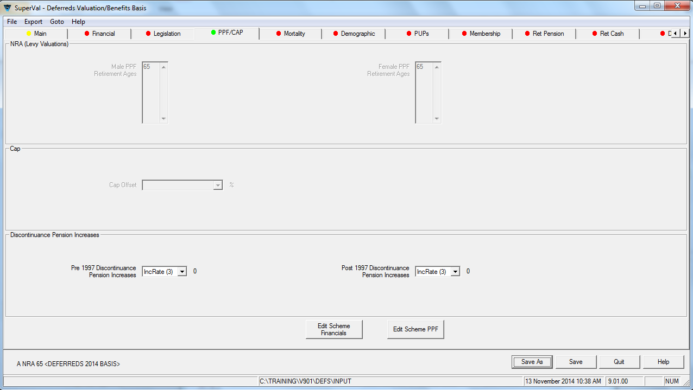

The rate should be entered as a percentage i.e. for 3% enter 3 and not
0.03.

_Discontinuance Pension Increases_ fields will be applied to pre- and
post-97 benefits as applicable.

### Pre 97 and Post 97 benefits for PPF

Benefits are split between pre- and post-97 based on the _PPF Service
Period_ field on the _PUPs_ tab.

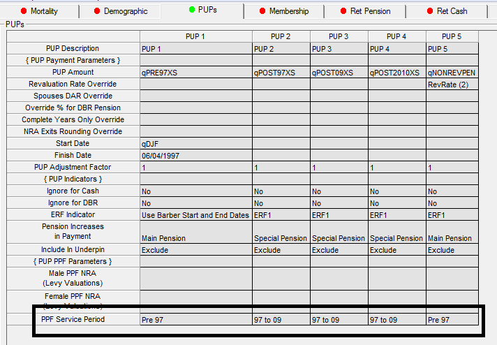

### GMPs

SuperVal will add the GMP to the Special (i.e. Pre 97) benefit and
then ignore any further effects of the GMP.

If _Franking in Deferment_ on the _GMP_ tab however is set to `Yes` then
SuperVal will ignore the GMP completely.

### NSPUPs (Non-standard PUPs)

Any benefits specified on the _NSPUPs_ tab will
**not** be restricted by the Compensation Cap. However, benefits
for members under Scheme NRA are adjusted by 90%.

### Death-in-Deferment benefits

SuperVal will carry out a Cap test on the spouse’s
pension where this is % member’s pension type _only_. 
Death in Deferment Lump Sum will not be included in the test by SuperVal but will
be costed and multiplied by 90% before being added to the liabilities.

The Cap test that is carried out by SuperVal for Death in Deferment
spouse’s pension for accrued benefit liabilities of non-PPF Valuation
runs is as follows:

**Member’s pension at death** compared with **Compensation Cap at NRA** *(i.e. allowing for increases in excess of inflation if applicable)*
× **NRA Age Factor** *(table specified on the PPF/Cap tab of the PPF
Set)*.

The result is then multiplied by 90%.

In contrast, a PPF valuation will apply age factors at each age in
deferment.

If there is a Cash-On-Top benefit that results in a restriction being
applied to the member’s pension this will in turn result in a lower
spouse’s pension both for death after *and* death before retirement.

## Pensioners

### Financial and demographic assumptions

The financial and demographic assumptions applied will be as specified
in the valuation basis with the exception of pension increase rates (for
Pre97 and Post97 benefits as shown below).

### PPF / CAP

The _PPF/CAP_ tab for Pensioners is similar to the one for Actives and
Deferreds except we have set out an allowance for one Capped Retirement
Age. In the Actives and Deferreds, this isn’t necessary as the system
uses the Normal Retirement Age but because the Pensioner module didn’t
have this we placed a retirement age on the _PPF/Cap_ tab to be used when
capping:

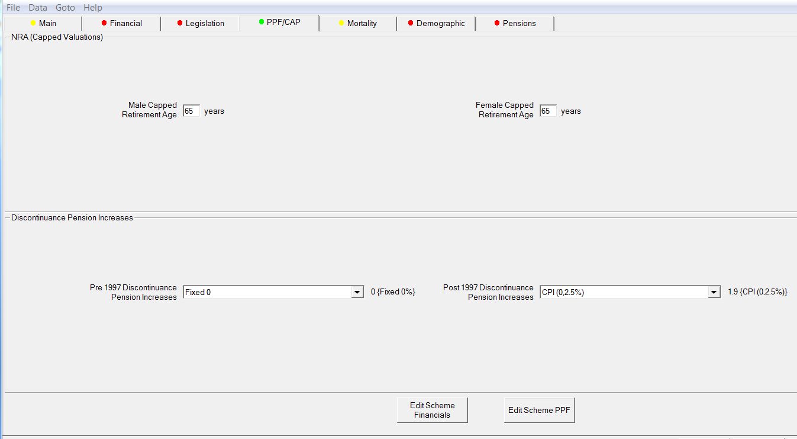

The Capped Retirement Age can range from 0 to 80. If valuing Children or
Dependants who should not be subject to the Cap, please ensure these
members have the `MEMORSP` indicator in the data set to `S` so that the
system reads them as dependants who only require a single life liability
and are excluded from comparison to the cap and are given unreduced
benefits.

If members are below the Capped Retirement Age, their entire benefits
are compared to the PPF compensation cap at their current age. If their
pension is below the cap, then they are entitled to 90% of their
benefits. If their pension is above the cap, then their benefits are
reduced to the cap and they receive 90% of their capped benefits.

Ensure your PPF Compensation Cap factor table covers a range of
ages from 20 to 80 say, so that if there are any members who are much
younger or older than Capped Retirement Age, the system is able to look
up an appropriate cap factor.

_Discontinuance Pension Increases_ fields will be applied to Pre- and
Post-97 benefits as applicable.

### Pre 97 and Post 97 benefits for PPF

The output will show the liabilities for all pension definitions and
highlight any members who have been capped. Benefits are assigned Pre
and Post 97 Discontinuance pension increases based on the _PPF Service
Period_ field on the _Pensions_ tab.

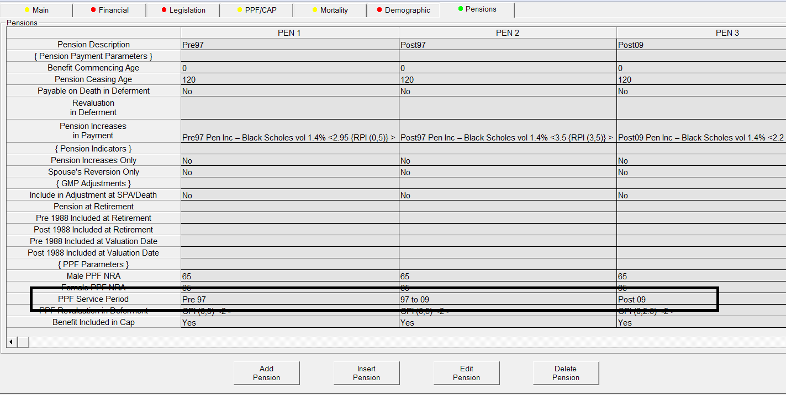

### GMPs

SuperVal will value the GMP as a Pre 97 benefit and apply Pre97
discontinuance pension increases as a result. If members are above SPA
usually their setup has `No` in the _Include Adjustment at
SPA/Death_ section and GMP is then added on top of the excess pension to
create the total pension in payment.

For members below SPA, if _Include Adjustment at SPA/Death_ is set to
`Yes` and the _Legislation_ tab has _Reduce Pensions at SPA_ checked then
the system assumed that the Pre97 pension is a total including GMP and
so does not value GMP0 and GMPE0 to avoid double counting. This is
consistent with the PPF (S179) valuation capping process.

## Setting up a non-PPF capped run

When setting up a batch run for a non-PPF capped run, first select the
type of run required and then check _Cap Accrued Benefits_.

This parameter is available when either a AAN, PUC and DAB funding
method or a deferred or a pensioner valuation is selected.

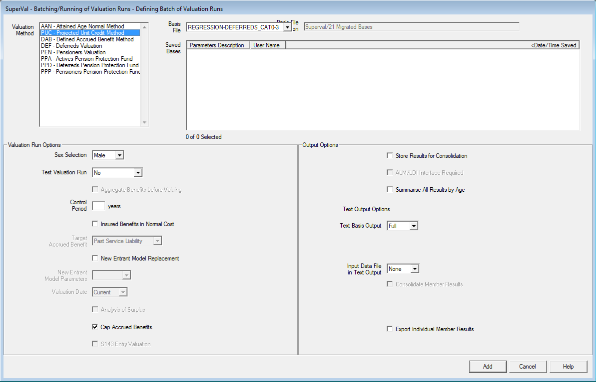

## Output

The Excel results output filename will indicate whether the Compensation
Cap is applied for accrued benefit liabilities by containing the text
`(Capped)` after the description of the funding method/module.

Any members where the accrued benefit liabilities have been affected by
the Compensation Cap will be highlighted as illustrated below:

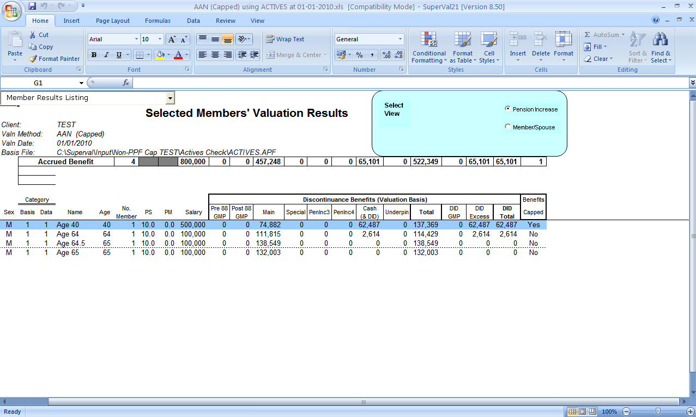

**All** members affected by the compensation cap are included (i.e.
including those who are only affected by the cap on death-in-deferment).

Results can be viewed either by pension-increase type or by beneficiary.
The Actives and Deferreds output show both the ongoing liability as well
as the discontinuance liability.

Pensioner Results show the liabilities for all Pension Definitions and
GMP. In addition to this, they also show both the Ongoing Liability and
the Capped Pension liability including tabulated totals:

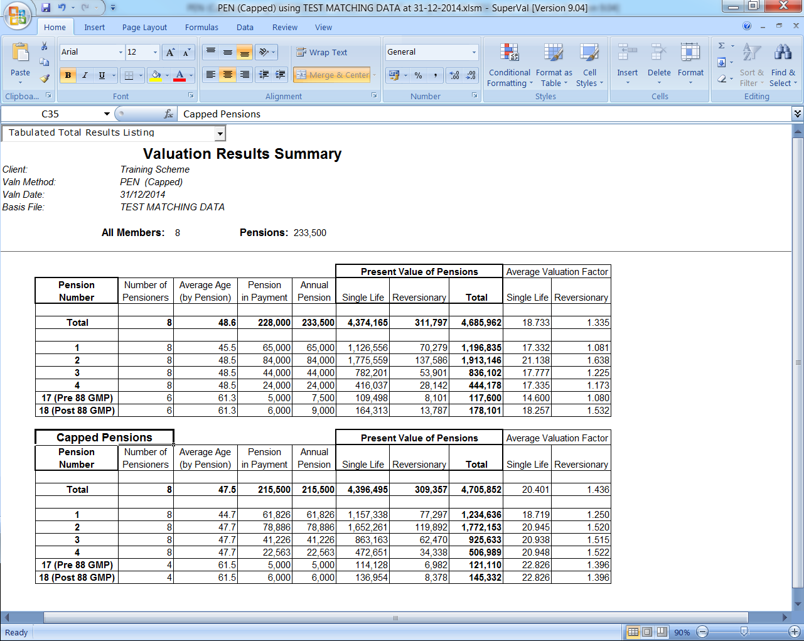

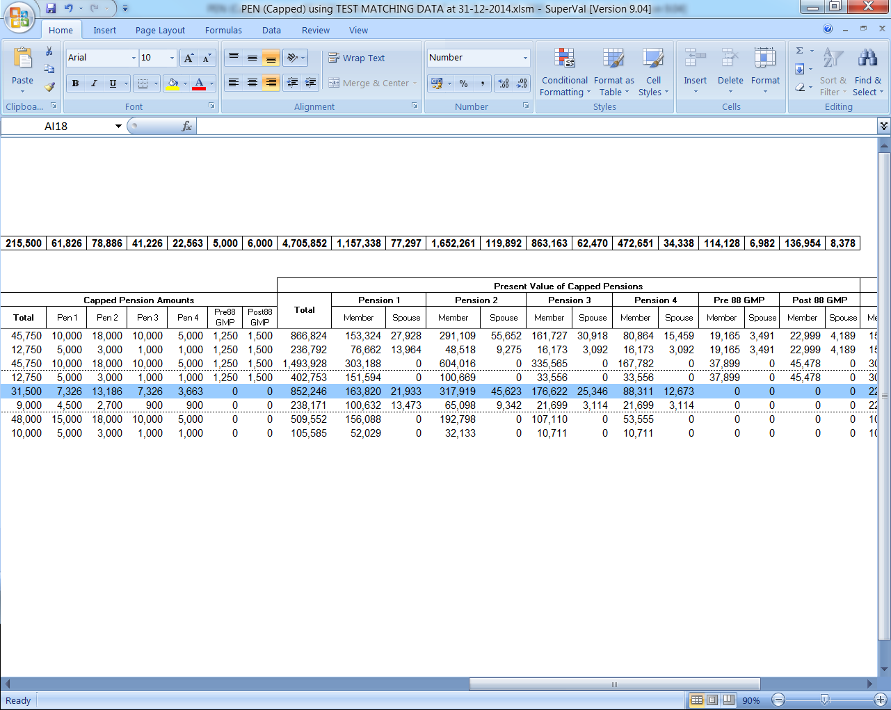
