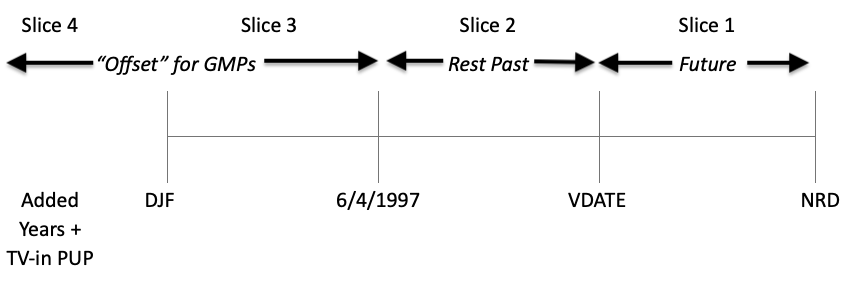
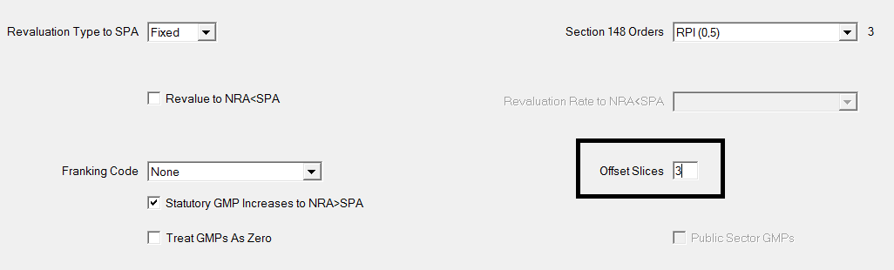
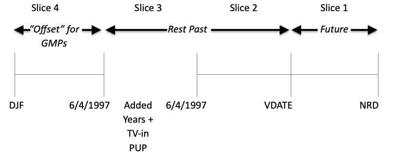
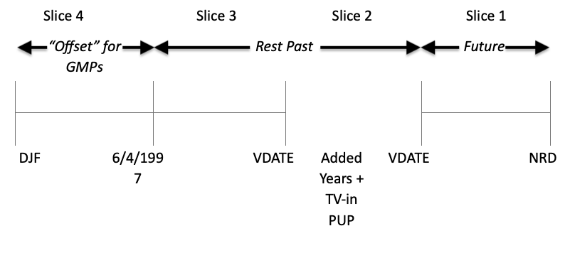

# Offsetting GMPs in pension slices

_How to offset GMPs in pension slices for the Actives module._

For a contracted-out scheme, where active members have accrued GMPs, 
define which pension slices GMPs should be offset against
in SuperVal. Here’s how.

!!! info "Version"

	This article is based on Version 9.25 (V9.25) of SuperVal.
	Any screenshots from earlier versions 
	are not materially different from those in V9.25.

## Setup

Specify the period of time over which the GMP accrual has
taken place. This is done by specifying which benefit slices to offset
the GMP against on the _Legislation_ tab.

### Example 1

Suppose an active member has accrued GMP within a scheme and also has
additional benefits (added years and transfer-in pension), including
TV-in GMP.

A typical benefit slice structure would be as follows:

	Slice 1: Future service
	Slice 2: Post’97 past scheme service
	Slice 3: Pre’97 past scheme service
	Slice 4: Added Years / TV-in pension

To offset GMP for slices 3 & 4, set Offset Slices on the _Legislation_ tab to 3:

So the basic principle is that if the number of Offset Slices specified is
$x$, then SuperVal will offset GMP against benefits which are
specified in slices which are numbered $x$ or greater.

The above Slice structure would be suitable if the additional
benefits **include** underlying GMPs included in the Pre-88 and
Post-88 GMP standard data items.

### Example 2

As per Example 1, but assume the additional benefits are not to be
included for GMP Offset. The slice structure can be specified
differently as follows:

Set the _Offset Slices_ to 4.

An alternative to the above Slice Structure could be:

## PPF valuations

:fontawesome-solid-hand-point-right:
[“PPF S179 (Levy) Valuations”](../ppf-s179/index.md)
