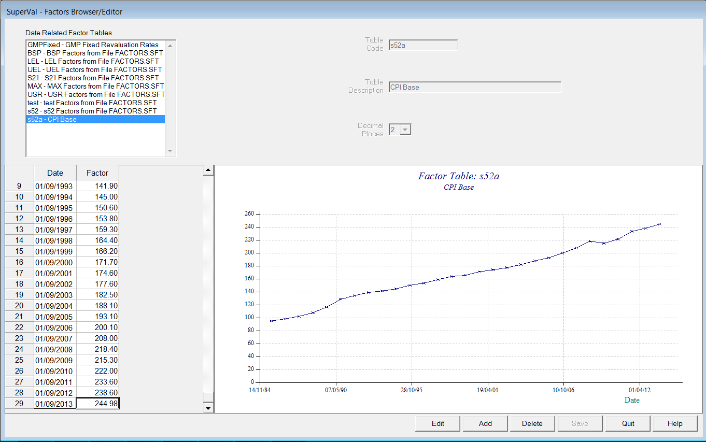

# Specifying pensions at date of leaving

!!! info "This article is based on version 9.25 of SuperVal."

	Any screenshots included from earlier versions of SuperVal are not materially different from those in V9.25.

## Setup

On the _Financial_ tab in the Deferreds module there are inputs for the Pre-Valuation Date revaluation:

### Pre Valuation Date Revaluation

If pensions are to be valued as for previous versions of SuperVal (i.e. by specifying all data items at Valuation Date), then this field needs to be set to `N – No`:

To allow for fixed-rate revaluation of XS pension between DOL and Valuation Date, select option `F – Fixed Rate`.

To allow for revaluation of XS pension between DOL and Valuation Date in line with a specified index (e.g. RPI), select option `I – s52 Index`.

### S52 Index

If you select `s52 Index` for _Pre Valuation Date Revaluation_, you will see a list of factor tables from `SVFACTORS.SF`:

You can then enter the relevant index values.
The table below is based on CPI values for September of each year.
You determine the frequency of index values required.
(In the example below it is yearly, but monthly or even daily values can be specified if necessary.)

### Fixed Rate

If you select `Fixed Rate`, the system automatically shows the two relevant fields of _Pre Valuation Date Rate_ and _Pre Valuation Date Rate Rounding_:

The rounding options are the same as the post-valuation date revaluation options, but notice the two periods Pre Valuation Date and Post Valuation date are calculated independently by the system, so consider the rounding options carefully.

## SuperVal methodology

### Revaluation from Date of Leaving to Date of Valuation

Pre-Valuation revaluation options:

F – Fixed Rate

: SuperVal will just apply the rate as per the rounding convention you have specified, based on the period between DOL and Valuation Date.

I – s52 index

: SuperVal will take the index value as at the Valuation Date (or the nearest preceding date if an index value is not defined for the Valuation Date itself) and divide this by the index value as at the DOL specified (again, it will take the nearest preceding date if an index value is not defined for DOL itself). The result will be multiplied by the relevant pension value at DOL to arrive at the pension value at Valuation Date.

!!! warning "Ensure this table is up to date."

	Or you could easily end up missing out some revaluation for the majority of members.

Note that under this method, any input in the _Pre-Valn Date Rate Rounding_ field will be ignored in the calculation.

### Revaluation from Date of Valuation to Normal Retirement Age

Once SuperVal has revalued the pensions at DOL to Valuation Date, it will then revalue benefits from Valuation Date to NRA as per previous versions of SuperVal.

**Complete years rounding**
If you have complete years rounding, take care you don’t end up missing out a year’s revaluation.
E.g. say period from DOL to VDATE is 9.8 years, and VDATE to NRD is 10.4 years (so total period from DOL to NRD is 20.2 years).
If you specify `YD` for both _NRA Exits Rounding_ and _Pre-Valn Date Rate Rounding_, then SuperVal will apply 9 years revaluation to VDATE, and 10 years after it – and so miss out a year’s revaluation.

!!! warning "The above methodology for revaluing pensions from DOL to NRA is not in line with statutory revaluation requirements: it is just an approximation."

## Revaluation of GMP

### Fixed Rate Revaluation DOL to DOV

SuperVal can now revalue from Date of Leaving to Date of Valuation, but only if the method of revaluation uses the Fixed Rate of Revaluation.

You must check the small box on the _Legislation_ tab:

To use this GMP0 and GMPE0 should contain data as at Date of Leaving.

The Fixed Revaluation Rates and the dates at which they apply are recorded in the `SVfactors.SF` file as the `GMPFixed` table.

### Calculation methodology

The system will calculate revaluation to DOV as:

	      Tax Years from Date of Leaving   to State Pension Date
	less  Tax Years from Date of Valuation to State Pension Date

This differs from how the excess is revalued as the whole deferral period is considered up to SPA, which should ensure the correct number of revaluations are applied.

This approach leaves the current method of revaluing from Date of Valuation unchanged. If users do not wish to use this new functionality, then leave this box unchecked and the existing methodology will be used.
