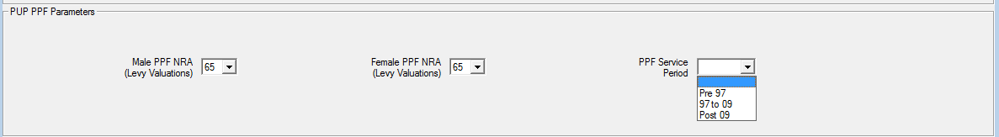

# PPF S143 (Entry) valuations

This article covers the additional functionality available to create a
PPF S143 (Entry) Valuation in SuperVal for the Deferreds Module. It also
discusses how the existing PPF S179 (Levy) Valuation functionality can
be adapted to run a PPF S143 (Entry) Valuation within the Pensioner
Module.

SuperVal runs a PPF S143 (Entry) valuation in
the Deferreds Module only. You can define the relevant PPF
assumptions within SuperVal, which will then override the assumptions
set up for ongoing runs. This will let you use the set-up for
the ongoing runs to carry out PPF runs, without having to recreate new
basis files.

As much of the setup for PPF S143 (Entry) valuation is similar to PPF
S179 (Levy) valuation, the user should consider reading these articles
in conjunction.

:fontawesome-solid-hand-point-right:
[PPF S179 (Levy) valuation](../ppf-s179/index.md)

This article has been updated to reflect the assumptions documented in
version B8 of the PPF’s S143 guidance.

Note that B8 changes are effective from 13&nbsp;June 2018.
To use these new yields for S143 valuations between 13&nbsp;June 2018 and
1&nbsp;November 2018, use the Secondary Key (e.g. a secondary key of S143)
and Adjustment Columns on the PPF yields page.

!!! info "Version"

    This article is based on V9.25 of SuperVal. Any screenshots from
    earlier versions are not materially different.

The following points are relevant for the general setup of SuperVal.

-   There are no special member-data requirements for PPF valuations.
-   When selecting the Scheme Folders, check _PPF Calculations Required_
    on the Data tab to enable the PPF parameters within the basis files.

## Defining PPF assumptions and recording yields

Follow exactly the same setup process as set out in
[PPF S179 (Levy) Valuation](../ppf-s179/index.md)
with the addition of the _S143 Cap Increase %_.
For completeness this is set out below.

Firstly, ensure that the PPF Yields, Caps and Mortality and Spouse's
override parameters are up to date and contain the relevant yields and
cap data for the valuation date.

This can be done by selecting _Tables>PPF_ from the main menu.

Define each of the PPF Yields, PPF Caps and PPF
Overrides. You can create multiple copies of the PPF Overrides but
only one set of Yields or Caps. These will be saved in the `SVPPFFILE.SF`
file in the Library Folder.

Each of these screens is discussed below.

### PPF Yields screen

To add or amend data use the _Add Row(s)_ or _Edit Row_ buttons at the
bottom of the page.

-   SuperVal expects bi-annual yields.
-   These bi-annual yields are converted to annualised yields
-   SuperVal uses the Yield date to establish which relevant assumptions
    guidance should be used and applies the prescribed method to calculate
    the assumptions used in the S179 valuation

#### Additional functionality

The Secondary Key introduces the ability to have two different sets of
yields defined at the same date. Attach a Secondary Key
to a set of yields by typing in a value in the relevant column, e.g. 1,
2, 3. This can be a numeric value or a character string.

When selecting the yields in the _Scheme PPF_ tab, choose
which set of yields to select. E.g. `01/01/2014 1`, `01/01/2014 2`,
etc.

SuperVal also lets you specify an adjustment to each of the
calculated interest rates for PPF valuations. The adjustment made is
additive e.g. if the calculated yield is 3.25% and `0.25` is entered, the
revised yield will be 3.50%.

#### Non-revaluing pensions

SuperVal makes no allowance for the non-revaluing pre-retirement yield
as this only applies if all benefits for all members are non-revaluing.
If you need this functionality, then the revaluing
pre-retirement yield can be manipulated.

### PPF Cap screen

To add or amend data use the _Add Row_ or _Edit Row_ button at the
bottom of the page.

Compensation Cap

: Enter the amount of the Compensation Cap applicable at age 65 as at the Applicable Date. Please note that SuperVal will apply 90% to the results for members below Normal Retirement Age after comparing with the Compensation Cap. Enter the full amount here (e.g. £39,006.18 as at 1&nsp;April 2018 at age 65).

Age Factor

: The Compensation Cap entered is that applicable to benefits payable at age 65. For benefits payable at ages other than 65, the Compensation Cap needs to be multiplied by either a reduction or increase factor for ages below or above age 65 respectively. The PPF have prescribed these factors and they are published on their website. Double-click to select the table that contains the relevant reduction factor table to apply. The table will have been previously entered into the Decrement File.

S143 Cap Increase %

: Enter the rate at which the Compensation Cap will increase in excess of inflation in the future for non-pensioners as set out in the guidance issued by the PPF. This currently is 1.5% (Version H6). Enter the rate of increase in excess of inflation here.

  Pre 1997 and Post 1997 Cash Factor (for retirement Cash on Top benefits only)

: The PPF has prescribed factors for converting Pre 1997 and Post 1997 lump sums into Pensions. The published rates need to be converted into commutation factors to be input into SuperVal. The factors entered will be used to convert any retirement Cash on Top benefit to pension equivalents. This amount plus the member's retirement pension will then be compared with the Compensation Cap and the result will then be multiplied by 90% if below Normal Pensionable Age.

### Override screen

Firstly, select the Parameter File containing the Overrides you wish to
edit. Different Parameter Files can be used to contain different sets of
Overrides. To enter a new set of Overrides use the _Default_ button. This
will open the PPF Overrides Details screens.

For S143 assumptions, we have a tick box so that the mortality for the
different bands can be specified. Specify the relevant mortality and
mortality improvement tables (Pre- and Post-retirement), the proportion
married for spouses and partners and the age difference here. The
assumptions will be chosen from a list of all of those available in the
Decrement File. Next to each table the description of the table is
shown. Use the _% Rating_ field to specify a scalar
adjustment to the table entered. For a 90% adjustment enter `-10`. For all
other valuations the user should ensure this is set to 100% by using an
adjustment of `0`.

## Setting up scheme PPF information

To add Scheme-level information select _Bases>Scheme>PPF_
from the main menu.

Within this screen choose the yields, caps and override
parameters to use in this Scheme Folder.

The Yields and Compensation Cap to be used will be taken from the
information entered in the PPF parameters referenced by the date shown
here. Where two sets of yields are defined for the same date
use the Secondary Key to identify which yields to use.

Select the PPF Override Parameter Set that contains the appropriate
spouse’s and mortality overrides.

Proportion Married

: Use the check box to determine whether to use the assumptions entered in the Overrides for Partner Proportion Married or Spouse’s Proportion Married. Note that the proportion married will apply at the PPF NRA. Allowance for the survivorship of the spouse will be made thereafter.

Cap Increases Before/After Discontinuance (Deferreds)

: These fields are not used for PPF S143 (Entry) valuations.

## PPF Mortality Adjustments - Member’s Age Ratings

SuperVal will automatically take up the relevant mortality table
according to each individual’s total pension size (as set out in
guidance note B6 to B8). Where included, a Cash on Top lump sum will be
converted to pension and included in the comparison. The mortality table
to apply is as follows (and is applied to both the base mortality table
and the mortality improvement table in SuperVal):

<!--  -->

<table id="mort-adj">
<thead>
<tr>
<th colspan="3">Pension Size % of Compensation cap at age 65</th>
<th colspan="2">Mortality Table</th>
</tr>
<tr>
<th>Pre 1 May 2014</th>
<th colspan="2">Post 1 May 2014</th>
<th colspan="2"></th>
</tr>
<tr>
<th>Males/Females</th>
<th>Males</th>
<th>Females</th>
<th>First Life</th>
<th>Contingent Life</th>
</tr>
</thead>
<tbody>
<tr>
<td>&lt;25%</td>
<td>&lt; 10%</td>
<td>&lt; 5%</td>
<td>Heavy</td>
<td>Heavy</td>
</tr>
<tr>
<td>25%–50%</td>
<td>10%–50%</td>
<td>5%–20%</td>
<td>Medium</td>
<td>Medium</td>
</tr>
<tr>
<td>&gt; 50%</td>
<td>&gt; 50%</td>
<td>&gt; 20%</td>
<td>Light</td>
<td>Light</td>
</tr>
</tbody>
</table>

## Setting up Deferred basis files for PPF Runs

For a PPF S143 (Entry) valuation, all non-pensioners will need to be
valued in the Deferreds module in SuperVal. (There is no functionality
to run a PPF S143 (Entry) valuations in the Actives module.)

The set-up for basis files is identical to that used for S179
valuations.

Select a basis file using _Bases>Group>Deferreds_.

### PPF/CAP tab

Select the scheme PPF information by clicking on the _Edit Scheme PPF_
on the PPF/CAP tab.

On this screen the following information can be added:

PPF Male and Female Retirement Ages

: You can specify up to four Normal Retirement Ages for males and females separately. Please note that these will also be used in any PPF Section 179 (Levy) valuation run in the same scheme folders.

Cap Offset %

: If a deferred member, who has not yet reached PPF Normal Retirement Age, is already receiving a retirement pension from this or another scheme, then the Compensation Cap at retirement can be reduced to reflect this. Select the data item containing the percentage of the Compensation Cap already used. SuperVal will then take account of this when determining any restriction in benefits due to the Compensation Cap at future retirement ages.

Pre 97 and Post 97 Discontinuance pension increases

: These fields are not used for PPF S143 (Entry) valuations. They are only used in the non-PPF capped runs however the relevance rules will require the user to enter a relevant parameter for this variable before proceeding.

### PPF inputs on PUPs Tab

PPF NRA (Levy Valuations)

: Select the PPF Normal Retirement Age for each PUP from the list previously defined on the _PPF/CAP_ tab.

PPF Service Period

: Specify whether a particular slice of benefit is in respect of Pre 97, 97 to 09, or Post 09 service and it will be valued accordingly for PPF purposes.

### Other issues

#### GMP calculations

The _Treat GMP as Zero_ checkbox will default to being ticked and all GMP benefits
are ignored when running a PPF S143 (Entry) valuation.

#### Non-standard PUPs and independent PUPs

IndPUPs are included in PPF runs. For members below NRA the benefit will be adjusted by 90%.
Independent PUPs will not be restricted by the Compensation Cap.

NSPUPs remain excluded.

#### Which adjustment factors are applied?

The PUP adjustment factors on the PUPs screen are included. These are
applied *before* the benefit is compared with the Compensation Cap

#### Cash on Top

Where Cash-on-Top benefits are provided all options except for _% of
pension_ are valued. These will be converted to an equivalent pension
amount using the Pre 1997 and Post 1997 Cash Factors entered on the _PPF
Caps_ tab in the PPF Parameters. These will then be added to the Total
Accrued Pension when applying the Compensation Cap.

SuperVal will split the liability for Cash on Top into Pre 97, 97 to
09 and Post 09.

SuperVal will ignore any retirement cash provided through commutation of
pension.

## Setting up Pensioners basis files for PPF runs

There is no specific functionality to run a PPF S143 (Entry) valuation
in the Pensioners module. However, there is no difference in the
treatment of Pensioners between a PPF S143 (Entry) valuation and a PPF
S179 (Levy) valuation except for the mortality assumptions used for the
different bands of pension. As a result, a pensioners PPF S143 (Entry)
valuation can be run through the PPF S179 (Levy) valuation functionality
after setting up new sets of PPF Overrides.

To reflect the different mortality assumptions, depending on
the size of the member’s pension, split the pensioners valuation data
into different categories. The categories within the data
should reflect the age rating that applies to the mortality assumption.

:fontawesome-solid-hand-point-right:
[PPF S179 (Levy) Valuation](../ppf-s179/index.md)
for more on how to set up.

## Expenses

SuperVal does not make any allowance for expenses in the PPF S143
(Entry) Valuations.

## Application of capping and reduction factors

### Retirement benefits

For S143 (Entry) valuations, SuperVal will reduce retirement benefits
using the same methodology as is used for a S179 (Levy) valuations,
except that the Compensation Cap at the relevant Normal Retirement Age
will be increased in line with ‘S143 Cap Increase %’ assumption between
Valuation Date and Normal Retirement Age. The following examples provide
more details.

!!! example "Example 1"

Member has just one NRA for all benefits and has not yet
reached this.

    Valuation Date                                 01/01/2013
    Member’s Age at Valuation Date                 60
    Deferred Pension revalued to Valuation Date    £20,000 pa
    Normal Retirement Age for all benefits         65
    Compensation Cap at age 65 at Valuation Date   £34,050 pa
                                                   (Cap at 1 April 2012)

Projected Compensation Cap at age 65

: = 34,050 × 1.015^5^ = £36,682

Projected Benefit at age 65 is

    = 90% × min[£20,000, £36,682]
    = £18,000 p.a.

The member won’t be subject to the Compensation Cap at retirement and
only the 90% reduction factor applied.

Strictly speaking, when calculating the projected Compensation Cap
in relation to any Post-09 benefits, an adjustment should be made based
on the geometric difference between the assumed yields in deferment for
Pre-09 and Post-09 benefits. Version 9.25 of SuperVal does not currently
make this adjustment.

!!! example "Example 2"

Member has just one NRA for all benefits and he has not yet
reached this.

The member’s revalued pension at Valuation Date is above the
Compensation Cap.

    Valuation Date                                 01/01/2013
    Member’s Age at Valuation Date                 60
    Deferred Pension revalued to Valuation Date    £40,000 pa
    Normal Retirement Age for all benefits         65
    Compensation Cap at age 65 at Valuation Date   £34,050 pa
                                                   (Cap at 1 April 2012)

Projected Compensation Cap at age 65

: = 34,050 × 1.015^5^ = £36,682

Projected Benefit at age 65 is

    = 90% × min[£40,000, £36,682]
    = £33,014 pa

The member’s benefits will be subject to the Compensation Cap at
retirement.

!!! example "Example 3"

Member has benefits payable from two different NRAs and he
has not yet reached either.

    Valuation Date                                01/01/2013
    Member’s Age at Valuation Date                55
    Deferred Pension revalued to Valuation Date   £10,000 pa – Pen1
                                                  £15,000 pa – Pen2
    Normal Retirement Age for all benefits        60 – NRA 1
    65 – NRA 2
    Compensation Cap at age 60 at Valuation Date  £29,867 pa
    Compensation Cap at age 65 at Valuation Date  £34,050 pa
                                                  (Cap at 1 April 2012)

The Projected Compensation Cap at age 60

: = 29,867 × 1.015^5^ = £32,175

The Projected Compensation Cap at age 65

: = 34,050 × 1.015^10^ = £39,516

Projected NRA 1 Benefit at age 60

    = 90% × min[10,000, 32,175]
    = £9,000 p.a.

Comp Cap % used at NRA 1

    = 10,000 ÷ 32,175
    = 31.08%

As this is less than 100% the member’s benefit is not capped at age 60.

Projected NRA 2 benefit at age 65

    = 90% × min[15,000, 39,516]
    = £13,500 pa

Comp Cap % used at NRA 2

    = 31.08% + 15,000 ÷ 39,516
    = 69.04%

As this is still less than 100%, the member’s benefit is not capped at
age 65.

The NRA 1 benefit continues to be paid from age 65. (It may have had
increases in payment between 60 and 65). In addition, NPA 2 benefit of
£13,500 is payable from age 65.

!!! example "Example 4" 

Member has benefits payable from two different NRAs and he
has not yet reached either.

    Valuation Date                                 01/01/2013
    Member’s Age at Valuation Date                 55
    Deferred Pension revalued to Valuation Date    £50,000 pa – Pen1
                                                   £15,000 pa – Pen2
    Normal Retirement Age for all benefits         60 – NRA 1
                                                   65 – NRA 2
    Compensation Cap at age 60 at Valuation Date   £29,867 pa
    Compensation Cap at age 65 at Valuation Date   £34,050 pa
                                                   (Cap at 1 April 2012)

The Projected Compensation Cap at age 60

: = 29,867 × 1.015^5^ = £32,175

Projected Benefit at age 60

    = 90% × min[50,000, 32,175]
    = £28,958 pa

In this case SuperVal will only value the Capped NRA 60 benefits and not
value any of the NRA 65 benefits (post-retirement).

Strictly speaking, if there is a split of pre/post 97 pension (either in
relation to the NPA60, NPA65 or both NPAs), there should be a
reallocation of pension at 65.
(See PPF document _Additional information
for carrying out a Section 143 valuation_.)
SuperVal currently does not
carry out this reallocation of benefits, (and hence the proportion of
Pre/Post 97 pension may need to be adjusted outside of SuperVal to amend
benefits from the higher NPA).

!!! example "Example 5"

Member has benefits payable from two different NRAs and he
has not yet reached either.

    Valuation Date                                 01/01/2013
    Member’s Age at Valuation Date                 55
    Deferred Pension revalued to Valuation Date    £25,000 pa – Pen1
                                                   £25,000 pa – Pen2
    Normal Retirement Age for all benefits         60 – NRA 1
                                                   65 – NRA 2
    Compensation Cap at age 60 at Valuation Date   £29,867 pa
    Compensation Cap at age 65 at Valuation Date   £34,050 pa
                                                   (Cap at 1 April 2012)

The Projected Compensation Cap at age 60

: = 29,867 × 1.015^5^ = £32,175

The Projected Compensation Cap at age 65

: = 34,050 × 1.015^10^ = £39,516

Projected NRA 1 Benefit at age 60

    = 90% × min[25,000, 32,175]
    = £22,500 pa

Comp Cap % used at NRA 1

    = 25,000 ÷ 32,175
    = 77.70%

As this is less than 100%, the member’s benefit is not Capped at age 60.

A pension of £22,500 will be paid between ages 60 and 65 (with any
relevant increases due).

Projected NRA 2 benefit at age 65

    = 90% x min[25,000, 39,516]
    = £22,500 pa

Comp Cap % used at NRA 2

    = 77.70% + 25,000 ÷ 39,516
    = 140.97%

As this is greater than 100%, the member’s benefits will be capped at
age 65 and a reduction factor will be applied to the benefit. The total
benefits will be reduced by a factor of $\frac{1}{1.4097} = 70.94\%$ from age 65.

SuperVal will reduce both the NRA 60 and NRA 65 benefits by a factor
of 0.7094 from age 65 onwards. Strictly speaking, if there is a split of
Pre/Post 97 pension (either in related to the NRA 60, NRA 65 or both
NPAs), there should be a reallocation of pension at 65. (See PPF document
_Additional information for carrying out a Section 143 valuation_.)
SuperVal currently does not carry out this reallocation of benefits (and
hence the proportion of Pre/Post 97 pension may need to be adjusted
outside of SuperVal to amend benefits from the higher NPA).

!!! example "Example 6: Members over NRA at the valuation date"

If a member has any benefits with an NRA lower than their current age,
then SuperVal will value the benefit from their current age ignoring the
90% adjustment.

For example, a member aged 63 has two benefits, one with NRA 60, the other
with NRA 65.

The NRA 60 benefit will be valued from age 63, ignoring the cap and
without adjustment (and no adjustment for late retirement).

The NRA 65 benefit will be valued from age 65, with a 90% adjustment.
Note, when determining whether the benefit will be Capped at age 65, the
NRA 60 benefit is ignored.

### Death-in-deferment Benefits

SuperVal will cap death-in-deferment benefits in exactly the same way as
it does for S179 valuations. Details are set out below.

Death-in-Deferment Lump Sums are ignored i.e. not included in the
liability.

A comparison with the Compensation Cap will only be made for the
spouse’s benefit where this is defined as percentage of the member’s
pension. The percentage override will be set to 50%.

The formula for the Reduction Factor uses the same methodology as for
Retirement benefits but uses the Compensation Cap at VDATE for the
member’s age last adjusted for the relevant Death in Deferment
percentage.

## Running a PPF S143 valuation

When setting up a batch run for a S143 valuation, follow the same
methodology as for a PPF S179 (Levy) valuation i.e. select the Deferred
Pension Protection Fund as the valuation method. Then select the Scheme
Basis Files that you wish to run and whether you wish to include Males
and Females. Then ensure the S143 Entry Valuation check box within the
Batch Parameters tab is ticked.

Click _Add_ to add the Batch run and then select either _Unattended
Run_ or an (attended) _Run_.

## Changes to PPF assumptions

SuperVal V9.25 allows fully for the changes in the financial and
demographic assumptions for PPF S179 (Levy) valuations ie those
specified in guidance notes A4, A5, A6, A7, A8 and A9.

SuperVal assumes all pensions defined are revaluing. As noted
earlier, the yields can be manipulated to allow for non-revaluing
pensions if required. However, for pensioners, you are able to define a
PPF Revaluation in Deferment for each pension defined.

Note the relevant yield data needs to be input at Valuation Date and
SuperVal will use the different formulae to determine the correct
yields.

## Output from PPF S143 runs

### Excel results output

Excel output is available for the deferreds module. The output filename
is:

    Deferreds PPD (S143) using <basis filename> at <vdate>.xls

The results will appear as follows:

Note that the liabilities are also shown separately for death-in
deferment-benefits. Any member who is affected by the Compensation Cap
has a `Yes` in the column _Benefit Capped_.

### Varprint / Accprint

Note that the single-life test files VARPRINT and ACCPRINT are
not available for PPF runs.

### Consolidation

Consolidation is carried out as for other funding methods. Under
Valuation Methods select `PP3 - Pension Protection Fund Entry`.

You can define the name of each consolidation run. Each run will
result in an Excel file and a database file.
