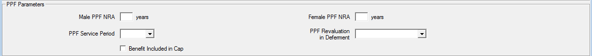

# PPF S179 (Levy) Valuations

SuperVal can run a PPF S179 (Levy) valuation. You can define the relevant PPF assumptions within SuperVal and these
will then override the assumptions set up for ongoing runs. This will
allow you to use the set-up for the ongoing runs to carry out PPF
runs without having to recreate basis files.

The following points are relevant for the general set up of SuperVal.

-   There are no special member-data requirements for PPF valuations.
-   When selecting the Scheme Folders, check _PPF Calculations Required_
    on the _Data_ tab to enable the PPF parameters within the basis files.
-   SuperVal introduces the concept of Scheme PPF Assumptions. Information
    on how to use them is set out below.

!!! info "This article is based on V9.30.01 of SuperVal."

## Defining PPF assumptions and recording yields

Firstly, ensure the PPF Yields, Caps and Mortality and Spouse's
override parameters are up to date and contain the relevant yields and
cap data for the valuation date.

(Select _Tables \> PPF_ from the main menu.)

Define each of the PPF Yields, PPF Caps and PPF Overrides.
You can create multiple copies of the PPF Overrides but only one set of Yields or Caps.
These will be saved in the `SVPPFFILE.SF` in the Library Folder of SuperVal.

Each of these screens is discussed below.

### PPF Yields

To add or amend data use the _Add Row(s)_ or _Edit Row_ button at the
bottom of the page.

SuperVal expects biannual yields, which it converts to annualised yields

SuperVal uses the Yield date to establish which relevant assumptions
guidance should be used, and applies the prescribed method to
calculate the assumptions used in the S179 valuation.

**Additional functionality**

The Secondary Key introduces the ability to have two different sets of
yields defined at the same date.
Attach a Secondary Key to a set of yields by typing in a value in the relevant column, e.g., 1, 2, 3.
This can be a numeric value or a character string.

When selecting the yields in the _Scheme PPF_ tab, choose a set of yields,
e.g., 01/05/2021 1, 01/05/2021 2, etc.

SuperVal V9 also lets you specify an adjustment to each of the
calculated interest rates for PPF valuations.
The adjustment made is additive i.e. if the calculated yield is 3.25% and 0.25 is entered, the revised yield will be 3.50%.

!!! warning "Non-revaluing pensions"

    SuperVal makes no allowance for the non-revaluing pre-retirement yield
    as this applies only if all benefits for all members are non-revaluing.

    If you need this functionality then the revaluing
    pre-retirement yield can be manipulated using the fields discussed
    above.

### PPF Cap screen

To add or amend data use the _Add Row_ or _Edit Row_ button at the
bottom of the page.

Compensation Cap

: Enter the amount of the Compensation Cap as at the Applicable Date at Age 65.

    SuperVal will apply 90% to the results for
    members below Normal Pensionable Age after comparing with the
    Compensation Cap. Enter the full amount here (e.g. £39,006.18 as at 1
    April 2022).

Age Factor

: The Compensation Cap entered is that applicable to benefits payable at age 65.

    For benefits payable at ages other than 65, the Compensation Cap
    needs to be multiplied by either a reduction or increase factor for ages
    below or above age 65 respectively. The PPF have prescribed these
    factors and they are published on their website.

Pre 1997 and Post 1997 Cash Factor

: (for retirement Cash-on-Top benefits only)

    The PPF has prescribed factors for converting Pre 1997 and Post 1997
    lump sums into Pensions. The published rates need to be converted into
    commutation factors to be input into SuperVal.

    The factors entered will
    be used to convert any retirement Cash-on-Top benefit to pension
    equivalents. This amount plus the member’s retirement pension will then
    be compared with the Compensation Cap and the result will then be
    multiplied by 90% if below Normal Pensionable Age.

Cap increases for long serving members

: The system was adapted from V9.11 onwards to allow for the increase in the compensation cap for a PPF Cap date on or after 6 April 2017.

    The system calculates service according to dates specified by the user in
    the basis file on the PPF/Cap tab and applies an uplift of 3% p.a.
    simple for each year over 20 years (subject to a limit of 2 times).

### Override screen

Firstly select the parameter file containing the overrides you wish to
edit. Different parameter files can be used to contain different sets of
overrides. To enter a new set of overrides use the _Default_ button. This
will open the _PPF Overrides Details_ screen.

Specify the relevant mortality and mortality improvement tables (Pre- and
Post-retirement) with any appropriate adjustment, the proportion married
for spouses and partners and the age difference here. The assumptions
will be chosen from a list of all of those available in the Decrement
File. Next to each table the description of the table is shown.

PPF Legislation from 1 May 2021 states to use different contingent
mortality rates. In V9.29 (and versions following), separate Rate Tables
have been added for contingent lives as new fields on the PPF Overrides
page.

Use _% Rating_ to specify a scalar adjustment to the table entered.
For a 90% adjustment enter `10`.
For all other valuations ensure this is set to 100% by using an
adjustment of `0`.

## Setting up scheme PPF information

For all three modules, add scheme-level information by selecting
_Bases \> Scheme \> PPF_ from the main menu.

Within this screen choose the yields, caps and override
parameters to use in this scheme’s Input Folder.

Service Adjusted Cap

: This field has three options:

    Yes

    : Always apply the 3% p.a. simple increase to the cap for any service above 20 years regardless of the date

    No

    : Never apply the 3% p.a. simple increase to the cap

    Post 5/4/2017 Valuation Date

    : Apply the long-service increase to the cap if the valuation is after 5 April 2017

Proportion married

: Use the check box to specify whether the Proportion married includes civil partners or not.

    !!! tip "Click _Edit PPF Overrides_ at the bottom of the page to check what the override assumptions are."

    The proportion married chosen will only apply at the PPF NPA.
    Allowance for the survivorship of the spouse will be made thereafter.

Cap Increases Before/After Discontinuance (Actives and Deferreds)

: These fields are not used for PPF S179 (Levy) valuations, but will be used for Non PPF Capped runts.

PPF GMP Revaluations to SPA (Pensioners)

: This field can also be used to adjust the revaluation of GMP benefits before State Pension Age applied in a PPF S179 (Levy) Valuation where GMP benefits have not yet come into payment for pensioners (e.g. those with pension tranches at different NRAs).

    Since 2008, PPF S179 (Levy)
    Valuations for deferred members are required to assume the benefits are
    increasing in deferment unless the benefits for all deferred members do
    not increase. As this situation is unlikely under UK legislation,
    SuperVal has been set up to assume all pensions are increasing in
    deferment. This field can be used to adjust the net yields used by
    SuperVal in deferment if required. To use, select the relevant parameter
    from those defined in the Global Parameters. If no adjustment is
    required leave this field blank.

## Setting up Active basis files for PPF runs

Select a category from a basis file using _Bases \> Group \> Actives_.

For PPF S179 (Levy) valuation purposes, active members will be assumed
to leave service on the Valuation Date. The Scheme PPF assumptions and
overrides selected above will apply.

The determination of the part of the pension that increases and does not
increase in payment and the treatment of the GMP is discussed below.

### Financial tab

!!! detail "Adjustment factors"

    SuperVal ignores anything to do with Main, Special,
    PenInc3 and PenInc4 for PPF runs, and therefore the adjustment
    factors in the Deferred Revaluation section are made redundant. Loading
    of different parts of the pension for PPF is handled on the Slices as
    discussed below.

### PPF inputs on PPF/CAP tab

At the bottom of the _PPF/CAP_ tab, a button links to the scheme’s
PPF information.

Some additional information in relation to the PPF valuation will be
defined once at category level on the PPF/CAP tab. See below:

Male and Female PPF Retirement Ages

: Specify up to four Normal Retirement Ages for males and females separately.

Service Cap Start Date and Service Cap End Date

: These fields are used to work out the pensionable service in conjunction with the long-service cap increase. The use of these fields depends on the settings in the PPF Scheme Details.

Cap Offset %

: If an active member is already receiving a retirement pension from this or another scheme, then the Compensation Cap at retirement can be reduced to reflect this. Select the data item containing the percentage of the Compensation Cap already used. SuperVal will then take account of this when determining any restriction in benefits due to the Compensation Cap at future retirement ages.

Pre 1997 and Post 1997 Discontinuance Pension Increases

: These fields are not used for PPF S179 (Levy) valuations. They are used only in the non-PPF capped runs, however the Relevance Rules will require the user to enter a relevant parameter for this variable before proceeding.

### PPF inputs on Slices, Alt Slices and Ind Slices tabs

Some additional information is defined on the _Slices_, _Alt Slices_ and _Ind
Slices_ tabs.

PPF NRA (Levy Valuations)

: Select the _PPF Normal Retirement Age_ for each slice from the list previously defined on the _PPF/CAP_ tab.

PPF Service Period

: Specify whether a particular slice of benefit is in respect of `Pre 97`, `97 to 09` or `Post 09` service and it will be valued accordingly for PPF purposes.

PPF Adjustment Factor (field)

: In SuperVal V9, the PPF Adjustment Factor is found on the _Tier_ tab, which sits alongside the _Slice_ tab. Enter the appropriate value. Note that :adjustment factors can be fixed or member-specific.

    

### Issues to watch out for

Active members will be valued as deferred members, so attention needs to
be paid to the specification of benefits on the _Leaving_ tab. (This is
particularly important if there is no withdrawal decrement in the
ongoing basis.)

#### Members who are over Normal Retirement Age

If a member has any benefits that would have been payable from a NRA
prior to their current age, SuperVal will value the benefit from their
current age and ignore the 90% adjustment.

For example, consider a member aged 63 who has 2 benefits.
The first one has a PPF NRA60 and the second a PPF NRA65.
The NRA60 benefit will be valued from age 63,
ignoring the cap and without the 90% adjustment (and no adjustment for
late retirement). The NRA65 benefit will be valued from age 65, with a
90% adjustment. When applying the cap, benefits already in payment are
ignored.

#### GMPs

For active members, SuperVal will ignore the GMP in a PPF S179 (Levy)
valuation.

#### Cash on Top

Where the scheme provides a retirement Cash-on-Top benefit in addition
to pension then all the options will be available in the PPF run except
for `25% Pension`, `IR Max Cash` and `% of pension`. If one of these
options is selected then the PPF S179 (Levy) Valuation will ignore the
Cash on Top benefit.

SuperVal will split the liabilities in relation to cash-on-top between
`Pre 97`, `97 to 09` and `Post 09`.

SuperVal will ignore retirement cash provided through commutation of
pension for PPF Valuation purposes as prescribed by the PPF.

#### Which adjustment factors are applied?

The adjustment factors in the _Deferred Revaluation_ section on the
_Financial_ tab are redundant for PPF runs.

Any PPF adjustment factors specified in the benefit slices are applied
*before* the application of the Compensation Cap.

Any (non-PPF) Pension Adjustment Factors are also included. These are
applied *before* the benefit is compared with the Compensation Cap.

#### Final pensionable salary

If you have included details of Final Pensionable Salary as at Valuation
Date in your data, then be sure to include it under _Initial Final
Average Salary_ in the relevant salary definition. (See screenshot
below.) If you don't define Final Pensionable Salary here, then SuperVal
will estimate one using the _Initial Salary_, the averaging period given
and the salary-escalation rate defined.

#### Ind Slices and Alt Slices

Benefits valued on the _Ind Slices_ and _Alt Slices_ tabs are included in
the PPF S179 (Levy) valuations.

When using _Alt Slices_ tab, if the benefits described bite then these
benefits will be compared to the Compensation Cap. For those below NRA
the 90% adjustment will also be applied.
Select which of the PPF Service Periods should be used.

For Ind Slices, if the member is below NRA then SuperVal will then apply
the 90% adjustment and value the benefit. For members above NRA the 90%
adjustment is not applied. Please note that benefits on the _Ind Slices_
tab will not be restricted by the Compensation Cap.
Select which of the PPF Service Periods should be used.

## Setting up Deferred basis files for PPF runs

Select a basis file using _Bases \> Group \> Deferreds_.

### PPF inputs on the PPF/CAP tab

Select the scheme PPF information by clicking on _Edit Scheme PPF_
on the _PPF/CAP_ tab. The rest of the tab is identical to the _Actives_ tab.

PPF Male and Female Retirement Ages

: You can specify up to four Normal Retirement Ages for males and females separately.

Service Cap Start Date and Service Cap End Date

: These fields are used to work out the pensionable service in conjunction with the long-service cap increase. The use of these fields depends on the settings in the PPF Scheme Details.

Cap Offset %

: If a deferred member is already receiving a retirement pension from this or another scheme, then the Compensation Cap at retirement can be reduced to reflect this.

    Select the data item containing the percentage
    of the Compensation Cap already used. SuperVal will then take account of
    this when determining any restriction in benefits due to the
    Compensation Cap at future retirement ages.

Pre-1997 and Post-1997 Discontinuance Pension Increases

These fields are not used for PPF S179 (Levy) valuations. They are used only
in the non-PPF capped runs; however you must in the Relevance Rules enter a relevant parameter for this variable before proceeding.

### PPF inputs on PUPs tab

PPF Service Period

: Specify whether a particular PUP is in respect of `Pre 97`, `97 to 09`
or `Post-09` service and it will be valued accordingly for PPF purposes.

### PPF inputs on Legislation tab

You can also select a Normal Retirement Age to be attached to the
GMP (which is converted into excess pension) for PPF S179 (Levy)
valuations on the _Legislation_ tab. SuperVal will add GMP to Pre-1997
benefit and value appropriately, depending on the selection for _Franking
in Deferment_.

If _Franking in Deferment_ on the _Legislation_ tab is

checked

: SuperVal will take the greater of the pre-97 pension on the _PUPs_ tabs and the GMP at Date of Valuation and use this value as the pre-1997 benefit ignoring any further effects of GMP.

unchecked

: The GMP is treated as another pre-1997 pension, payable from the age specified on the _Legislation_ tab.

### Other issues to watch for

#### Members who are over Normal Retirement Age

If a member has any benefits that would have been payable from a NRA
prior to their current age, SuperVal will value the benefit from their
current age and ignore the 90% adjustment.

For example, consider a member aged 63 who has 2 benefits.
The first one has a PPF NRA60 and the second a PPF NRA65.
The NRA60 benefit will be valued from age 63, ignoring the cap and without the 90% adjustment (and no adjustment for late retirement).
The NRA65 benefit will be valued from age 65, with a 90% adjustment.
When applying the cap, the NRA 60 benefit is ignored.

#### Non-standard and independent PUPs

SuperVal includes Ind PUPs in PPF runs. For members below NRA the
benefit will be adjusted by 90%. The benefits on these tabs will not be
restricted by the Compensation Cap.

NSPUPs remain excluded.

#### Which adjustment factors are applied?

The PUP adjustment factors on the PUPs screens are included. These are
applied *before* the benefit is compared with the Compensation Cap

GMP adjustment factor is also included and is applied *before* the
benefit is compared with the Compensation Cap.

#### Cash on Top

Any cash-on-top benefit is valued only if it has been set up either as a
`Multiple of Pension` or as a `Cash Data Item`.

## Setting up Pensioner basis files for PPF S179 runs

Select a basis using the _Bases \> Group \> Pensioners_.

Version 8.40 onwards of SuperVal will cap/reduce pensioner benefits as
required when doing a PPF run.

### PPF inputs on the PPF/CAP tab

Select the Scheme PPF information by clicking _Edit Scheme PPF_
on the _PPF/CAP_ tab. Most of this tab is identical to the _Actives_ and
_Deferred_ tabs.

Service Cap Start Date and Service Cap End Date

: These fields are used to work out the pensionable service in conjunction with the long-service cap increase. The use of these fields depends on the settings in the PPF Scheme Details.

NRA (Capped Valuations)

: The capped retirement age is used to determine whether the overall benefits are above or below the cap.

    This has been done to be consistent
    with the Active and Deferred modules which use the Normal Retirement Age
    rather than the PPF NRA’s in capped runs. Anyone aged above the capped
    retirement age will have all the benefits uncapped.

Pre 1997 and Post 1997 Discontinuance Pension Increases

: These fields are not used for PPF S179 (Levy) valuations.

    They are used only in the non-PPF capped runs; however you must in the Relevance Rules enter a relevant parameter for this variable before proceeding.

### PPF inputs on the Legislation tab

Within the pensioner module the link to the Scheme PPF information is
found on the Legislation tab. Other fields on this tab that need to be
considered are documented below.

PPF Normal Retirement Ages

Enter the PPF Normal Retirement Ages that should be used for GMPs to
determine whether benefits should be capped/reduced.

### PPF inputs on the Pensions Tab

There are a number of fields relevant to a PPF S179 (Levy) Valuation on
the _Pensions_ tab for pensioners.

PPF Normal Retirement Ages

: Enter the PPF Normal Retirement Age that applies for each pension.

    SuperVal will use this age to determine whether the 90% adjustment is
    applied to that pension. In addition, when applying the Compensation
    Cap, SuperVal will ignore any pensions where the PPF NRA is before the
    member’s current age.

    You may need to set up extra categories for ill-health retirement
    cases and set the PPF NRA to a suitably low age for these categories.
    This will ensure no capping or benefit reduction applies to any of the
    pension (if required).

PPF Service Period

: Specify whether the pensions included on the _Pensions_ tab are `'`Pre 97`'`,
`'`97 to 09`'` or `'`Post 09`'`.

PPF Revaluation in Deferment

: This field can be used to adjust the revaluation applied in a PPF S179 (Levy) valuation where benefits have not yet come into payment for pensioners (e.g. those with pension tranches at different NRAs).

    Since 2008, PPF S179 (Levy) valuations of deferred pensions are required to
    assume the benefits are increasing in deferment unless the benefits of
    all deferred members do not increase. 

    As this situation is unlikely under UK legislation, 
    SuperVal has been set up to assume all pensions
    are increasing in deferment. This field can be used to adjust the net
    yields used by SuperVal in deferment if required. To use, select the
    relevant parameter from those defined in the Global Parameters. Where no
    adjustment is required, select a Global Parameter set to 0.

Benefits Included in Cap

: SuperVal V9 has been amended to let you select whether or not benefits from a particular tab are included when comparing to the Compensation Cap.

    In previous versions of SuperVal pensions were ignored for capping purposes if

    -   a temporary pension was being valued (benefit ceasing age is not 120); or
    -   _Value Pension Increases Only?_ was set to `Yes`; or
    -   _Value Spouse_s Reversion Only?_ was set to `Yes`.

    Capping for Pensioners under the PPF run is undertaken in two stages.

    Firstly, any benefits which are subject to the Compensation Cap which
    are already in payment are added and compared to the Compensation Cap at
    the members's age last birthday on the Valuation Date. These benefits
    are capped pro-rata. 

    Secondly, any benefits which are subject to the
    Compensation Cap but not yet in payment are compared to the proportion
    of the Compensation Cap not yet used. The Compensation Cap used is that
    for the highest PPF NRA for the member. These benefits are then capped
    pro-rata. 

### Other issues to watch for

#### Application of proportion married in Pensioner module

PPF guidance states that you must use a proportion married consistent
with 90%/80% (males) or 80%/70% (females) at Normal Pension Age for 
pre-31 October 2009 valuations and rates of 85%75% (males) or 75%/65%
(females) for post-30 October 2009 valuations. Hence, for pensioners
SuperVal will adjust the proportion-married percentage by a survival
factor for the spouse from Date Pension Commenced (DPC) to the valuation
date.

SuperVal V9 has been amended to allow for both base mortality and
mortality improvements when determining the probability of survival for
the spouse between the Date Pension Commenced (DPC) data field imported
into SuperVal and the valuation date.

SuperVal will always use the standard data item field Date Pension
Commenced (DPC) when calculating the spouse’s survival probability 
i.e. it will ignore any entry in the _Benefit Commencing Age_ field in the
_Pensions_ tab.

#### GMPs

GMPs are ignored if _Reduce Pensions at SPA_ is checked and treated
as another pre-97 pension if _Reduce Pension at SPA_ is unchecked.

The spouse’s element valued will be 50% of both the pre-1988 and post-1988 
GMP for all members. Revaluation will at the _PPF GMP Revaluation
to SPA_ specified in the scheme PPF parameters.

The GMP PPF Age will be used to determine if the benefit is capped or
not.

## Expenses

SuperVal does not make an **automatic allowance** for expenses in the
PPF S179 (Levy) Valuations in any of the modules.

## Assumptions overridden

The following assumptions are overridden for a PPF run:

| Module            | Parameter                                                      | Action Taken                                                    |
|-------------------|----------------------------------------------------------------|-----------------------------------------------------------------|
| All               | Post Retirement Interest Rates                                 | Ignored                                                         |
| All               | Pension increases in payment                                   | Ignored                                                         |
| All               | Revaluation in deferment                                       | Ignored                                                         |
| All               | Mortality (including scaling factors)                          | Ignored                                                         |
| All               | Proportion Married Data                                        | Ignored                                                         |
| All               | Spouse’s Definition                                            | Set to ‘At Retirement’                                          |
| All               | Early Retirement Tables                                        | Ignored                                                         |
| Actives/Deferreds | Pre Retirement Interest Rate                                   | Ignored                                                         |
| Actives/Deferreds | Pension Guarantee Periods                                      | Set to zero                                                     |
| Actives/Deferreds | First Year Increase                                            | Set to ‘Default’                                                |
| Actives/Deferreds | Spouse’s Death after Retirement/Death in Deferment Proportions | Set to 50%, unless zero in basis                                |
| Actives/Deferreds | Death in Deferment cash benefits                               | Set to zero                                                     |
| Actives/Deferreds | Commutation                                                    | Ignored                                                         |
| Actives/Deferreds | Underpin                                                       | Ignored                                                         |
| Actives           | Deferreds revaluation adjustment factors                       | Ignored                                                         |
| Actives           | Pre retirement decrements other than death                     | Ignored – all actives assumed to withdraw on the valuation date |
| Deferreds         | Pre retirement decrements other than death                     | Ignored                                                         |

## Application of Capping

For PPF S179 (Levy) Valuations, SuperVal will restrict retirement
benefits as follows:

### Actives – Retirement Benefits

Where 

$TAP_V$ 

: is the Total Accrued Pension at VDATE

$CC_V$
: is the Compensation Cap at VDATE for highest NRA

$$Reduction\ Factor = 90\% \times \frac{\min(TAP_V,CC_V)}{TAP_V}$$

This reduction is applied on a pro-rata basis across all benefits from
the Slices and Alt Slices.

SuperVal will take the highest NRA for which the member has service.

If Cash-on-Top benefits are included, they are converted to an
equivalent pension amount and included in the Total Accrued Pension at
VDATE when calculating the reduction factor to apply. The conversion
factors used (which differ for pre- and post-1997 benefits) are those
referenced from the PPF Caps by the date specified in the Scheme PPF
tabs.

The Reduction Factor calculation excludes any benefits from Slices where
the member’s age is greater than the PPF NRA specified.

Benefits set up on the _Ind Slices_ tab are not included in the comparison
with the Compensation Cap. SuperVal will add on 90% (for members below
NRA only) of the benefits after comparison with the Compensation Cap.

### Deferreds – Retirement Benefits

Where 

$TDP_V$

: is the Total Deferred Pension revalued to VDATE

$$Reduction\ Factor = 90\% × \frac{\min(TDP_V, CC_V)}{TDP_V}$$

The Reduction Factor calculation excludes any benefits from PUPs where
the member’s age is greater than the PPF NRA specified.

Benefits on the _IndPUP_ tab are not included in the comparison with the
Compensation Cap. SuperVal will add on 90% (for members below NRA only)
of the benefit after comparison with the Compensation Cap.

Benefits on the _NSPUPs_ tab are ignored.

### Pensioners – Retirement Benefits

SuperVal V9 has been amended to let you select, on each
pension defined, whether it is included or excluded in the
comparison with the Compensation Cap.

If the member is over the PPF NRA specified on a particular PUP then the
benefits will not be capped.

### Actives and Deferreds – Death-in-Deferment benefits

For PPF S179 (Levy) Valuations, SuperVal will restrict both active and
deferred Death-in-Deferment benefits as follows.

Death in Deferment Lump Sums are ignored i.e. not included in the
liability.

A comparison with the Compensation Cap will only be made for the
spouse’s benefit where this is defined as percentage of the member’s
pension. The percentage override will be set to 50%.

The formula for the Reduction Factor uses the same methodology as for
Retirement benefits but uses the Compensation Cap at VDATE for the
member’s age last adjusted for the relevant Death-in-Deferment
percentage.

Note: There may be members for whom the Death in Deferment benefits will
be Capped but for whom the Retirement benefits are not. (This would
occur when benefits at VDATE exceed the PPF Cap based on age at VDATE
but are less than the PPF Cap at PPF NRA.) The output will show these
members as Capped even though benefits at Retirement are not.

Finally, where there is a Cash-on-Top benefit that acts to restrict a
member’s benefits at Retirement, this will result in a lower spouse’s
Death-before-Retirement and Death-after-Retirement benefit.

## Running a PPF S179 valuation

To run a PPF S179 (Levy) valuation, firstly set up a Batch run and
select from either Actives, Deferreds or Pensioners Pension Protection
Fund as the valuation method. Then select the Scheme Basis Files that
you wish to run and whether you wish to include Males and Females.

If running a Deferreds valuation, ensure the _S143 Entry Valuation_
check box is unselected. (This option is not available on the Actives or
Pensioners module.)

Click _Add_ to add the Batch run and then select either an _Unattended
Run_ or an (attended) _Run_.

## Changes to PPF assumptions

SuperVal V9.30.01 allows fully for the changes in the financial and
demographic assumptions for PPF S179 (Levy) valuations ie those
specified in guidance notes A4, A5, A6, A7, A8, A9, A10 and A11.

SuperVal assumes all pensions defined are revaluing. As noted
earlier, the yields can be manipulated to allow for non-revaluing
pensions if required. However, for pensioners, you can define a
PPF Revaluation in Deferment for each pension defined.

To allow for the other changes, the user must define new PPF Sets for
post 1 May 2021 valuations, which include the relevant updated
assumptions.

Note, the relevant yield data must be input at Valuation Date and
SuperVal will use the different formulae to determine the correct
yields.

## Output from PPF S179 runs

### Excel results output

Excel output is available for all three modules. The output filenames
are:

    Actives    | PPA (S179) using <basis filename> at <vdate>.xlsm 
    Deferreds  | PPD (S179) using <basis filename> at <vdate>.xlsm 
    Pensioners | PPP (PPF)  using <basis filename> at <vdate>.xlsm  

The results will appear as follows:

The liabilities are also shown separately for death-in-deferment benefits. 
Any member who is affected by the Compensation Cap has a `Yes` 
in the column _Benefit Capped_.

### Varprint / Accprint

The single-life test files `VARPRINT` and `ACCPRINT` are not available for PPF runs.

### Consolidation

Consolidation is carried out as for other funding methods. Under
Valuation Methods select `PPF - Pension Protection Fund Levy`.

You can define the name of each consolidation run. 
Each run will produce an Excel file and a database file.
