# Pre-SPA pensioners

This article deals with the
valuation of pensioners below State Pension Age within the Pensioners
Module in SuperVal.

It discusses how to set up the SuperVal basis files to allow for the
correct interaction between the excess pension and the Guaranteed
Minimum Pension (GMP) for this group of people. It also provides some
more information on the franking options available.

For pensioners over State Pension Age, SuperVal will value the
Guaranteed Minimum Pension (GMP) in addition to the pensions specified
on the _Pensions_ tab.

!!! info "This article is based on V9.25 of SuperVal."

	Any screenshots from earlier versions are not materially different.

## Does the GMP interact with the excess pension at all?

Firstly, consider whether the GMP pensions interact with the excess
pensions at all.

Take a male pensioner currently aged 60 with a pension of £1,000 pa.
Over the 5 years to 65, this pension increases to £1,200 pa with scheme
increases. At age 65, he is entitled to a GMP of £500 pa.

Depending on the franking option used his benefits at age 65 could vary
between paying all of the GMP (£500) in addition to his £1,200 excess
and offsetting all of the GMP against the excess. So his total benefit
at 65 could be anything between £1,200 pa and £1,700 pa.

(Note the total benefit at 65 could actually be as low as £500 pa, if
for example no excess pension is payable after age 65. This situation
might arise if the member has commuted a large amount of pension and
opted to have the remaining non-GMP benefit spread over the period to
SPA. This document does not deal with such cases. It assumes that the
total benefit at SPA does not fall when the GMP comes into payment.)

The graphs below illustrate the potential scenarios:

**Scenario 1** None of the GMP is offset. Total pension at SPA increases
from £1,200 to £1,700.

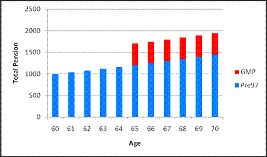

**Scenario 2** Some of the GMP is offset against the excess. Total pension
at SPA increases to £1,500.

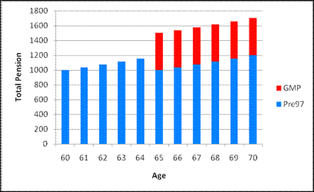

**Scenario 3** GMP is completely offset against the excess. Total pension
at SPA stays at £1,200.

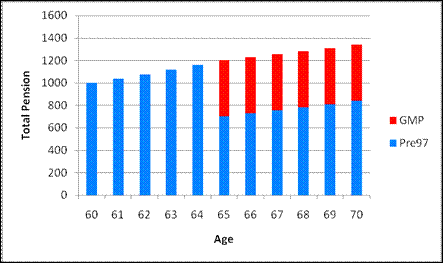

SuperVal can be set-up to value benefits within this range as
appropriate. However, where insufficient information is provided it will
default to the top end of the range ie it will assume the GMP does NOT
interact with the excess at all and so increase the pension at SPA by
the amount of the GMP. (This corresponds to scenario 1 above, where the
benefit at 65 increases by £500 to £1,700.)

## Franking – a quick reminder

If members (of a contracted-out scheme) retire before SPA, the pension
paid may include some notional GMP. Up until SPA, the pension will be
increased in line with Pre-1997 scheme pension increases. However, the
GMP portion should have received GMP revaluations which will have been
different. The pension will therefore, need to be increased at SPA to
allow for the missed revaluations.

This step-up can be given in full ie GMP at SPA – GMP at Retirement.
Alternatively, the GMP revaluations can be offset against the increases
that have been granted to the pension while it was in payment.

The most common approach is ‘Full Franking’, where the pension from the
GMP revaluation is offset against the increases that have been given to
the total Pre-1997 pension. ‘No Franking’ is where the GMP revaluations
are not offset at all (and so the step-up is given in full). ‘Partial
Franking’, is where the GMP revaluations are offset against increases to
the (notional) GMP portion of the pension between retirement and SPA.

Note: The member may have left active service before retiring and not
yet reached SPA. Therefore the GMP included in the pension may not yet
reflect any revaluations from Date of Leaving. SuperVal therefore
requires you to tell it what the GMP was at retirement (and at
Valuation Date if you want to value benefits using Partial Franking).

### Additional data required for Franking calculations 

In order to calculate benefits at SPA correctly, you’ll need some or all
of the following additional data items in your CSV file:

Pre-1997 Pension(s) at Retirement

: This is needed to calculate the increase in the Pre-1997 benefit between NRA and SPA.

Notional GMP at Retirement

: This is needed in order to determine the increase in the GMP between NRA and SPA and hence the step-up in pension at SPA. This is equal to the GMP at Date of Leaving with any *scheme* revaluation applied to GMPs between DOL and Retirement Date (if applicable). (This will be entered on the _Pensions_ tab in the Pre-1988/Post-1988 Included at Retirement.)

Notional GMP at Valuation Date

: This is equal to the Notional GMP at Retirement plus Pre-1997 scheme excess increases to valuation date. (This will be entered on the _Pensions_ tab in the Pre-1988/Post-1988 Included at Valuation Date.) Note, this is _not_ the same
as the standard SuperVal data items of GMP0/GMPE0.^†^

!!! note "SuperVal will always require data for the two items above."

	If this data isn’t given, it will assume the GMP is added on in full at
	SPA, i.e. No Franking. It will only require the Notional GMP at Valuation
	Date when Partial Franking is being applied.

^†^ For pre-SPA members, GMP0 and GMPE0 are the
Pre-1988 and Post-1988 GMPs at DOL increased with *statutory* revaluations
(either Fixed or S148) up to the valuation date – SuperVal takes these
amounts and then applies any remaining statutory revaluation required
between valuation date and SPA (as defined on the _Legislation_ tab).

## Basis-file setup 

### Pensioner basis file

All of the inputs considered in this document are on either the _Pensions_
tab or the _Legislation_ tab. The relevant inputs are in the screenshots
below:

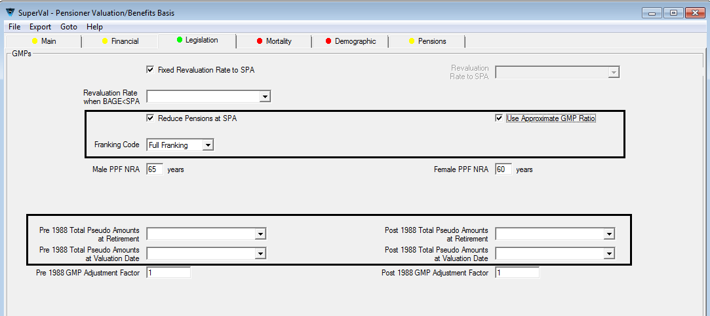

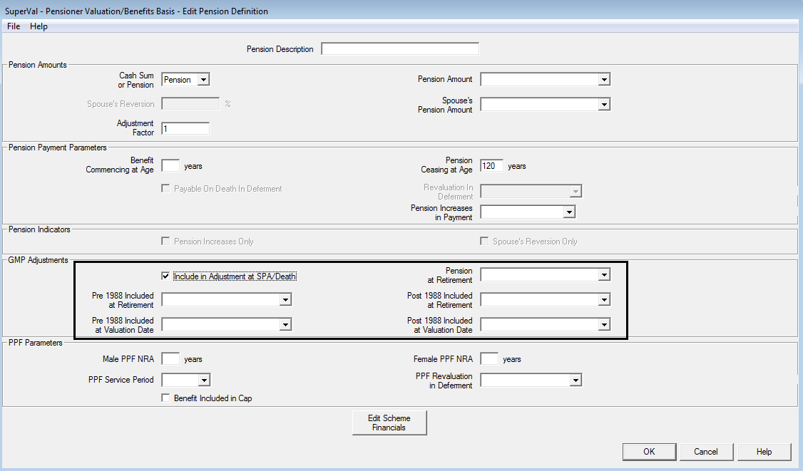

The entries required on _each_ tab depend on what happens with the
pensions at SPA and what data you have available.

The flowchart below points users to the relevant SuperVal set-ups
required to deal with the majority of cases. Note there are four
possible different set-ups shown (with screenshots of both the
_Legislation_ and _Pensions_ tab for each). These equate to the most likely
scenarios you will be required to value.

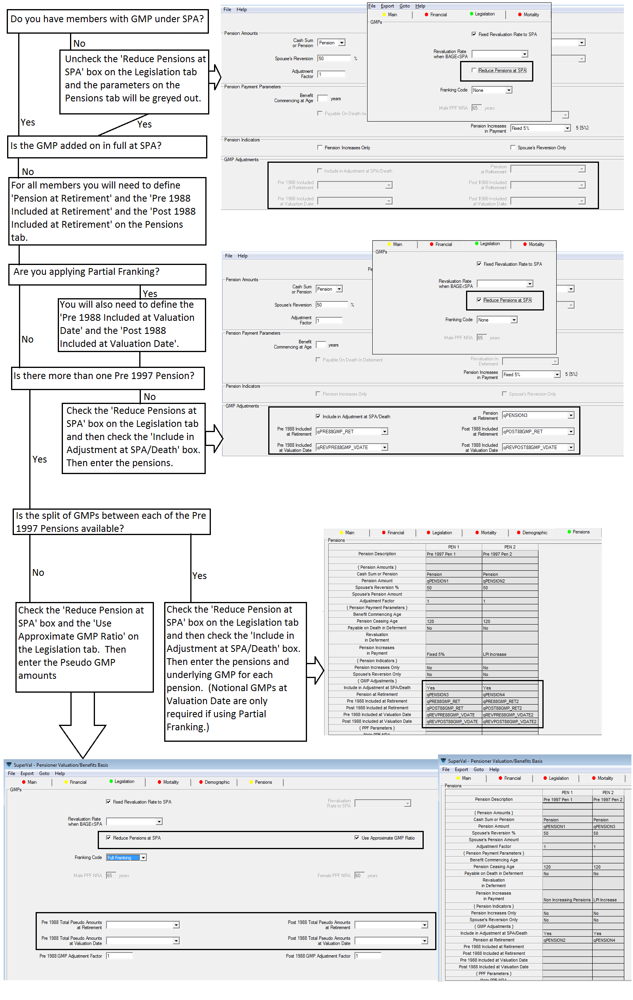

### How to ignore franking altogether (scenario 3) 

This would be similar to using the No Anti Franking Guarantee option
that is available in the Actives and Deferreds modules. In some cases,
the scheme may not provide any increase in the pension at SPA. (The
total pension from SPA will however be subject to a minimum of the GMP
at SPA and so there will be a step-up if total Pre-1997 pension is less
than the revalued GMP.)

You can value this by giving SuperVal the data that will result in it
calculating a zero step-up for all members. The simplest way to do this
is to calculate the GMP at SPA for each member and to input this as a
data item for _Pre-1988/Post-1988 GMP Included at Retirement_ on the
_Pensions_ tab. To enable these boxes to be visible check both _Reduce
Pensions at SPA_  on the _Legislation_ tab and _Include in
Adjustment at SPA/Death_ on the _Pensions_ tab. Also
set _Franking Code_ on the _Legislation_ tab to `None`.

SuperVal will derive the step-up by using the standard data items for
the GMP ie GMP0 and GMPE0 to calculate GMP at SPA and then subtracting
the GMP at Retirement. By entering the GMP at SPA into these fields
SuperVal will have the same data for each member and so the step-up in
GMP will be calculated as zero.

### More than one pre-1997 pension and using pseudo GMPs 

If there is more than one pre-97 pension and the split of GMP between
these different pensions is not known, then you can enter Pseudo
GMP information on the _Legislation_ tab to approximate
this data. To enable this option, check _Use Approximate GMP Ratio_
on the _Legislation_ tab. You will then be able to enter the Pre-
and Post-1988 Total Pseudo GMP amounts at both Retirement and Valuation
Date.

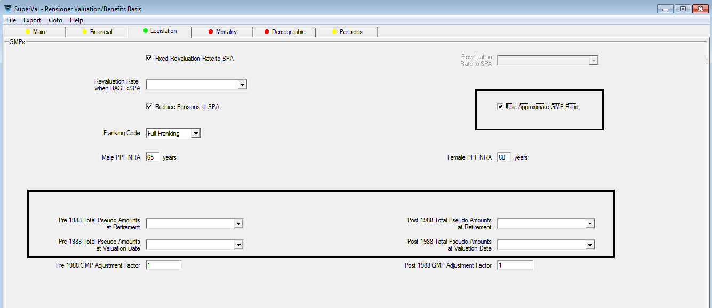

If there is more than one Pre-1997 benefit and you do have the split of
GMP for each pension, then enter this data in the appropriate Pension
fields on the _Pensions_ tab:

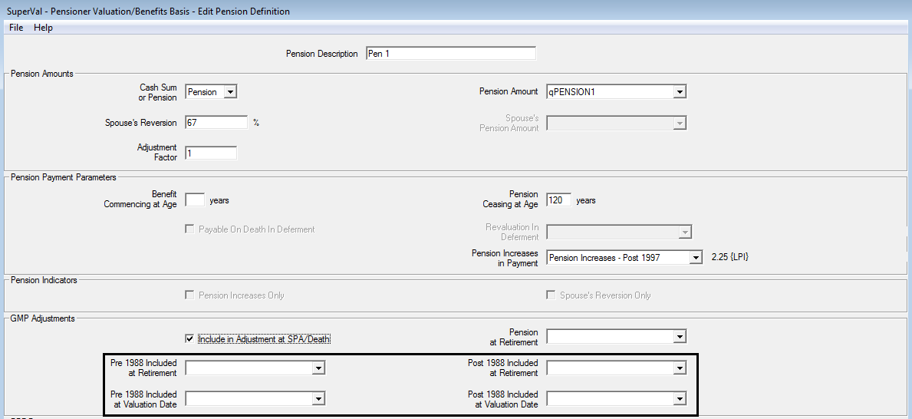

### What if the pre-1997 pension at SPA is less than the GMP at SPA? 

SuperVal currently undervalues the liability if the GMP at SPA is
bigger than Pre-1997 pension at SPA.

This is because, when it’s calculating the offset at SPA, it offsets the
whole GMP with excess increases, regardless of how big the pre SPA
pension is. This is best illustrated by an example:

Say a member aged 64 has pension of £1 pa, but GMP from age 65 is £1,000
p.a.

SuperVal will value liability as:

	£1 for life from age 64            (with excess increases in payment)
	– £1,000 for life from age 65      (with excess increases in payment)
	+ £1,000 for life from age 65      (with GMP    increases in payment)

The second item should be limited to £1 but it isn’t. In this instance
SuperVal will end up with a negative Pre-1997 liability.

To avoid this you can put the relevant members in a different category,
in which you value the Pre-1997 excess as a temporary pension. In the
screenshot below, this temporary benefit has been set up as Pension1.
The Relevance Rules will automatically grey-out _Include in
adjustment at SPA/Death_ and ignore any adjustment.

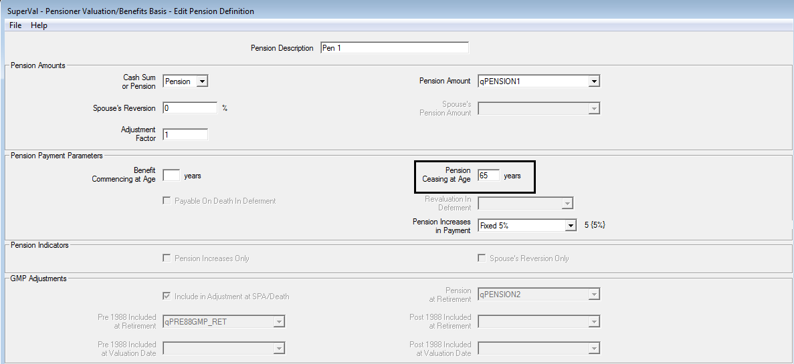

## Examples

Set out below are a couple of examples of the how the calculations work.

### Membership data 

The following membership data is used.

&nbsp;| Case Study 1 | Case Study 2
------|--------------|-------------
Valuation Date | 1 Jan 2013 | 1 Jan 2013
Date Pension Commenced | 1 Jan 2013 | 1 Jan 2013
Date of Leaving | 1 Jan 2008 | 1 Jan 2008
Sex | Male | Male
Status | Pensioner | Pensioner
Age at Valuation Date (= Age at DPC) | 60 | 60
Pre-1997 Pension at Valuation Date (pa) | £2,600.00 | £2,600.00 (split into two equal pensions)
Notional Pre-1988 GMP at Valuation Date (pa) |  | £500.00^†^
Notional Post-1988 GMP at Valuation Date (pa) | £1,000.00^†^ | £500.00^†^
Fixed Rate GMP Revaluations (based on Date of Leaving) | 4% | 4%
Post-1997 Pension at Valuation Date (pa) | £2,150.00 | £2,150.00

^†^ included in Pre-97 Pension amount.

For all cases below, we have shown the total amount of pension payable
from SPA, including the split between GMP and excess over GMP. We have
also shown how SuperVal will value these benefits.

### Case Study 1 

The entire excess pension receives 5% pa fixed increases in payment.
Full Franking is applied at SPA.

#### Derivation of pensions at SPA

&nbsp;                                                  | &nbsp;    | &nbsp;
--------------------------------------------------------|-----------|---------------------------------
Post-1997 Pension at SPA                                | £2,744.01 | = £2,150 × 1.055
Pre-1997 Pension Increases from 60 to 65                |   £718.33 | = £2,600 × (1.055 -1)
Revalued GMP at SPA less Notional GMP at Valuation Date |   £169.86 | = £1,000 × (1.044 -1)

Note the GMP revaluation is assumed Fixed Rate (4.00% based on DOL) and
SuperVal misses out the last revaluation before SPA (hence only 4
revaluations here).

Full Franking is being applied so you can offset any increases given to
Pre-1997 Pension between Valuation Date and SPA against GMP step-up.

Since Excess increases between Valuation Date and SPA are greater than
GMP increases, then no step-up applies.

&nbsp;                  | &nbsp;    | &nbsp;
------------------------|-----------|--------------------------------------------------
Post-1997 Pension       | £2,744.01
GMP                     | £1,169.86
Excess Pre-1997 Pension | £2,148.47 | = £2,600.00 – £1,000.00 + max[0, £718.33-£169.86]
Total                   | £6,062.34

Note the total can also be calculated as (£2,600 + £2,150) × 1.055

#### SuperVal set-up

Enter data items into the data file as follows:

&nbsp;                           | &nbsp;         | &nbsp;
---------------------------------|----------------|-----------------------------
Post-1988 Included at Retirement | qPost88GMP_Ret | £1,000 (assumed all Post-88)
Pension Amount                   | qPension2      | £2,600
Pension at Retirement            | qPension3      | £2,600

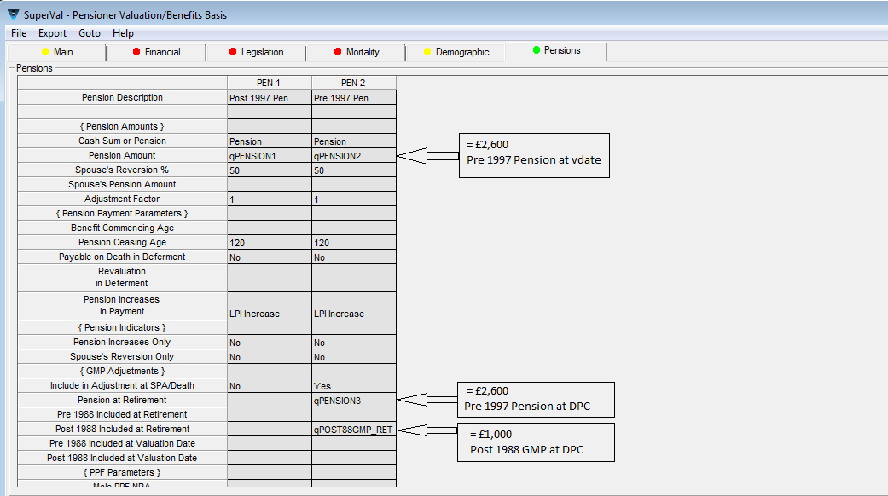

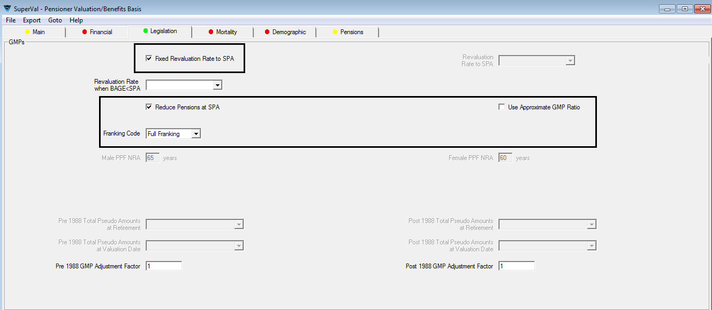

### Case Study 2 

The Pre-1997 excess pension is split into two parts:

- XS1 (£1,300) receives 0% pa fixed increases and

- XS2 (£1,300) receives 5% pa fixed increases in payment.

- Of the £1,000 Notional GMP, £500 is included in XS1 and £500 in XS2. 

#### Derivation of Pensions at SPA

&nbsp;                                                  | &nbsp;    | &nbsp;
--------------------------------------------------------|-----------|--------------------------------------------------
Post-1997 Pension                                       | £2,744.01 | = £2,150 × 1.055
Pre-1997 Pension Increases from 60 to 65                | £359.17   | = £1,300 × (1.055 -1)
Revalued GMP at SPA less Notional GMP at Valuation Date | £169.86   | = £1,000 × (1.044 -1)

Full Franking is being applied so offset any increases given to XS
between Valuation Date and SPA against GMP step-up.

Since XS increases between Valuation Date and SPA are greater than GMP
increases, then no step-up applies.

&nbsp;                    | &nbsp;    | &nbsp;
--------------------------|-----------|--------------------------------------------------
Post-1997 Pension         | £2,744.01
GMP                       | £1,169.86
Excess Pre-1997 Pension 1 | £800.00   | = £1,300.00 – £500.00
Excess Pre-1997 Pension 2 | £989.31   | = £1,300.00 – £500.00 + max[0, £359.17 - £169.86]
Total                     | £5,703.18

Note the Total can also be calculated as £1,300.00 + (£1,300 + £2,150) × 1.055

#### SuperVal set-up

Enter data items into the data file as follows:

&nbsp;                           | &nbsp;              | &nbsp;
---------------------------------|---------------------|-------
Pre-1988 Included at Retirement  | qPre88GMP_Ret       | £500
Post-1988 Included at Retirement | qPost88GMP_Ret      | £500
Pension Amount                   | qPension2/qPension4 | £1,300
Pension at Retirement            | qPension3/qPension5 | £1,300

The setup of the _Legislation_ tab is exactly the same as Case Study 1. 
The
_Pensions_ tab is as follows:

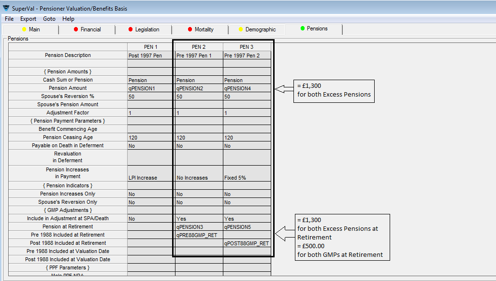

