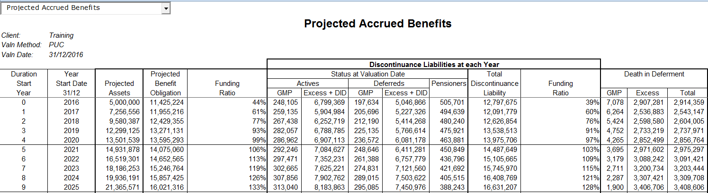
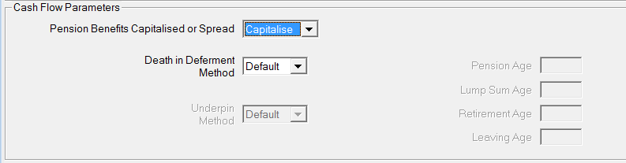
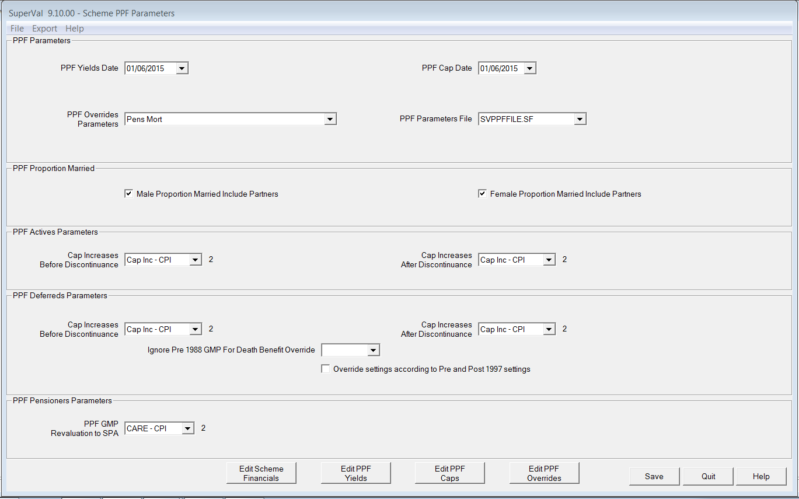
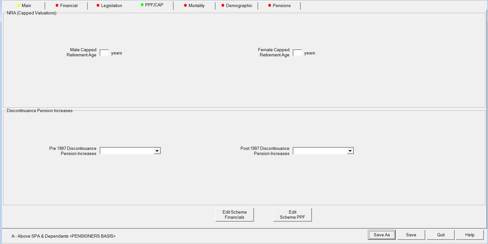

# Projecting discontinuance benefits

There is a TAS P requirement that in each valuation, the Scheme Funding
Report should include projections of the funding level at the expected
effective date of the next Scheme Funding assessment on the solvency
basis and the technical provisions basis.

This could potentially mean projecting the Technical provisions,
Solvency and the level of PPF Benefits on a Solvency basis by three
years.

Because of the nature of the PPF benefit this is a difficult
calculation. We have leveraged the current functionality of SuperVal to
carry out this calculation. Even so, our approach involves several
approximations and gaining a full understanding of the approach is not
easy.

The approach is described below.

## Technical approach

### Overview

Calculating the PPF benefit in the event of discontinuance in 3 years
time involves:

-   Projecting the scheme benefits for 3 years allowing for decrements,
    pension increases and the other valuation assumptions

-   Converting the scheme benefit to an accrued PPF benefit at that point
    – so capping and reducing by 10% where appropriate, and splitting the
    resulting pension or deferred pension into pre- and post-1997
    components with the pre-97 having no increases and post-97 increasing
    at LPI (2.5%).

-   Valuing the resulting accrued PPF benefits.

To value the PPF level of benefits on a Solvency basis see 
[Non-PPF-capped valuations](../non-ppf-capped-runs/index.md). 
To project the
benefits for example by 3 years you could run the Actives with a
Solvency basis on a 3-year PUC. Once the run is consolidated the system
will have the projected benefits listed in the Excel output. This will
project the benefits to the end of the year and then value the accrued
benefits at that point.

SuperVal also supports the Defined Accrued Benefit method of valuation.
The essence of this method is to project the scheme benefits over a
defined control period and then calculate the value of accrued
discontinuance benefits at that point.

Both of these methods are suitable for valuing PPF benefits on a
Solvency basis, though the PUC run may be more familiar to users. The
main change from the normal PUC and DAB approach is that the accrued
benefit at the end of the period is converted to a PPF benefit before
being valued. We have introduced a “capping” concept into the batching
parameters to enable SuperVal users to carry out the PPF capping.
Typically the control period will be 3 years.

As, only Accrued Benefits at the Valuation Date are shown in the
valuation output, in order to get the figures required for projection
purposes, valuation runs should be consolidated. This value is obtained
from the AB1 column on the consolidation output. In order to get
intelligible figures, all benefits must be capitalised. 

**Tip** The cashflows can be set to `Capitalise` using the _Cash Flow Parameters_ on the _Main_ tab.

### Capping parameters

Set the capping parameters as follows.

Set the valuation batch capping parameter to `Cap Accrued Benefits`.

On the scheme _PPF Parameter_ settings specify:

-   Amount of the Cap at age 65 at the valuation date
-   Cap age adjustment factor to allow for varying PPF NRAs
-   Cash factors to allow for Cash on Top benefits which must also be capped.
-   Cap increase rate before discontinuance and after discontinuance. The
    _After Discontinuance_ parameter lets you adjust the Cap for the
    period between the discontinuance date and NRA.
-   _PPF Cap Date_

The Pre-97 and Post-97 pension increases to be applied to the
discontinuance benefits (i.e. increases after the end of the control
period) can be specified on the _PPF/Cap_ tab. Note that the increase
rates in the control period are those in the valuation basis for the
scheme benefits.

### Emerging benefits and discontinuance

Emerging benefits are those relating to decrements in the control period
(e.g. retirements from active, death in deferment).

Discontinuance benefits are those relating to members staying in the
same status throughout the control period and then discontinuing. This
includes Actives discontinuing to Deferred status with PPF benefits at
the end of the control period, and Deferreds converting to PPF benefits.

The sum of the discontinuance and emerging benefits is the total scheme
benefits assuming discontinuance at the end of the control period on PPF
terms.

Broadly, the capping parameters are applied to discontinuance benefits
and not to emerging benefits. So emerging benefits are treated in the
same way as before but discontinuance benefits are not. This has
implications for the parameter settings as described in this document.

Emerging benefits and discontinuance benefits are handled differently as
follows:

-   Capping is only applied to Discontinuance benefits
-   10% reduction only applied to discontinuance benefits
-   The Pre-97 and Post-97 pension increases to be applied after the
    control period are only applied to the discontinuance benefits

## Setting up the basis modules

Assuming we are looking at a 3-year control period where normal benefits
will be valued for 3 years and after that, PPF level benefits will be
valued.

### Pensioners

To value PPF benefits after 3 years, the pension-increase rates for the
years after the end of the control period must be set to the Pre-97 and
Post-97 PPF increase rates as appropriate for each Pension Definition.
So each increase will require a vector value such as `2, 2, 2, 0`: the
first three relating to scheme benefits in the control period, and the last
to PPF benefits after discontinuance.

The capping applied in the Pensioner module will be based on the a
member having the `MemorSp` Member or Spouse indicator set to `M`, if
the ceasing age for a pension definition is 120 and if the age is less
than the NRA specified on the _PPF/Cap_ tab. Dependants who have the `S`
_MemorSp_ indicator will not be subject to capping. Temporary pensions
with ceasing ages less than 120 are also uncapped. 

:fontawesome-solid-hand-point-right:
[PPF S179 (Levy) valuations](../ppf-s179/index.md)
for more information on the PPF cap.

When calculating discontinuance benefits, the Pre-97 rate (as defined on
the _PPF/Cap_ tab) is used for all Pre-97 PUPs (as defined by Pre-97 PPF
Service Period indicator) and the Post-97 rate is used for all other
PUPs. The Pre-97 rate is the default.

### Deferreds

#### Emerging benefits

If the decrement is retirement from deferred, this will be at NRA so
capping etc. will not be required and is not applied. However the
conversion to PPF benefits at the end of the control period will need to
be handled. To enable this, the pension increase rates for the years
after the end of the control period must be set to the Pre-97 and
Post-97 PPF increase rates as appropriate for each PUP. Note that for
each type of increase, this will almost always require a vector value –
e.g. `3.5,3.5,3.5,0`, the first three relating to scheme benefits in the
control period, and the last to PPF benefits after discontinuance.

#### Discontinuance benefits

These will always result from the conversion from a scheme benefit to a
PPF benefit at the end of the control period. Capping, 90% and the
Pre-97 and Post-97 pension increases will be applied to the
discontinuance benefits. Death in deferment is handled in line.
When calculating discontinuance benefits, the Pre-97 rate (as defined on
the _PPF/Cap_ tab) is used for all Pre-97 PUPs (as defined by Pre-97 PPF
Service Period indicator) and the Post-97 rate is used for all other
PUPs. The Pre-97 rate is the default.

### Actives

#### Emerging benefits

If the decrement is normal retirement, then the approach is analogous to
deferred retiring, but using the pension-increase parameters for Actives
in the control period. Note that for each type of increase, this will
almost always require a vector value – e.g. `3,3,3,2.25`, the first three
relating to scheme benefits in the control period, and the last to PPF
benefits after discontinuance.

For example, if the Salary Increase rate is 3% and the Deferred
Revaluation rate is 2%, then the Salary Increase parameter in the Basis
file could be `3 3 3 2` to ensure that only three salary increases are
applied.

If the decrement is for early retirement or withdrawal then capping and
reduction will not be applied. So the best approach will normally be to
ignore early retirement and withdrawal. If the decrement is for ill
health then again the capping will not be applied, but as PPF capping
does not normally apply to such retirements this may well be OK. It
would be normal to have a death decrement.

#### Discontinuance benefits

These will always result from the conversion from a scheme benefit to a
PPF benefit at the end of the control period. Capping, 90% and the
Pre-97 and Post-97 pension increases will be applied to the
discontinuance benefits. The Pre-97 rate, set on the _PPF/CAP_ tab, is
used for all Pre-97 slices (as defined by offset slice) and the Post-97
rate is used for the other slices.

## Miscellaneous

For death in deferment, if such benefits as lump sums are not required
they should be set to zero.

For completeness, projected PPF solvency is also calculated for the
years in the control period. These calculations are less accurate –
one reason being that they assume the changeover to PPF pension
increase rates come into force at the end of the control period for
emerging benefits.

PPF NRA and PPF Proportions married are not used in the calculations.

For actives, the Pre-97 benefits as at the valuation date are compared
with the GMPs as at the valuation date and are increased as
appropriate. The GMPs are then reset to zero.

For enhanced deferreds the GMPs are treated as Pre97 irrespective of
the parameters on the GMP tab. They are then costed as Pre-97 pension
and the GMPs reset to zero. If franking in deferment is set to `Yes` the
GMPs are ignored. No comparison is made with the total PUPs at the
valuation date.

Underpin is ignored.

The cap applied to Actives DID is the cap applicable to the NRA and
not the cap applicable at the date of death.

The adjusted benefits at the valuation date are then fed through the
existing accrued benefit calculations

Actives cash on top is ignored unless it is a multiple of pension
(2.25, 3 or user-defined) or 3/80ths for each year of service.

Enhanced Deferreds cash on top is ignored unless it is a multiple of
pension.

Capping can also be applied to other valuation methods.

No amendments have been made to the treatment of the assets and
contributions in the cashflows.
