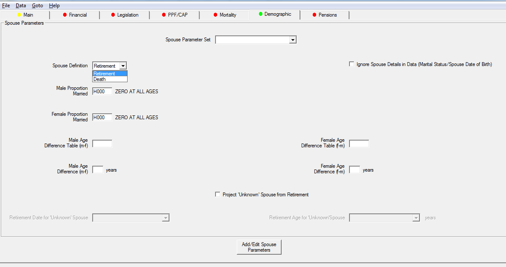
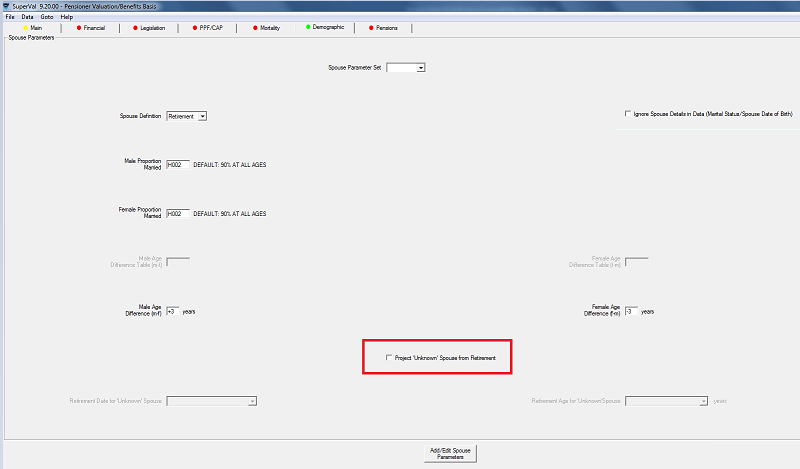

# Proportion married

When you define Proportion Married, SuperVal lets you apply
this either at Retirement or at Death.

This article outlines the difference between these two options.
It is relevant for the Actives, Deferreds and Pensioners modules.

-   If you choose `Death`, SuperVal will use the table specified to
	determine the proportion married at death for each age.

-   If you choose `Retirement`, SuperVal will calculate proportion married
	at death by taking the proportion married at Retirement Age (or Age at
	Valuation Date for pensioners) and then allowing for spouse’s mortality
	thereafter.

!!! info "This article is based on V9.25 of SuperVal."

	Any screenshots from earlier versions are not materially different.

## The different methods

The different methods can be illustrated by a couple of examples. The
examples are based on the data set out in the table below.

| Member’s Age | Proportion Married % | Spouse’s Age | Spouse’s Lx Table |
|--------------|----------------------|--------------|-------------------|
| 65           | 70                   | 62           | 100,000           |
| 66           | 72                   | 63           | 99,000            |
| 67           | 74                   | 64           | 97,000            |
| 68           | 76                   | 65           | 95,565            |
| 69           | 77                   | 66           | 93,176            |
| 70           | 78                   | 67           | 90,380            |
| 71           | 79                   | 68           | 87,217            |
| 72           | 80                   | 69           | 83,728            |
| 73           | 80                   | 70           | 79,961            |
| 74           | 80                   | 71           | 75,963            |
| 75           | 80                   | 72           | 71,785            |

### Actives and Deferreds 

Consider an active member with a Normal Retirement Age of 65. His spouse
is 3 years younger than him.

The proportion married, at age 70, used by SuperVal is calculated below.

If Retirement is selected for Spouse’s Definition, SuperVal will use age
at Normal Retirement Date for actives and allow for the spouse’s
mortality thereafter.

Using spouse’s mortality:

$$Proportion\ Married = Proportion\ married\ at\ NRD \times \frac{l_{67}}{l_{62}}$$

	         90,380
	= 70% × -------   = 63%
	        100,000

If `Death` is selected for Spouse's Definition, SuperVal will calculate
the cashflows using the member’s proportion married based on his age in
each year of calculation. Hence at age 70, the proportion married will
be:

$$Proportion\ Married = Proportion\ married\ at\ 70 = 78\%$$

### Pensioners 

Consider a pensioner member with a Normal Retirement Age of 65. At the
valuation date he is aged 70 with a spouse assumed to be age 67.

The proportion married, at age 75, used by SuperVal is calculated below.

If `Retirement` is selected under Spouse Definition, SuperVal will use age
at valuation date for pensioners.

Using spouse’s mortality:

$$Proportion\ Married = Proportion\ married\ at\ valuation\ date \times \frac{l_{72}}{l_{67}}$$

	        71,785
	= 78% × ------   = 62%
	        90,380

Note that this uses the proportion-married table to determine proportion
married at valuation date and spouse mortality thereafter.

You can use the proportion married at Retirement with allowance for
the Spouse Mortality between the Retirement Date and the Valuation Date
if the Marital Status is not `M`, `S` or `W` (Married, Single or
Widowed).

The Retirement Date can be specified as either:

-   a date field in the pensioner member’s data; or
-   a specified age e.g. 65, 60; or
-   an age specified as a numeric field in the pensioner member’s data.

To do this, check _Project ‘Unknown’ Spouse from Retirement_ field
and specify from what age or what date you want to project the spouse’s
data.

If `Death` is selected under Spouse Definition, SuperVal will calculate
the cashflows using the member’s proportion married based on his age in
each year after the valuation date. Hence at age 75, the proportion
married will be:

$$Proportion\ Married = Proportion\ married\ at\ 75	= 80\%$$

## PPF S179 (Levy) valuations

### Pensioners

When running a PPF Section 179 (Levy) valuation, the PPF guidance states
that you must use the proportion-married assumptions as set out in the
relevant guidance appropriate to the valuation date.

For existing pensioners, adjustments to the proportion-married
percentage to reflect survival of the spouse between Normal Pension Age
(NPA) and the valuation date may need to be made for existing
pensioners.

SuperVal adjusts the proportion married used to reflect the probability
of the spouse surviving between the Date Pension Commenced (DPC) data
field imported into SuperVal and the valuation date. The adjustment
takes account of both the base mortality table and the mortality
improvements specified.

Post-valuation date adjustments continue to use the base mortality table
adjusted for mortality improvements.
