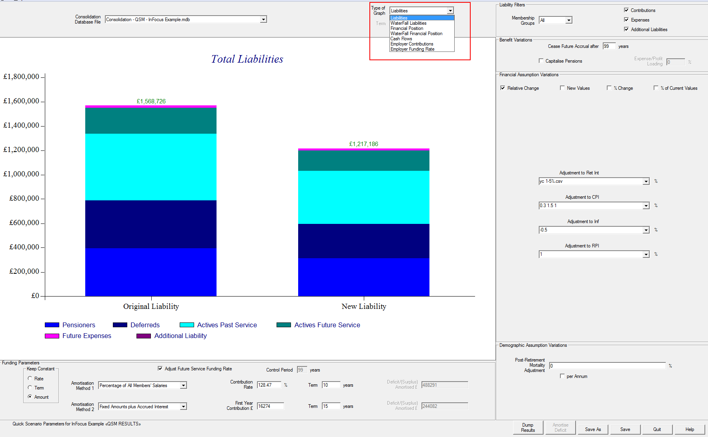

# Quick scenario modelling (QSM)

The Quick Scenario Modeller (QSM) module lets you quickly vary
valuation assumptions (without running a SuperVal valuation):

-   financial assumptions (allowing for any prospective caps and collars)
-   post-retirement mortality (by a change in mortality rates or improvement)
-   limiting future benefit accrual
-   deficit / surplus amortisation

by manipulating valuation cash flows to gain approximate results to be
able to investigate the effect on:

-   liabilities (total or broken down by assumption change)
-   cash flows
-   financial position (total or broken down by membership class)
-   Employer future funding rate
-   total Employer contributions

QSM could be used when:

-   deciding upon changes to the previous valuation basis
-   looking at the effect of future what-if scenarios against the valuation result
-   modifying valuation results to produce valuations used for other
    purposes such as Accounting valuations

For the QSM a new concept of Grouping has been introduced for financial
assumptions. Financial assumptions that have the same underlying
economic assumption (e.g. all assumptions related to RPI) can be grouped
together and a single adjustment can be applied to these grouped
assumptions (the adjustment is typically relative to the original
assumption and will allow for prospective caps/collars).

Grouping provides a powerful way to make adjustments to related
assumptions at one time.

Financial assumptions can be adjusted in several ways:

-   a relative (additive) change (scalar or vector)
-   a percentage (multiplier) change (scalar or vector)
-   a new assumption (useful when specifying a new yield curve for a
    proposed valuation basis, original caps and collars will apply)

If Spouse cashflows are stored separate to member cashflows (a new
option in SuperVal), post-retirement mortality or mortality improvement
can be adjusted, currently by a simple percentage reduction or
improvement per year.

The QSM allows future-service accrual to be ceased after a specified
period and for pensions to be capitalised at exit with an Expense/Profit
loading.

Deficits can be amortised in two tranches over specified term(s)
expressed as:

-   a percentage of salaries
-   level amounts
-   a fixed amount plus interest on the outstanding balance

The results of the adjustments can be viewed graphically in a number of
ways:

-   change in total liabilities or the contribution of each assumption
    change to the liability change
-   change in the financial position or the contribution of each
    membership class to the financial position change
-   change in projected cash flows
-   change in Employer contributions or change in the future-service
    funding rate
-   selecting a subset of the membership classes

Any scenario result can be saved to a file to be reviewed later (or to
display in later discussions with clients).

The QSM is based on the current valuation structure with a few extra
steps:

-   Set up Groups in the Financial Assumptions
-   Set Valuation Flags (ALM/LDI results required in Batching and, if
    post-retirement Mortality adjustments are required, Separate Spouse
    cash flows flag in Scheme Details)
-   Consolidation of your Valuation Runs (consolidating ensures the
    Categories included represent a "Scheme" and allows an Asset value,
    Amortisations and Expenses to be specified)
-   Summarise Financial Assumptions (in the Consolidation database)
-   Run the Quick Scenario Modeller.

This article summarises how the QSM module works in SuperVal
and illustrates how the results are displayed and stored.

## Groups for financial assumptions

For the QSM a new concept of Grouping has been introduced for financial
assumptions.

Financial assumptions that have the same underlying economic assumption
(e.g. all assumptions related to RPI) can be grouped together and a single
adjustment can be applied to these grouped assumptions in the QSM.

Grouping has the advantage that if you are unfamiliar with the detail of the
SuperVal bases you can use the QSM by way of Grouping names, and means that
related financial assumptions applying across a number of different
Membership Classes and Categories can be varied with a single change.

To set up Groupings, select _Bases \> Scheme \> Financial Assumptions_

Select _Add / Edit Financials_ for the financial set to be used in the run.

The tabs _Interest_, _Inflation_, _Revaluation_ and _Increase_ now have an extra column: _Grouping_.

In the _Grouping_ column either:

-   Right-click to display the current Groupings list (listed in the _Groupings_ tab - see below); or
-   type a new descriptive name (not already on the Groupings list) which will then be added to the list on the _Groupings_ tab.

**Note**
These can be called anything, but grouped assumptions will move in unison.

The QSM currently supports ten different groupings (there
is no theoretical limit to the number of Groups but this is considered
to be a likely practical limitation if assumptions are appropriately
grouped).

E.g. 

If a financial assumption is fixed, the Grouping should be left blank and this assumption will not be available to specify any variation.

There is now an extra tab under _Financial Assumptions_ called _Groupings_. 

A Grouping Name can be added either:

-   to the _Interest_, _Inflation_, _Revaluation_ or _Increase_ tabs which will be automatically added to the _Groupings_ tab, or
-   under the _Groupings_ tab and this list can then be used in the _Interest_, _Inflation_, _Revaluation_ and _Increase_ tabs

**Version 9.25**
You can now define prospective caps
and collars for interest, inflation, revaluation and increase in the
_Financial Assumption_ grid. These values can be entered as a scalar
value. The caps and collars will be applied within the Quick Scenario
Modelling calculations (with any adjustment restricted to the specified
range).

## Post-retirement mortality adjustments

The post-retirement mortality adjustments in QSM rely on having separate
member and spouse pension cash flows stored in the database.

To create separate output for cashflows for spouses in SuperVal, check
_Output Separate Cashflows for Spouse_ under _File \> Properties \> Valn Options_.

In the QSM, post-retirement mortality or mortality improvement can be
adjusted, currently by a simple percentage reduction or percentage
improvement per year.

More complex mortality improvement models could be coded, if required.

The ‘average’ mortality underlying pension cashflows is derived from the
cashflows by removing the inflationary elements (inflation, revaluation
and increases) leaving a set of cashflows decreasing over time only as a
result of the ‘average’ mortality.

Thus, if mortality adjustments are to be performed in the QSM, it is
important that the inflationary elements are specified as accurately as
possible. This is particularly relevant where multiple tranches of
benefit (which may have different underlying rates of inflation and
revaluation) are grouped because they relate to the same pension
increase. As the rates of inflation and revaluation extracted by
SuperVal when summarising financial assumptions (see below) will relate
to just one tranche of benefit, some judgement may be required to adjust
these rates to represent the ‘average’ rate over all tranches grouped by
pension increase.

## Valuation runs and consolidation

The QSM will only work with valuation runs with:

-   the _ALM/LDI Interface Required_ field checked in the Batch parameters; and
-   spread pension benefits (pension benefits can be capitalised at the point of commencement in the QSM, if required).

Currently, the QSM will not work with Accurate Scenario valuation runs.

The QSM requires a Consolidation database.

The rationale for this is: Consolidation forces you to select a group of homogeneous runs (in terms of Valuation Method, Control Period, etc.) which represent a ‘Scheme’ (whether that be all membership classes or a single class) for whom a segregated amount of assets can be ascertained. 

It also allows other assets and liabilities to be included such as:

-   two tranches of Amortisation Contributions
-   an Asset Value
-   other Liabilities (such as Additional Accumulations, post-valuation significant Asset gains/losses, etc.)
-   scheme expenses (note that they currently only relate to Actives members — additional expense elements for Other Membership Classes can be added, if required).

When consolidating ensure the ALM/LDI Interface selection field does _not_ show `No` as these are the cashflows used by the QSM – it should be either `Exclude Left Service` or `Include Left Service` (depending on whether the Left Service dimension (_File \> Properties \> Valn Options_) was flagged in the valuation runs).

Check _Retain Category Splits_ in the Database field (QSM works at Sex/Category level in its calculations as there may be differences in financial assumptions between Categories).

## Summarise financial assumptions

The QSM uses the Financial Assumptions used in valuation runs as well as some elements of the Scheme benefit design and the actuarial basis to remove inflationary elements (and mortality, if desired) from the valuation cash flows. (These deflated cash flows can have adjusted assumptions applied to them to produce adjusted valuation results.)

The extraction of this data is carried out in the Summarise Financial Assumptions module.

Select _Valuation>Summarise Financial Assumptions_

Select the Consolidation Database to be summarised.

If _Analyse Contingencies separately_ is checked, the Financial Assumptions summary (and the consequent QSM calculations) will be separated by Contingency. If it is left unchecked, QSM will run slightly quicker but all benefits in each Category will be assumed to have the same Financial Assumptions and benefit basis as the Retirement benefit.

If Summarise Financial Assumptions has previously been run on the selected Consolidation Database, the results of that summarising will simply be extracted from the database (unless _Analyse Contingencies separately_ is checked and it wasn’t checked last time, in which case the Summary of Financial Assumptions will be performed again broken down by Contingency).

Ultimately, it will display the information extracted from the Valuation Bases as:

-   a table (on the Benefits tab) showing Benefit level information broken
    down by Membership Class, Category, Sex, Benefit Type, Past or Future
    Service benefit and, if requested, Contingency
-   a table (on the Category tab) showing Category level information
    broken down by Membership Class, Category and Sex.

Below is an example of the tables (only part is shown):

The rows in the tables can be sorted by right-clicking in the column header. 
(Right-clicking on the first column header restores the original order.)

Most of the entries in these tables are protected and cannot be changed (as their value is known with certainty) but some on the Benefits table can be changed (as they are either user-defined or the value may be one – or an average – of many values) as follows:

Groups

: You can change Financial Groups (perhaps noting an issue after running the QSM) to:

    -   separate Financial Assumptions (currently grouped)
    -   group separate groups of Financial Assumptions together 
    -   remove groups that are not needed

Inflation and Revaluation assumptions

: Where multiple tranches of benefit (which may have different underlying rates of inflation and revaluation) are combined because they relate to the same Pension Increase, the rates of inflation and revaluation extracted by SuperVal when Summarising Financial Assumptions will relate to just one tranche of benefit. 

    Some judgement may be required to adjust these rates (and their corresponding caps and collars) to represent the ‘average’ rate over all tranches grouped by Pension Increase. Note that only a numeric value (scalar or vector) can be specified. 

    Any mortality adjustments performed in the QSM rely on the accuracy of the inflationary elements specified as the "average" mortality underlying pension cashflows is derived from the cashflows by removing the inflationary elements (inflation, revaluation and increases) leaving a set of cashflows decreasing over time only as a result of the "average" mortality only.

These summarised Financial (and other benefit basis and actuarial basis) Assumptions, including any changes made, are stored in the database. 

The Benefit Basis column includes a description of the liability, which guides the calculations in the QSM, such as:

-   Final Salary (use the Final Average Salary period when inflating)
-   CARE (use Revaluations for Past service and use both Revaluation and Salary Inflation for Future service)
-   Valn Basis Pro Rata (for Valuation Basis Cash Commutation allows the Cash Commutation to be recalculated on the adjusted Valuation basis)
-   Cash (for Pensioners to indicate a Cash benefit - revalued only) 
-   the Amortisation method being used for the amortisation tranche.

## Quick Scenario Modeller

Next select _Valuation>Quick Scenario Modeller_.

### Consolidation database

Select the Consolidation Database File to be used.

### Liability filters

You can restrict the membership classes (all, any combination of two, or Actives, Deferreds or Pensioners) to include in the calculations.

You can also select whether or not to include contributions (Actives Member and Employer and Amortisations) and/or expenses and/or additional liabilities (if there are any). Note that, for the purposes of cashflows, any Consolidation additional liabilities are ‘paid out’ immediately as the nature of the liability is unknown.

### Benefit variations

You can restrict future-benefit accrual to a (integral or non-integral) period of years.

!!! warning "This calculation assumes uniform accrual of future service benefits over the period up to the point of exit."

    Thus any benefit design that includes a maximum service accrual period, non-uniform future benefit accrual (other than CARE which has been allowed for) or where the benefits already have a limit on future accrual, the calculations will be inaccurate.

You can also capitalise pensions at the point of exit (to simulate a buy-out) using the adjusted post-retirement assumptions. A profit / expenses loading can also be applied to these capitalised amounts.

### Financial assumption adjustments

The Financial Assumptions can be adjusted in the following ways:

-   a Relative Change (positive or negative additive change)
-   a % Change (positive or negative multiplier change)
-   a % of Current Value: 100 + % Change
-   New Values: Ignores the current value

Three different adjustments can be used:

-   A single number (negative or positive)
-   A vector of numbers (negative or positive) separated by a space (limit of 50 digits)
-   A yield-curve (CSV file)

Each value in a vector or a yield curve relates to one projection year and the last value applies for the remainder of the term.

The `New Values` option may be most useful when deciding upon changes to the previous valuation basis - particularly when yield curves are used for Financial Assumptions.

### Post-retirement mortality assumption

You can specify a scalar or a vector percentage adjustment here.

If the _per Annum_ box is 

unchecked

: it is an adjustment to the mortality rates by the percentage specified.

checked

: it is an adjustment to the mortality improvement i.e.

    $\pi_t \times (1-mortality\ adjustment_t)$ at time $t$

### Amortisation of surplus/deficit

When consolidating, the surplus/deficit can be amortised using two
tranches.

These amortisation tranches can then be altered within the QSM:

1.  Select one of the rate, term or amount to be kept constant.

2.  Choose one of four amortisation methods:

    +   Percentage of All Members’ Salaries (including New Entrants)
    +   Percentage of Current Members’ Salaries
    +   Level Amounts
    +   Fixed Amounts plus Accrued Interest

3.  The field chosen in 1 to remain constant is greyed out in 3. 
    Changing any of the remaining available fields alters the other available 
    field for that tranche.

Thus you can alter the amount of deficit/surplus that is amortised (if the Amount is not selected to remain constant) by changing the either the Amount or the Rate or Term (depending on which is available). 

If the Amount is kept constant, changing the Rate or Term will simply change the other to amortise the given amount of amortisation.

In the above example, `Term` is chosen to remain constant, so if _First Year Contribution_ is increased/decreased, _Deficit/(Surplus) Amortised_ will increase/decrease or vice-versa if the Deficit(Surplus) is changed.

### Amortisation Solver

Alternatively, use the _Amortise Deficit_ button to amortise any
resultant deficit/(surplus) (after any assumption adjustments) so that
the Liabilities are fully funded.

The Amortisation Solver can spread the amortisation over either or both
of the two amortisation tranches by changing either the Rate of Contribution or the Term of the Contributions and, if both selected, either `Equally` or `Proportionally`.

Press _Run_ and the amortisation fields will be updated with the required
values.

### Future-service funding rate

The rate (i.e. the percentage of salaries) of future service "normal"
Employer Contributions (i.e. non-amortisation contributions) can be
varied in line with the adjustments in the valuation basis by checking
_Adjust Future Service Funding Rate_.

For the PUC method, you can also change the Control Period.

If _Adjust Future Service Funding Rate_ is unchecked, the future-service 
‘normal’ Employer Contribution rate will remain unchanged.

In both cases, the amount of these contributions will be affected by
changes in the inflationary component underlying the contributions and
their value will also be affected by changes in the discount rate
applying.

Note that future service "normal" Employer Contributions are calculated
at member level in the valuation but the QSM calculation is based on
groups of members by Sex/Category. As a consequence, there will be some
minor differences when compared to a valuation run – particularly for a
small group of members.

### Type of graph

There are seven options to graphically display the results (by selecting _Type of Graph_:

-   Liabilities
-   Waterfall Liabilities
-   Financial Position
-   Waterfall Financial Position
-   Cash flows
-   Employer Contributions
-   Employer Funding Rate

All the graphs respond immediately to adjustments made to any of the
liability filters, benefit variations, valuation assumptions or
amortisations.

#### Liabilities

The Liabilities graph displays the liabilities broken down by Membership
Class and Past/Future Service (including expense and additional
liabilities specified in consolidation) on the valuation basis and after
adjustments:

#### Waterfall Liabilities

The Waterfall Liabilities graph displays the change in liabilities
broken down by the Assumption Change:

#### Cash Flows

The Cash Flows graph displays the change in cashflows (net of Contributions if they are included): 

#### Financial Position

The Financial Position graph displays the scheme’s financial position
broken down by Membership Class and Past/Future Service including the
amortisations and the Asset Value, expenses and additional liabilities
specified in consolidation on the valuation basis and after adjustments:

#### Waterfall Financial Position

The Waterfall Financial Position graph displays change in the scheme’s financial position broken down by Membership Class and Past/Future Service and the amortisations on the valuation basis and after adjustments: 

#### Employer Contributions

The Employer Contributions graph displays the amount of the Employer’s
total contributions on the valuation basis and after adjustments:

#### Employer Funding Rate

The Employer Funding Rate graph displays the Employer Future Service
Funding Rate on the valuation basis and after adjustments:

This is only relevant for Actives; _Adjust Future Service Funding Rate_ needs to be checked. 

### Output

At the bottom of the screen is a _Dump Results_ button which will produce a text file with results on the adjusted valuation basis (Equiniti will output this file in a HTML format in the next release). 

This contains:

-   a summary of any Liability Filters
-   a summary of the changes in valuation assumptions (benefits, financial, mortality and contributions)
-   the original / change in / revised liabilities, split by Membership Class, Sex/Category, Past/Future Service, Benefit Type and (if selected) Contingency
-   revised cashflows, split into the components shown in the Consolidation output.

This output was primarily prepared as way to check results against Consolidation output.

If requested, the QSM results could be exported to:

-   a Consolidation database; and/or
-   Excel output

### Saving scenarios

A scenario can be saved to a file and re-opened at a later time (with
the assumption settings restored to the point when they were saved).

Note that the cashflows (original and adjusted) are stored in the file
so the QSM is independent of the original database from which the cashflows 
were extracted.

As a consequence, if the consolidation database is re-created, any
changes in the cashflows in this new consolidation database will not be
reflected in cashflows stored in QSM files. To aid with the job of
identifying QSM cash flows needing updating, when opened, the timestamp
when the QSM scenario was originally saved is displayed as part of the
database name.

## Limitations

The valuation process works at the individual-member level whereas the
QSM works at Sex/Category level. As a consequence, member level
information is lost which, in some circumstances, will result in an
inaccuracy of the results produced by QSM.

The more important known issues include:

-   Any benefit comparisons such as Alternate Slices, Tier Deductions,
    Underpins etc. cannot be modelled.
-   Non-homogeneous assumptions (e.g. benefit tranches with the same
    pension increase but different revaluations) cannot be separately
    identified. To get around this you can amend the
    Assumptions Summary, which will mitigate this limitation.
-   Mortality Assumptions uses a “benefit weighted” average Mortality at
    each exit point (/contingency if separated). The same adjustment is
    applied to all ages.
-   Under Pensioners – Pensions Increases Only and Spouse’s Only options
    do not work in QSM.
-   Only post-retirement mortality assumptions can be adjusted.
-   GMP calculations involving franking use an approximate modelling
    method in this version, due to the greater complexity.
-   Benefits cannot be capitalised.

We have tested the QSM over a wide range of benefit parameters but, with
the range of basis parameters in SuperVal, it is unlikely that we have
been able to test every possible combination of basis parameters. This
issue is exacerbated by users using workarounds (using basis parameters
in ways not originally envisaged or combining two different valuation
runs to achieve the required result).

The QSM is provided on an ‘as-is’ basis and it is highly recommended
that some testing of QSM results for each Scheme be performed to confirm
the accuracy (or to evaluate the inaccuracy, if the benefit design
includes a limitation above) of the QSM results.

To expedite this testing (if requested by users), we could write an
export of the valuation assumption adjustments to an Accurate Scenario
Model parameter set.
