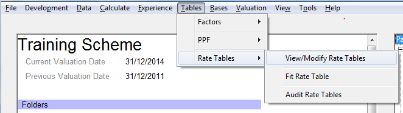
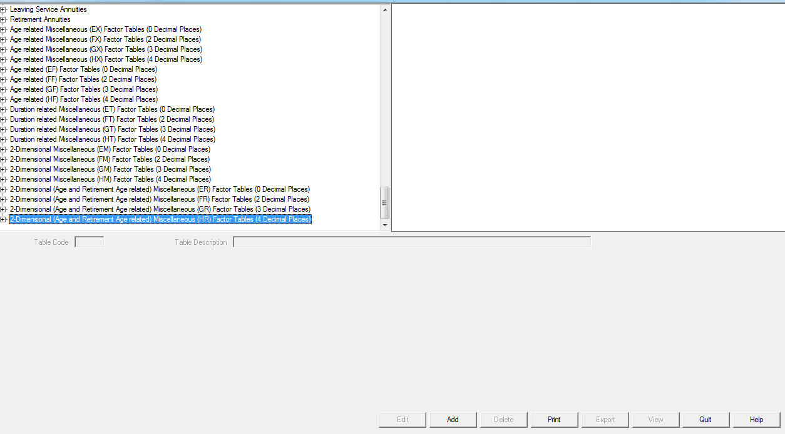
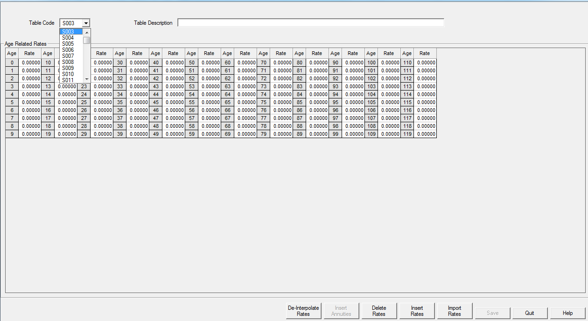
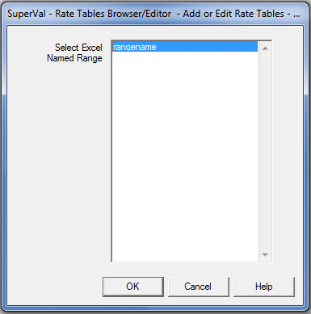
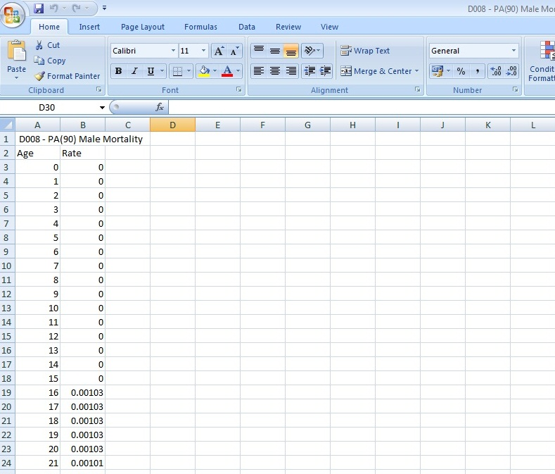
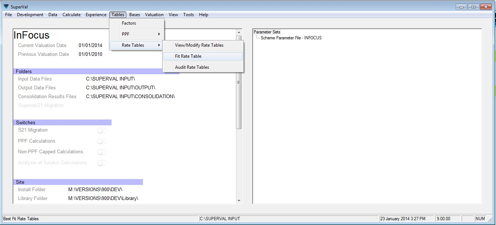
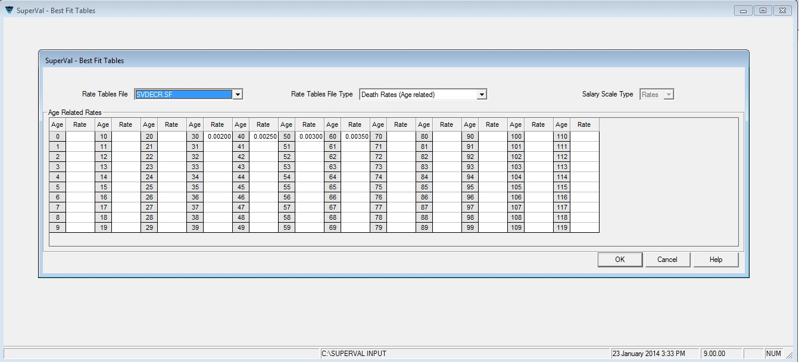

# Using rate tables

Rate Tables are defined in SuperVal and can either be entered manually
or imported from Excel. Rate Tables can also be exported out of SuperVal
to either a CSV file or an XLS file. This article explains how to do it.
It is relevant for the actives, deferreds and pensioners modules.

!!! info "This article is based on V9.25 of SuperVal."

    Any screenshots from previous versions are not materially different.

## Setting up rate tables

In SuperVal V9.20, the Rate Table functionality is found under:
_Tables>Rate Tables>View/Modify Rate Tables_ from the Main Menu.

This will open the Rate Table Browser screen. The top node shows the
Decrement File that is being displayed. Each type of Rate Table has a
parent node with a description of the Rate Tables below. Rate Tables are
displayed in the following order:

    Death Rates
      Age
      Age and Service
      Select
    Mortality Improvement Rates
      Age and Term from Base Year
    Ill Health Rates
      Age
      Age and Service
    Leaving Service Rates
      Age
      Age and Service
    Retirement Rates
      Age
      Age and Service
      Age and Retirement Age
    Promotional Salary Scales
      Age
      Service
    Durational Leaving Service Weights
    Proportions Married
    Age Difference (primary-spouse) Tables
    New Entrant Tables
      Proportions
      Salaries
    Contributions Salary Bands
      Duration related
    Death Annuities
    Ill Health Annuities
    Leaving Service Annuities
    Retirement Annuities
    Age Related Miscellaneous Factor tables
    Age Related Factor tables
    Durational Related Miscellaneous Factor tables
    2-Dimensional Miscellaneous Factor tables.

Within each type Rate Tables are ordered by Rate Table number.

!!! note "Not all tables are available to all users."

### Add or edit a rate table

Select the class of decrement corresponding to your new table (making
sure if importing that the type of table you have selected has a format
which will correspond with the format of your saved rates in Excel) and
then click the _Add_ button near the bottom of the screen.

This opens the Rate Table screen.

Select the Table Number you wish to use from the drop-down list.
Note the list will only display numbers not already in use.
Enter a description for the table.

Then either enter the rates manually or import the rates from elsewhere.

If entering manually, enter the decrements as required. If using the
Import functionality, click _Import Rates_. This opens up the
Windows file browser. Select the required file from the Library folder and click _Open_.
The imported rates will
be shown in red for review. Click _OK_ if you do not wish to
make any further changes to these rates. Then click _Save_ on the
_Add/Edit Rate Tables_ screen.

The new table will now be available for use in the valuations.

#### Format of Excel rate table for importing

If importing a table from Excel, then the Excel rate table should be in
a format similar to the table being set up.

For one-dimensional decrement tables, Column A represents age (or
duration) and B is the rate applying at each age (or duration).

          A    B
    ------------------
     1    0    0.0000
     2    1    0.0001
     3    2    0.0002
     ...  ...  ...
     120  119  0.7000
     121  120  0.9000

If you wish, you may include a descriptive header as the first record.

Note that these rates have four decimal places and therefore you would be
able to import them into a SuperVal rate table with format `F5.4` or
wider. (See [Allowable Tables](#allowable-tables) below for the different formats of
SuperVal rate table types.) If you import rates into a table with a
format that has fewer decimal places than the source file, the values
are rounded to fit.

Once the rates are in the correct format then select _File \> Save As_.
The file saved must be saved as a file type `Formatted Text (Space
delimited)` or `Text (Tab delimited)`. Saving as this type of file will
automatically give the filename the extension `.prn`. Once the table has
been saved, close and return to SuperVal.

For two-dimensional tables, SuperVal will import directly from Excel
(i.e. without saving as a Formatted Text (Space delimited) file) and
will assume age goes down the table and duration across.
Where the data in Excel has additional decimal places, SuperVal will
round the figure appropriately.

Alternatively you can use the named range functionality in SuperVal.

You may also use the Import facility when editing an existing table.

#### Using a named range in Excel

Alternatively you can name the range of cells in the Excel worksheet
that correspond to the rate table to be imported.

This provides the flexibility to create tables anywhere in the
spreadsheet and also to have multiple tables in one spreadsheet. Save the
Excel workbook in the standard `.xls` format.

When importing rate tables from an Excel workbook which contains one or
more named ranges, SuperVal will prompt you to select the
appropriate range:

### Exporting rate tables

SuperVal V9 was extended to include the ability to export a rate table
to Excel.

Within the Rate Table menu select the Rate Table you wish to Export and
then click _Export_. Then select whether to export as a
CSV file or an XLS file, type in a file name for the exported rate
table file, and click _OK_. The exported Rate Table will be found in the
Library folder of SuperVal.

### Fit a Rate Table

V9.00 allows the user to search the existing Rate Tables before entering
a new one to see if it already exists. This is accessed from _Tables \>
Rate Tables \> Fit Rate Table_.

Select the type of Rate Table to search (i.e. death,
retirement) and then type a selection of rates into SuperVal and click
_OK_. The minimum points of reference is 4.

SuperVal will return a list of best-fit tables with the required Age
Rating and % Rating, along with the rates that using this table would
produce.

### Allowable tables

The formats for the different types of rate tables are set out below.
The format is defined as the number of figures followed by the number of
figures after the decimal place ie `F5.3` format is a five-digit number
with last three digits being decimals.

| prefix | description                                                       | format | range           |
|--------|-------------------------------------------------------------------|--------|-----------------|
| D      | Death decrement rates (age related)                               | F5.5   | 0 to 0.99999    |
| DM     | Death decrement rates (age and service related)                   | F5.5   | 0 to 0.99999    |
| DS     | Death decrement rates (select)                                    | F5.5   | 0 to 0.99999    |
| I      | Ill health decrement rates (age related)                          | F5.5   | 0 to 0.99999    |
| IM     | Ill health decrement rates (age and service related)              | F5.5   | 0 to 0.99999    |
| L      | Withdrawal decrement rates (age related)                          | F5.5   | 0 to 0.99999    |
| LM     | Withdrawal decrement rates (age and service related)              | F5.5   | 0 to 0.99999    |
| MM     | Mortality Improvement Rates (age and term from base year related) | F10.9  | 0 to 1.1        |
| R      | Retirement decrement rates (age related)                          | F5.5   | 0 to 0.99999    |
| RM     | Retirement decrement rates (age and service related)              | F5.5   | 0 to 0.99999    |
| RR     | Retirement decrement rates (age and retirement age)               | F5.5   | 0 to 0.99999    |
| S      | Salary Scale (age related)                                        | F5.5   | -0.9 to 0.99999 |
| ST     | Salary Scale (service related)                                    | F5.5   | -0.9 to 0.99999 |
| T      | Duration weighting                                                | F6.4   | 0 to 99.9999    |
| H      | Proportion Married                                                | F5.4   | 0 to 1          |
| AD     | Age Difference Tables                                             | F1.0   | 0.9 to 9        |
| CM     | Contributions Salary Bands (Duration related)                     | F7.0   | 0 to 9999999    |
| NE     | New Entrants Proportions                                          | F6.0   | 0 to 999,999    |
| NS     | New Entrants Salaries                                             | F7.0   | 0 to 9,999,999  |
| DA     | Death Annuities                                                   | F5.3   | 0 to 99.999     |
| IA     | Ill health Annuities                                              | F5.3   | 0 to 99.999     |
| LA     | Leaving Service Annuities                                         | F5.3   | 0 to 99.999     |
| RA     | Retirement Annuities                                              | F5.3   | 0 to 99.999     |

There are miscellaneous tables as follows:

| prefix | description                           | format | range               |
|--------|---------------------------------------|--------|---------------------|
| EX     | Age related miscellaneous tables 0 dp | F7.0   | 0 to 9,999,999      |
| FX     | Age related miscellaneous tables 2 dp | F9.2   | 0 to 9,999,999.99   |
| GX     | Age related miscellaneous tables 3 dp | F10.3  | 0 to 9,999,999.999  |
| HX     | Age related miscellaneous tables 4 dp | F11.4  | 0 to 9,999,999.9999 |
| EF     | Age related tables 0 dp               | F7.0   | 0 to 9,999,999      |
| FF     | Age related tables 2 dp               | F9.2   | 0 to 9,999,999.99   |
| GF     | Age related tables 3 dp               | F10.3  | 0 to 9,999,999.999  |
| HF     | Age related tables 4 dp               | F11.4  | 0 to 9,999,999.9999 |
| EM     | 2 Dimensional tables 0 dp             | F7.0   | 0 to 9,999,999      |
| FM     | 2 Dimensional tables 2 dp             | F9.2   | 0 to 9,999,999.99   |
| GM     | 2 Dimensional tables 3 dp             | F10.3  | 0 to 9,999,999.999  |
| HM     | 2 Dimensional tables 4 dp             | F11.4  | 0 to 9,999,999.9999 |
| ET     | Duration related tables 0dp           | F7.0   | 0 to 9,999,999      |
| FT     | Duration related tables 2 dp          | F9.2   | 0 to 9,999,999.99   |
| GT     | Duration related tables 3 dp          | F10.3  | 0 to 9,999,999.999  |
| HT     | Duration related tables 4 dp          | F11.4  | 0 to 9,999,999.9999 |

The miscellaneous tables can be used for any purpose. However, SuperVal
will require the use of a certain type of rate table in two areas. These
are on the _Slices>Tiers_ and relate to:

-   Accelerated Service tables must be an `ET` type rate table.
-   Service Related Accrual must be a `ET`, `FT`, `GT` or `HT` type rate table.

