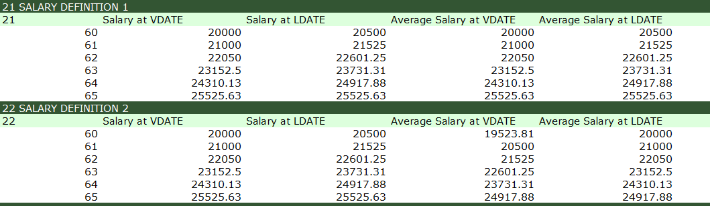
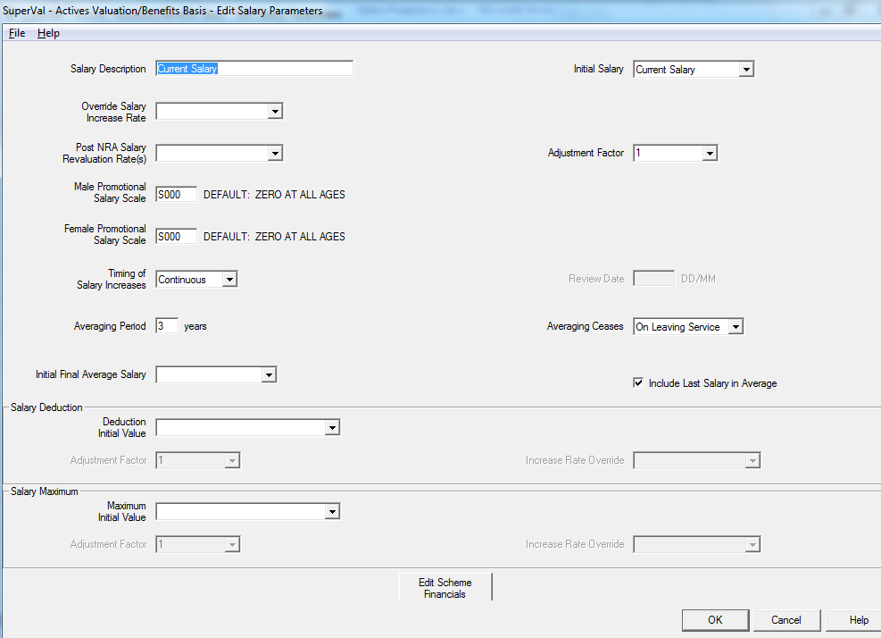
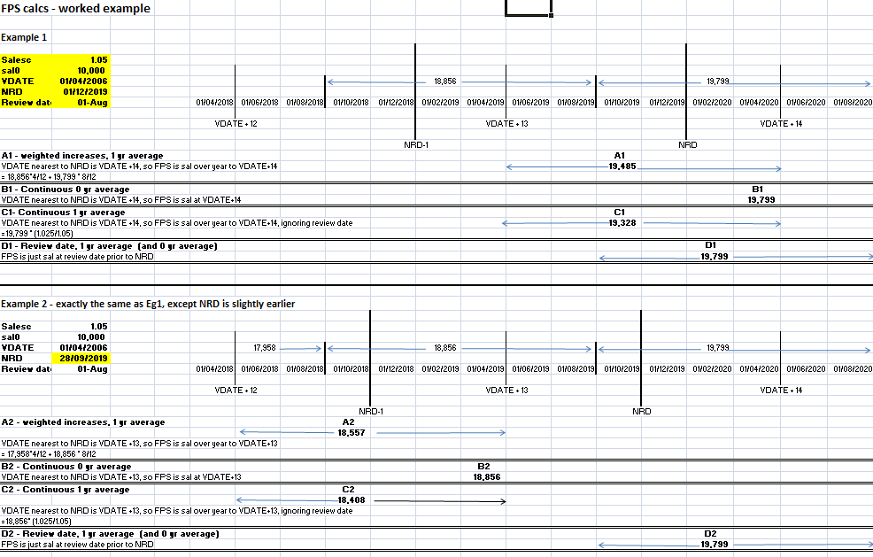
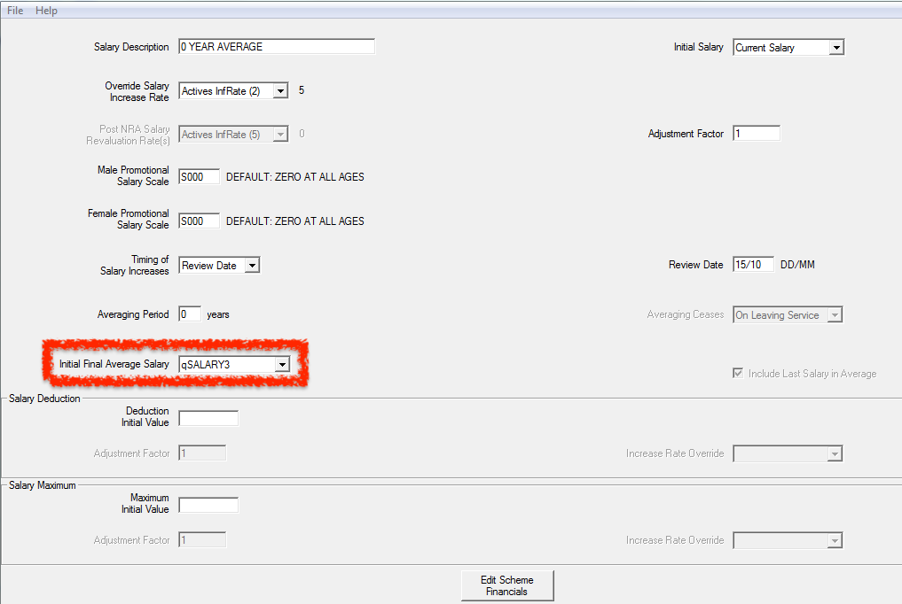
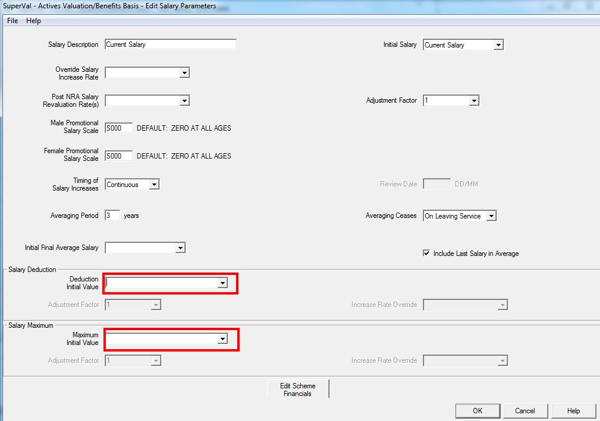
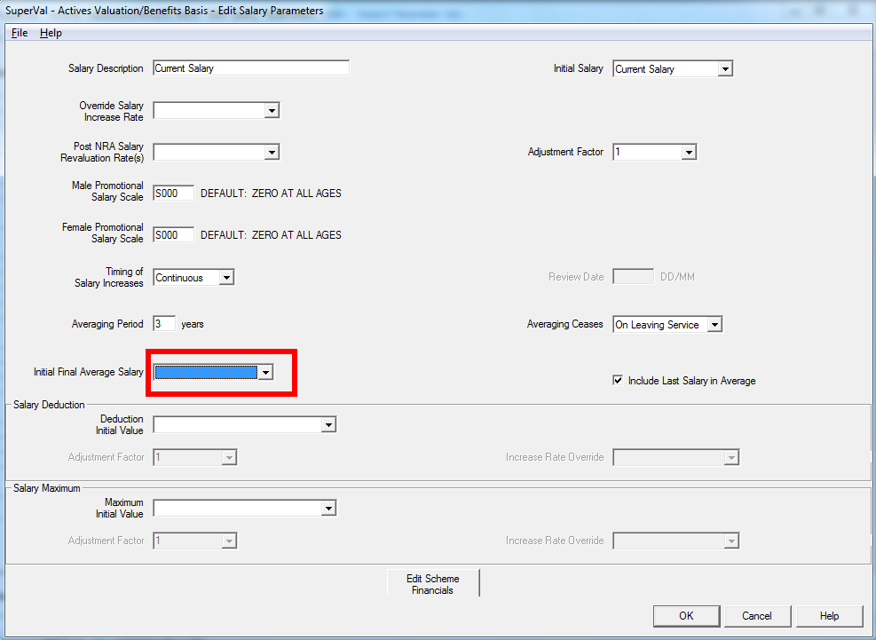

# Salary projections

This article covers the Salary Projections for the Actives Module.

SuperVal has a number of different options for defining salaries for
Active members. This article explains how to use these different parameters.

SuperVal allows you to define up to nine different salaries. Within each
salary definition, there is substantial flexibility, designed so you
can allow for different types of averaging as well as different
caps and offsets. You can also to take account of current Final
Pensionable Salary (FPS) when calculating FPS at later dates.

!!! info "This article is based on V9.25 of SuperVal." 

    Any screenshots from earlier versions are not materially different.

## VarPrints

The VarPrint (or AccPrint for accrued calculations) sets out in detail
how the salary is projected under each of the salary projections coded
for a particular member (or members).

The VarPrint/AccPrint is obtained by:

-   When setting up the data file to be used adding a star in the last
    column for the member you wish to review.
-   When setting up a Valuation Batch select either `Limited` or `Full`
    for the Test Valuation Run field. Selecting Limited will produce an
    individual member print with data for every fifth age between
    Valuation Date and Normal Retirement Date. Selecting Full will produce
    an individual member print with data for every age between Valuation
    Date and Normal Retirement Date.

The VarPrint can be opened in either Excel or HTML and the section which
shows the salary projections in section 2$n$ where $n$ is the salary number.
Below is an illustration of the output for salaries 1 and 2.

The first two columns show projected salaries at each age without any
averaging. LDATE is mid-year, except for year of retirement, where it
is averaged over the same period as the VDATE figure. See Appendix for
worked examples.

## Averaging-period options

### Explanation and examples of calculations of FPS and NRD

All the examples in this section are based on a 1-year averaging period. There are examples of longer averaging periods in section 4.

Below is a screenshot showing the salary definition screen:

Initial Salary

: Enter details of the current salary.

Override Salary Increase Rate

: You can enter an override for the main salary increase rate entered
on the _Financial_ tab. This will only apply to this salary definition.

Promotional Scale

: You can enter a promotional scale that will be applied in addition to the main salary increase rate.

    This can either be an age-related Promotional Scale (`Sxxx` table) or a
    Service-Related Promotional Scale (`STxxx` table). The Service-Related
    Promotional Scale is only available to GAD Users.

Timing of Salary Increase and Review Date

: SuperVal gives you three options for averaging. These are:

    Weighted Average

    : This works out the Final Pensionable Salary over the relevant period up to the VDATE anniversary nearest NRD, taking account of the review date specified. (You must enter a Review Date.)

    Review Date

    : This will average salary over the number of review dates specified, with the last salary used being the one on the review date before the actual NRD.

    Continuous

    : This is like weighted, i.e. it works out Final Pensionable Salary over the averaging period ending on the VDATE anniversary nearest NRD, but it ignores the review date. Instead it uses the averaging period given and then adjusts by (1+½S) ÷ (1+S). (Unless averaging period is zero, in which case no averaging is applied).

Averaging Period

: Enter the averaging period (in whole years) that SuperVal should use.

Averaging ceases on

: Select from either the point of exit or Normal Retirement Date.

Include the Last Salary in the Averaging Period?

: If unchecked, then SuperVal will add 2 years to the averaging period above. If checked, then the salary is averaged only over the period specified.

    For example, checked and a 5-year averaging period is the same as
    unchecked and a 3-year averaging period. (They would both result in a
    salary being on average 2.5 years ago.)

Salary Deductions

: Enter a Deduction Initial Value, any adjustment factor and/or a Global Parameter that contains the rate of increase for the Deduction.

Salary Maximum

: Enter a Maximum Initial Value, any adjustment factor and/or a Global Parameter that contains the rate of increase for the Maximum.

### Worked example of calculation of FPS and NRD

The next page shows how Final Pensionable Salary (FPS) is calculated for
each of salaries shown below. The calculations have been shown for two
members, who are identical except for their Date of Birth. They have
been set so that the Valuation Date anniversary closest to NRD is the
one AFTER NRD for member 1 and the one BEFORE NRD for member 2.

Relevant details are:

Description                        | Member 1                       | Member 2
-----------------------------------|--------------------------------|---------
Salary Escalation                  | 5%
VDATE                              | 01/04/2006
Salary at VDATE                    | £10,000
Review Date                        | 1 August
Salary over year ending 01/08/2018 | 10,000 × 1.05^12^ = £17,958
Salary over year ending 01/08/2019 | 10,000 × 1.05^13^ = £18,856
Salary over year ending 01/08/2020 | 10,000 × 1.05^14^ = £19,799
NRD                                | 1 December 2019                | 28 September 2019

### Using the Initial Final Average Salary field

If a member is due to leave or retire from the scheme soon after the
valuation date then in order to calculate Final Pensionable Salary
(FPS), SuperVal will need to know what the member’s salary was in the
year(s) before VDATE.

For example:

    Member Aged 65 = NRA
    Salary at VDATE = £10,000
    FPS is based on a 3-yr average (Review Date)
    Salary Escalation is 5%

In this case, SuperVal will calculate Final Pensionable Salary at
retirement as:

              £10,000   £10,000
    £10,000 + ------- + -------
                1.05     1.05²
    ---------------------------   = £9,531
                 3

SuperVal effectively rolls back the current salary using the escalation
rate provided to determine Final Pensionable Salary.

There will be some instances where you assume a high proportion of
members leaving or retiring close to the VDATE (in particular for
discontinuance and PPF Valuations), and to cater for this, SuperVal
allows you to specify what the actual FPS at VDATE is. The data item is
specified in the _Initial Final Average Salary_ field.

If present, this data item will override the Source Data Item for PPF
and discontinuance runs (i.e. when date of exit from the Scheme is
VDATE). For exit dates after VDATE, SuperVal will blend the two data
items as appropriate.

For example:

    FPS at VDATE = £30,000
    Current Salary = £40,000
    FPS is based on 3 year average

Ignoring increases, FPS for a member due to retire on VDATE will just be £30,000

FPS for a member due to retire in 1 year

: `(£30,000 + £30,000 + £40,000) ÷ 3 = £33,333.33`

FPS for a member due to retire in 2 years

: `(£30,000 + £40,000 + £40,000) ÷ 3 = £36,667.67`

FPS for a member due to retire in 3 years

: `(£40,000 + £40,000 + £40,000) ÷ 3 = £40,000`

### Promotional salary scale

Each salary definition in SuperVal allows you to specify a Promotional
Salary Scale for both males and females. This is an age-related scale,
which may be used for example to allow for salaries to increase at a
higher rate for younger members.

One important note is that SuperVal will use the member’s age nearest
VDATE in order to determine which factor to use for the first salary
increase after VDATE:

Say the scale is:

     Age  Salary Scale
    -------------------
      57     -0.10
      58     -0.05
      59      0.05
      60      0.10

Using the following data

                            Member 1
    ---------------------------------------------
    VDATE                   1 April 2006
    Review Date             31 December
    Averaging Period        1 year (Review Date)
    Salary                  £10,000
    Salary Increase Rate    5%
    NRA                     60

#### Member 1

DOB

: 01/01/1948; so age at VDATE = 58.00 (age nearest 58)

FPS 

: = Salary at review date prior to NRD (31/12/2007) 
= £10,000 × 1.05^2^ × (1 + SF~58~) × (1 + SF~59~) 
= £10,000 × 1.05^2^ × 0.95 × 1.05 
= £10,997

#### Member 2

DOB

: 29/09/1948; so age at VDATE = 58.48 (age nearest 58)

FPS

: = Salary at review date prior to NRD (31/12/2007) 
= £10,000 × 1.05 × (1 + SF~58~) × (1 + SF~59~) 
= £10,997

Note that SuperVal uses the Promotional Scale at age 58
for the increase due on 31 December 2006 despite the fact that the
member is actually over 59 on that date.

## Offset and capping options

For each salary defined, SuperVal allows you to specify either a
deduction and/or a maximum amount.

If no increase rate is entered then the maximum and the deduction will be increased in line with the salary-increase rate entered in the _Override Salary Increase Rate_ specified above or the value entered for the _Salary Increase Rate_ on the _Financial Assumptions_ tab if this is blank.

### Order of the maximum and the deduction

Note that

-   the maximum will always be applied before the deduction.
-   Averaging Period and Review Date/ Continuous/ Weighted apply when
    calculating the maximum
-   Averaging Period and Review Date/ Continuous/ Weighted also apply
    when calculating the deduction.
-   The maximum is applied by comparing FPS based on Maximum Amount with
    FPS based on “Source data item” i.e. you do _not_ compare each year’s
    salary to the maximum and take the greater of the two.

The above points are illustrated by the worked example below.
This starts off with one of the definitions used in the earlier
example, and then looks at various combinations of averaging period,
deduction and maximum.

### Worked example

Showing how deduction and maximum are applied.

Calculate FPS at NRD for each of the salary definitions given below for
a member with the following details:

    VDATE    1 April 2006
    NRD      1 December 2019
    SAL0     £10,000
    Assume Salary escalation of 5% p.a.

| Salary Projection Information  | Salary1               | Salary2               | Salary3               | Salary4               | Salary5               | Salary6               |
|--------------------------------|-----------------------|-----------------------|-----------------------|-----------------------|-----------------------|-----------------------|
| Initial Salary                 | Current Salary (Data) | Current Salary (Data) | Current Salary (Data) | Current Salary (Data) | Current Salary (Data) | Current Salary (Data) |
| Override Salary Increase Rate  |                       |                       |                       |                       |                       |                       |
| Averaging Period               | 1                     | 3                     | 3                     | 1                     | 1                     | 1                     |
| Averaging Ceases               | On Leaving Service    | On Leaving Service    | On Leaving Service    | On Leaving Service    | On Leaving Service    | On Leaving Service    |
| Timing of Salary Increases     | Weighted              | Weighted              | Weighted              | Weighted              | Weighted              | Weighted              |
| Review Date                    | 01/08                 | 01/08                 | 01/08                 | 01/08                 | 01/08                 | 01/08                 |
| Include Last Salary in Average | Yes                   | Yes                   | Yes                   | Yes                   | Yes                   | Yes                   |
| Adjustment Factor              | n/a                   | n/a                   | n/a                   | n/a                   | n/a                   | n/a                   |
| Deduction Initial Value        |                       |                       | 5,000                 |                       | 5,000                 | 0                     |
| Deduction Increase Rate        | n/a                   | n/a                   | 5%                    | n/a                   | 5%                    | n/a                   |
| Deduction Adjustment Factor    | 1.0                   | 1.0                   | 1.0                   | 1.0                   | 1.0                   | 1.0                   |
| Maximum Initial Value          |                       |                       |                       | 19,000                | 19,000                | £5,000                |
| Maximum Increase Rate          |                       |                       |                       | 0%                    | 0%                    | 5%                    |
| Maximum Adjustment Factor      | 1.0                   | 1.0                   | 1.0                   | 1.0                   | 1.0                   | 1.0                   |

**Solution**

           Member 1
    ----------------
    Sal0   10,000
    Sal1   10,500
    ...    ...
    Sal11  17,103
    Sal12  17,959
    Sal13  18,856
    Sal14  19,799

FPS1

:  $= \frac{8}{12} × Sal14 + \frac{4}{12} × Sal13$

    $= 19,485$

FPS2

: $= (\frac{8}{12} × Sal14 + Sal13 + Sal12 + \frac{4}{12} × Sal11) ÷ 3$

    $= 18,572$

FPS3

: $= \frac{FPS2}{2}$

    $= 9,286$

    The Deduction is half of the basic salary and has the same increase
    rate. The fact that FPS3 is half of FPS2 shows that the 3-year
    averaging period is applied to the deduction as well as the basic
    salary.

FPS4

: = Maximum Salary = 19,000

    SuperVal does _not_ compare maximum with each year’s salary when
    calculating FPS.

    So FPS4 is **not** $\frac{8}{12} \times \min(8856, 19000) + \frac{4}{12} \times \min(19,799, 19000) = £18,904$.

    Instead, it compared FPS based on basic salary with the FPS based on
    the maximum amount.

    So $FPS4 = \min(19485, 19000)$

FPS5

: $= FPS4 – \frac{FPS1}{2} = 9,257$

    Shows that the maximum is applied _before_ the deduction.

FPS6

: $= \frac{FPS1}{2} = 9,742$

    Shows that the averaging period is also applied to the maximum.

## Algebra and worked examples

Showing how all salaries are projected in the VarPrint

### Notation

$n$

: The averaging period

$j$

: The rate of salary increase

$FAF$

: The Final Averaging Factor over $n$ years:

    Review-date increases:

    $$\frac{\ddot{a}^{j}_{n}}{n}$$

    Continuous increases: ^†^

    $$\frac{1+½j}{1+j} \times \frac{\ddot{a}^{j}_{n}}{n}$$ 

$S$

: The pensionable salary at valuation date

$t$

: Under review-date increases, the number of review-date anniversaries from the valuationdate to NRD. For the continuous-increases case, $t$ is the number of years from the valuation date to the anniversary of the valuation date nearest the NRD.

$S_x(C)$

: The salary figure at age $x$ under column C.

**Note**
When n = 0 the FAF = 1.

^†^ The formula for the continuous-increases FAF comes from the following:

$$\frac{1}{2} \left[\frac{1}{n} (1 + \frac{1}{1+j} + … + \frac{1}{(1+j)^{n-1}}) + \frac{1}{n} (\frac{1}{1+j} + \frac{1}{(1+j)^2} + … + \frac{1}{(1+j)^n})\right]$$

### Review-date increases

The salary projections, as they appear in VarPrint are as follows:

Age        | Salary at VDATE (A)   | Salary at LDATE (B)               | Average Salary at VDATE (C) | Average Salary at LDATE (D)
-----------|-----------------------|-----------------------------------|-----------------------------|----------------------------------
$x$        | $S$                   | $S[1+a.j]$                        | $S.FAF$                     | $S_x(C).[1+ a.j]$
$x+1$      | $S(1+j)$              | $S(1+j)[1+a.j]$                   | $S(1+j).FAF$                | $S_{x+1}(C).[1 + a.j]$
$x+2$      | $S(1+j)^2$            | $S(1+j)^2[1+a.j]$                 | $S(1+j)^2.FAF$              | $S_{x+2}(C).[1+a.j]$
…          | …                     | …                                 | …                           | …
NRA        | $S(1+j)^t$            | $S(1+j)^t$                        | $S(1+j)^t.FAF$              | $S_{NRA}(C)$

$a$ is the proportion of a year, working in days, to represent the time
between the review date and the valuation date (or its next
anniversary). If the review date and the valuation date coincide then
$a=0$.

### Continuous increases

The salary projections, as they appear in VarPrint are as follows:

Age   | Salary at VDATE (A)   | Salary at LDATE (B)             | Average Salary at VDATE (C) | Average Salary at LDATE (D)
------|-----------------------|---------------------------------|-----------------------------|----------------------------
$x$   | $S$                   | $S(1+½j)$                       | $S.FAF$                     | $S_x(C)(1+½j)$
$x+1$ | $S(1+j)$              | $S(1+j)(1+½j)$                  | $S(1+j).FAF$                | $S_{x+1}(C)(1+½j)$
$x+2$ | $S(1+j)^2$            | $S(1+j)^2(1+½j)$                | $S(1+j)^2.FAF$              | $S_{x+2}(C)(1+½j)$
…     | …                     | …                               | …                           | …
NRA   | $S(1+j)^t$            | $S(1+j)^t$                      | $S(1+j)^t.FAF$              | $S_{NRA}(C)$

###

####

### Weighted review increases

The salary projections, as they appear in VarPrint are as follows:

Age   | Salary at VDATE (A)  | Salary at LDATE (B)              | Average Salary at VDATE (C)            | Average Salary at LDATE (D)
------|----------------------|----------------------------------|----------------------------------------|----------------------------
$x$   | $S$                  | $S[1+a×j]$                       | $S.FAF.[1+a×j]÷(1+j)$                  | $Sx(C)×(1+½j)$
$x+1$ | $S(1+j)$             | $S(1+j)[1+ a×j]$                 | $S.FAF.[1+a×j]$                        | $Sx+1(C)×(1+½j)$
$x+2$ | $S(1+j)^2$           | $S(1+j)^2[1+a×j]$                | $S(1+j).FAF.[1+a×j]$                   | $Sx+2(C)×(1+½j)$
…     | …                    | …                                | …                                      | …
NRA   | $S(1+j)^t$           | $S(1+j)^t$                       | $S(1+j)^{t-1}.FAF.[1+a×j]$             | $S_{NRA}(C)$

### Final Average Salary data source

This field works in conjunction with any of the three salary increase
methods.

SuperVal will take the current-salary data item, the accurate final-average
data item and calculate the projected final average salary as
follows.

 &nbsp; | &nbsp;
--------|---------------------------------------------------------------
 $z$    | Averaging period applicable
 $fasn$ | Final average salary calculated from current salary at time $n$
 $FASO$ | Accurate final average salary at the valuation date
 $FASn$ | Final average salary used in SuperVal $= fasn + (FASO – faso).\frac{(z-n)}{z}$

The final term $\frac{(z-n)}{z}$ has a minimum value of zero.

For example, say that:

    Current salary is £10,000
    FAS data source is £30,000
    Salary escalation is 5% pa
    3-year average period
    Member is one year from retirement

**Step 1** Calculate average salary at VDATE and retirement, based on
current salary alone:

at VDATE: $\frac{1}{3} × (10,000 + \frac{10,000}{1.05} + \frac{10,000}{1.05^2}) = £9,351.37$

at retirement: $\frac{1}{3} × (10,000 × 1.05 + 10,000 + \frac{10,000}{1.05}) = £10,007.94$

**Step 2** Calculate excess of actual Final Average Salary over the
estimated figure as at VDATE:

$$£30,000 - £9,351.37 = £20,468.63$$

**Step 3** Spread this amount over the averaging period and add it on to
the original figure:

Final Av sal at ret = $£10,007.94 + 20,468.63 × \frac{2}{3} = £23,653.69$

Using the notation from above:
<!-- FIXME Faso? -->

    fasn = £10,007.94
    FASO = £30,000
    Faso = £9,351.37
    z = 3 and n = 1

## Appendix – examples

    Data                                     Value
    -----------------------------------------------------------------
    DOB                                      1 December 1959
    NRD                                      1 December 2019
    Salary at the VDATE (SAL0)               £10,000
    Definition of Final Pensionable Salary   Average of last 3 years
    VDATE                                    1 April 2006
    Salary Increase Rate                     5%

### Review Date Increases

Suppose that the review date is 01 August each year.

Then the VarPrint will show the projection of the salary as follows:

Age   | Salary at VDATE (A) | Salary at LDATE (B) | Average Salary at VDATE (C) | Average Salary at LDATE (D)
------|---------------------|---------------------|-----------------------------|----------------------------
46    | 10,000              | 10,333              | 9,531                       | 9,849
47    | 10,500              | 10,850              | 10,008                      | 10,341
48    | 11,025              | 11,392              | 10,508                      | 10,858
…     | …                   | …                   | …                           | …
60    | 19,799              | 19,799              | 18,871                      | 18,871

The calculated items under notation required here are as follows:

$a = 243 ÷ 365 = 0.665753$ (243 days from review to anniversary of VDATE)

FAF= $\ddot{a}^{5\%}_{3} ÷ 3 = 0.953137$

Examples of some of the calculations above:

&nbsp; | at  | value  | calculation
-------|-----|--------|-----------------------------------------------
A      | 47  | 10,500 | 10,000 × 1.05
B      | 47  | 10,850 | 10,000 × 1.05 × (1 + 0.665753 × 0.05)
C      | 47  | 10,008 | 10,000 × 1.05 × 0.953137
D      | 47  | 10,341 | 10,000 × 1.05 × 0.953137 × (1+ 0.665753 × 0.05)
D      | 60  | 18,871 | 10,000 × 1.05^14^ × 0.953137

Column D would be used for the calculation of the benefit amounts.

### Continuous Increases

If continuous salary increases are allows for then the project becomes
as follows:

| Age | Salary at VDATE (A) | Salary at LDATE (B) | Average Salary at VDATE (C) | Average Salary at LDATE (D) |
|-----|---------------------|---------------------|-----------------------------|-----------------------------|
| 46  | 10,000              | 10,250              | 9,304                       | 9,531                       |
| 47  | 10,500              | 10,763              | 9,770                       | 10,008                      |
| 48  | 11,025              | 11,301              | 10,258                      | 10,508                      |
| ….. | ……….                | ……….                | ……….                        | ……….                        |
| 60  | 19,799              | 19,799              | 18,422                      | 18,422                      |

The calculated items under notation required here are as follows:

FAF = (1.025 ÷ 1.05) × 0.953137 (FAF for review date increases) = 0.930443

Examples of some of the calculations above:

&nbsp; | at  | value  | calculation
-------|-----|--------|-------------------------------------------
A      | 47  | 10,500 |  10,000 × 1.05
B      | 47  | 10,763 |  10,000 × 1.05 × 1.025
C      | 47  | 9,770  |  10,000 × 1.05 × 0.930443
D      | 47  | 10,008 |  10,000 × 1.05 × 0.930443 × (1.05 ÷ 1.025)
D      | 60  | 18,422 |  10,000 × 1.05^14^ × 0.930443

Column D would be used for the calculation of the benefit amount.
