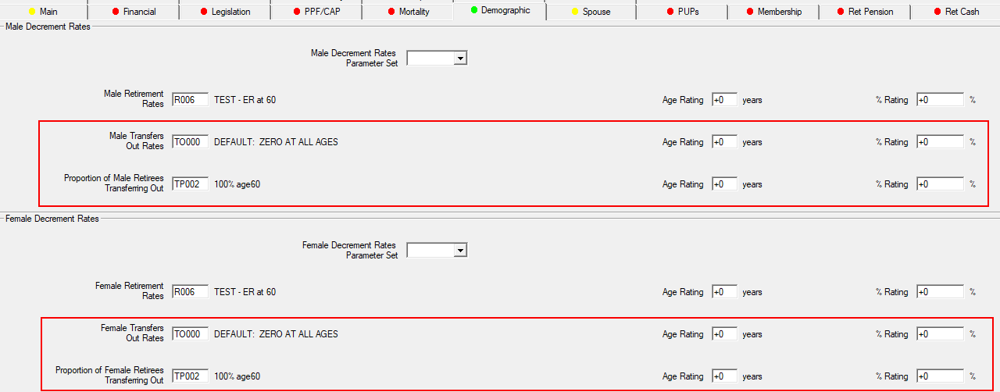
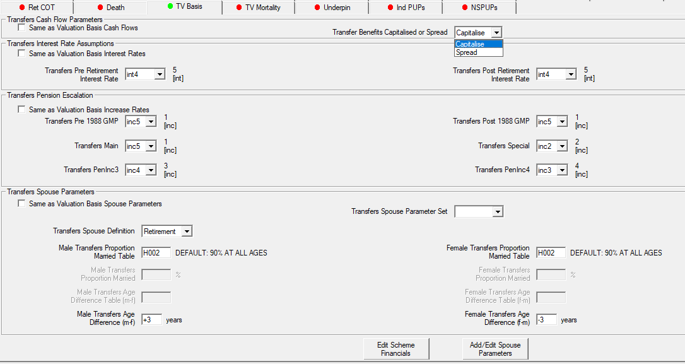
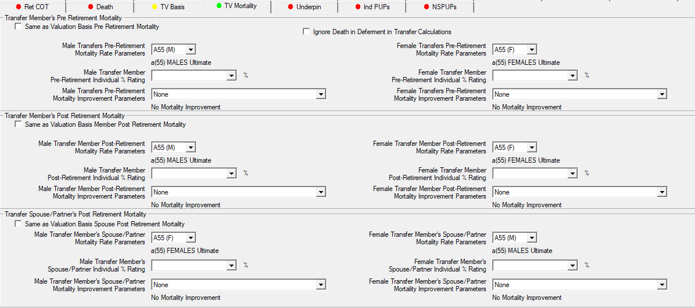
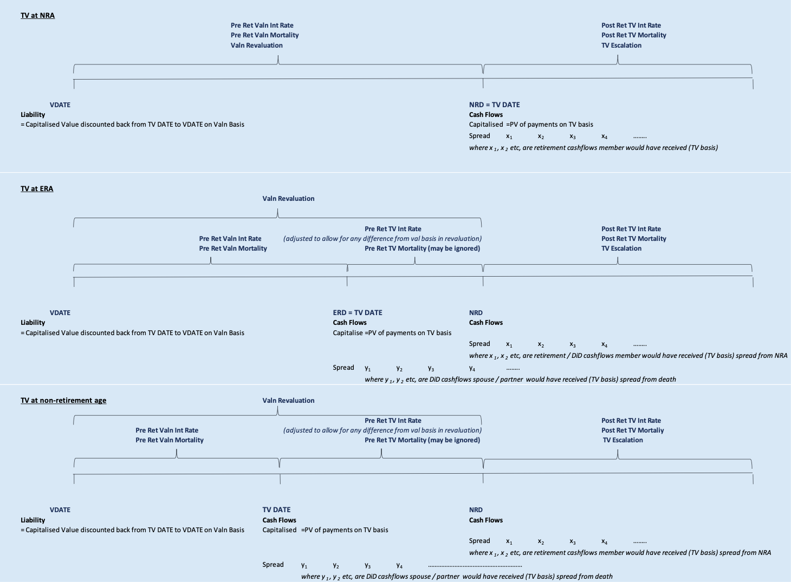
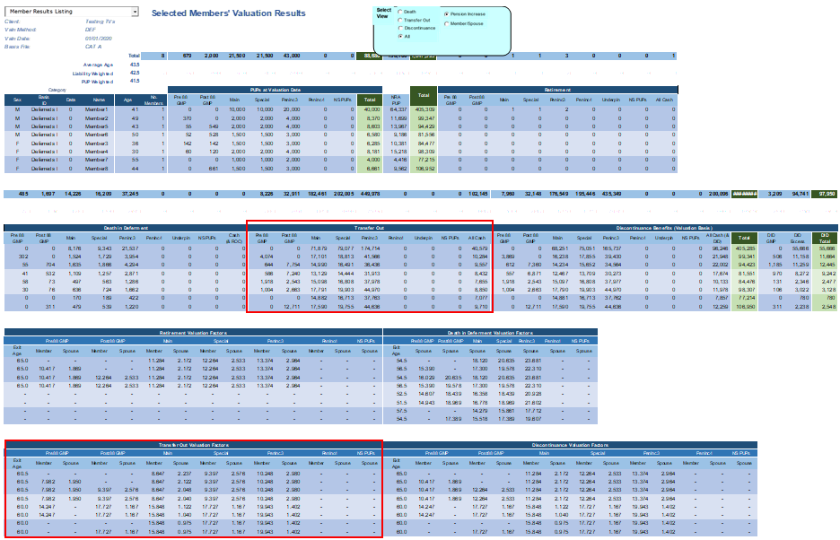
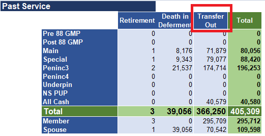

# Transfer values

SuperVal now lets you value Transfer Values for Deferreds.
These calculations will be based on two decrements:

Transfer Out Rates (`TOxxx`)

: Rate of transfers at all ages up to and including Normal Retirement Age.

    Two-dimensional Retirement Age
    related Transfer Out Rates (`TRxxx`) are also available if you are
    valuing different Retirement Ages (within a Category or within a
    Scheme).

Proportion of Retirees Transferring Out (`TPxxx`)

: Proportion of Early Retirements or Normal Retirements who opt to take Transfer Values.

Both can be used in a single category.

## Transfer values for Deferreds

### New fields for transfer values

#### New fields under Demographic

Select the `TOxxx`, `TRxxx` and `TPxxx` tables together with any Age Rating /
% Rating.

#### New fields under new tab TV Basis

You can select the following Transfer Value Basis assumptions:

-   Transfer Benefits are to be capitalised at the date of transfer or to
    be spread from the Normal Retirement Date / Date of Death
-   Pre and Post Retirement Interest Rates
-   Pension Escalation Rates
-   Spouses’ Parameters

All of these can be set (dynamically) to the same values as the
Valuation Basis assumptions via the checkboxes on the left.

As we currently do not hold individual PUPs information (the PUPs are
aggregated by Pension Increase) we are unable to unwind the revaluations
without recalculating all the benefits. Therefore, revaluation rates
used for Transfer Values are the same values as the Valuation Basis. To
approximately reflect any difference between Valuation Basis and
Transfer Value revaluations, a (single) adjustment can be made to the
pre-retirement interest rate assumption.

#### New fields under new tab TV Mortality

You can select Transfer Value Basis mortality assumptions.

These can be set (dynamically) to the same values as the Valuation Basis
assumptions via the checkboxes on the left.

Death in Deferment calculations can be excluded by checking _Ignore
Death in Deferment in Transfer Calculation_.

Note that, consistent with the death in deferment on a Valuation Basis,
the spouse/partner’s post-retirement mortality assumption is used on
pension after deaths between transfer value date and normal retirement
date.

### Calculations for transfer values

The calculation of the Transfer Value is the present value
of the benefits given up, using the transfer-value basis, of which the
assumptions (interest, mortality, proportion married, age difference)
may or may not be the same as the valuation basis. The cashflows may be
capitalised at the date of exit or spread from the date of retirement /
death between transfer date and date of retirement.

The benefits included are:

-   Normal Retirement Pension for the Member
-   Post Retirement pension upon death payable to spouse / partner
-   Pre-Retirement pension upon death payable to spouse / partner
-   Cash benefits – on top only, including any cash payable upon death
-   Underpin^†^

^†^ Underpin is applied at date of transfer, rather than Normal
    Retirement Age or death; this is a known limitation of the Underpin
    code.

Note that Early Retirement Benefits and Cash Commutation are not
included; it is assumed that they would be of less value than Normal
Retirement and therefore should be excluded.

The calculations and assumptions are demonstrated in the diagram below.
(Click to expand.)

### New fields in database and Excel output

#### New database fields

There are ten possible new contingencies with results in `ResultsData`:

    ContingencyID  ContingencyName
    ------------------------------------------------------------------------
    31             Transfer at Voluntary Early Retirement
    32             Transfer at NRA (or later) Retirement
    33             Transfer at Late Retirement
    34             Death after Transfer at Voluntary Early Retirement
    35             Death after Transfer at NRA (or later) Retirement
    37             Transfer Out before Normal Retirement
    38             Transfer Out at Normal (or later) Retirement
    39             Transfer Out at Late Retirement
    40             Death after Transfer Out before Normal Retirement
    41             Death after Transfer Out at Normal (or later) Retirement

#### New fields in Member Results Listing

New fields for Transfer Value components at valuation date and
individual Transfer Out Valuation Factors at average age of exit.

Note that the proportion of the Spouses’/Partners’ Transfer Out
Valuation Factors for death in deferment do not allow for revaluation.

#### New fields in Tabulated Total Results Listing

New fields for Transfer Value components at valuation date.

#### New column in Cash Flows

If spread, the Transfer cash flows will begin from NRD or from death
between date of transfer and NRD (if death in deferment is included)

If capitalised, the cash flow will be at the TV date.

#### New tables in Table Basis ID

The `TOxxx`, `TRxxx` and `TPxxx` tables will be output here.

