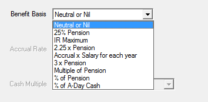

# Valuing cash benefits

Some schemes will pay cash benefits on retirement or death in addition to pension benefits or by commuting pension for cash amounts. This note sets out how to value these benefits in SuperVal.

!!! info "This article is based on version 9.25 of SuperVal."

!!! tip "Client Code"

    Users with Client Code 3 have more flexibility in valuing cash benefits than  with Client Code 0. 

    Setups are considered for both client codes in this article.

This article does not include specific details of how to set up or value cash benefits for PPF runs and capped non-PPF runs.

:fontawesome-solid-hand-point-right:
[PPF S179 (Levy) Valuations](../ppf-s179/index.md)
 
:fontawesome-solid-hand-point-right:
[Non-PPF Capped Runs](../non-ppf-capped-runs/index.md)

## Overview

### Actives

Post-Retirement cash benefits for active members can be made payable on the following events:

-   Normal & Early Retirement
-   Ill Health Retirement
-   Deferred Normal Retirement

The cash benefit can be provided _either_ on top of pension benefits _or_ through commuting the pension.

!!! tip "Client Code 3 users"

    A combination of _both_ cash on top _and_ cash commuted can be specified if required.

There is flexibility available for specifying which pension is commuted for cash.
Further commutation factors can be specified for each pension increase rate.

Pre-retirement cash benefits are also considered in this article.

### Deferreds

Post-retirement cash benefits for Deferreds can be made payable on:

-   Normal & Early Retirement

As with actives, the retirement cash can be payable _either_ on top of pension benefits _or_ provided through commuting the pension.

!!! tip "Client Code 3 users"

    A combination of _both_ cash on top _and_ cash commuted can be specified if required.

There is, however, no flexibility (as yet) in determining the pension that is commuted for cash and there is only one set of cash commutation factors (CCFs) that can be used.

!!! tip "Client Code 3 users"

    There is the option of commuting main or special pensions first or applying the pro-rata method, and also defining two sets of CCFs.

Pre-Retirement cash benefits are also considered in this article.

## Actives

### (Normal/Early/Deferred) Retirement Cash

The Retirement Cash parameters can be specified on the _Ret Cash_ and _Ret COT_ tabs:

Ret Cash:

Ret COT:

### Ill-health retirement cash

These parameters are specified on the _IH Cash_ tab. The _IH Cash_ tab is very similar to the _Ret Cash_ tab (the fields are the same except for the additional fields _Include Prospective Service?_ and _Male/Female Reduction Factors_):

IH Cash:

IH COT:

### Parameters

#### Options

There are eight cash benefit ‘options’ or ‘types’ for active members:

Neutral or Nil

: No retirement cash benefit will be valued.

25% Pension, 2.25 × Pension, and 3 × Pension

: These can still be used, but have effectively been superseded by `Multiple of Pension` and `% of Pension`, which are more flexible. (See below.)

IR Maximum

: can also still be selected, but is rarely chosen by SuperVal users.

Accrual × Salary for each year

: This option unlocks three fields:

    Accrual Rate

    :  Type in the required accrual rate e.g. 3/80ths = 3.75%

    Salary

    : Select one of the salary projections (1 to 9) specified on the _Salary_ tab to be used for retirement-cash calculation.

    Service

    : There are two options to choose from:

            M – Scheme Membership
            S – Company Service

        Where option `M` is selected SuperVal will calculate service using standard date data item `DJF – DoJ Scheme`.
        So ensure `DJF` is specified in your data format and in your data for this option.

        Where option `S` is selected SuperVal will calculate service using standard data date item `DJS – DoJ Company`.
        So ensure `DJS` is specified in your data format and in your data for this option.

        NB: If there is no Slice 1 then there will be no future-service cash calculated.

    **Maximum Service**
    The setting for the service _Maximum_ on the _Retirement_
    tab will apply to the _Service_ calculation for the 3/80ths cash
    benefit.

    **Added Years** will not be included in the service calculation for the
    `Accrual × Salary for each year` option unless the data items `DJF` or
    `DJS` are backdated as appropriate.

Multiple of Pension or % of Pension

: Enter either the multiple or percentage that applies.

    You can also specify member-specific multiples/percentages within
    the CSV file and select the relevant data item for the _Cash
    Multiple_ or _Cash Percentage_ field.

% of A Day Cash

: :fontawesome-solid-hand-point-right: [A-Day Cash](../a-day-cash/index.md)

Include Prospective Cash?

: This field appears for *Ill Health Retirement Cash* benefits only.

    By answering `Yes` the prospective (exit to NRD) service multiplied by the Future Service Fraction will be included in the cash calculation.

Reduction Factors (Male & Female)?

: These fields appear for *Ill Health Retirement Cash* benefits only.

On Top or Commuted?

: Specify whether the cash benefit is `Cash On Top` payable on top of your pension benefits or `Commutation` payable through commutation of the retirement pension.

    The commutation of the pension for the cash benefit is determined by the settings for the fields _Priority_ and _Commutation Tables_.

    !!! tip "A combination of _both_ cash on top *and* cash commuted can be specified, so this field is not included in CC3."

#### Priority

This is used where the pension is commuted for cash. You can specify a priority order for commuting pension for cash.

The options are:

    A – After Split
    B – Before Split
    N – No Priority
    P – Pro Rata

The `Split` in options `A` and `B` refer to the Slice `Not After Date` for the _Offset Slice No._ specified on the _Financial_ tab.

Typically an active member will have a service timeline as shown in the following diagram:

After Split

: In the above timeline priority option `A – After Split` would mean that the pension accruing post 6/4/1997 will be commuted for cash first.

Before Split

: In the above timeline priority option `B – Before Split` would mean that the pension accruing pre 6/4/1997 will be commuted for cash first.

Note that for either of the time periods _After Split_ or _Before Split_ one or more of the pension-increase rates in payment Main, Special, PenInc3 or PenInc4 may apply. (The pension-increase rates Main, Special, PenInc3 and PenInc4 are indicated on the Slices.)

Within the _After Split_ or _Before Split_ time period the cash commutation order of the pension is:

    Special
    Main
    PenInc3
    PenInc4

No Priority

: The cash commutation order is simply by the pension-increase rate order, ignoring time period. In other words:

        Special
        Main
        PenInc3
        PenInc4

    This is regardless of when these pensions have accrued.

Pro Rata

: The pension will simply be commuted for cash in proportion, ignoring pension-increase rate and timing.

    Note that SuperVal calculates the split between pension and cash by pro-rating the pension commuted.

    See Appendix for a worked example.

#### Ignore GMP in Split?

This enables the split between Pre-97 and Post-97 benefit to be done in the correct proportions.

If `Y-Yes` is selected then SuperVal will not take off the GMP from
the Pre-97 benefit before calculating the proportions.

Please note if `Y - Yes` is chosen then GMP may be commuted depending
on the options chosen and the size of the GMP, but will still pay the
whole of the GMP at SPA. This may overstate the liability.

See Appendix for a worked example.

#### Commutation tables

Specify the table codes that contain the cash commutation factors for males and females. These are typically tables with three decimal places i.e. `GX` type rate tables. (Note that you should use mid-year values for ages below NRA – because SuperVal assumes mid-year exits, and does *not* interpolate).

The factors may vary by pension-increase rate. Therefore a different table can be specified for Main, Special, PenInc3 or PenInc4 pension-increase rates. If the Scheme only uses one set of cash commutation factors, specify this table for *all 4* of the pension-increase rates.

!!! tip "Client Code 3 users"

    Cash benefits can also be defined in the _Ind Slices_ tab within each slice for CC3 users.

    By setting the start age and end age as the same (either by specifying the ages on the slice or using a member-specific data item), SuperVal will value the benefit as cash.

Allowing for Maximum Pension Commencement Lump Sum (PCLS)

SuperVal does not currently give users the option to use the maximum PCLS, and so it needs to be valued via the `% of Pension` option. In the majority of cases, the proportion will vary by member, and so you will need to calculate it outside of SuperVal and then use the cash multiple field to define it as a member-specific item.

#### VarPrint

The VarPrint shows in section 1400 the calculation of the Normal & Early Retirement Cash.
Where the Retirement Pension is commuted for Cash, the post-commutation pension is shown in section 1600.
For Leaving Service Cash, this is shown in section 2510.

#### Pre-retirement cash benefits

Cash benefits payable on the death of a member prior to retirement (either on death-in-service (DIS) or death-in-deferment (DID)) can be valued in SuperVal.

:fontawesome-solid-hand-point-right:
[Valuing DIS Benefits](../dis-benefits/index.md)

#### DID cash benefits

 DID benefits can be set up on the _Leaving Service_ tab:

#### Benefit Basis (Males/Females)

There are four options:

None

: Self-explanatory

Return of Contributions

: The benefit includes a return of past contributions, the value is in the `ACW` standard data item, and future contributions as specified in the _Contributions_ tab. It is assumed ACW includes interest to the valuation date (if applicable).

    The _Interest Rate on Service_ on the _Contributions_ tab will apply to withdrawal.
    The _Interest Rate in Deferment_ on the _Contributions_ tab will apply from withdrawal to
    death in deferment.

Return of Contributions if No Spouse

: This is same as `Return of Contributions` except contributions are returned only if there is no spouse on death in deferment. The benefit value is the product of that option and Proportion Married.

Multiple of Pension

: Use this option where a cash benefit is payable on DID which is a multiple of the Deferred Retirement Pension.

## Deferreds

### Ret Cash and Ret COT tabs

Ret Cash:

Ret COT:

The options in the tabs are:

Cash Indicator

: Select whether the retirement cash benefit is payable `On Top` of pension or provided through `Commutation` of the pension.

    !!! tip "Client Code 3 users"
    
        A combination of *both* cash on top *and* cash commuted can be specified, so this field is not included in CC3.

Multiple of Pension

: The cash benefit can be a multiple of the retirement pension. Note that this means the cash amount will have been subject to the same deferred revaluation (excess and GMP) as the pension up to retirement age.

Percentage of pension

: Alternatively, the cash benefit can be a percentage of the retirement pension multiplied by the relevant commutation-table factor.

    Again note that the cash will then be subject to the same deferred revaluation as the pension.

    !!! tip "Client Code 3 users"

        The Cash Multiple or Percentage amount may be input as a member specific data item (within the CSV file) using the relevant FIELD input.

### Commutation table (Males/Females)

Select the cash commutation factor tables applicable. These tables will be used if the cash is provided through commuting the pension or if using the `Percentage of pension` benefit option.

Note that only *one* set of cash factor tables can be specified.
Furthermore, no _Priority_ setting can be specified for Deferreds.
Cash commutation for Deferreds will behave like the actives _Priority_ setting `No Priority` (in other words, by pension-increase rate).
This order is:

    Special increasing pension
    Main increasing pension
    Pen Inc 3
    Pen Inc 4

It is therefore prudent with Deferreds, where more than one pension-increase rate is being used, to set the lowest pension-increase rate as Special. This is to ensure that the ‘cheaper’ pension is used up for commutation for cash first.
See Appendix for a worked example.

!!! tip "Client Code 3 users"

    For CC3 users, *four* sets of CCFs can be defined (for Main, Special, Peninc3 & Peninc4 pensions), and Commutation Priority can also be specified.

### PUPs

Ensure the _Ignore for Cash_ options in the PUPs are set accordingly. These can be useful if any pensions are non-commutable, or if Cash on Top is only provided on certain pensions

### Using Cash Cap

If the cash data item for each member is available you can use the _Cash Cap_ region in the _Retirement Cash_ tab to value the benefit:

Using this section gives complete control over the amount of retirement cash.
The following parameters that can be applied to the cash data item:

    Revaluation Rate
    Complete Years Only (early retirement exits)
    (NRA) Exit Rounding
    % Data Item
    Early Retirement Reduction Factor Table (ERF1 or ERF2)
    Adjustment Factor

Note, however, that this is a Cash *Cap*, i.e. the maximum amount each member can take.
So, to ensure that this data item is valued, the formula on the _Benefits_ screen needs to be set to a rate that will exceed the cash benefit specified in this `Cash Cap` column for every member.

!!! tip "Client Code 3 users"

    Cash benefits can also be defined in the Ind PUPs Tab within each Ind PUP for CC3 users.

    By setting the start age and end age as the same (either by specifying the ages on the PUP or using a member-specific data item), SuperVal will value the benefit as cash.

### Pre-retirement cash benefits

Death-in-Deferment cash benefits can be specified on the _Death_ tab:

Death Cash Multiple

: If a lump sum multiple of Deferred Pension is payable on DID, enter the multiple applicable i.e. enter 5 for 5 × Pension.

Conts Data Item (Plus Conts Data Item)

: If a return of contributions is payable on DID, then choose the data item for this field from the data CSV file. Up to two different contribution amounts can be selected (two separate fields)

Conts Interest Rate (Plus Conts Interest Rate)

: If a return of contributions is payable on DID (specified in the previous field), input the interest rate to apply to the amount (from valuation date to decrement date). Since two separate contribution items can be specified, two separate interest rates can also be specified.

Add/Compare

: If both _Death Cash Multiple_ and (one or more) _Conts Data Item(s)_ are specified, SuperVal can either value all benefits (i.e. add them up) or take the greater of the _Death Cash Multiple_ and the (sum of the) _Conts Data Item(s)_ (i.e. compare them). Select the appropriate option.

## Appendix

### Actives – Pro-rata examples

!!! example "Cash = 25% of pension – Cash Commutation on Retirement"

    -   Member has 10 years’ Past Service (PS) and 10 years’ potential Future Service (FS) to assumed retirement age.
    -   Benefit is accrued uniformly over whole service period, but pension increases in 
        respect of FS are higher than those in respect of PS.
    -   Cash Commutation Factor for PS= 10. Cash Commutation Factor for FS=15.
    -   Assume total projected pension benefit = £20,000.
    -   Assume 25% of pension is commuted.

SuperVal will commute pension as follows:

    Total Pension commuted = 25% of £20,000 = £5,000

This is split in proportion to the pension, so 50% goes to PS and 50% to FS

    PS: Pen comm = £2,500, Cash = £2,500 × 10 = £25,000
    FS: Pen comm = £2,500, Cash = £2,500 × 15 = £37,500

    Total cash                                = £62,500

**Note 1**: SuperVal includes any ERFs or LRFs when working out the
proportion of pension commuted.

**Note 2**: The position is skewed if there is GMP, and _Ignore GMP in
split?_ is set to `No`. The pension commuted is the same, but it’s
assumed only to be taken from excess over GMP pension.
For example, if GMP **at retirement** was £4,000 in the above example,
then total excess is £16,000 (£6,000 PS and £10,000 FS). So:

    PS: Pen comm = £5,000 × 6/16  = £1,875, Cash = £1,875 × 10 = £18,750
    FS: Pen comm = £5,000 × 10/16 = £3,125, Cash = £3,125 × 15 = £47,875

    Total cash                                                 = £65,625

If NRA&lt;SPA, Superval will also check that there is sufficient
residual benefit at SPA to cover GMP – and limit the retirement cash
if necessary.

**Note 3**: Only member’s pension will be commuted. The spouse’s DAR pension is valued based on the pre-commutation pension amounts.

---

!!! example "Cash = 2.25 × Pension"

    -   Member has 10 years’ Past Service (PS) and 10 years’ potential Future Service (FS) to assumed retirement age.
    -   Benefit is accrued uniformly over whole service period, but pension increases in respect of FS are higher than those in respect of PS.
    -   Cash Commutation Factor for PS = 10. Cash Commutation Factor for FS=15.
    -   Assume total projected pension benefit = £20,000.
    -   Assume 2.25 × pension is taken as cash.

SuperVal will commute pension as follows:

    Total cash = 2.25 × 20,000 = £45,000.

As noted earlier, **SuperVal calculates the split between pension and
cash by pro-rating the pension commuted.** Therefore we need to
calculate the proportion (P) commuted which will lead to a lump sum of
£45,000:

    P × (10,000 × 10 + 10,000 × 15)  = 45,000

Therefore P = 18%. So 

    PS pension = 0.82 × 10,000      =  £8,200
    PS cash    = 0.18 × 10,000 x 10 = £18,000

and 

    FS pension = 0.82 × 10,000      =  £8,200
    FS cash    = 0.18 × 10,000 x 15 = £27,000

**Note 1**: SuperVal includes any ERFs or LRFs when
working out the proportion of pension commuted.

**Note 2**: The position is skewed if there is GMP, and _Ignore GMP in
split?_ is set to `No`. The total cash is the same, but it’s assumed
only to be taken from excess over GMP pension. Therefore P will end up
higher. For example, if GMP **at retirement** was £4,000 in the above
example, then then total excess is £16,000 (£6,000 PS and £10,000
FS).

    P × (6,000 × 10 + 10,000 × 15) = 45,000

and so P = 21.43%. So 

    PS pension = 0.7857 × 6,000 + 4,000 =  £8,712
    PS cash    = 0.2143 × 6,000 × 10    = £12,858

And 

    FS pension                          =  £7,857
    FS cash    = 0.2143 × 10,000 × 15   = £32,145

If NRA&lt;SPA, SuperVal will also check that there is sufficient residual benefit at SPA to cover GMP - and limit the retirement cash
  if necessary.)

**Note 3**: Only member’s pension will be commuted. The spouse’s DAR
pension is valued based on the pre-commutation pension amounts.

---

!!! example "Cash = 25% showing effect of Ignore Split"

The tables below illustrate the resulting cash if other options are
chosen for spreading the cash.

In the examples below, the split date is set as VDATE.

1.  `Before Split` and `No Priority` (GMP = £6,000)

    &nbsp;      | Pension increases | Pre-commtn pension | Pension commuted | Commtn factor | Cash       | Post-commtn pension
    ------------|-------------------|---------------------|------------------|----------------|------------|---------------------
    GMP         |                   | 4,000               |                  |                |            | 4,000
    PS (Excess) | Special           | 6,000               | 5,000            | 10             | 50,000     | 1,000
    FS          | Main              | 10,000              |                  | 15             | 0          | 10,000
    **Total**   |                   | **20,000**          | **5,000**        |                | **50,000** | **15,000**

    Because PS has Special increases, it is commuted first if there is `No Priority`.

1.  `Before Split` and `No Priority` (GMP = £6,000)

    &nbsp;      | Pension increases | Pre-commtn pension | Pension commuted | Commtn factor | Cash       | Post-commtn pension
    ------------|-------------------|---------------------|------------------|----------------|------------|---------------------
    GMP         |                   | 6,000               |                  |                |            | 6,000
    PS (Excess) | Special           | 4,000               | 4,000            | 10             | 40,000     | 0
    FS          | Main              | 10,000              | 1,000            | 15             | 15,000     | 9,000
    **Total**   |                   | **20,000**          | **5,000**        |                | **55,000** | **15,000**

    There is not enough PS excess pension to cover all the pension commuted, so some FS pension is commuted as well.

1.  After split

    &nbsp;      | Pension increases | Pre-commtn pension | Pension commuted | Commtn factor | Cash       | Post-commtn pension
    ------------|-------------------|---------------------|------------------|----------------|------------|---------------------
    GMP         |                   | 4,000               |                  |                |            | 4,000
    PS (Excess) | Special           | 6,000               | 0                | 10             | 0          | 6,000
    FS          | Main              | 10,000              | 5,000            | 15             | 75,000     | 5,000
    **Total**   |                   | **20,000**          | **5,000**        |                | **75,000** | **15,000**

### Deferreds

!!! example "Cash commutation of 25% at retirement"

    -   Male Member has Total Projected Deferred Pension of £1,000 p.a. at 65
    -   Benefit is split: £600 GMP, £200 Pre-97 XS, £200 Post-97 Pension
    -   Cash Commutation assumption: 25% of Pension at 65 commuted for cash
    -   CCF to apply at 65 = 16

**Questions:** Calculate the cash amount and split of post-commutation pension at 65
if:

1.  Pre-97 XS and Post-97 Pension are both valued with `Special` increases.
1.  Pre-97 XS valued with `Special` increases, Post-97 Pension valued with `Main` increases.

**Solution:**

!!! tip "This solution relates to Client Code 0 users only."

    There is more flexibility in the set-up for Client Code 3 users.

*Question 1:* SuperVal commutes pension as follows:

    Total Cash                     = 25% × 1,000 × 16 = £4,000
    Total Pension Commuted         = 25% × 1000       =   £250
    Total Post-Commutation Pension                    =   £750

GMP will not be commuted, and since both pre-97 XS and post-97 pensions have been set up
with the same increases, they will be reduced proportionally by the same amount.

Hence, split of Post-Commutation Pension is as follows:

    GMP             = £600
    Pre-97 XS       = £75
    Post-97 Pension = £75

*Question 2:* SuperVal commutes pension as follows:

    Total Cash              = £4,000
    Total Pension Commuted  =   £250
    Total Post-Comm Pension =   £750

GMP not commuted. Since pre-97 XS has been set-up with `Special` increases
and post-97 Pension set up with `Main` increases, it will commute the `Special` pension first.

Hence, split of Post-Commutation Pension is as follows:

    GMP             = £600
    Pre-97 XS       =   £0
    Post-97 Pension = £150

