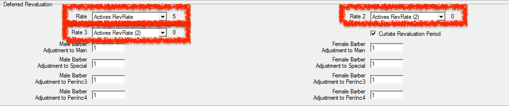
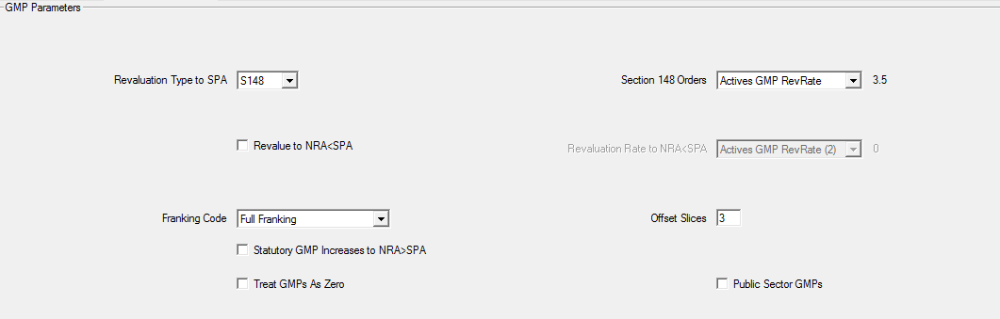
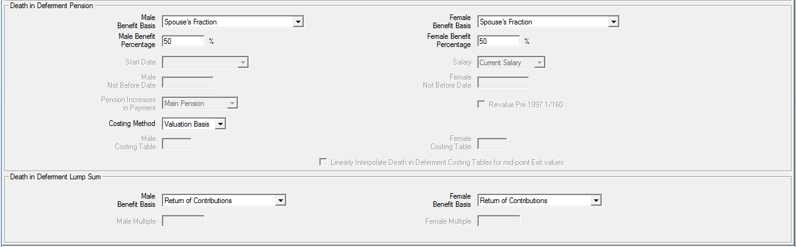
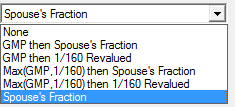
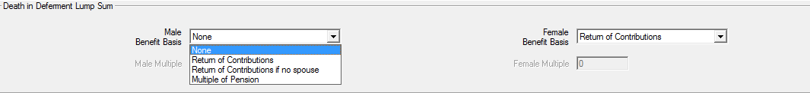
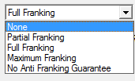

# Valuing withdrawal benefits

If a withdrawal decrement applies for Actives, you must define how
deferred benefits should be calculated in SuperVal. This article
addresses how withdrawal benefits are set up and valued.

!!! info "This article is based on V9.25 of SuperVal." 

    Any screenshots from earlier versions are not materially different.

## Deferred pension (retirement)

The deferred-pension benefit where there is a withdrawal decrement for
active members is determined by parameters on the _Financial_,
_Legislation_ and _Leaving_ tabs, along with your ‘Slice’ structure.

### Slices tab

For each Slice (benefit tranche) you can specify whether the
benefit revalues using one of the three rates available from the dropdown list.
This is available under the _Slice_ tab, under the _Slice
Indicators_ frame. The revaluation in deferment rates for excess and GMP
are specified on the _Financial_ and _Legislation_ tabs as discussed
below.

### Financial and Legislation tabs

#### Deferred revaluation

The _Rate_ field applies in deferment to the excess over GMP benefit.
The frame below is found on the _Financial_ tab.

Note that up to three different deferred revaluation rates can be
specified (Rate, Rate 2 and Rate 3). The appropriate rate can be picked
when defining each benefit slice.

Loading adjustment factors can also be applied. These will only be
applied to the part of the Pup that has arisen from Slices indicated for
ERF table 1 (even though such tables are not actually applied to the
deferred pension). This would be typically used where there is a “Barber
window” of service and therefore a need to reflect an earlier retirement
age.

:fontawesome-solid-hand-point-right:
[Equalisation of Retirement Ages](../equalisation-of-retirement-ages/index.md)

#### GMPs

The frame below is found on the _Legislation_ tab and deals with how the
GMP (standard data items) increases in active service, and re-values in
deferment.

#### In deferment

The type of revaluation applicable to SPA after exit from active service
is determined by the setting for _Revaluation Type to SPA_.

#### Active service

The field _Section 148 Orders_ rate applies to the GMP while the member
is still active and will therefore apply to the GMP up to the assumed
(future) exit point.

#### NRA &lt; SPA

Where retirement age is before SPA the make-up of the PUP at NRA will be
determined by the setting for _Revalue to NRA&lt;SPA_:

-   If unchecked, GMP will not be re-valued
-   If checked, the GMP will be revalued according to _Revaluation Rate to NRA&lt;SPA_

!!! note "Complete years will be used and not complete tax years (to NRA&lt;SPA only)."

An adjustment will be made at SPA for GMP revaluations to SPA not
already in payment. The option used for the _Franking Code_ field
determines the amount of this adjustment.

The way SuperVal treats retirements before SPA is illustrated below:

<table>
<thead>
<tr class="header">
<th>Pensions at NRA</th>
<th>Pensions at SPA</th>
</tr>
</thead>
<tbody>
<tr class="odd">
<td rowspan="2" style="vertical-align: middle;">+ Anti-Franking Guarantee</td>
<td>Pre 6/4/1988 GMP (at SPA)</td>
</tr>
<tr class="even">
<td>Post 6/4/1988 GMP (at SPA)</td>
</tr>
<tr class="odd">
<td>Main Pup (incl. NRA “GMP”)</td>
<td>Main excess over GMP (at SPA)</td>
</tr>
<tr class="even">
<td>Special Pup (incl. NRA “GMP”)</td>
<td>Special excess over GMP (at SPA)</td>
</tr>
<tr class="odd">
<td>PenInc3 Pup (incl. NRA “GMP”)</td>
<td>PenInc3 excess over GMP (at SPA)</td>
</tr>
<tr class="even">
<td>PenInc4 Pup (incl. NRA “GMP”)</td>
<td>PenInc4 excess over GMP (at SPA)</td>
</tr>
</tbody>
</table>

The amount of step-up at SPA will be determined by the combination of
the _Revaluation Type to SPA_ _Revaluation Rate to NRA&lt;SPA_ and the
_Franking Code_.

In summary, SuperVal will value temporary annuities between NRA and SPA.
At SPA an addition is made for the required GMP revaluations and the
pension amounts then valued as whole-life annuities.

#### Franking code

There are five options:

    0 – None
    1 – Partial Franking
    2 – Full Franking
    3 – Maximum Franking
    4 – No Anti Franking Guarantee

From 0 to 4 there is a reducing amount added at SPA for GMP
revaluations.

:fontawesome-solid-hand-point-right:
[Franking Code examples](#franking-code-examples)

#### IR maxima

SuperVal does not apply the IR Maximum rules specified on the
_Legislation_ tab to deferred benefits. The reason for this is that IR
Maximum rules, generally speaking, occur when all the benefits are
considered at retirement.

### VarPrint and AccPrint

The calculation of the deferred pension at NRA at assumed future exit
points is shown in Section 2400 (Leaving Service Pension) before any SPA
adjustments. Loading adjustments to Pups are carried out in section 2450
(these apply to deferred amounts from Slices indicated for Early
Retirement Factor Table 1 (ERF1)).

A summary of deferred pension at NRA is shown in Section 2460.

SPA Adjustments for GMP revaluations are shown in 2600.

The capitalised value (i.e. annuity~NRA~ × D~NRA~ ÷
DAge at Exit) of these benefit amounts at the assumed exit
point are shown in Section 6000. The capitalised values are shown for
excess over GMP and GMP separately in the following sections:

    Section  Description
    -------------------------------------------------------------
    6000     GMP valued as payable from the later of SPA and NRA
    6200     Main excess over GMP
    6300     Special excess over GMP
    6350     PenInc3 excess over GMP
    6400     PenInc4 excess over GMP

All the excess over GMPs are valued as temporary annuities to SPA (where
NRA&lt;SPA) and as whole-life annuities from SPA after SPA adjustments.

## Death-in-deferment benefits

Benefits payable on death in deferment can be pensions, lump sums or
both.

The parameters are specified on the _Leaving_ tab:

### Death-in-deferment pensions

There are six options for this benefit:

None

: Select this if there is no pension benefit on death in deferment.

GMP then Spouse’s Fraction

: For this option the benefit calculations specified in the slices are used (i.e. accrual and salary).

    The death-in-deferment pension benefit is WGMP plus Spouse’s Fraction, determined by:

    -   _Benefit Percentage_
    -   _Offset Slices_ – the percentage is applied to the benefits arising
        from slices with a slice number lower than the _Offset Slices_
    -   benefit calculations in the slices

    Revaluation in deferment for the _Spouse’s Fraction_ is as for the
    Slices used for the calculation of the benefit.

    For example, if the _Offset Slices_ is 3, the _Spouse’s Fraction_ is
    calculated as a Benefit Percentage of benefits from Slices 2 and 1.

GMP then 1/160 Revalued

: The benefit calculations specified in the Slices are not used.

    The death-in-deferment pension benefit is WGMP plus 1/160 pension,
    which equals 1/160 × salary and service determined by:

    -   _Salary_ – select one of the nine salary projections specified
    -   _Start Date_ and _Not Before Date_ and the _Not After Date_ for the “Offset Slices”

    The 1/160^th^ pension benefit would typically start at 6/4/1997
    (or date joined pensionable service if later).

    The _Pension Increases in Payment_ rate needs to be specified for the
    1/160^th^ pension benefit. This benefit will be revalued in
    deferment at the deferred revaluation _Rate_ specified on the
    _Financial_ tab.

Max (GMP, 1/160) then Spouse’s Fraction

: The benefit calculations (i.e. accrual and salary) specified in the Slices are used.

    The death-in-deferment pension benefit is the sum of:

    -   The greater of WGMP, and 1/160 × salary and service from the later of
        _Start Date_ and _Not Before Date_ up to the end date of the _Offset
        Slices_ (specified on the _Financial_ tab). (The comparison is made at
        the date of death if benefits are costed using the Valuation Basis or
        at the date of exit if costed using a Costing Table); and

    -   Spouse’s Fraction, determined by the fields:

        + _Benefit Percentage_
        + _Offset Slices_ – the Percentage is applied to benefits arising from
          slices with a slice number lower than _Offset Slices_
        + benefit calculations in the slices

    Typically the end date of the slice specified as _Offset Slices_ and
    start date for the Spouse’s Fraction would be 6/4/1997.

    Specify the _Increase in Payment_ rate for the 1/160^th^
    pension benefit (in excess of GMP).

    Revaluation in deferment for the _Spouse’s Fraction_ is as for the
    Slices used for the calculation of the benefit.

    The 1/160^th^ benefit can be revalued (or not) by this rate
    also by checking (or unchecking) the _Revalue Pre-1997 1/160_ field.

Max (GMP, 1/160) then 1/160 Revalued

: The benefit calculations specified in the Slices are not used.
    The death-in-deferment pension benefit is the sum of:

    -   The greater of WGMP, and 1/160 × salary and service from the later of
        _Start Date_ and _Not Before Date_ up to the end date of the _Offset
        Slices_ (specified on the _Financial_ tab) (The comparison is made at
        the date of death if benefits are costed using the Valuation Basis or
        at the date of exit if costed using a Costing Table); and
    -   A “1/160 Revalued” pension, which equals 1/160 × salary and service
        determined by the fields:
    -    _Salary_ – select one of the nine salary projections specified
    -   _Start Date_, _Not Before Date_ and the end date for the slice
        indicated by _Offset Slice_ – for determining service

    Typically the end date of the slice specified as _Offset Slices_ would
    be 6/4/1997. The latter of this date (as a _Not Before Date_) and _Start
    Date_ would be the start date for the 1/160^th^ revalued
    pension benefit.

    Specify the _Pension Increases in Payment_ rate for the
    1/160^th^ pension benefit.

    The _1/160 Revalued_ benefit will be revalued in deferment at the
    deferred revaluation _Rate_ specified on the _Financial_ tab. The
    1/160^th^ benefit compared with the WGMP can be revalued (or
    not) by this rate also by checking” (or unchecking) the _Revalue Pre
    1997 1/160_ field.

Spouse’s Fraction

: The death in deferment pension benefit is _Benefit Percentage_ multiplied by the benefits calculated in the Slices.

    The pension will be revalued according to the rate specified in the
    Slices and the deferred revaluation _Rate_ on the _Financial_ tab.

Summary:

    Option/Field                  0   1   2   3   4   5
    ---------------------------------------------------
    Percentage (M&F)              –   X   –   X   –   X
    Salary                        –   –   X   X   X   –
    Start Date                    –   –   X   X   X   –
    Not Before Date (M&F)         –   –   X   X   X   –
    Pension Increases in Payment  –   –   X   X   X   –
    Revalue Pre 1997 1/160        –   –   –   X   X   –

### Costing

The options for _Costing Method_ are:

    Costing Table
    Valuation Basis

Note this field is not applicable to the death-in-deferment lump sum benefit.

Costing Table

    Here you can specify tables for the annuity part of the death in
    deferment liability.

    These tables are specified in the _Costing Method_ field.

Valuation Basis

    This option would normally be used.

    Using this option means that the death-in-deferment pension benefit is
    valued on the basis as specified for the category in the basis file.

### Death-in-deferment lump sum

There are four options for this benefit:

None

: No lump sum benefit.

Return of Contributions

: This option will value standard data item _Member’s Contributions_ (ACW) as returned on death in deferment.

    On the _Contributions_ tab you can apply a rate of interest for this benefit (“ROC In Deferral Interest (% p.a.)”). Note however, that it will assume the data item includes interest to the valuation date and the _ROC In Service Interest (% p.a.)_ on the _Contributions_ tab will apply from the valuation date until exit.

Return of Contributions if no spouse

: This option is the same as (`Return of Contributions`) above except that contributions are returned _*only if*_ there is no spouse on death in deferment.

    Whether or not there is a spouse is determined by the _Proportion Married_ table specified on the _Demographic_ tab.
    The relevant rate in the table at age at exit is applied (not age at death in deferment).

    For example, if the proportion-married table has entries of 90% throughout. There is therefore a rate of 10% of no spouse on death in deferment. The value of benefit under this option would therefore be 10% of that under the above option (Return of Contributions).

Multiple of Pension

: Select this option for a lump sum payable on death in deferment of some multiple of the member’s pension. Then enter in the following fields for males and females the multiple to apply.

## Franking Code examples

This field affects the pension amounts at SPA where NRA is before SPA.

There are five choices for members retiring before SPA:

The impact of each of these options is explained by the examples below.

Worked examples:

!!! example "A male member retiring at 60 has a pension as follows"

    -   Pension   = £2,000
    -   GMP at 60 = £1,000 (included in above figure)
    -   GMP at 65 = £1,500

GMP revaluations between 60 and 65 are therefore £500 (£1,500 less
£1,000).

Suppose further that the pension increase rate is 5% pa.

The add-on at SPA for the GMP revaluations between 60 and 65 under each
of the options are as follows:

No Franking

:   All revaluation on the GMP is added to the pension at SPA
    So, the pension at SPA is:

    2,000 × 1.05^5^ + 500 = 3,052.56

Partial Franking

:   Revaluation on the GMP between retirement and SPA, less scheme increases
    granted on the GMP, is added at SPA.

    So, the pension at SPA is:

    2,000 × 1.05^5^ + [500 – 1,000 × (1.05^5^ – 1)] 
    = 2,552.56 + 223.72 
    = 2,776.28

    The item in square brackets is set to a minimum of zero.

Full Franking

:   All increases on pensions between retirement and SPA are franked against
    revaluation on the GMP.

    So, the pension at SPA is:

    2,000 × 1.05^5^ + [500 – 2,000 × (1.05^5^ – 1)] 
    = 2,552.56 + 0 
    = 2,552.56

    The item in square brackets is set to a minimum of zero.

Maximum Franking

:   This option differs from Full Franking only if you have an early
    retirement decrement in your basis. For the early retirements the
    calculation is as under option 4. For the normal retirement the
    calculation is as under option 2.

No Anti Franking Guarantee

:   No anti-franking guarantee is made at SPA. So, the pension at SPA:

    2,000 × 1.05^5^ = 2,552.56

**VarPrints**

Section 2600 shows the adjustments made to the deferred pension for the
Franking Code. Cell 2616cF shows the “Anti-Franking Guarantee”.
Under each of the options above the amount shown here would be:

    Franking Code  Anti-Franking Guarantee
    ---------------------------------------
          0                 500
          1                 223.72
          2                   0
          3                   0
          4                   0
