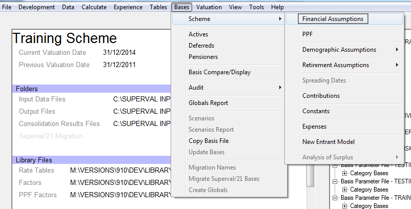
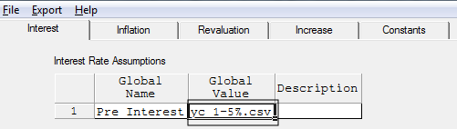
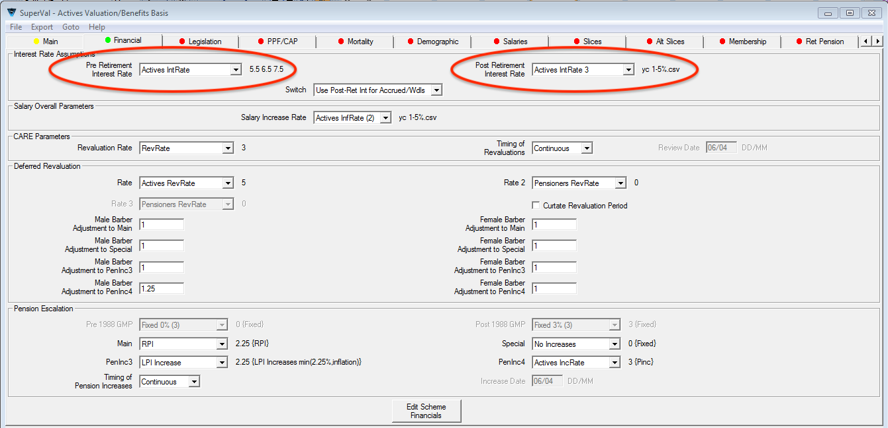
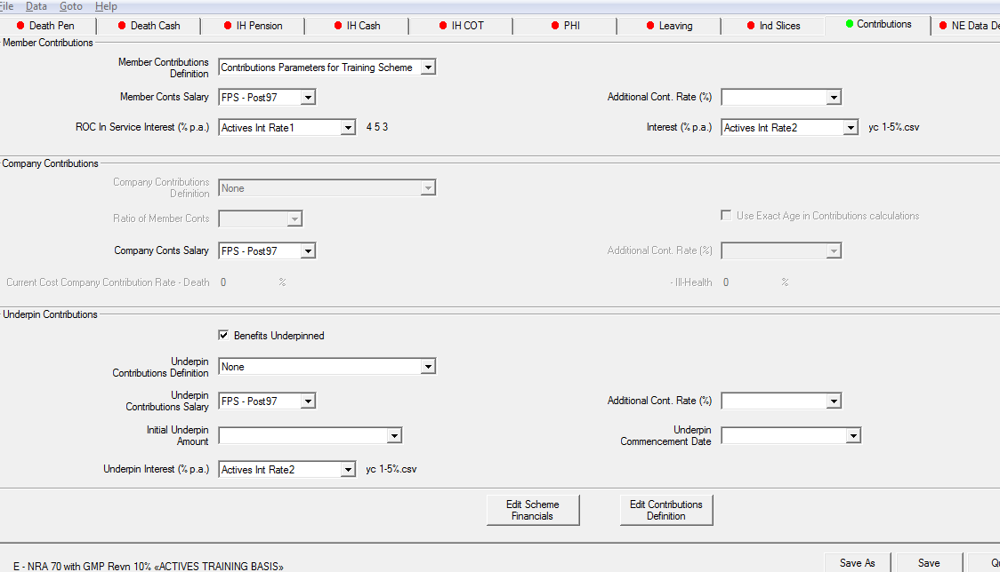
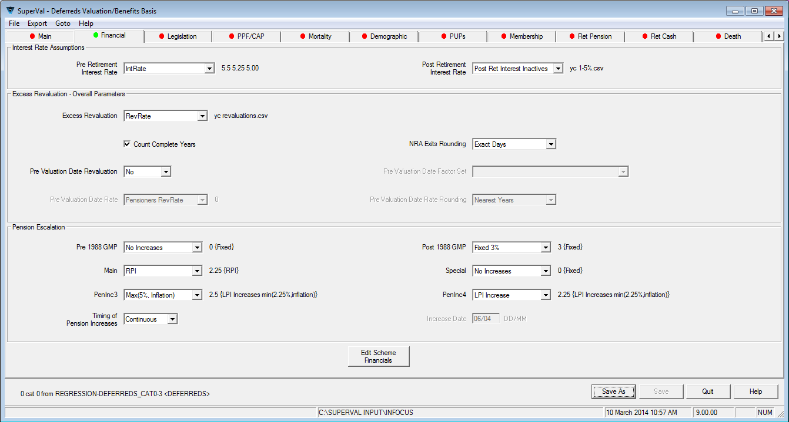
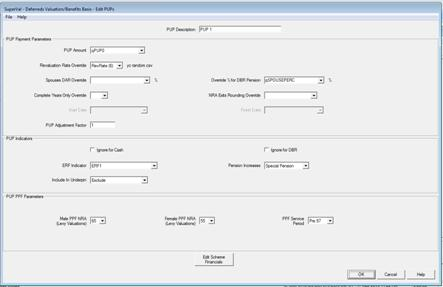
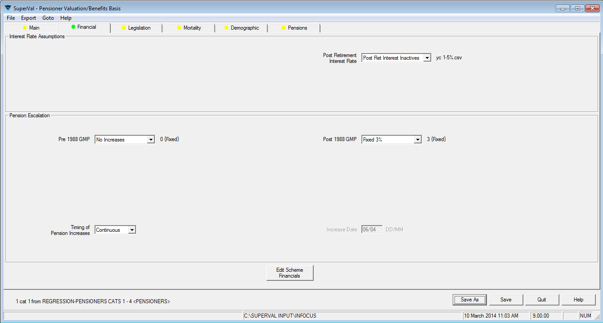
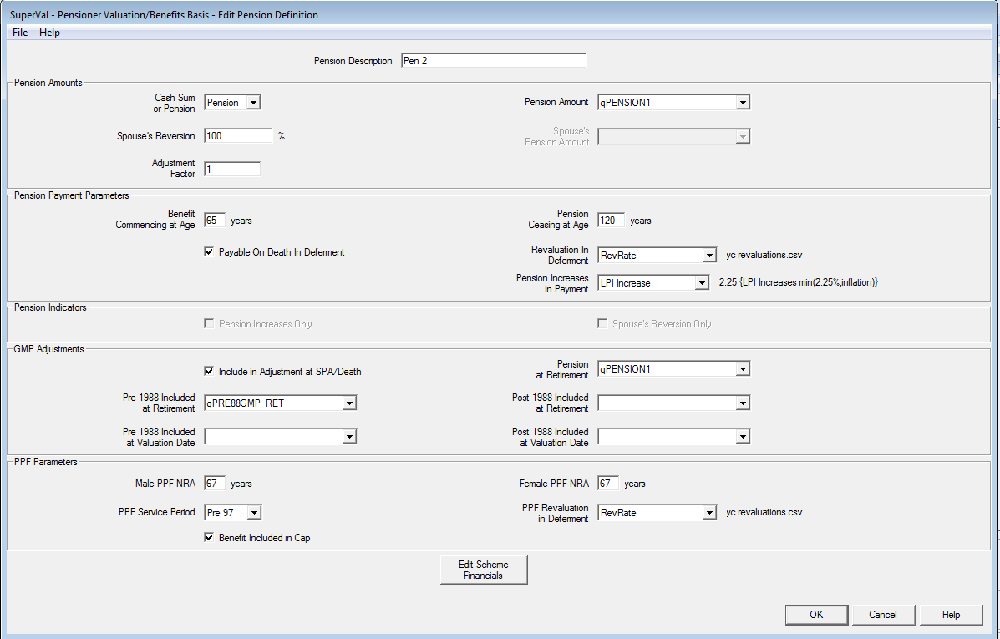
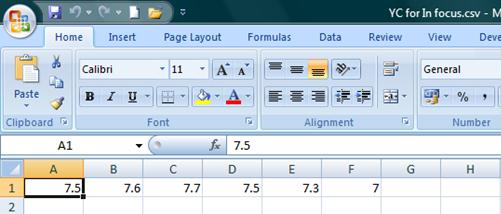

# Using yield curves

SuperVal can be set up either to use financial assumptions that are
fixed or to allow the assumptions to vary by each future year.
This article discusses the different ways to vary the assumptions over time.

**Scope:** Actives, Deferreds and Pensioners modules

!!! info "This article is based on V9.25 of SuperVal." 

    Any screenshots from earlier versions are not materially different.

Yield-curve valuations are becoming more common in practice and SuperVal
can be set up in two different ways to allow for this. The main
financial assumptions are selected on the _Financial_ tab but in addition,
various term-dependent financial assumptions can be used on the
individual tabs.

The first method involves specifying a vector of data and the second
approach involves using a yield curve entered in a CSV file.

For both methods the assumptions are specified within the _Bases>Scheme>Financial Assumptions_ and then selected on the appropriate tab
in the Basis File.

SuperVal assumes the data entered for yield curves equate to the
one-year forward rates appropriate at each point in time. For example,
the spot rate applicable over duration $t$ is defined as $y_t$.

Enter the one-year forward rate at time $t$
(agreed at time 0) i.e. $f_t = f (t,1)$.

SuperVal will determine the rate of interest over the period, i.e.

$$(1+y_t)^t = (1+f_0) (1+f_1) (1+f_2) … (1+f_{t-1})$$

## Setting up Scheme Parameter

### Two different approaches

Consider the following assumptions used for the post-retirement interest
rate, with year 1 starting from the valuation date:

              Post-Retirement
    Year       Interest Rate †
    -------------------------------------
      1             7.5%
      2             7.6%
      3             7.7%
      4             7.5%
      5             7.3%
      6+ years      7.0%

^†^ SuperVal assumes these are the one-year forward rates,
i.e. the rate applicable over year 2 is 7.6%, and the rate applicable over year 5 is 7.3% etc.

For all three modules, the post-retirement interest rate assumption will
be defined in the Interest Rate section of the Financial Assumption
Parameters.

#### Method 1: Using vectors

In the Financial Assumptions section, the required interest rate is
defined by adding the values of the vector with a space between each
year’s rates. The final figure entered will be used for all years into
the future.

Within the Basis File, these values can then be selected by
choosing the correct Global Variable Name. Once selected, the values for
the vector are shown to the right of the pointer. The main financial
assumptions are selected on the _Financial_ tab but in addition, various
term-dependent financial assumptions can be used on the individual tabs
i.e. _Legislation_ tab, _Salary_ tab and _Contributions_ tab for Actives.

Note that you cannot enter negative rates for vectors and that a
maximum of 115 characters can be entered in a vector.

#### Method 2: Using yield curves

In the Financial Assumptions section, the required interest rate is
defined by adding a CSV table (see below). Within the Basis File, this
yield curve can then be selected by choosing the correct Global Variable
Name.

The table of interest rates to be used must first be set-up in Excel and
then saved as a CSV file in the Input Folder. The table
should have one row, and up to 200 columns. The entry in column 1
represents the rate that will apply during the first year after the
valuation date. The entry in column $n$ represents the rate to apply
during the $n$th year after the valuation date. There is no
limit on the number of decimal places you can specify. The final figure
entered will be used for all years into the future.

The data entered into the CSV file may also contain negative rates for
yield curves.

Within the Global Financial Parameters, the CSV files available in the
input folder are found by a right-click in the _Global Value_ column.

#### Which method to use?

In the above example, the interest rate only varied between years 1 to 6
and then remained fixed at 7%. This would be a relatively simple
scenario to set up using the vector method.

However, for a yield curve that applies over many more years, method 2
is usually the quickest and easiest approach to use. The table only
needs to be specified once and can then be used in SuperVal as required.
In addition, negative values for assumptions can only be entered when
using the yield curve approach.

SuperVal will only let you choose one assumption for a particular
financial assumption i.e. Interest Rate 1 or Interest Rate 2 etc. You
can, however, use different approaches for different financial
assumptions i.e. define pension escalation using a vector but salary
escalation using a yield curve (CSV file).

## Setting up Scheme Basis Files

Yield curves can be used for the financial assumptions throughout all of
the Bases File. The method for selecting these is the same for all
three modules.

### Actives

#### Yield-curve inputs on the Financial tab

For each of the parameters where a financial assumption is required,
select from the dropdown list the Global Variable Name containing the
appropriate data. For vectors the values that will be used and for yield
curves the name of the yield curve will then be shown next to Global
Variable Name.

Note the image below shows the use of a vector for Pre-Retirement
Interest and a yield curve for Post-Retirement Interest.

#### Yield-curve inputs on the Legislation tab

On the _Legislation_ tab, yield curves can be used for the various
increase rates that are applied.

#### Yield-curve inputs on the PPF/CAP tab

On the _PPF/CAP_ tab, a yield curve can be used for the Pre- and Post-1997
Discontinuance Increases.

#### Yield-curve inputs on the Salary tab=

Within each salary definition, the salary increase rate assumption can
be overridden and the deductor/cap increase rates can also be specified
as a yield curve.

This is done by choosing the assumption containing the relevant CSV
file where appropriate.

#### Yield-curve inputs on the Contributions tab

Various term-dependent financial assumptions can also be used on the
Contributions tab.

### Deferreds

The set-up is similar to the Actives, in that the main term-dependent
assumptions should be set up by specifying appropriate CSV files as
tables within the Input Folder. These can then be used to
define an interest rate in the Financial Assumptions area.

These are then accessed from the various tabs but in particular the
_Financial_ tab.

Other tabs where term-dependent assumptions can be specified include the
_PUPs_ tab, _NSPUPs_ tab and the _Legislation_ tab.

!!! tip "For Client Code 3 users, the Ind PUPs tab can also allow for term-dependent assumptions."

The screenshot below is taken from the _PUPs_ tab, as an example of where
a term-dependent assumption can be set up in the Deferreds module.

### Pensioners

In the Pensioners module, term-dependent assumption can be selected from
the list of available assumptions in the Financial Assumptions.

Other tabs where term-dependent assumptions can be specified include the
_Legislation_ tab and the _Pensions_ tab.

## Timing of application

All of the rates specified using the yield-curve functionality will
apply from the valuation date.

For example, below is an interest-rate assumption that has been set up
using the yield-curve functionality.

SuperVal will use the rate of 7.5% for the period VDATE to VDATE+1, 7.6%
from VDATE+1 to VDATE+2 and so on.

This applies to all assumptions. In particular, take care
when entering the post-retirement interest rate as this will apply from
the valuation date and *not* from the year the member retires.

For example, consider a member whose age is 2 years below NRA, with the
yield curve above being used for both pre and post retirement interest
rates. For this member, the Interest Rate used in the first year post
retirement will be 7.7%.

## Parameters in the Basis Files where yield curves can be used

Module                       | Tab                    | Frame                                  | Parameter
-----------------------------|------------------------|----------------------------------------|--------------------------------------------
Actives/Deferreds            | Financial              | Interest Rate Assumptions              | Pre Retirement Interest Rate
Actives/Deferreds/Pensioners | Financial              | Interest Rate Assumptions              | Post Retirement Interest Rate
Actives                      | Financial              | Salary Overall Parameters              | Salary Increase Rate
Actives                      | Financial              | CARE Parameters                        | Revaluation Rate
Actives                      | Financial              | Deferred Revaluation                   | Rate
Actives                      | Financial              | Deferred Revaluation                   | Rate 2
Actives                      | Financial              | Deferred Revaluation                   | Rate 3
Actives/Deferreds            | Financial              | Pension Escalation                     | Main
Actives/Deferreds            | Financial              | Pension Escalation                     | Special
Actives/Deferreds            | Financial              | Pension Escalation                     | PenInc 3
Actives/Deferreds            | Financial              | Pension Escalation                     | PenInc 4
Actives/Deferreds/Pensioners | Financial              | Pension Escalation                     | Pre 1988 GMP
Actives/Deferreds/Pensioners | Financial              | Pension Escalation                     | Post 1988 GMP
Actives                      | Legislation            | GMPs                                   | Section 148 Orders
Actives/Deferreds            | Legislation            | GMPs                                   | Revaluation Rate to NRA \< SPA
Actives                      | Legislation            | IR Maximum Parameters                  | Cap Increase Rate
Actives/Deferreds            | PPF/CAP                | Discontinuance Pension Increase        | Pre 1997 Discontinuance Pension Increases
Actives/Deferreds            | PPF/CAP                | Discontinuance Pension Increase        | Post 1997 Discontinuance Pension increases
Actives                      | Salary                 |                                        | Override Salary Increase Rate
Actives (GAD only)           | Salary                 |                                        | Post NRA Salary Revaluation Rate
Actives                      | Salary                 | Salary Deduction                       | Increase Rate Override
Actives                      | Salary                 | Salary Maximum                         | Increase Rate Override
Actives                      | Contributions          | Member Contributions                   | ROC in Service Interest
Actives                      | Contributions          | Member Contributions                   | ROC in Deferral Interest
Actives                      | Contributions          | Underpin Contributions                 | Underpin Interest
Deferreds                    | Financial              | Excess Revaluation – Overall Parameter | Excess Revaluation
Deferreds                    | Financial              | Excess Revaluation – Overall Parameter | Pre Valuation Date Rate
Deferreds                    | PUPs, Ind PUPs, NSPUPs | PUP Payment Parameters                 | Revaluation Rate Override
Deferreds/Pensioners         | Legislation            | GMPs                                   | Revaluation Rate to SPA
Deferreds                    | Ret Cash               | Cash Cap                               | Revaluation Rate Override
Deferreds                    | Death                  | Death in Deferment Cash                | Conts Interest Rate
Deferreds                    | Death                  | Death in Deferment Cash                | Plus Conts Interest Rate
Deferreds                    | Underpin               | Underpin Parameters                    | Underpin Interest
Pensioners                   | Legislation            | GMPs                                   | Revaluation Rate when BAGE \< SPA
Pensioners                   | Pensions               | Pension Payment Parameters             | Revaluation in Deferment
Pensioners                   | Pensions               | Pension Payment Parameters             | Pension Increases in Payment
Pensioners                   | Pensions               | PPF Parameters                         | PPF Revaluation in Deferment

                                                                    